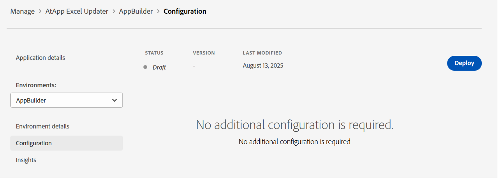

# Adquirir e instalar aplicaciones desde Adobe Exchange

Ahora puede instalar aplicaciones creadas por socios para Workfront directamente desde Adobe Exchange. Esta capacidad conecta a los clientes con un ecosistema en crecimiento de socios de Adobe que ofrecen herramientas creadas específicamente para mejorar la productividad, optimizar las operaciones y ampliar la funcionalidad de Workfront. A través de Adobe Exchange, los clientes pueden descubrir e instalar aplicaciones que se integran perfectamente en Workfront mediante extensiones de interfaz de usuario.

Adobe Exchange es el mercado central de aplicaciones, extensiones e integraciones de terceros en Adobe Experience Cloud, incluido Adobe Workfront. Para los clientes de Workfront, es el destino ideal para descubrir e instalar aplicaciones que mejoren la funcionalidad, optimicen los flujos de trabajo e integren sistemas externos.

## Aplicaciones de socio de Adobe

Workfront Partner Network es un ecosistema cada vez más amplio de socios tecnológicos: proveedores de software independientes (ISV) que crean aplicaciones escalables, seguras y ampliables mediante las extensiones de IU de Adobe App Builder y Workfront.

Los socios de Workfront aprovechan las extensiones de la interfaz de usuario de Workfront, un potente marco de trabajo que permite incrustar aplicaciones directamente en la interfaz de Workfront. Una vez instaladas desde Adobe Exchange, los administradores de Workfront pueden añadir estas aplicaciones a las plantillas de diseño para que sean visibles y accesibles para los usuarios dentro de sus flujos de trabajo diarios. Esta integración perfecta garantiza que los usuarios puedan interactuar con las herramientas creadas por socios, como paneles, flujos de aprobación o rastreadores de campañas, sin salir del entorno de Workfront.

### AtApp

#### Resultados en tiempo real, justo dentro de Adobe Workfront

Nos asociamos con clientes de Adobe Workfront para convertir cuellos de botella diarios en soluciones repetibles con resultados predecibles. Nuestra creciente biblioteca de soluciones le ayuda a mejorar la precisión, la velocidad y la rendición de cuentas mediante el uso de datos en directo desde el lugar en el que las personas trabajan. Pueden ayudar a los líderes a ver lo que está sucediendo ahora y a planificar lo que debería suceder a continuación. Explore las aplicaciones de Adobe Exchange de AtAppStore disponibles actualmente y listas para instalar, luego elija las que coincidan con sus prioridades actuales y escale a medida que sus necesidades crezcan.

* [Excel Updater](https://exchange.adobe.com/apps/ec/abtt1rq7o9/atapp-excel-updater): La solución Excel Updater le ofrece una ruta rentable para integrar datos en Workfront sin tener que aprender la API, escribir código o configurar un servidor, y es ideal para cargas de datos únicas y recurrentes.

* [Recalc Helper](https://exchange.adobe.com/apps/ec/abv755903t/atapp-recalc-helper): La solución Recalc Helper le ofrece una forma rápida de recalcular fácilmente las expresiones calculadas de formulario personalizadas, las escalas de tiempo de los proyectos o las finanzas de los proyectos para todos los elementos que coincidan con un filtro seleccionado, directamente desde Workfront.

* UberTimesheet: La solución UberTimesheet puede mejorar y expandir la adopción de Workfront por parte de sus usuarios al hacer que sea simple y conveniente para todos rastrear el tiempo desde su navegador, tableta o teléfono inteligente, después del hecho.

### Workfocus

Workfocus ofrece soluciones avanzadas de automatización e integración para Workfront. Sus aplicaciones se centran en:

* Simplificación de plazos

* Automatización de flujos de trabajo de Fusion

* Habilitar la colaboración entre instancias

Las aplicaciones de Workfocus están diseñadas para funcionar de forma nativa dentro de Workfront, aprovechando las extensiones de la interfaz de usuario para proporcionar a los usuarios potentes herramientas que mejoran la productividad y reducen el esfuerzo manual.

## Requisitos previos y permisos

**Aprovisionamiento de App Builder**

* Los clientes deben tener App Builder aprovisionado en su Adobe Admin Console. Es un requisito previo para instalar aplicaciones desde Adobe Exchange.

**Administradores de organización empresarial o desarrolladores**

* Puede buscar aplicaciones, hacer clic en **Obtener** y continuar con la instalación.

* Si alguien en la organización ya ha adquirido la aplicación, puede que vea **Comenzar instalación** o **Administrar** en su lugar.

**Usuarios no administradores**

* Puede iniciar la adquisición, pero se le pedirá que inicie sesión y puede encontrar restricciones si la aplicación requiere el consentimiento del administrador o licencias especiales.

## Adquirir e instalar aplicaciones desde Adobe Exchange

Los clientes de Adobe pueden examinar, buscar e instalar aplicaciones directamente desde Adobe Exchange Marketplace para utilizarlas en Workfront.

Las aplicaciones creadas con Adobe App Builder se muestran como _Aplicaciones App Builder_ en Adobe Exchange. Cada lista de aplicaciones incluye documentación, capturas de pantalla e instrucciones de uso para ayudar a los clientes a comprender el valor de la aplicación.

Para ver las aplicaciones de Workfront, vaya a Adobe Exchange y busque aplicaciones compatibles con Workfront. También puede filtrar las listas de aplicaciones de Workfront App Builder:

1. Haz clic en **Experience Cloud** en el panel izquierdo.
1. En el panel izquierdo, busque **Producto** y luego seleccione **Workfront**.
1. Expanda **Tipo de aplicación** y, a continuación, elija **App Builder**.

### Adquirir aplicaciones

Las aplicaciones pueden requerir la compra a Adobe Exchange o permitir la instalación, pero requieren la licencia del desarrollador de la aplicación.

Para adquirir una aplicación

1. Haga clic en el nombre de la aplicación.
1. Haga clic en el botón situado en la esquina superior derecha de la lista de aplicaciones.
1. Haga clic en **Sí, continuar** y, a continuación, acepte el contrato de licencia para el usuario final.
   

### Acciones para administradores de sistemas

Cuando un usuario adquiere una aplicación de Adobe Exchange, puede que vea el siguiente mensaje: _El administrador del sistema debe aprobar la adquisición para que pueda instalar y utilizar la aplicación._

Esto significa que la aplicación requiere la aprobación a nivel de administrador antes de continuar con la instalación. Los administradores del sistema pueden encontrar la solicitud en las siguientes áreas:

**Notificaciones**

Normalmente, se notifica por correo electrónico a los administradores del sistema cuando un usuario de su organización adquiere una aplicación.

**Admin Console**

Los administradores del sistema pueden iniciar sesión en Admin Console en [https://adminconsole.adobe.com/](https://adminconsole.adobe.com/) y navegar hasta Productos > Integraciones de aplicaciones para ver todas las aplicaciones adquiridas o solicitadas.

Una vez que un administrador del sistema tiene acceso a las solicitudes, puede revisarlas y aprobarlas. Algunas aplicaciones pueden pedir al administrador que consienta el acceso a los datos y asignar la aplicación a perfiles de producto o usuarios específicos.

Una vez aprobada, la aplicación pasa a estar disponible para la instalación.

## Instalación de aplicaciones

Una vez adquirida una aplicación, puede instalarse directamente en Workfront. Los administradores pueden administrar las aplicaciones instaladas a través de la interfaz de Workfront, asegurándose de que estén correctamente configuradas y sean accesibles para los usuarios.

1. Busque la aplicación que desea instalar y abra el menú Actions en la parte derecha de la pantalla.
1. Haga clic en Ver detalles de la aplicación.
1. Seleccione un entorno en la parte izquierda de la pantalla o añada uno nuevo.
1. Haga clic en **Implementar**.
   
1. Asignar derechos de instalación o uso (si es necesario).

   Si su organización controla el acceso a la aplicación a través de perfiles de producto o grupos de usuarios, asigne la aplicación al perfil o grupo adecuado para que los usuarios puedan continuar con la instalación y el uso.

## Añadir a plantilla de diseño

Una vez implementada, la aplicación del socio estará disponible en la plantilla de diseño de Workfront. Puede añadir la aplicación a la navegación principal o secundaria para usarla en Workfront.

Para añadir la aplicación a la plantilla de diseño, abra la plantilla de diseño y vaya al área del menú principal o del menú secundario. Añada la aplicación mediante el icono Add.

## Póngase en contacto con Soporte técnico

Los propietarios de las aplicaciones admiten las extensiones instaladas desde Adobe Exchange. Desde administrar aplicaciones, puedes hacer clic en **Obtener ayuda** para obtener ayuda con cualquier problema.