# Configure y administre Adobe Cloud Drive para su organización

Como administrador, puede configurar Adobe Cloud Drive para que los usuarios tengan acceso directo desde el escritorio a sus archivos de proyecto en el almacenamiento en la nube de Adobe, a través de Finder en macOS y el Explorador de archivos en Windows. Este artículo explica cómo habilitar el acceso en Adobe Admin Console, implementar la aplicación en dispositivos de usuario y administrar el acceso de forma continua.

Adobe Cloud Drive es una aplicación de escritorio empresarial que monta documentos de Workfront en el almacenamiento en la nube de Adobe como una unidad virtual en los equipos Mac y Windows de los usuarios. Después de la instalación, los usuarios ven las carpetas de sus proyectos de Workfront en el Finder o el Explorador de archivos y pueden abrir, editar y guardar archivos de proyecto mediante cualquier aplicación de escritorio, sin descargar archivos manualmente ni trabajar con un explorador.

Para utilizar Adobe Cloud Drive, su organización debe estar en el paquete Ultimate de flujo de trabajo con el almacenamiento en la nube de Adobe habilitado.

Para obtener más información sobre Adobe Cloud Drive, consulte los siguientes artículos:

* [Información general sobre Adobe Cloud Drive](/help/quicksilver/documents/adobe-cloud-drive/adobe-cloud-drive-overview.md)
* [Instalar Adobe Cloud Drive](/help/quicksilver/documents/adobe-cloud-drive/install-adobe-cloud-drive.md)
* [Usar Adobe Cloud Drive](/help/quicksilver/documents/adobe-cloud-drive/use-adobe-cloud-drive.md)

## Requisitos de acceso

+++ Expanda para ver los requisitos de acceso para la funcionalidad en este artículo.

<table style="table-layout:auto"> 
 <col> 
 <col> 
 <tbody> 
  <tr> 
   <td role="rowheader">Versión de Adobe Workfront</td> 
   <td>Flujo de trabajo de Ultimate, con Adobe Cloud Storage habilitado</td> 
  </tr> 
  <tr> 
   <td role="rowheader">Derechos de administrador de Adobe</td> 
   <td>Debe ser administrador del sistema para Workfront en Adobe Admin Console</td> 
  </tr> 
 </tbody> 
</table>

Para obtener más información, consulte [Requisitos de acceso en la documentación de Workfront](/help/quicksilver/administration-and-setup/add-users/access-levels-and-object-permissions/access-level-requirements-in-documentation.md).

+++

## Asignar acceso a Adobe Cloud Drive en Adobe Admin Console

Adobe Cloud Drive se incluye con el paquete Workflow Ultimate cuando el almacenamiento en la nube de Adobe está habilitado. No aparece como un producto independiente en la sección **Productos** de Admin Console. En su lugar, se administra a través de la sección **Roles** en **Usuarios**.

Cuando vaya a **Usuarios** > **Funciones**, verá dos funciones asociadas al producto Workfront:

| Función | Asignado automáticamente a | Relevancia para Adobe Cloud Drive |
| --- | --- | --- |
| **Miembro** | Todos los usuarios de la organización | Contiene el conmutador de capacidad de Adobe Cloud Drive de nivel de organización. Activado de forma predeterminada. |
| **usuario ACD** | Nadie, de forma predeterminada | Otorga acceso individual cuando el conmutador de nivel de organización está desactivado. |

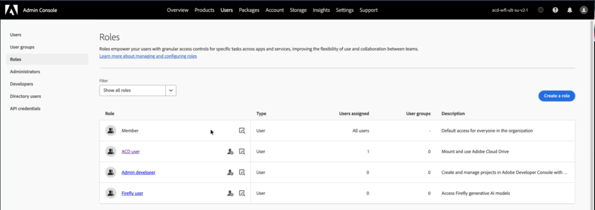

### Controles de acceso

**Control 1: control de capacidad a nivel de organización (en el rol de miembro)**

El rol **Miembro** se asigna automáticamente a todos los usuarios de su organización. Dentro de este rol, hay un conmutador de capacidad **Adobe Cloud Drive**. Cuando este conmutador está activado, todos los usuarios con una licencia de Workflow Ultimate pueden acceder a Adobe Cloud Drive. Cuando está desactivado, ningún usuario puede acceder a Adobe Cloud Drive, independientemente de su licencia.

El conmutador está activado de forma predeterminada cuando Adobe activa Adobe Cloud Drive para su organización.

**Control 2: función de usuario ACD**

El rol de **usuario ACD** solo es relevante cuando el conmutador de nivel de organización está desactivado. Si desactiva el conmutador de nivel de organización para ejecutar una prueba piloto controlada, aún podrá otorgar acceso a usuarios específicos agregándolos al rol **usuario ACD**. Los usuarios con esta función pueden acceder a Adobe Cloud Drive incluso cuando el conmutador de nivel de organización está desactivado. Si el modificador de nivel de organización está activado, el rol **usuario de ACD** no tiene ningún efecto.

**Requisito subyacente: licencia de Ultimate de flujo de trabajo**

Adobe Cloud Drive solo está disponible en el paquete Ultimate de flujo de trabajo. Las opciones de función no están disponibles en ningún otro paquete.

La licencia dentro del paquete Workflow Ultimate puede ser de cualquier tipo: Estándar, Ligera o Colaboradora. Para obtener información sobre las licencias, consulte [Resumen de licencias](/help/quicksilver/administration-and-setup/add-users/how-access-levels-work/licenses-overview.md).

En la tabla siguiente se muestra cómo interactúan estos controles:

| Conmutador de nivel de organización | Usuario con la función de usuario de ACD | Licencia de flujo de trabajo Ultimate | Resultado del acceso |
| --- | --- | --- | --- |
| Activado | No obligatorio | Sí | Concedido |
<!-- | On | Not required | No | Denied | -->
| Desactivado | Sí | Sí | Concedido |
| Desactivado | No | Sí | Denegado |
| O bien | O bien | No | Denegado |

## Requisitos previos

Compruebe lo siguiente antes de empezar:

* Los usuarios que planea aprovisionar tienen asignadas licencias de flujo de trabajo de Workfront.
* Ha revisado los [requisitos de red](#network-requirements) con su equipo de TI.
* Ha redactado una comunicación para enviarla a los usuarios en la que se explica qué muestra Adobe Cloud Drive (solo recursos de proyecto de Workfront) y cómo instalarla.

  >[!NOTE]
  >
  >Un usuario que tiene el acceso habilitado, pero no tiene acceso a ningún proyecto de Workfront, ve una unidad montada vacía después de iniciar sesión. Esto es esperable. El acceso al proyecto de Workfront se administra por separado en Workfront. Para obtener más información, vea [Compartir un proyecto](/help/quicksilver/workfront-basics/grant-and-request-access-to-objects/share-a-project.md).
  >
  >Además, la asignación de derechos de Creative Cloud debe estar en la misma organización de IMS que Workfront para que los proyectos aparezcan en la unidad.

## Configuración del acceso en Adobe Admin Console

El acceso a Adobe Cloud Drive está configurado en Adobe Admin Console. Elija la opción que coincida con la estrategia de despliegue.

### Opción A: habilitar el acceso para toda la organización

Cuando Adobe activa Adobe Cloud Drive para su organización, el conmutador de capacidad de nivel de organización se activa de forma predeterminada y todos los usuarios tienen acceso inmediatamente. Utilice este procedimiento para confirmar que el conmutador está activado antes de desplegar la aplicación.

1. Inicie sesión en [adminconsole.adobe.com](https://adminconsole.adobe.com/).
1. Haga clic en **Usuarios** en la barra de navegación superior.
1. Haga clic en **Roles** en el panel izquierdo.
1. Haga clic en **Miembro** en la lista de funciones.
1. En el panel **Member** que se abre a la derecha, confirme que **Adobe Cloud Drive** aparece en **Permisos** y que su conmutador está activado.

   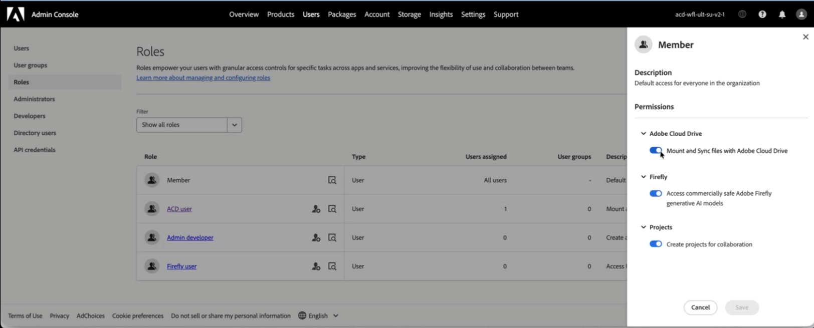

   >[!NOTE]
   >
   >Si Adobe Cloud Drive no aparece en los **permisos** del rol de **Member**, es posible que Adobe Cloud Drive aún no esté activado para su organización. Póngase en contacto con el Soporte técnico de Adobe para confirmarlo.

1. Haz clic en **Guardar** si has hecho algún cambio.

### Opción B: habilitar el acceso para un grupo específico de usuarios

Utilice esta opción cuando desee limitar el acceso a un conjunto definido de usuarios, por ejemplo, durante una prueba piloto antes de un despliegue más amplio. Esto implica desactivar el conmutador a nivel de organización y luego agregar los usuarios piloto al rol **usuario ACD**.

>[!IMPORTANT]
>
>Al desactivar el conmutador a nivel de organización, se elimina inmediatamente el acceso a Adobe Cloud Drive para todos los usuarios de su organización, incluidos los usuarios que han iniciado sesión actualmente. Debe desactivar la capacidad en el nivel de organización y agregar los usuarios piloto en la misma sesión.

Para desactivar la capacidad en el nivel de organización:

1. Inicie sesión en [adminconsole.adobe.com](https://adminconsole.adobe.com/).
1. Haga clic en **Usuarios** en la barra de navegación superior y, a continuación, haga clic en **Roles** en el panel izquierdo.
1. Haga clic en **Miembro** en la lista de funciones.
1. En el panel **Miembro**, busque **Adobe Cloud Drive** en **Permisos** y desactívela.
1. Haga clic en **Guardar**.

Para agregar usuarios piloto a la función de usuario ACD:

1. En el panel izquierdo, haga clic en **Roles** para regresar a la lista de roles.
1. Haga clic en **usuario ACD** en la lista de funciones.

   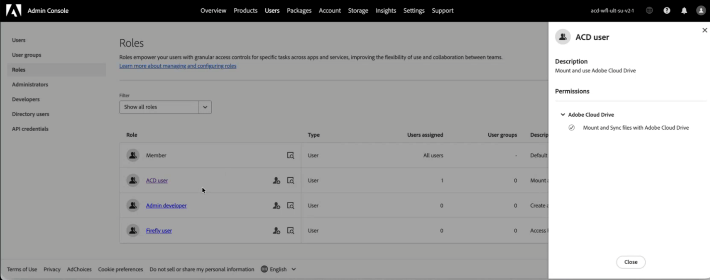

1. Haga clic en **Agregar usuarios**.
1. Introduzca la dirección de correo electrónico de cada usuario piloto.
1. Haga clic en **Guardar**.

   Los usuarios agregados a la función **usuario ACD** obtienen acceso inmediatamente. Los usuarios que no tienen esta función no tendrán acceso hasta que los añada a la función o vuelva a activar el conmutador de nivel de organización.

   >[!TIP]
   >
   >Para expandir el acceso con el tiempo, vuelva a la función **usuario de ACD** y agregue usuarios según sea necesario. Cuando esté listo para un despliegue completo, vuelva a activar el interruptor de nivel de organización en el rol **Miembro**. Una vez activado el modificador de nivel de organización, el rol **usuario de ACD** no tiene ningún efecto y no necesita mantenimiento.

## Implementar la aplicación de Adobe Cloud Drive

La configuración del acceso en Adobe Admin Console establece el derecho de. Al implementar la aplicación, se instala en el dispositivo del usuario. Estos son dos pasos separados y obligatorios.

Adobe Cloud Drive es una aplicación independiente. No se distribuye a través de la aplicación de escritorio de Creative Cloud y no aparece en el administrador de paquetes de Creative Cloud. Sin embargo, el perfil de usuario de Adobe Cloud Drive está vinculado al derecho a la aplicación de Creative Cloud. Esto significa que para que un usuario acceda a los proyectos de Workfront en la unidad, las aplicaciones de Creative Cloud deben tener derecho a la misma organización de IMS que Workfront.

Elija el método de implementación que coincida con las prácticas de administración de dispositivos de su organización.

### Método A: implementación administrada por TI mediante paquetes de Admin Console

Utilice este método cuando su organización utilice herramientas de implementación centralizadas como Microsoft Intune, SCCM, Jamf Pro o Apple Remote Desktop. Este es el flujo de trabajo de implementación empresarial estándar de Adobe y sigue el mismo proceso de creación de paquetes utilizado para otras aplicaciones de Adobe.

Para crear el paquete en Adobe Admin Console:

1. Inicie sesión en [adminconsole.adobe.com](https://adminconsole.adobe.com/).
1. Haga clic en **Paquetes** en la barra de navegación superior.
1. Haga clic en **Paquetes generados previamente** en el panel izquierdo.
1. Haga clic en la ficha **Plantillas**.

   Adobe Cloud Drive aparece dos veces en la lista de plantillas: una para macOS y otra para Windows.

   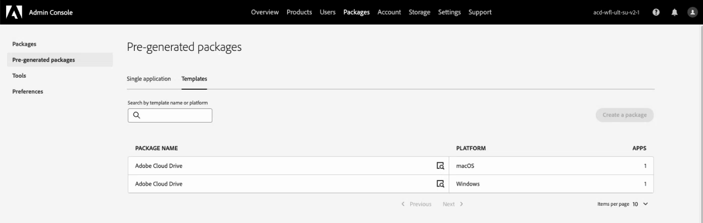

1. Busque la fila **Adobe Cloud Drive** que coincida con su plataforma de destino y luego haga clic en el icono de detalles de esa fila.

   Un panel lateral muestra los metadatos del paquete.

   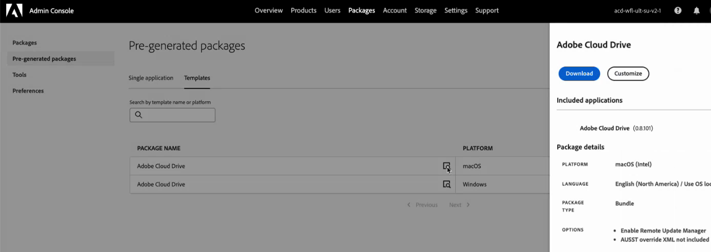

1. Haga clic en **Personalizar**.

   Se abre el asistente para personalizar paquetes, con cuatro pasos: **Configurar**, **Elegir aplicaciones**, **Opciones** y **Finalizar**.

1. En el paso **Configurar**, seleccione la arquitectura para los equipos de destino, confirme la configuración de idioma y haga clic en **Siguiente**.

   * **macOS:** Elija **macOS (Intel)** o **macOS (Apple Silicon)**.
   * **Windows:** Elija **Windows (64 bits)** o **Windows (ARM)**.

   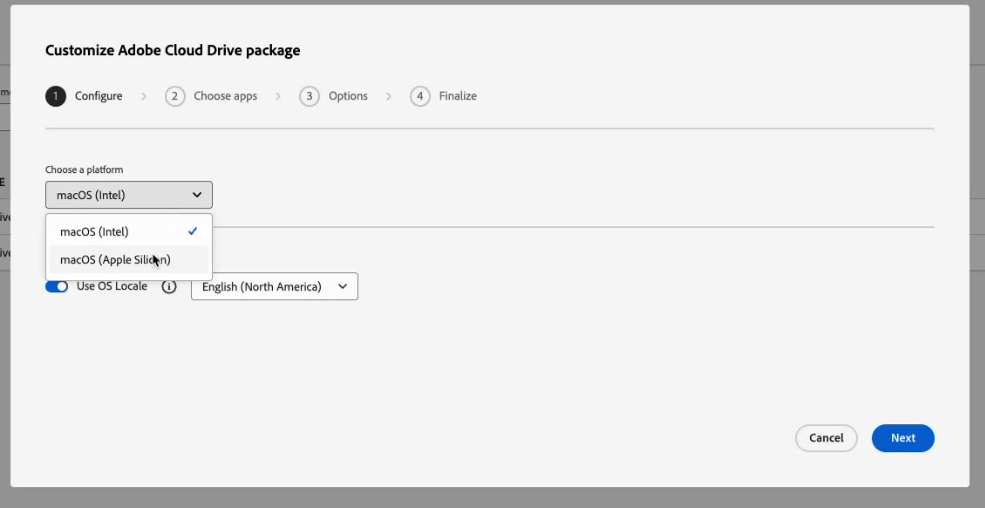

1. En el paso **Elegir aplicaciones**, confirme que Adobe Cloud Drive está seleccionado con la versión que desee.

   Adobe Cloud Drive está preseleccionado con la última versión disponible. Para usar una versión anterior, haz clic en **Otras versiones** y selecciona **Versiones anteriores**.

   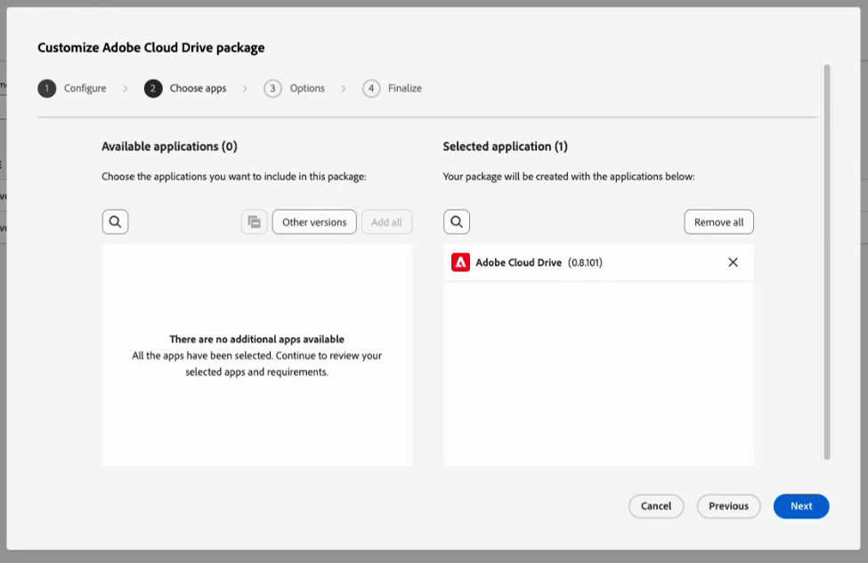

1. Haga clic en **Siguiente**.
1. En el paso **Opciones**, haga clic en **Siguiente** sin seleccionar ninguna opción.

   Esta configuración se aplica a las aplicaciones de escritorio de Creative Cloud y no se aplica a Adobe Cloud Drive.

   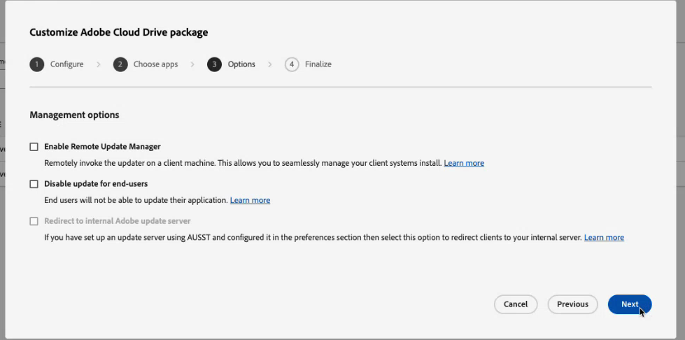

1. En el paso **Finalizar**, escriba un nombre para el paquete y seleccione **Paquete plano**.
1. Revise el resumen y haga clic en **Crear paquete**.

   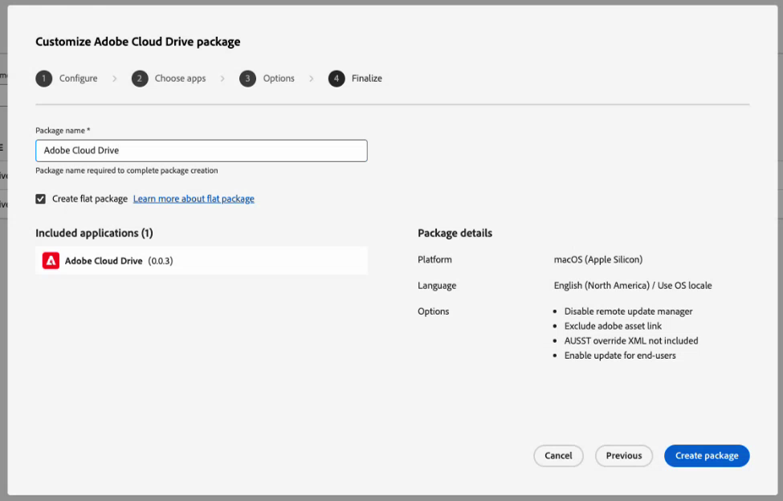

   El asistente se cierra. El nuevo paquete aparece en la parte superior de la lista de paquetes con el estado **Preparando** mientras se está creando. Una vez que esté listo, el estado cambia a **Actualizado** y aparece un vínculo de descarga.

   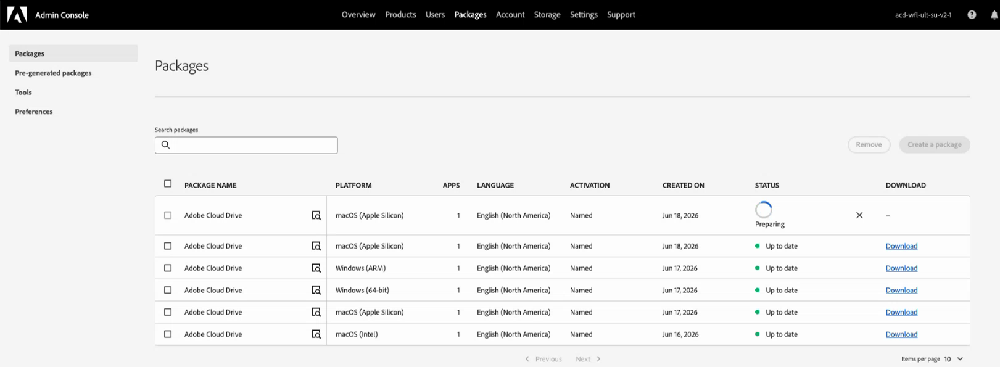

1. Haga clic en **Descargar** y guarde el archivo del paquete en la ubicación que haya elegido.

### Método B: descarga directa de autoservicio desde Distribución de software

Utilice este método para organizaciones más pequeñas, para dispositivos autoadministrados o cuando indique a usuarios individuales que instalen la aplicación ellos mismos.

Antes de empezar, confirme lo siguiente:

* El acceso está habilitado para los usuarios de Adobe Admin Console.
* Se ha notificado a los usuarios con la URL de distribución de software y las instrucciones de inicio de sesión.
* Se ha verificado la conectividad de red con los extremos requeridos. Para obtener más información, consulte [Requisitos de red](#network-requirements) en este artículo.

Para autoinstalar Adobe Cloud Drive:

1. Confirme que el acceso esté habilitado para el usuario en Adobe Admin Console.
1. Dirija al usuario a [experience.adobe.com/#/downloads](https://experience.adobe.com/#/downloads).

   >[!NOTE]
   >
   >Los usuarios deben tener habilitado el acceso a Adobe Cloud Drive en Adobe Admin Console para ver el programa de instalación de Adobe Cloud Drive. Los usuarios sin acceso no verán el instalador en la lista.

1. El usuario inicia sesión con su Enterprise ID o Federated ID. El instalador de Adobe Cloud Drive aparece en la ficha **Workfront** de Distribución de software.
1. El usuario descarga el instalador para su plataforma y sigue los pasos de instalación de [Instalar Adobe Cloud Drive](/help/quicksilver/documents/adobe-cloud-drive/install-adobe-cloud-drive.md).

   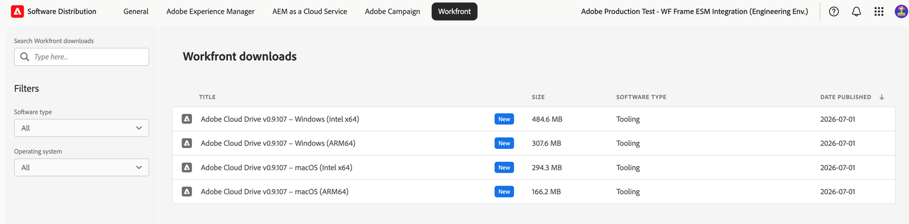

Después del despliegue, complete esta verificación en un dispositivo de prueba:

1. Inicie Adobe Cloud Drive desde la carpeta **Aplicaciones** (macOS) o desde el menú **Iniciar** (Windows).
1. Inicie sesión con una cuenta de usuario que tenga habilitado el acceso a Adobe Cloud Drive en Adobe Admin Console.
1. Confirme que las carpetas de proyecto de Workfront aparecen en la unidad montada en el Finder o el Explorador de archivos.

   >[!NOTE]
   >
   >Un usuario que inicia sesión correctamente pero no ve ninguna carpeta no tiene acceso a ningún proyecto de Workfront. Agregue el usuario a un proyecto en Workfront para rellenar la unidad.

1. Vaya a una carpeta de proyecto y cree un archivo de prueba pequeño.
1. Abra Workfront en un explorador y confirme que el archivo de prueba aparece en el proyecto correspondiente.
1. Elimine el archivo de prueba después de la verificación.

## Administrar el acceso continuo de los usuarios a Adobe Cloud Drive

Una vez que su organización esté utilizando Adobe Cloud Drive, siga estos pasos para agregar nuevos usuarios o para eliminar a los usuarios que ya no necesitan acceso.

### Crear un nuevo usuario

Si el conmutador de nivel de organización está activado, no se requiere ninguna acción de Adobe Admin Console. Pida al usuario que descargue e instale Adobe Cloud Drive. Si un usuario con licencia sigue sin poder acceder a Adobe Cloud Drive, póngase en contacto con el servicio de asistencia de Adobe para confirmar que su cuenta se haya migrado correctamente.

Si el conmutador de nivel de organización está desactivado:

1. Inicie sesión en [adminconsole.adobe.com](https://adminconsole.adobe.com/).
1. Haga clic en **Usuarios** en la barra de navegación superior y, a continuación, haga clic en **Roles** en el panel izquierdo.
1. Haga clic en **usuario ACD** en la lista de funciones.
1. Haga clic en **Agregar usuarios**, escriba la dirección de correo electrónico del usuario y haga clic en **Guardar**.

### Eliminar un usuario

Si el conmutador de nivel de organización está activado, cualquier usuario con licencia tendrá acceso a Adobe Cloud Drive. Para quitar el acceso de un usuario específico sin quitar su licencia de Workfront, desactive el conmutador de nivel de organización y agregue todos los demás usuarios al rol **usuario de ACD**, excluyendo al usuario que desea bloquear.

Si el modificador de nivel de organización está desactivado y el usuario tiene el rol **usuario ACD**:

1. Inicie sesión en [adminconsole.adobe.com](https://adminconsole.adobe.com/).
1. Haga clic en **Usuarios** en la barra de navegación superior y, a continuación, haga clic en **Roles** en el panel izquierdo.
1. Haga clic en **usuario ACD** en la lista de funciones.
1. Seleccione el usuario y haga clic en **Quitar**.

El usuario pierde el acceso a la unidad montada inmediatamente. Los archivos almacenados en Workfront no se eliminan. La caché local del usuario permanece en el dispositivo hasta que desinstale la aplicación.

>[!IMPORTANT]
>
>Al quitar un usuario de la función **usuario de ACD**, no se quita de Workfront ni de ningún proyecto de Workfront. Administrar el acceso al proyecto de Workfront por separado.

## Administrar el acceso al proyecto de Workfront

Adobe Cloud Drive muestra a los usuarios los proyectos de Workfront a los que tienen acceso. El acceso al proyecto se administra en Workfront, no en Adobe Admin Console. Un usuario que tiene acceso a Adobe Cloud Drive, pero que no pertenece a ningún proyecto de Workfront, ve una unidad montada vacía después de iniciar sesión. Este es el comportamiento esperado.

Para obtener información sobre cómo administrar el acceso al proyecto, vea [Administrar proyectos](/help/quicksilver/manage-work/projects/manage-projects/manage-projects-overview.md) y [Compartir un proyecto](/help/quicksilver/workfront-basics/grant-and-request-access-to-objects/share-a-project.md).

## Requisitos de red

Adobe Cloud Drive requiere acceso HTTPS saliente (puerto 443) a un conjunto de extremos de Adobe. No se requieren reglas de cortafuegos de entrada. Para obtener la lista de extremos, consulte [extremos de red de Adobe](https://helpx.adobe.com/in/enterprise/kb/network-endpoints.html).

Adobe Cloud Drive lee la configuración proxy de nivel del sistema tanto en macOS como en Windows. Se admiten los proxies autenticados.

## Consideraciones de seguridad

### Autenticación

Adobe Cloud Drive autentica a los usuarios a través de Adobe IMS (Identity Management System). Los usuarios inician sesión con su Enterprise ID o Federated ID. Si su organización utiliza SSO configurado en Adobe Admin Console, los usuarios se autentican a través de su proveedor de identidad y no necesitan credenciales de Adobe independientes.

>[!NOTE]
>
>Adobe Cloud Drive no admite los Adobe ID personales (cuentas creadas individualmente y no administradas) en implementaciones empresariales. Los usuarios deben iniciar sesión con un Enterprise ID o Federated ID en el directorio de su organización.

### Datos en tránsito y en reposo

* Toda la comunicación entre Adobe Cloud Drive y los servicios de Adobe utiliza TLS 1.2 o superior.
* Los archivos almacenados en el almacenamiento en la nube de Adobe se cifran en reposo.
* Los archivos almacenados en caché localmente utilizan el cifrado de disco en el nivel del sistema operativo cuando FileVault (macOS) o BitLocker (Windows) están habilitados en el dispositivo.

### Control de acceso a archivos

El acceso a archivos sigue los permisos del proyecto de Workfront. Los usuarios solo ven los proyectos para los que tienen permisos e interactúan con ellos, tal como lo permite su nivel de acceso a Workfront.

La carpeta raíz de cada proyecto de Workfront es de solo lectura en la vista de escritorio. Los usuarios no pueden cambiar el nombre, mover ni eliminar una carpeta raíz de proyecto desde el Buscador o el Explorador de archivos. Pueden crear carpetas, subcarpetas y archivos a cualquier profundidad dentro de una carpeta de proyecto, según sus permisos de Workfront.

## Solución de problemas comunes

Para ver los pasos de solución de problemas del usuario final, consulte [Solucionar problemas de Adobe Cloud Drive](/help/quicksilver/documents/adobe-cloud-drive/troubleshoot-adobe-cloud-drive.md). Los problemas que se enumeran a continuación son específicos de los administradores.

### El usuario no puede encontrar el instalador de Adobe Cloud Drive en Distribución de software

**Causa:** El acceso a Adobe Cloud Drive no está habilitado para el usuario en Adobe Admin Console.

**Resolución:**

1. Inicie sesión en [adminconsole.adobe.com](https://adminconsole.adobe.com/) y haga clic en **Usuarios**.
1. Busque el usuario y haga clic en su nombre.
1. Haga clic en la ficha **Roles** y compruebe si Adobe Cloud Drive está habilitado.

**Causa:** Creative Cloud All Apps está aprovisionado en una organización IMS diferente de Workfront.

**Resolución:** No hay ninguna resolución disponible actualmente.

### El usuario instaló la aplicación e inició sesión, pero no ve carpetas en la unidad

**Causa:** El usuario no tiene permisos para ningún proyecto de Workfront.

**Resolución:**

1. En Workfront, confirme que el usuario tiene permisos de al menos un proyecto.
1. Si no es así, comparta un proyecto con el usuario.
1. Pida al usuario que espere hasta cinco minutos a que aparezca la carpeta del proyecto.
1. Si la carpeta sigue sin aparecer después de cinco minutos, pídale al usuario que salga de Adobe Cloud Drive y vuelva a iniciarla.

### El usuario no puede iniciar sesión en Adobe Cloud Drive

**Causa:** La cuenta de Adobe Admin Console del usuario está inactiva o su identidad no está configurada correctamente.

**Resolución:**

1. En Adobe Admin Console, haga clic en **Usuarios** y busque el usuario.
1. Confirme que el estado de la cuenta del usuario es **Activo**.
1. Confirme que el dominio de correo electrónico del usuario es un dominio reivindicado en su directorio de Admin Console.
1. Si su organización utiliza SSO, confirme que la cuenta del usuario está activa en el proveedor de identidad.
1. Pida al usuario que intente iniciar sesión de nuevo.

### Los archivos no se sincronizan después de que el usuario los guarde

**Causa:** El archivo no se guardó explícitamente o hay un problema de conectividad de red.

**Resolución:**

1. Confirme con el usuario que guardó el archivo usando **Archivo** > **Guardar** en la aplicación. Al cerrar una aplicación o depender del guardado automático, no se almacena en déclencheur la sincronización.
1. Confirme que el usuario tiene acceso a Internet y puede comunicarse con `*.adobe.com` y `*.workfront.com`.
1. Pida al usuario que compruebe el icono de Adobe Cloud Drive en la barra de menús (macOS) o en la bandeja del sistema (Windows) para ver si hay un indicador de error.
1. Si se produce un error, pídale al usuario que salga de Adobe Cloud Drive, vuelva a iniciarlo y guarde el archivo de nuevo.
1. Si el problema persiste, recopile el registro de la aplicación:

   * **macOS:** `~/Library/Logs/Adobe/AdobeCloudDrive/`
   * **Windows:** `C:\Users\<username>\AppData\Local\Temp\Adobe\AdobeCloudDrive\`

### Apareció una copia en conflicto de un archivo en la carpeta del proyecto

**Causa:** dos usuarios guardaron cambios en el mismo archivo antes de sincronizar cualquiera de las versiones con la nube. Adobe Cloud Drive conservó ambas versiones automáticamente.

La copia en conflicto utiliza este formato de nomenclatura: `filename (Conflicted copy from device_name on date_time).extension`
Por ejemplo: `project_brief (Conflicted copy from jsmith's MacBook Pro on 2026-06-15-10-45-19).docx`

**Resolución:**

1. Pregunte a ambos usuarios qué versión es autoritativa.
1. Copie el contenido necesario de la copia en conflicto en el archivo principal.
1. Elimine la copia en conflicto después de reconciliar las dos versiones.

   >[!NOTE]
   >
   >Adobe Cloud Drive no utiliza el bloqueo de archivos. Para evitar conflictos cuando varios usuarios editan el mismo archivo, coordine la edición mediante asignaciones de tareas de Workfront o flujos de trabajo de aprobación antes de que varios usuarios accedan al mismo archivo desde el escritorio.

### El usuario no puede crear una carpeta o un archivo en el proyecto

**Causa A:** El usuario está intentando crear una carpeta o archivo en el nivel raíz del proyecto. Las carpetas raíz del proyecto son actualmente de solo lectura en Adobe Cloud Drive. Las carpetas de nivel raíz representan proyectos de Workfront, que se crean y administran en Workfront.

**Resolución:**

1. Pida al usuario que se desplace a cualquier subcarpeta existente dentro del proyecto y que cree allí el archivo o la carpeta.
1. Si el usuario necesita una nueva carpeta de nivel superior dentro del proyecto, pídale que la cree primero en Workfront. A continuación, aparece en Adobe Cloud Drive.

**Causa B:** El usuario no tiene permisos de edición en el proyecto de Workfront.

**Resolución:**

1. En Workfront, compruebe los permisos del usuario en el proyecto (**Ver**, **Contribuir** o **Administrar**).
1. Actualice los permisos del usuario a **Contribute** o **Manage** si necesita crear o editar archivos.
