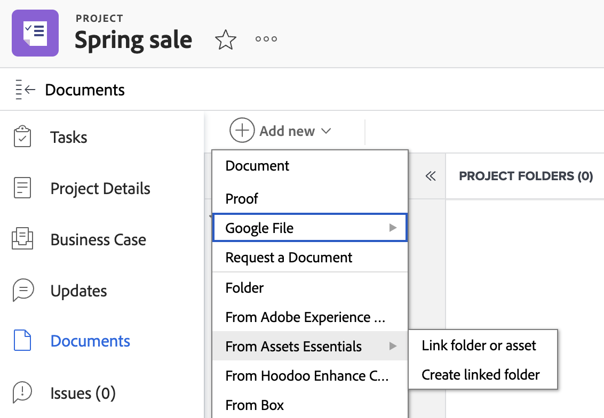

# Cree una carpeta vinculada a Experience Manager Assets o a Assets Essentials

Puede crear una carpeta vinculada a Experience Manager Assets o a Assets Essentials en Workfront. Como la carpeta está vinculada, cualquier recurso añadido a la carpeta se mostrará automáticamente en Workfront y Experience Manager. No es necesario que envíe manualmente el recurso si está en una carpeta vinculada.

Si se elimina o mueve un recurso de una carpeta vinculada dentro de Experience Manager Assets o Assets Essentials, Workfront conserva una copia del recurso en el área Proyecto > Documentos.

>[!NOTE]
>
>Esta funcionalidad no está disponible en el área de documentos nuevos. 
>Si su organización utiliza el almacenamiento en la nube de Adobe, verá el área de Documentos nuevos cuando acceda a documentos en Workfront. Desde allí, puede agregar recursos desde Experience Manager Assets o Assets Essentials, pero no podrá crear una carpeta vinculada.

## Requisitos de acceso

+++ Expanda para ver los requisitos de acceso para la funcionalidad en este artículo.

<table>
  <tr>
   <td><strong>paquete de Adobe Workfront</strong>
   </td>
   <td>Cualquiera
   </td>
  </tr>
  <tr>
   <td><strong>licencias de Adobe Workfront</strong>
   </td>
   <td>
   
Estándar

   
Plan

   </td>
  </tr>
  <tr>
   <td><strong>Productos adicionales</strong>
   </td>
   <td>Debe tener Experience Manager Assets as a Cloud Service o Assets Essentials y se le debe añadir al producto como usuario.
   </td>
  </tr>
  <tr>
   <td><strong>Permisos de Experience Manager</strong>
   </td>
   <td>Debe tener acceso de escritura a la carpeta de destino en la integración de Experience Manager.
   </td>
  </tr>
  <tr>
   <td><strong>Configuraciones de nivel de acceso</strong>
   </td>
   <td>Debe ser administrador de Workfront para configurar una integración de Experience Manager. Una vez configurada, los usuarios con una licencia de planificación o estándar pueden configurar carpetas vinculadas en proyectos individuales.
   </td>
  </tr>
</table>

Para obtener más información sobre esta tabla, consulte [Requisitos de acceso en la documentación de Workfront](/help/quicksilver/administration-and-setup/add-users/access-levels-and-object-permissions/access-level-requirements-in-documentation.md).

+++

## Requisitos previos

Antes de comenzar,

* El administrador de Workfront debe configurar una integración de Experience Manager. Para obtener más información, consulte [Configuración de la integración Experience Manager Assets as a Cloud Service](/help/quicksilver/administration-and-setup/configure-integrations/configure-aacs-integration.md) o [Configuración de la integración de Experience Manager Assets Essentials](/help/quicksilver/documents/adobe-workfront-for-experience-manager-assets-essentials/setup-asset-essentials.md).

## Crear una carpeta vinculada

La carpeta vinculada se crea en la ubicación especificada por el administrador de Workfront cuando configura la integración. Cada integración solo puede tener una ubicación de carpeta para las carpetas vinculadas.

El nombre de la carpeta vinculada se crea automáticamente en función del Portafolio, el Programa o el Proyecto con el que esté asociada y no se puede cambiar. Si el proyecto no está asociado a un Portafolio o a un Programa, la carpeta vinculada mostrará el nombre del proyecto y la fecha de creación.

>[!NOTE]
>
>No puede crear un nuevo documento o versión de prueba dentro de una carpeta vinculada.

Para crear una carpeta vinculada:

1. Vaya al Proyecto donde desee colocar la carpeta.
1. Seleccione **Agregar nuevo** y, a continuación, vaya a la integración de Experience Manager que configuró su administrador.

   >[!NOTE]
   >
   >El administrador de Workfront puede elegir cualquier nombre para esta integración, por lo que es posible que no mencione específicamente a Experience Manager Assets ni a Assets Essentials.

1. Seleccione **Crear carpeta vinculada**. El sistema crea automáticamente una carpeta en Experience Manager en función de la ubicación especificada cuando se configuró la integración.
   
