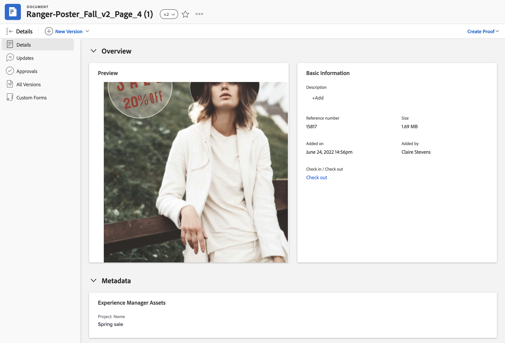
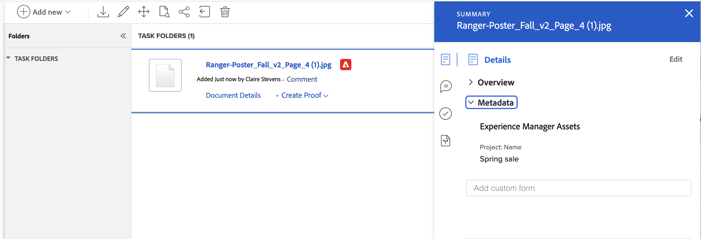

# Ver metadatos asignados para Experience Manager Assets o Assets Essentials

Puede ver una vista en tiempo real de los metadatos asignados en el panel Detalles del documento y Resumen de los documentos. Los campos de metadatos se asignan por primera vez al enviar un recurso desde Workfront a Experience Manager Assets o a Assets Essentials. Si el administrador de Workfront ha habilitado la sincronización de metadatos de objetos, los campos permanecen actualizados si se modifican en alguna de las aplicaciones.

## Requisitos de acceso

+++ Expanda para ver los requisitos de acceso para la funcionalidad en este artículo.

<table>
  <tr>
   <td><strong>paquete de Adobe Workfront</strong>
   </td>
   <td>Cualquiera
   </td>
  </tr>
  <tr>
   <td><strong>licencias de Adobe Workfront</strong>
   </td>
   <td>
   
Colaborador o superior

   
Solicitud o superior

   </td>
  </tr>
  <tr>
   <td><strong>Productos adicionales</strong>
   </td>
   <td>Debe tener Experience Manager Assets as a Cloud Service o Assets Essentials, y debe estar añadido al producto como usuario en la Admin Console.
   </td>
  </tr>
  <tr>
   <td><strong>Configuraciones de nivel de acceso</strong>
   </td>
   <td>
Acceso de edición a documentos

   </td>
  </tr>
  <tr>
   <td><strong>Permisos de objeto</strong>
   </td>
   <td>Acceso de visualización o superior
   </td>
  </tr>
</table>

Para obtener más información sobre esta tabla, consulte [Requisitos de acceso en la documentación de Workfront](/help/quicksilver/administration-and-setup/add-users/access-levels-and-object-permissions/access-level-requirements-in-documentation.md).

+++

## Requisitos previos

Antes de comenzar,

* El administrador de Workfront debe configurar una integración de Experience Manager. Para obtener más información, consulte [Configuración de la integración de Experience Manager Assets as a Cloud Service](/help/quicksilver/administration-and-setup/configure-integrations/configure-aacs-integration.md) o [Configuración de la integración de Experience Manager Assets Essentials](/help/quicksilver/documents/adobe-workfront-for-experience-manager-assets-essentials/setup-asset-essentials.md).

## Detalles del documento

Para abrir el panel Metadatos en Detalles del documento:

1. Vaya al proyecto, tarea o problema que contiene el documento y, a continuación, seleccione **Documentos**.
1. Pase el puntero por encima del documento que necesita y luego seleccione **Detalles del documento**.
1. Busque y expanda la sección **Metadatos**.

   >[!NOTE]
   >
   >No puede editar campos en esta sección. Son de solo lectura.

## Resumen de los documentos

Para abrir el panel Metadatos en el panel Resumen:

1. Vaya al proyecto, tarea o problema que contiene el documento y, a continuación, seleccione **Documentos**.
1. Busque el documento que necesita.
1. Haga clic en el **Icono de resumen**  y, a continuación, expanda la sección **Metadatos**.

   >[!NOTE]
   >
   >No puede editar campos en esta sección. Son de solo lectura.

