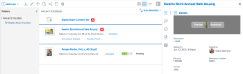

# Ver o descargar un recurso vinculado desde Experience Manager Assets o Assets Essentials

Puede ver o descargar un recurso en Adobe Workfront que esté vinculado desde Experience Manager Assets o Assets Essentials.

## Requisitos de acceso

+++ Expanda para ver los requisitos de acceso para la funcionalidad en este artículo.

<table style="table-layout:auto"> 
 <col> 
 <col> 
 <tbody> 
  <tr> 
   <td role="rowheader">Paquete de Adobe Workfront</td> 
   <td> 
 Cualquiera
 </td> 
  </tr> 
  <tr> 
   <td role="rowheader">Licencias de Adobe Workfront</td> 
   <td>
   
Colaborador o superior

   
Solicitud o superior
 </td> 
  </tr> 
  <tr> 
   <td role="rowheader">Productos adicionales</td> 
   <td>Debe tener Experience Manager as a Cloud Service o Assets Essentials, además de estar añadido al producto como usuario en Admin Console.</td> 
  </tr> 
  <tr> 
   <td role="rowheader">Configuraciones de nivel de acceso</td> 
   <td> 
Acceso de edición a documentos
  </td> 
  </tr> 
  <tr> 
   <td role="rowheader">Permisos de objeto</td> 
   <td> 
Acceso de visualización o superior
 </td> 
  </tr> 
 </tbody> 
</table>

Para obtener más información sobre esta tabla, consulte [Requisitos de acceso en la documentación de Workfront](/help/quicksilver/administration-and-setup/add-users/access-levels-and-object-permissions/access-level-requirements-in-documentation.md).

+++

## Requisitos previos

Antes de comenzar,

* El administrador de Workfront debe configurar una integración de Experience Manager. Para obtener más información, consulte [Configuración de la integración de Experience Manager Assets as a Cloud Service](/help/quicksilver/administration-and-setup/configure-integrations/configure-aacs-integration.md) o [Configuración de la integración de Experience Manager Assets Essentials](/help/quicksilver/documents/adobe-workfront-for-experience-manager-assets-essentials/setup-asset-essentials.md).

## Ver o descargar un recurso vinculado

1. Busque el documento que desea ver o descargar.
1. En la lista de documentos, seleccione el documento.
1. En el resumen del documento que se encuentra a la derecha, pasa el puntero por encima de la miniatura que hay en la parte superior y elija **Vista previa** o **Descargar**.

   
