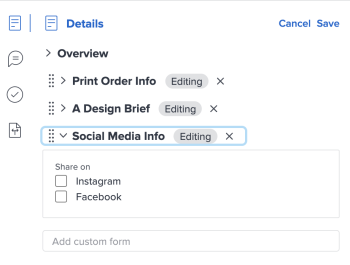

# Añadir o editar un formulario personalizado en un documento

Puede añadir un formulario personalizado a un documento o a una versión de documento para capturar información adicional o metadatos específicos de los recursos.

## Requisitos de acceso

+++ Expanda para ver los requisitos de acceso para la funcionalidad en este artículo.

<table style="table-layout:auto"> 
 <col> 
 <col> 
 <tbody> 
  <tr> 
   <td role="rowheader">Paquete de Adobe Workfront</td> 
   <td> 
Cualquier paquete de Workfront para administrar documentos mediante el almacenamiento heredado de Workfront

Cualquier paquete de flujo de trabajo para administrar documentos mediante Adobe Cloud Storage.
 </td> 
  </tr> 
  <tr> 
   <td role="rowheader">Licencias de Adobe Workfront</td> 
   <td> 
   
Colaborador o superior

   
Solicitud o superior
 </td> 
  </tr> 
  <tr> 
   <td role="rowheader">Configuraciones de nivel de acceso</td> 
   <td> 
Acceso de edición a documentos
 </td> 
  </tr> 
  <tr> 
   <td role="rowheader">Permisos de objeto</td> 
   <td> 
Administrar el acceso al documento
 </td> 
  </tr> 
 </tbody> 
</table>

Para obtener más información sobre el contenido de esta tabla, consulte [Requisitos de acceso en la documentación de Workfront](/help/quicksilver/administration-and-setup/add-users/access-levels-and-object-permissions/access-level-requirements-in-documentation.md).

+++

## Requisitos previos

* El formulario personalizado tiene que haberse compartido con usted

## Agregar un formulario personalizado en el área de documentos heredados

Si su organización utiliza un almacenamiento de Workfront heredado, verá el área de documentos heredados al acceder a documentos en Workfront. Para obtener más información sobre el almacenamiento de Workfront, consulte [Diferencias entre el almacenamiento en la nube de Adobe y el almacenamiento de Workfront heredado](/help/quicksilver/review-and-approve-work/esm-overview.md#differences-between-adobe-cloud-storage-and-legacy-workfront-storage).

Para añadir un formulario personalizado a un documento:

1. Vaya al proyecto, tarea o problema que contiene el documento y, a continuación, seleccione **Documentos**.
1. Busque el documento que necesita.

1. Haga clic en el icono **Resumen**  y luego busque la sección **Detalles**.
1. En el cuadro **Añadir formulario personalizado**, empiece a escribir y seleccione un formulario personalizado. El formulario se guardará automáticamente en el documento.

   >[!NOTE]
   >
   >En el menú desplegable solo se muestran los formularios personalizados activos. Puede añadir hasta 10 formularios personalizados por documento. Si necesita crear un formulario personalizado, consulte [Crear un formulario personalizado](/help/quicksilver/administration-and-setup/customize-workfront/create-manage-custom-forms/form-designer/design-a-form/design-a-form.md).

## Editar un formulario personalizado en el área de documentos heredados

1. Vaya al proyecto, tarea o problema que contiene el documento y, a continuación, seleccione **Documentos**.
1. Busque el documento que necesita.

1. Haga clic en el icono **Resumen**  y, a continuación, busque la sección **Detalles** cerca de la parte superior.
1. Haga clic en **Editar** en la esquina superior derecha y expanda el formulario que desee.
1. Realice los cambios necesarios y luego haga clic en **Guardar**.

   

## Agregar un formulario personalizado en el área de Documentos nueva

Si su organización utiliza el almacenamiento en la nube de Adobe, verá la nueva área Documentos al acceder a documentos en Workfront. Para obtener más información sobre el almacenamiento en la nube de Adobe, consulte [Información general sobre el almacenamiento en la nube de Adobe](/help/quicksilver/review-and-approve-work/esm-overview.md).

Para añadir un formulario personalizado a un documento:

1. Vaya al proyecto, tarea o problema que contiene el documento y, a continuación, seleccione **Documentos**.
1. Seleccione el documento que necesite.
1. En la sección **Detalles** de la derecha, haga clic en **Editar**.
   
1. En el campo **Forms personalizado**, empiece a escribir y seleccione un formulario personalizado.
1. Haga clic en **Guardar**. El formulario personalizado aparece en la sección de detalles.

## Editar un formulario personalizado en la nueva área de documentos

1. Vaya al proyecto, tarea o problema que contiene el documento y, a continuación, seleccione **Documentos**.
1. Seleccione el documento que necesite.
1. En la sección **Detalles** de la derecha, haga clic en **Editar**.
   
1. En la sección **Forms personalizado**, busque el formulario que desea editar.
1. Realice los cambios necesarios y luego haga clic en **Guardar**.
