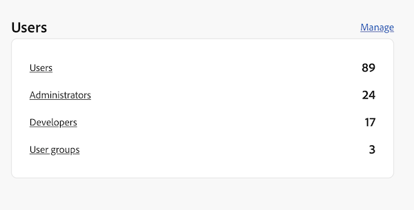

# AppBuilder dentro de Workfront Document Details

Puede instalar AppBuilder en Detalles del documento.

## Requisitos previos

Debe tener lo siguiente:

* Una cuenta de Workfront habilitada para IMS
* Un equipo de desarrollo con nodo v18 y npm

## Añadir desarrolladores a Admin Console

>[!IMPORTANT]
>
>Asegúrese de haber seleccionado la organización IMS correcta para todos los pasos siguientes. Si pertenece a varias organizaciones, es posible seleccionar la incorrecta. Asegúrese de actuar bajo la organización correcta, que generalmente aparece en la esquina superior derecha.


1. Vaya a una de las siguientes opciones:

* Escenario: [https://stage.adminconsole.adobe.com/](https://stage.adminconsole.adobe.com/)
* Prod: [https://adminconsole.adobe.com/](https://adminconsole.adobe.com/)

1. En la sección Usuarios, haga clic en **Desarrolladores** > **Adición de desarrolladores**.

   

   >[!NOTE]
   >
   >Si no ve una opción para administrar desarrolladores, no tiene un producto que permita el acceso a desarrolladores. Workfront AEM no proporciona acceso de desarrollador, pero sí lo hace de manera independiente, lo que hace el. Si no ve esto, tendremos que averiguar cómo incluir Workfront en la lista de aplicaciones que permite a los desarrolladores.

1. Añada el correo electrónico del usuario. Debe buscar usuarios existentes que ya se hayan agregado desde Admin Console.

1. Añada los productos necesarios al perfil del desarrollador y haga clic en **Guardar**.


## Obtener acceso a AppBuilder

Las organizaciones deben trabajar con sus administradores de cuentas para adquirir AppBuilder. El proceso exacto para esto no se entiende porque no necesitábamos hacer esto para el POC.

Si desea probar la integración de AppBuilder, puede solicitar una prueba gratuita para su organización de IMS aquí:
[https://developer.adobe.com/app-builder/trial/#](https://developer.adobe.com/app-builder/trial/#)

Tengo la impresión de que aunque es una prueba gratuita de 30 días, en realidad no desactivarán la prueba después de ese tiempo.

Si AppBuilder está configurado correctamente, debería ver &quot;Crear proyecto a partir de una plantilla&quot; como parte de la creación de un nuevo proyecto (que se trata en la sección siguiente).

## Cree un nuevo proyecto en la consola de desarrollo

1. Clic **Crear proyecto a partir de plantilla**.

   >[!IMPORTANT]
   >
   >Si no ve esta opción, significa que no está configurado correctamente en Admin Console y no tiene acceso al catálogo del creador de aplicaciones. Esta opción solo se muestra cuando tiene acceso a AppBuilder.

   

1. Seleccionar **Generador de aplicaciones**.

1. Introduzca una **Título del proyecto** y **Nombre de aplicación**. Ambos tienen valores predeterminados, pero será más fácil identificar el proyecto que desee más adelante si personaliza el valor.

   >[!NOTE]
   >
   >Hay una opción para agregar espacios de trabajo adicionales en este paso. Se nos sugirió que creáramos un espacio de trabajo para cada desarrollador. Esto mantiene los secretos y las implementaciones separados entre sí a medida que los desarrolladores trabajan. Debe asignar un nombre al espacio de trabajo con el nombre del desarrollador que lo utiliza. El clip de AIO tiene opciones para cambiar el espacio de trabajo, que se tratarán más adelante.


1. Salir **Incluir tiempo de ejecución** seleccionados. No sé por qué, en serio, ¡pero no lo cambies!

1. Haga clic en **Guardar**.

## CLI de E/S de Adobe (aio)

Adobe proporciona una CLI de código abierto que se puede utilizar para ayudar a crear las aplicaciones del Generador de aplicaciones. Puede encontrar la documentación aquí: [https://github.com/adobe/aio-cli](https://github.com/adobe/aio-cli) así como instrucciones de Adobe del Generador de aplicaciones [https://developer.adobe.com/app-builder/docs/getting_started/first_app/](https://developer.adobe.com/app-builder/docs/getting_started/first_app/).

1. Instalación
   1. Para instalar la herramienta (asegúrese de que está en el nodo v18 primero), ejecute: `npm install -g @adobe/aio-cli `.

1. Autenticar en Terminal
   1. Inicie el terminal e inicie sesión en AIO con el comando: `aio login`.

1. Inicialice la aplicación
   1. Comience a configurar la aplicación ejecutando: `aio app init example-app`.

1. Selección de configuración
   1. Seleccione la organización y el proyecto en las opciones proporcionadas.\
      
      

1. Selección y configuración de plantilla
   1. Examine todas las plantillas disponibles y elija la **@adobe/aem-cf-editor-ui-ext-tpl** plantilla para el proyecto.
      
      

1. Definición de la extensión
   1. Asigne un nombre a la extensión.
   1. Proporcione un resumen descriptivo de la funcionalidad de la extensión.
   1. Seleccione un número de versión inicial para empezar.
   1. Confirme la finalización seleccionando **Ya terminé.**.
      

1. Vaya a la carpeta del proyecto
   1. Acceso a la carpeta src
   1. Cambie el nombre de la carpeta `aem-cf-editor-1` hasta `workfront-doc-details-1`.

1. Modificar archivos de configuración
   1. Abra app.config.yaml.
   1. Actualizar la línea desde `aem/cf-editor/1` hasta `workfront/doc-details/1`.
   1. Ajuste de la ruta de inclusión desde `src/aem-cf-editor-1/ext.config.yaml` hasta `src/workfront-doc-details-1/ext.config.yaml`.

1. Edición del componente Registro de extensiones
   1. Abrir `src/workfront-doc-details-1/web-src/src/components/ExtensionRegistration.js`.
   1. En la sección métodos, agregue una función. `secondaryNav` que contiene una función asincrónica `getButtons`.
   1. `getButtons` debe recibir un objeto con la siguiente estructura:

      ```
          {
          docId: "String",  // Document ID
          docvId: "String", // Document version ID
          sharedContext: {
              hostname: "String",
              protocol: "String",
              auth: {
              imsOrgID: "String",    // Customer's IMS Org ID
              imsToken: "String",    // User's IMS token
              imsClientId: "String"
              }
          }
          }
      ```

1. Esta función devuelve una matriz de objetos button que aparecerán en la navegación:

   ```
       methods: {
       secondaryNav: {
           async getButtons({docId, docvId, sharedContext}) {
           return [
               { label: 'Registration', url: '/index.html' },
               { label: 'Review', url: '/index.html#review' }
           ];
           }
       }
       }
   ```

1. Configurar enrutamiento de aplicaciones
   1. Abra el archivo App.js y configure las rutas para incluir las funcionalidades recién desarrolladas. Deberá configurar rutas para la vista predeterminada y para cualquier vista adicional como la página de revisión. A continuación se indica cómo se pueden definir estas rutas:

      ```
          <Route index element={<ExtensionRegistration />} />
          <Route exact path="index.html" element={<ExtensionRegistration />} />
          <Route exact path="review" element={<Review />} />
      ```

1. Acceder a detalles del documento
   1. Implementar la función proporcionada `document.getDocumentDetails` en la aplicación para recuperar datos esenciales del documento. Esta función recupera un objeto que contiene `docId` y `docvId`, junto con un `sharedContext` objeto con `hostname`, `protocol`y los detalles de autenticación. Asegúrese de que la aplicación gestione correctamente estos datos.

1. Integración de la captura de datos en los componentes
   1. Añada un componente nuevo a la carpeta de componentes de su aplicación. Dentro de este componente, establezca una conexión con Workfront para recuperar información del documento y datos de autenticación mediante la conexión establecida con la aplicación host. Este es un ejemplo de cómo puede estructurar el componente para que se ocupe de esto:

      ```
          import { useEffect, useState } from 'react';
          import { attach } from "@adobe/uix-guest";
          import { extensionId } from "./Constants";
      
          function Review() {
              const [conn, setConn] = useState();
      
              useEffect(() => {
              const iife = async () => {
                  // "attach" the guest application to the host. This creates a "tunnel" from the host app that allows data to be passed to the iframe running this app.
                  const connection = await attach({
                  id: extensionId,
                  });
                  setConn(connection);
              };
      
              iife();
              }, []);
      
              useEffect(() => {
                  if (conn) {
                      // Using the connection created above, grab the document details from the host tunnel.
                      conn?.host?.document?.getDocumentDetails().then(setDocDetails);
                      // Pull the auth tokens from the sharedContext (see host app for details)
                      setAuth(conn?.sharedContext?.get("auth"));
                      setHostname(conn?.sharedContext?.get("hostname"));
                      setProtocol(conn?.sharedContext?.get("protocol"));
                  }
              }, [conn]);
      
          return (<>Text</>);
          }
      
          export default Review;
      ```

## Configuración de proyectos de AIO existentes

1. Actualizar archivos de configuración
   1. Abrir `app.config.yaml`.
   1. Modifique la configuración actualizando la referencia desde `aem/cf-editor/1` hasta `workfront/doc-details/1`. Este ajuste alinea las rutas de archivo con la estructura de proyecto actual.

1. Revisión del componente Registro de extensiones
   1. Busque y abra el archivo llamado `ExtensionRegistration.js`.
   1. En la sección métodos, agregue una función. `secondaryNav` que contiene una función asincrónica `getButtons`.
   1. `getButtons` debe recibir un objeto con la siguiente estructura:

      ```
          {
          docId: "String",  // Document ID
          docvId: "String", // Document version ID
          sharedContext: {
              hostname: "String",
              protocol: "String",
              auth: {
              imsOrgID: "String",    // Customer's IMS Org ID
              imsToken: "String",    // User's IMS token
              imsClientId: "String"
              }
          }
          }
      ```

1. Esta función devuelve una matriz de objetos button que aparecerán en la navegación:

   ```
       methods: {
       secondaryNav: {
           async getButtons({docId, docvId, sharedContext}) {
           return [
               { label: 'Registration', url: '/index.html' },
               { label: 'Review', url: '/index.html#review' }
           ];
           }
       }
       }
   ```

1. Configurar enrutamiento de aplicaciones
   1. Abra su `App.js`y configure las rutas para incluir las funcionalidades recién desarrolladas. Deberá configurar rutas para la vista predeterminada y para cualquier vista adicional como la página de revisión. A continuación se indica cómo se pueden definir estas rutas:

      ```
          <Route index element={<ExtensionRegistration />} />
          <Route exact path="index.html" element={<ExtensionRegistration />} />
          <Route exact path="review" element={<Review />} />
      ```

1. Acceder a detalles del documento
   1. Implementar la función proporcionada `document.getDocumentDetails` en la aplicación para recuperar datos esenciales del documento. Esta función recupera un objeto que contiene `docId` y `docvId`, junto con un `sharedContext` objeto con `hostname`, `protocol`y los detalles de autenticación. Asegúrese de que la aplicación gestione correctamente estos datos.

1. Integración de la captura de datos en los componentes
   1. Añada un componente nuevo a la carpeta de componentes de su aplicación. Dentro de este componente, establezca una conexión con Workfront para recuperar información del documento y datos de autenticación mediante la conexión establecida con la aplicación host. Este es un ejemplo de cómo puede estructurar el componente para que se ocupe de esto:

      ```
          import { useEffect, useState } from 'react';
          import { attach } from "@adobe/uix-guest";
          import { extensionId } from "./Constants";
      
          function Review() {
              const [conn, setConn] = useState();
      
              useEffect(() => {
              const iife = async () => {
                  // "attach" the guest application to the host. This creates a "tunnel" from the host app that allows data to be passed to the iframe running this app.
                  const connection = await attach({
                  id: extensionId,
                  });
                  setConn(connection);
              };
      
              iife();
              }, []);
      
              useEffect(() => {
                  if (conn) {
                      // Using the connection created above, grab the document details from the host tunnel.
                      conn?.host?.document?.getDocumentDetails().then(setDocDetails);
                      // Pull the auth tokens from the sharedContext (see host app for details)
                      setAuth(conn?.sharedContext?.get("auth"));
                      setHostname(conn?.sharedContext?.get("hostname"));
                      setProtocol(conn?.sharedContext?.get("protocol"));
                  }
              }, [conn]);
      
          return (<>Text</>);
          }
      
          export default Review;
      ```

## Publicación de aplicaciones

>[!IMPORTANT]
>
>Asegúrese de haber seleccionado la organización de IMS correcta para cada uno de los pasos siguientes.

Para tener una aplicación de invitado cargada en Workfront, la aplicación debe insertarse en el espacio de trabajo de producción y enviarse para su aprobación.

1. Implementar la aplicación en el espacio de trabajo de producción
   1. `aio app use -w Production `
   1. `aio app deploy `

1. Vaya a [https://developer-stage.adobe.com/](https://developer-stage.adobe.com/) o [https://developer.adobe.com/](https://developer.adobe.com/).
   1. Clic **Consola** en la esquina superior derecha.

1. Busque el proyecto que utilizó para crear la aplicación AppBuilder.

1. Seleccione el espacio de trabajo de producción.
   

1. Envíe la solicitud para revisión privada (recibirá advertencias de que no vamos a publicar en el mercado de intercambio de aplicaciones, lo cual está bien).

1. Rellene el formulario (título, descripción, icono y nota para el revisor).
   

>[!IMPORTANT]
>
>Una vez enviado, un administrador del sistema de la organización deberá aprobar el envío.

## Aprobar el envío

1. Como administrador del sistema, vaya a [https://stage.exchange.adobe.com/](https://stage.exchange.adobe.com/) o [https://exchange.adobe.com/](https://exchange.adobe.com/).

1. Clic **Administrar** > **Aplicaciones de Experience Cloud**. Debería ver las aplicaciones enviadas con opciones para aprobar o rechazar.
Una vez aprobadas, las extensiones de aplicación publicadas deben cargarse automáticamente en el entorno de Workfront.

   

## Ayuda adicional

Adobe tiene documentación interesante sobre cómo empezar a crear aplicaciones para AppBuilder y cómo implementarlas. Estos son algunos vínculos útiles:

* [https://developer.adobe.com/app-builder/docs/getting_started/first_app/#4-bootstrapping-new-app-using-the-cli](https://developer.adobe.com/app-builder/docs/getting_started/first_app/#4-bootstrapping-new-app-using-the-cli)

* [https://developer.adobe.com/uix/docs/guides/publication/](https://developer.adobe.com/uix/docs/guides/publication/)

* [https://developer.adobe.com/uix/docs/services/aem-cf-console-admin/extension-development/](https://developer.adobe.com/uix/docs/services/aem-cf-console-admin/extension-development/)

