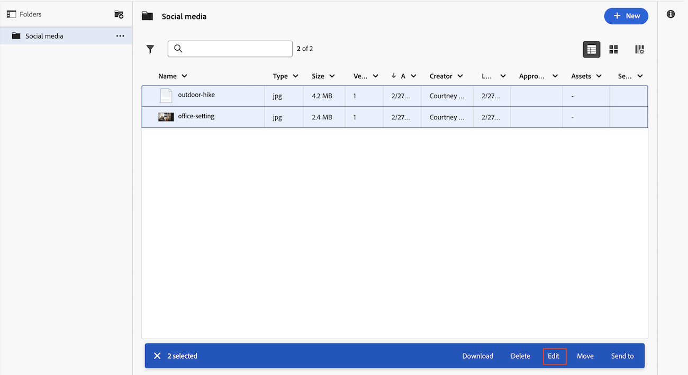

# Editar documentos de forma masiva

Puede editar la descripción, añadir formularios personalizados y editar formularios personalizados en varios documentos a la vez.

## Consideraciones al editar formularios personalizados

Tenga en cuenta lo siguiente al editar formularios personalizados de documentos de forma masiva:

* La información que está cambiando en todos los documentos seleccionados sobrescribe la información existente en documentos individuales.
* Cuando se seleccionan proyectos que tienen valores diferentes para el mismo campo, el campo muestra un indicador “Varios valores”. Los campos que son casillas de verificación, botones de opción y conmutadores tienen el indicador “Varios valores” junto a ellos.
* Cuando se actualiza una opción en un campo de varias opciones (por ejemplo, un campo que se muestra como un conjunto de opciones o casillas de verificación), todas las demás opciones deben coincidir entre los documentos seleccionados.

>[!BEGINSHADEBOX]

**Ejemplo**
Puede que tenga un campo de casilla de verificación con tres casillas de verificación (Opción 1, Opción 2 y Opción 3): la Opción 1 está desmarcada para todos los documentos seleccionados, y la Opción 2 y la Opción 3 están marcadas para algunos y no están marcadas para otros documentos que haya seleccionado. Si desea comprobar la Opción 1 para todos los documentos, también debe hacer que la Opción 2 y la Opción 3 coincidan con todos los proyectos seleccionados antes de poder guardar los cambios. Por lo tanto, debe seleccionarlas o deseleccionarlas para que puedan coincidir en todos los proyectos seleccionados. Si no cambia ninguna de las opciones, puede guardar el campo tal cual y los documentos mantendrán su selección actual para todas las opciones.

>[!ENDSHADEBOX]

## Requisitos de acceso

+++ Expanda para ver los requisitos de acceso para la funcionalidad en este artículo.

<table style="table-layout:auto"> 
 <col> 
 <col> 
 <tbody> 
  <tr> 
   <td role="rowheader">Paquete de Adobe Workfront</td> 
   <td> 
 Cualquiera
 </td> 
  </tr> 
  <tr> 
   <td role="rowheader">Licencias de Adobe Workfront*</td> 
   <td>
Colaborador o superior
 
   
Solicitud o superior
 </td> 
  </tr> 
  <tr> 
   <td role="rowheader">Configuraciones de nivel de acceso</td> 
   <td> 
Acceso de edición a documentos
</td> 
  </tr> 
  <tr> 
   <td role="rowheader">Permisos de objeto</td> 
   <td> 
Administrar el acceso al documento
</td> 
  </tr> 
 </tbody> 
</table>

Para obtener más información sobre el contenido de esta tabla, consulte [Requisitos de acceso en la documentación de Workfront](/help/quicksilver/administration-and-setup/add-users/access-levels-and-object-permissions/access-level-requirements-in-documentation.md).

+++

## Editar documentos por lotes en el área de documentos heredados

Si su organización utiliza un almacenamiento de Workfront heredado, verá el área de documentos heredados al acceder a documentos en Workfront. Para obtener más información sobre el almacenamiento de Workfront, consulte [Diferencias entre el almacenamiento empresarial de Adobe y el almacenamiento de Workfront heredado](/help/quicksilver/review-and-approve-work/esm-overview.md#differences-between-adobe-enterprise-storage-and-legacy-workfront-storage).

Para editar documentos de forma masiva, haga lo siguiente:

1. Vaya a la pestaña Documentos de un proyecto o al área Documentos del menú principal.
1. Presione Ctrl o Cmd en el teclado y seleccione los documentos que desee editar.
1. Haga clic en el icono Editar .
   
1. (Opcional) Añada o edite la **Descripción**. Si la descripción de cada documento es diferente, verá _Múltiples valores_ en el cuadro de descripción. Puede añadir la misma descripción para todos los documentos, pero no puede editar descripciones de documentos individuales al editar de forma masiva.
1. Realice los siguientes cambios con los formularios personalizados:

   <table>
    <tr>
    <td><strong>Añadir formularios</strong></td>
    <td>En el cuadro <strong>Agregar formulario personalizado</strong>, puede elegir entre formularios adjuntos y formularios para añadir. Los formularios adjuntos se encuentran en algunos de los documentos seleccionados, pero no en todos. Un formulario adjunto a todos los documentos seleccionados se muestra de forma automática en la ventana de edición.  </td>
    </tr>
    <tr>
    <td><strong>Editar formularios</strong></td>
    <td>Edite los formularios personalizados adjuntos. La información que cambie sobrescribirá la información existente en los documentos individuales. Los campos con valores diferentes en los documentos se muestran como “Múltiples valores”. </td>
    </tr>
    <tr>
    <td><strong>Reorganizar formularios</strong></td>
    <td>Haga clic en el formulario personalizado y arrástrelo para reorganizarlo.</td>
    </tr>
    </table>
1. Haga clic en **Guardar**.

## Editar documentos por lotes en el área de nuevos documentos

Si su organización utiliza el almacenamiento empresarial, verá el área de nuevos documentos al acceder a ellos en Workfront. Para obtener más información acerca del almacenamiento empresarial, consulte [Descripción general del almacenamiento empresarial de Adobe](/help/quicksilver/review-and-approve-work/esm-overview.md).

Para editar documentos de forma masiva, haga lo siguiente:

1. Vaya al proyecto, tarea o problema que contiene el documento y, a continuación, seleccione **Documentos**.
1. Presione Ctrl o Cmd en el teclado y seleccione los documentos que desee editar.
1. Haga clic en Editar en la parte inferior de la página.
   
1. (Opcional) Añada o edite la **Descripción**. Si la descripción de cada documento es diferente, verá _Múltiples valores_ en el cuadro de descripción. Puede añadir la misma descripción para todos los documentos, pero no puede editar descripciones de documentos individuales al editar de forma masiva.
1. Realice los siguientes cambios con los formularios personalizados:

   <table>
    <tr>
    <td><strong>Añadir formularios</strong></td>
    <td>En la sección <strong>Formulario personalizado</strong>, puede agregar un nuevo formulario personalizado a los documentos seleccionados. Los formularios personalizados adjuntos a todos los documentos seleccionados se muestran en la sección <strong>Formularios personalizados en común</strong>.  </td>
    </tr>
    <tr>
    <td><strong>Editar formularios</strong></td>
    <td>Edite los formularios personalizados adjuntos. La información que cambie sobrescribirá la información existente en los documentos individuales. Los campos con valores diferentes en los documentos se muestran como “Múltiples valores”. </td>
    </tr>
    </table>
1. Haga clic en **Guardar**.

## Editar documentos de forma masiva en un informe de documento

1. Desplácese a un informe de documento existente.
o
Cree un informe de documento como se describe en [Crear un informe personalizado](/help/quicksilver/reports-and-dashboards/reports/creating-and-managing-reports/create-custom-report.md).
1. Seleccione los documentos que desea editar.
1. Haga clic en el icono Editar .
1. (Opcional) Añada o edite la **Descripción**. Si la descripción de cada documento es diferente, verá _Múltiples valores_ en el cuadro de descripción. Puede añadir la misma descripción para todos los documentos, pero no puede editar descripciones de documentos individuales al editar de forma masiva.
1. Realice los siguientes cambios con los formularios personalizados:

   <table>
    <tr>
    <td><strong>Añadir formularios</strong></td>
    <td>En el cuadro <strong>Agregar formulario personalizado</strong>, puede elegir entre formularios adjuntos y formularios para añadir. Los formularios adjuntos se encuentran en algunos de los documentos seleccionados, pero no en todos. Un formulario adjunto a todos los documentos seleccionados se muestra de forma automática en la ventana de edición.  </td>
    </tr>
    <tr>
    <td><strong>Editar formularios</strong></td>
    <td>Edite los formularios personalizados adjuntos. La información que cambie sobrescribirá la información existente en los documentos individuales. Los campos con valores diferentes en los documentos se muestran como “Múltiples valores”. </td>
    </tr>
    <tr>
    <td><strong>Reorganizar formularios</strong></td>
    <td>Haga clic en el formulario personalizado y arrástrelo para reorganizarlo.</td>
    </tr>
    </table>
1. Haga clic en **Guardar**.
