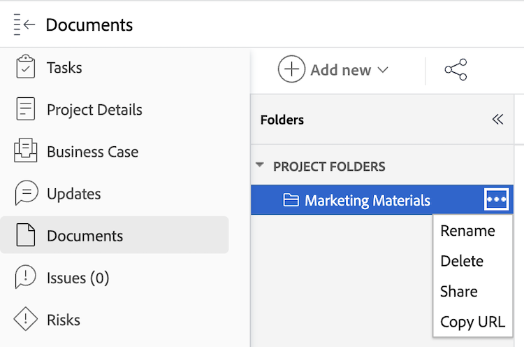

# Copiar y compartir un vínculo a una carpeta de documentos

Puede copiar un vínculo directo para cualquier carpeta de documentos que contenga cualquiera de los siguientes objetos de [!DNL Workfront]: [!UICONTROL Programa], [!UICONTROL Portafolios], [!UICONTROL Proyecto], [!UICONTROL Tarea] o [!UICONTROL Problema]. No puede copiar un vínculo de ninguna carpeta contenida en el área de [!UICONTROL Documentos] del menú principal, ya que esas carpetas están vinculadas directamente a su perfil de usuario y no se pueden compartir con otros.

>[!NOTE]
>
>Esta funcionalidad no está disponible en el área de nuevos documentos. 
>Si su organización utiliza el almacenamiento empresarial, verá el área de nuevos documentos al acceder a ellos en Workfront. Para obtener más información acerca del almacenamiento empresarial, consulte [Descripción general del almacenamiento empresarial de Adobe](/help/quicksilver/review-and-approve-work/esm-overview.md).

## Requisitos de acceso

+++ Expanda para ver los requisitos de acceso para la funcionalidad en este artículo.

<table style="table-layout:auto"> 
 <col> 
 <col> 
 <tbody> 
  <tr> 
   <td role="rowheader">Paquete de Adobe Workfront</td> 
   <td> 
Cualquiera
 </td> 
  </tr> 
  <tr> 
   <td role="rowheader">Licencia de Adobe Workfront</td> 
   <td> 
   
Estándar

   
Trabajo o superior
 </td> 
  </tr> 
  <tr> 
   <td role="rowheader">Configuraciones de nivel de acceso</td> 
   <td> 
Ver acceso a los documentos
 </td> 
  </tr> 
  <tr> 
 </tbody> 
</table>

Para obtener más información sobre el contenido de esta tabla, consulte [Requisitos de acceso en la documentación de Workfront](/help/quicksilver/administration-and-setup/add-users/access-levels-and-object-permissions/access-level-requirements-in-documentation.md).

+++

## Copiar y compartir un vínculo a una carpeta de documentos

Para copiar un vínculo a una carpeta de documentos:

1. Vaya al objeto [!DNL Workfront] que contiene la carpeta del documento.
1. Haga clic en el menú **[!UICONTROL Más]** y, a continuación, seleccione **[!UICONTROL Copiar URL]**. Puede compartir este vínculo para proporcionar acceso rápido a la carpeta. Los usuarios deben tener al menos acceso de visualización al objeto para ver la carpeta.
   
