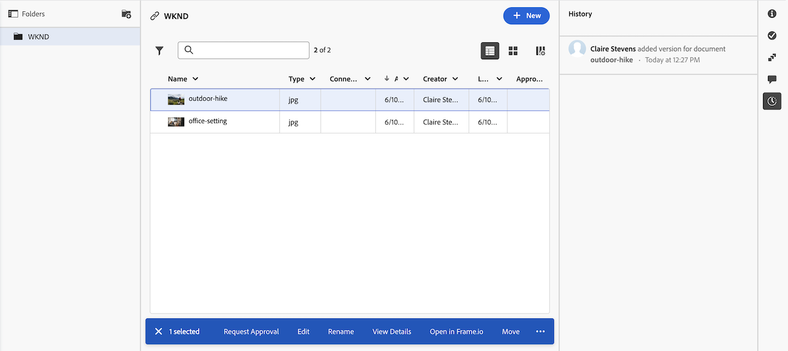

# El área Documentos

En el área Documentos puede organizar, administrar y ver los metadatos de los documentos cargados en Adobe Workfront. También puede ver la decisión de la revisión.

Actualmente, Workfront tiene dos versiones del área Documentos: el área de documentos heredados y el área de documentos nueva. La versión que utilice su organización depende de si su organización utiliza almacenamiento de Workfront heredado o almacenamiento en la nube de Adobe. Para obtener más información acerca de estos tipos de almacenamiento, vea [Información general sobre el almacenamiento en la nube de Adobe](/help/quicksilver/review-and-approve-work/esm-overview.md).

## Área de documentos heredados

Existen dos tipos de áreas de Documentos. Las funciones y la funcionalidad son las mismas para ambas:

* **Área de documentos de un programa, portafolio, plantilla, proyecto, tarea o problema:** Muestra todos los documentos a los que tiene acceso para un proyecto, tarea o problema en particular. Para acceder a esta área, haga clic en **Documentos**  en el panel izquierdo mientras ve un proyecto, tarea o problema.

* **Área de documentos globales:** muestra todos los documentos a los que tiene acceso en Workfront. Para obtener acceso a esta área, haga clic en **Documentos**  en el menú principal .

Para obtener información sobre cómo subir documentos en Workfront, consulte [Añadir documentos a Adobe Workfront desde el sistema de archivos](../../documents/adding-documents-to-workfront/add-documents-from-file-system.md).

El área de documentos registra un recuento de los siguientes elementos:

* Carpetas de Workfront
* Archivos cargados desde el sistema de archivos
* Archivos añadidos a Workfront desde integraciones
* Experience Manager Assets vinculados

### Panel de resumen

Al seleccionar un documento en el área de documentos, puede utilizar el Resumen de la derecha para ver los detalles del documento, administrar las actualizaciones y aprobaciones del documento, ver las versiones del documento y agregar y editar Forms personalizado para el documento.

Si la revisión está configurada para el documento, la sección Detalles incluye información como la fecha de vencimiento de la revisión y el progreso actual de la revisión.

Puede hacer clic en el encabezado Detalles para ir al área completa Detalles del documento cuando necesite toda la información sobre un documento.

Para obtener información sobre el resumen, consulte [Resumen de la información general de documentos](../../documents/managing-documents/summary-for-documents.md).

### Decisión de revisión

Una vez que se toma una decisión de la revisión, esta aparece en la lista de documentos.

### Carpetas

Puede configurar carpetas para organizar los documentos. Para obtener más información, consulte [Crear carpetas de documentos](../../documents/organizing-documents/create-documents-folder.md).

En el área de Documentos global, puede configurar dos tipos de carpetas para organizar los documentos a los que tiene acceso:

* **Carpetas inteligentes:** muestra solo los documentos que desea ver. Para obtener más información, consulte [Crear y administrar carpetas inteligentes](../../documents/organizing-documents/create-manage-smart-folders.md).

* **Mis carpetas:** organice los documentos como desee. Para obtener más información, consulte [Crear carpetas de documentos](../../documents/organizing-documents/create-documents-folder.md).

### Detalles del documento ampliados

La página Detalles del documento ofrece una versión más completa de los Detalles del documento en el Resumen de la derecha.

## Área Nuevos documentos

El nuevo área Documentos solo está disponible para si su organización se encuentra en el almacenamiento en la nube de Adobe. Para obtener más información sobre el almacenamiento en la nube de Adobe, consulte [Información general sobre el almacenamiento en la nube de Adobe](/help/quicksilver/review-and-approve-work/esm-overview.md).

### Uso del panel de resumen

Al seleccionar un documento en el área de documentos, puede utilizar el Panel de resumen de la derecha para ver los detalles del documento, agregar y editar formularios personalizados adjuntos, crear y administrar flujos de trabajo de aprobación, ver versiones del documento y más.

#### Revisar y aprobar con Frame.io

Puede revisar y aprobar documentos en la nueva área Documentos con el visor Frame.io.

Para obtener más información, consulte [Introducción a la revisión y aprobación unificadas](/help/quicksilver/review-and-approve-work/get-started-with-unified-approvals.md).

#### Administrar versiones

Puede cargar nuevas versiones de un documento en el área de Documentos nuevos. Al cargar una nueva versión, se conserva la versión anterior y se puede acceder a ella desde el Panel de resumen. Las versiones se nombran automáticamente con la fecha y la hora de la carga, pero se puede cambiar el nombre según sea necesario.

También puede iniciar un nuevo flujo de trabajo de aprobación para una versión específica de un documento.

#### Ver historial de documentos

Puede ver el historial de un documento en la nueva área Documentos. El historial incluye los siguientes tipos de información:

* Cuando se cargó el documento
* Cuando se cargaron las nuevas versiones
* Cuando se iniciaron los flujos de trabajo de aprobación para el documento
* Y más

### Carpetas de nivel de sistema para permisos de documento

Workfront crea automáticamente una carpeta de nivel de sistema cuando se carga el primer documento en una tarea o un problema. Estas carpetas heredan los permisos de la tarea o del problema y son visibles en el área de documentos de nivel de proyecto. Todos los documentos cargados en esa tarea o problema se almacenan en esa carpeta y heredan los permisos de ella. Esta es la forma principal en que se administran los permisos para los documentos en el área de Documentos nuevos. Para obtener más información, consulte [Permisos de objeto e información general de nivel de acceso para el modelo de almacenamiento en la nube de Adobe](/help/quicksilver/review-and-approve-work/esm-access-permissions.md#how-document-permissions-work).

## Consideraciones

* La nueva área Documentos está optimizada para pantallas de 1024 píxeles de ancho o superior. Si tiene una pantalla más pequeña, es posible que tenga problemas para acceder al Panel de resumen.

* El área de Documentos global no está disponible en la nueva experiencia del área de Documentos. Solo puede acceder a documentos de programas, portafolios, proyectos, tareas o problemas.
