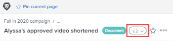

# Administrar versiones de documentos

<!-- Audited: 5/2025 -->

{{highlighted-preview}}

Puede administrar varias versiones de un documento en Workfront.

## Requisitos de acceso

+++ Expanda para ver los requisitos de acceso para la funcionalidad en este artículo.

<table style="table-layout:auto"> 
 <col> 
 <col> 
 <tbody> 
  <tr> 
   <td role="rowheader">Paquete de Adobe Workfront</td> 
   <td> 
Cualquier paquete de Workfront para administrar documentos mediante el almacenamiento heredado de Workfront

Cualquier paquete de flujo de trabajo para administrar documentos mediante Adobe Cloud Storage.
</td> 
  </tr> 
  <tr> 
   <td role="rowheader">Licencias de Adobe Workfront</td> 
   <td> 
   
Colaborador o superior

   
Solicitud o superior 

   </td> 
  </tr> 
  <tr> 
   <td role="rowheader">Configuraciones de nivel de acceso</td> 
   <td> 
Ver acceso a los documentos
 </td> 
  </tr> 
  <tr> 
   <td role="rowheader">Permisos de objeto</td> 
   <td> 
Ver acceso al documento
</td> 
  </tr> 
 </tbody> 
</table>

Para obtener más información sobre esta tabla, consulte [Requisitos de acceso en la documentación de Workfront](/help/quicksilver/administration-and-setup/add-users/access-levels-and-object-permissions/access-level-requirements-in-documentation.md).

+++

## Requisitos previos

* Este artículo supone que el documento tiene varias versiones.

  Si necesita información sobre cómo cargar nuevas versiones de un documento en Workfront, consulte [Cargar una nueva versión de un documento](../../documents/managing-documents/upload-new-document-version.md).

## Administrar versiones de documentos en el área de documentos heredados

### Ver una lista de todas las versiones de un documento

{{step1-to-documents}}

1. En la página **Documentos**, seleccione un documento de la lista.

1. En la esquina superior derecha de la página, haga clic en el icono **Abrir resumen** . Se abre el panel lateral **Resumen del documento**.

1. Desplácese hacia abajo hasta la sección **Versiones** para ver todas las versiones del documento.

### Ver y administrar detalles de una versión anterior del documento

{{step1-to-documents}}

1. Pase el puntero por encima del documento y haga clic en **Detalles del documento**.

1. Cerca de la parte superior de la página **Detalles del documento**, haga clic en el menú desplegable situado junto al nombre y, a continuación, haga clic en el nombre de la versión que desee ver y administrar.

   

   Además de ver los detalles de la versión, puede realizar cambios en la misma, como el nombre, los metadatos y la configuración de revisión (si se trata de una revisión de documento).

### Descargar una sola versión del documento

{{step1-to-documents}}

1. En la página **Documentos**, seleccione un documento de la lista.

1. En la esquina superior derecha de la página, haga clic en el icono **Abrir resumen** . Se abre el panel lateral **Resumen del documento**.

1. En la sección **Versiones**, haga clic en el menú **Más**  que se encuentra a la derecha de la versión y, a continuación, haga clic en **Descargar** en la lista desplegable que aparece.

   

### Descargar todas las versiones de un documento

{{step1-to-documents}}

1. En la página **Documentos**, seleccione un documento de la lista.

1. En la esquina superior derecha de la página, haga clic en el icono **Abrir resumen** . Se abre el panel lateral **Resumen del documento**.

1. Desplácese hacia abajo hasta la sección **Versiones** y, a continuación, haga clic en **Descargar todo**.

### Eliminar una versión de documento

Si carga una versión de un documento por error o ya no es necesaria, puede eliminar la versión y mantener el documento original.

>[!IMPORTANT]
>
>No puede recuperar una versión de documento que elimine individualmente.

Tenga en cuenta lo siguiente cuando considere la posibilidad de eliminar una versión de documento:

* Solo se puede eliminar una versión a la vez. Si se elimina una versión, esta acción aparece en la sección Actualizaciones del documento.
* Si carga una nueva versión después de eliminarla, esta recibirá el siguiente número secuencial. Por ejemplo, si hay tres versiones de un documento y elimina la versión 3, el siguiente documento cargado será la versión 4.
* Las actualizaciones del sistema y los comentarios realizados sobre una versión se conservan en Workfront después de eliminarse la versión.

  <!--
  <li data-mc-conditions="QuicksilverOrClassic.Draft mode">Deleting a document version in Workfront does not delete the Proof version.&nbsp;</li>
  -->

Para eliminar una versión de documento:

{{step1-to-documents}}

1. En la página **Documentos**, seleccione el documento de la lista.

1. En la esquina superior derecha de la página, haga clic en el icono **Abrir resumen** . Se abre el panel lateral **Resumen del documento**.

1. Desplácese hacia abajo hasta la sección **Versiones** para ver todas las versiones del documento.
1. En la sección **Versiones**, haga clic en el menú **Más**  que se encuentra a la derecha de la versión y, a continuación, haga clic en **Eliminar** en la lista desplegable que aparece.

   >[!NOTE]
   >
   >* La opción **Delete** solo está visible si hay al menos 2 versiones.
   >* Si el documento está vinculado a una fuente externa, ese vínculo se elimina y el documento ya no es accesible a través de Workfront.

   

## Administrar versiones de documentos en el área de nuevos documentos en Vista previa

Si su organización utiliza el almacenamiento en la nube de Adobe, verá la nueva área Documentos al acceder a documentos en Workfront. Para obtener más información sobre el almacenamiento en la nube de Adobe, consulte [Información general sobre el almacenamiento en la nube de Adobe](/help/quicksilver/review-and-approve-work/esm-overview.md).

Workfront numera cada versión en el orden en que se carga (por ejemplo, V1, V2, V3) para que coincida con los números de versión de Frame.io.

### Ver una lista de todas las versiones de un documento

{{step1-to-documents}}

1. En la página **Documentos**, seleccione un documento de la lista.

1. Haga clic en el icono **Versiones**  que se encuentra en el lado derecho de la página. El panel Versiones se abre y enumera todas las versiones del documento en Historial de versiones.

   >[!NOTE]
   >
   >Si una versión tiene un flujo de trabajo de aprobación, su estado, como &quot;Aprobado&quot; o &quot;Retirado&quot;, aparece junto a ella. Las versiones sin flujo de trabajo de aprobación no muestran un estado.

### Solicitar aprobación de una versión

{{step1-to-documents}}

1. En la página **Documentos**, seleccione un documento de la lista.
1. Haga clic en el icono **Versiones**  que se encuentra en el lado derecho de la página.
1. Haga clic en el menú **Más** junto a la versión y luego haga clic en **Solicitar aprobación**.
1. Configure el flujo de trabajo de aprobación. Para obtener más información, consulte [Crear un flujo de trabajo de aprobación de documentos](/help/quicksilver/review-and-approve-work/document-reviews-and-approvals/manage-document-approvals/create-a-document-approval.md).

   >[!NOTE]
   >
   >Si una versión anterior ya tiene un flujo de trabajo de aprobación abierto, al solicitar la aprobación de esta versión, se retira. La versión anterior mantiene su número de versión y su historial de aprobación, pero su estado cambia a &quot;Retirado&quot;.

### Ver y administrar detalles de una versión anterior del documento

{{step1-to-documents}}

1. En la página **Documentos**, seleccione un documento de la lista.
1. Haga clic en el icono **Versiones**  que se encuentra en el lado derecho de la página.
1. Haga clic en el menú **Más** junto a la versión y luego haga clic en **Ver detalles**.

### Descargar una sola versión del documento

{{step1-to-documents}}

1. En la página **Documentos**, seleccione un documento de la lista.

1. Haga clic en el icono **Versiones**  que se encuentra en el lado derecho de la página.

1. Haga clic en el menú **Más** junto a la versión y, a continuación, haga clic en **Descargar**.

### Descargar todas las versiones de un documento

{{step1-to-documents}}

1. En la página **Documentos**, seleccione un documento de la lista.

1. Haga clic en el icono **Versiones**  que se encuentra en el lado derecho de la página.

1. Haga clic en **Descargar todo** en la parte superior del panel Versiones.

   

### Eliminar una versión de documento

{{step1-to-documents}}

1. En la página **Documentos**, seleccione un documento de la lista.

1. Haga clic en el icono **Versiones**  que se encuentra en el lado derecho de la página.

1. Haga clic en el menú **Más** junto a la versión y, a continuación, haga clic en **Eliminar**.

   >[!NOTE]
   >
   >Al eliminar una versión, no se modifican los números de las demás versiones. Por ejemplo, si elimina la versión 3 de un documento con las versiones de la V1 a la V5, las versiones restantes conservarán sus números originales y no habrá ninguna V3 posteriormente. La próxima versión que cargue se convertirá en la versión 6.

