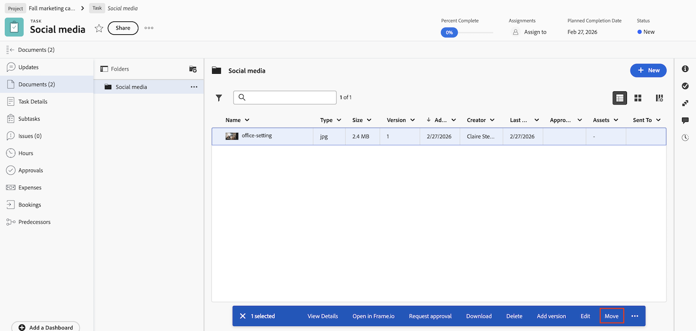

# Mover documentos

Un usuario con derechos para administrar un documento puede mover el documento a otro objeto.

El usuario también debe tener permisos para añadir documentos al nuevo objeto para completar esta acción. 

Al mover un documento, cualquiera de los siguientes elementos también se moverá con el documento:

* Versiones de documento
* Pruebas de documentos
* Aprobaciones de documentos

## Requisitos de acceso

+++ Expanda para ver los requisitos de acceso para la funcionalidad en este artículo.

<table style="table-layout:auto"> 
 <col> 
 <col> 
 <tbody> 
  <tr> 
   <td role="rowheader">Paquete de Adobe Workfront</td> 
   <td>
Cualquier paquete de Workfront para administrar documentos mediante el almacenamiento heredado de Workfront

Cualquier paquete de flujo de trabajo para administrar documentos mediante Adobe Cloud Storage.
</td> 
  </tr> 
  <tr> 
   <td role="rowheader">Licencias de Adobe Workfront</td> 
   <td> 
   
Colaborador o superior

   
Solicitud o superior
 </td> 
  </tr> 
  <tr> 
   <td role="rowheader">Configuraciones de nivel de acceso*</td> 
   <td> 
Acceso de edición a documentos
 </td> 
  </tr> 
  <tr> 
   <td role="rowheader">Permisos de objeto</td> 
   <td> 
Administrar el acceso al documento
 
Permiso para añadir documentos al nuevo objeto
</td> 
  </tr> 
 </tbody> 
</table>

Para obtener más información sobre el contenido de esta tabla, consulte [Requisitos de acceso en la documentación de Workfront](/help/quicksilver/administration-and-setup/add-users/access-levels-and-object-permissions/access-level-requirements-in-documentation.md).

+++

## Mover un documento al área de documentos heredados

Si su organización utiliza un almacenamiento de Workfront heredado, verá el área de documentos heredados al acceder a documentos en Workfront. Para obtener más información sobre el almacenamiento de Workfront, consulte [Diferencias entre el almacenamiento en la nube de Adobe y el almacenamiento de Workfront heredado](/help/quicksilver/review-and-approve-work/esm-overview.md#differences-between-adobe-cloud-storage-and-legacy-workfront-storage).

Para mover un documento:

1. Vaya al proyecto, tarea o problema que contiene el documento y, a continuación, seleccione **Documentos**.
1. Busque el documento que necesita.

1. Haga clic en el icono **Mover** .
   

1. En el menú desplegable del cuadro que aparece, haga clic en **Problema**, **Proyecto** o **Tarea** para indicar el tipo de objeto al que desea mover el documento. 

1. Escriba el nombre del **Problema**, **Proyecto** o **Tarea** en el cuadro de texto.

   >[!NOTE]
   >
   >Solo puede pasar a otro proyecto, tarea o problema mediante el almacenamiento heredado de Workfront.

1. Haga clic en **Finalizar**.

También puede mover un documento desde la página Detalles del documento.

## Mover un documento al área de Documentos nueva

Si su organización utiliza el almacenamiento en la nube de Adobe, verá la nueva área Documentos al acceder a documentos en Workfront. Para obtener más información sobre el almacenamiento en la nube de Adobe, consulte [Información general sobre el almacenamiento en la nube de Adobe](/help/quicksilver/review-and-approve-work/esm-overview.md).

Para mover un documento:

1. Vaya al proyecto, tarea o problema que contiene el documento y, a continuación, seleccione **Documentos**.
1. Busque el documento que necesita.
1. Haga clic en **Mover** en la parte inferior de la página.

1. En el menú desplegable del cuadro que aparece, haga clic en **Problema**, **Proyecto** o **Tarea** para indicar el tipo de objeto al que desea mover el documento.

1. Escriba el nombre del **Problema**, **Proyecto** o **Tarea** en el cuadro de texto.

   >[!NOTE]
   >
   >Solo puede pasar a otro proyecto, tarea o problema mediante Adobe Cloud Storage.

1. Haga clic en **Mover**.