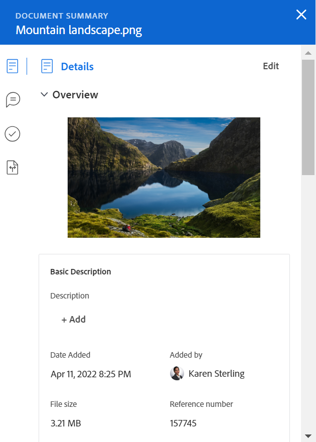
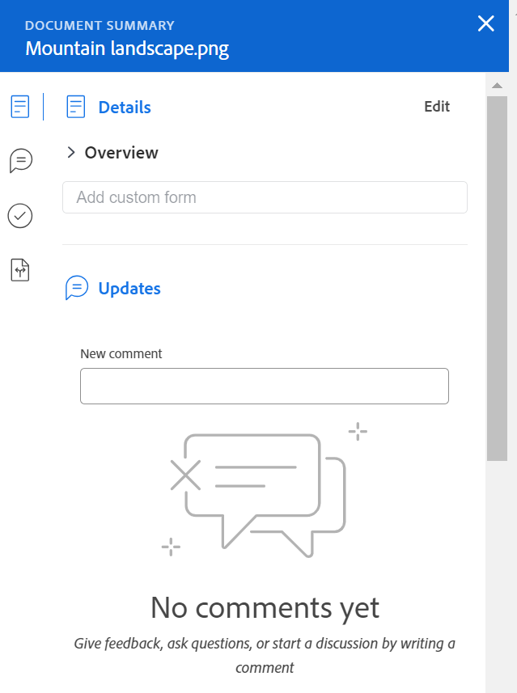

# Resumen de los documentos

El resumen le permite interactuar con información importante directamente desde la lista de documentos.

## Requisitos de acceso

Debe tener lo siguiente:

<table style="table-layout:auto"> 
 <col> 
 </col> 
 <col> 
 </col> 
 <tbody> 
  <tr> 
   <td role="rowheader">plan de Adobe Workfront*</td> 
   <td> 
 Cualquiera
 </td> 
  </tr> 
  <tr> 
   <td role="rowheader">Licencias de Adobe Workfront*</td> 
   <td> 
Solicitud o superior
 </td> 
  </tr> 
  <tr data-mc-conditions=""> 
   <td role="rowheader">Configuraciones de nivel de acceso*</td> 
   <td> 
Editar acceso a documentos
 
Nota: Si todavía no tiene acceso, pregunte a su administrador de Workfront si establece restricciones adicionales en su nivel de acceso. Para obtener información sobre cómo un administrador de Workfront puede modificar su nivel de acceso, consulte <a href="../../administration-and-setup/add-users/configure-and-grant-access/create-modify-access-levels.md" class="MCXref xref">Crear o modificar niveles de acceso personalizados</a>.
 </td> 
  </tr> 
  <tr data-mc-conditions=""> 
   <td role="rowheader">Permisos de objeto</td> 
   <td> 
Ver acceso al objeto asociado al documento
 
Para obtener información sobre la solicitud de acceso adicional, consulte <a href="../../workfront-basics/grant-and-request-access-to-objects/request-access.md" class="MCXref xref">Solicitar acceso a objetos </a>.
 </td> 
  </tr> 
 </tbody> 
</table>

&#42;Para saber qué plan, tipo de licencia o acceso tiene, póngase en contacto con el administrador de Workfront.

## Abrir la vista Resumen

1. Vaya a la **Documentos** y seleccione un elemento de la lista.
1. Haga clic en el **Icono Abrir resumen** .

   Después de abrir el Resumen, permanece abierto mientras hace clic en otros documentos y permanece abierto hasta que lo cierra manualmente.

   

## Detalles

Utilice la sección Detalles para ver información general de alto nivel e interactuar con formularios personalizados. Haga clic en **Detalles** en la parte superior de la sección para ir a la página Detalles del documento completa.

* [Información general](#overview)
* [Formularios personalizados](#custom-forms)

### Información general {#overview}

Expanda la sección Información general para ver o descargar una miniatura de imagen, abrir una prueba, actualizar la descripción básica, retirar el documento y más.

### Formularios personalizados {#custom-forms}

Utilice la sección Forms personalizado para agregar, editar o ver cualquier formulario personalizado asociado al documento. Empiece a escribir el nombre del formulario personalizado para agregarlo al documento. Para obtener más información, consulte [Agregar o editar un formulario personalizado en un documento](../../documents/managing-documents/add-custom-form-documents.md).

## Actualizaciones

Utilice la sección Actualizaciones para leer una actualización realizada por alguien en el documento o la prueba. El resumen muestra las dos primeras observaciones realizadas. Para obtener más información sobre las actualizaciones, consulte [Comentar en una prueba](../../review-and-approve-work/proofing/reviewing-proofs-within-workfront/comment-on-a-proof/comment-on-proof.md).

## Rutas de aprobación

Utilice la sección Aprobaciones para solicitar la aprobación de un documento. También puede recordar a alguien sobre una aprobación, volver a enviarla y cancelar la decisión anterior, o eliminar la aprobación. Los aprobadores de documentos pueden utilizar el Resumen para tomar una decisión.

Las aprobaciones de prueba deben agregarse en el flujo de trabajo de prueba. Para obtener más información sobre las aprobaciones, consulte

* [Aprobación del trabajo](../../review-and-approve-work/manage-approvals/approving-work.md)
* [Solicitar aprobaciones de documentos](../../review-and-approve-work/manage-approvals/request-document-approvals.md)

## Versiones

Utilice la sección Versiones para ver el número de versiones creadas para un documento específico. Haga clic en el **Más menú** a

* Abrir una prueba
* Descargar una prueba o un documento
* Obtener una vista previa de un documento compatible con el explorador
* Vaya a Detalles del documento
* Eliminar una prueba o un documento

