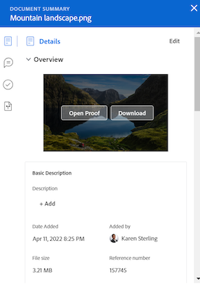

# Resumen de la información general de documentos

<!--Audited: April, 2024-->

Puede usar el Panel de resumen para acceder a información importante y actualizarla directamente desde la lista de documentos.

+++ Expanda para ver los requisitos de acceso para la funcionalidad en este artículo.

## Requisitos de acceso

Debe tener el siguiente acceso para realizar los pasos de este artículo:

<table style="table-layout:auto"> 
 <col> 
 </col> 
 <col> 
 </col> 
 <tbody> 
  <tr> 
   <td role="rowheader">Plan de Adobe Workfront</td> 
   <td> 
 Cualquiera
 </td> 
  </tr> 
  <tr> 
   <td role="rowheader">Licencias de Adobe Workfront</td> 
   <td> 
Nuevo: colaborador o superior
 
   
Actual: solicitud o superior

   </td> 
  </tr> 
  <tr data-mc-conditions=""> 
   <td role="rowheader">Configuraciones de nivel de acceso</td> 
   <td> 
Acceso de edición a documentos
  </td> 
  </tr> 
  <tr data-mc-conditions=""> 
   <td role="rowheader">Permisos de objeto</td> 
   <td> 
Acceso de visualización al objeto asociado con el documento
 </td> 
  </tr> 
 </tbody> 
</table>

Para obtener más información sobre el contenido de esta tabla, consulte [Requisitos de acceso en la documentación de Workfront](/help/quicksilver/administration-and-setup/add-users/access-levels-and-object-permissions/access-level-requirements-in-documentation.md).

+++

## Abrir la vista Resumen

{{step1-to-documents}}

1. En la página **Documentos**, seleccione un documento de la lista.

1. En la esquina superior derecha de la página, haga clic en el icono **Abrir resumen** . Se abre el panel lateral **Resumen del documento**.

   

   Después de abrir el Resumen, permanecerá abierto en esta página (incluso si hace clic en otros documentos) hasta que lo cierre manualmente.

## Detalles

Utilice la sección Detalles para ver información general de alto nivel e interactuar con formularios personalizados. Haga clic en Detalles en la parte superior de la sección para ir a la página completa de Detalles del documento.

* [Información general](#overview)
* [Formularios personalizados](#custom-forms)

### Información general {#overview}

Expanda la sección Información general para ver o descargar una miniatura de imagen, abrir una prueba, actualizar la descripción básica, desproteger el documento y mucho más.

### Formularios personalizados {#custom-forms}

Utilice la sección Formularios personalizados para añadir, editar o ver cualquier formulario personalizado asociado al documento. Empiece a escribir el nombre del formulario personalizado para añadirlo al documento. Para obtener más información, consulte [Añadir o editar un formulario personalizado en un documento](../../documents/managing-documents/add-custom-form-documents.md).

## Actualizaciones

Utilice la sección Actualizaciones para ver una actualización realizada por alguien en el documento o la prueba. El resumen muestra los dos primeros comentarios realizados. Para obtener más información sobre las actualizaciones, consulte [Comentario sobre una prueba](../../review-and-approve-work/proofing/reviewing-proofs-within-workfront/comment-on-a-proof/comment-on-proof.md).

## Rutas de aprobación

Utilice la sección Aprobaciones para solicitar la aprobación de un documento. También puede recordar a alguien una aprobación, volver a enviar la aprobación y cancelar la decisión anterior o eliminar la aprobación. Los aprobadores de documentos pueden utilizar el Resumen para tomar una decisión.

Las aprobaciones de pruebas deben añadirse al flujo de trabajo de la prueba. Para obtener más información sobre las aprobaciones, consulte

* [Aprobación de trabajos](../../review-and-approve-work/manage-approvals/approving-work.md)
* [Solicitar aprobaciones de documentos](../../review-and-approve-work/manage-approvals/request-document-approvals.md)

## Versiones

Utilice la sección Versiones para ver el número de versiones creadas para un documento específico. Haga clic en el icono Más  para hacer lo siguiente:

* Abra una prueba.
* Descargue una prueba o un documento.
* Vista previa de un documento compatible con el explorador.
* Vaya a los detalles del documento.
* Eliminar una prueba o un documento.

