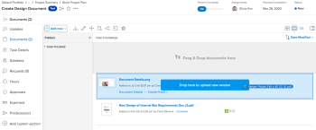
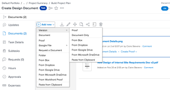

# Cargar una nueva versión de un documento

Puede agregar una nueva versión de un documento que haya cargado anteriormente en Adobe Workfront.

Si el nombre de archivo de la nueva versión es diferente del nombre de archivo de la versión anterior, Workfront muestra el documento con el nombre de archivo más reciente.

Si el documento contiene una revisión y desea crear una nueva versión del documento revisado, consulte la sección [Cargar un documento y crear una nueva versión de una revisión](../../review-and-approve-work/proofing/creating-proofs-within-workfront/generate-proof-for-a-document.md#uploading-a-document-and-creating-a-new-version-of-a-proof) en el artículo [Crear una revisión para un documento](../../review-and-approve-work/proofing/creating-proofs-within-workfront/generate-proof-for-a-document.md).

Para obtener información sobre cómo agregar una nueva versión de un documento vinculado a Workfront desde una aplicación externa, consulte [Agregar una nueva versión de un documento vinculado](../../documents/adding-documents-to-workfront/link-documents-from-external-apps.md#add) en [Vincular documentos desde aplicaciones externas](../../documents/adding-documents-to-workfront/link-documents-from-external-apps.md).

## Requisitos de acceso

+++ Expanda para ver los requisitos de acceso para la funcionalidad en este artículo.

<table style="table-layout:auto"> 
 <col> 
 </col> 
 <col> 
 </col> 
 <tbody> 
  <tr> 
   <td role="rowheader">Paquete de Adobe Workfront</td> 
   <td> 
 Cualquiera
 </td> 
  </tr> 
  <tr> 
   <td role="rowheader">Licencias de Adobe Workfront</td> 
   <td> 
   
Colaborador o superior

   
Solicitud o superior
 </td> 
  </tr> 
  <tr data-mc-conditions=""> 
   <td role="rowheader">Configuraciones de nivel de acceso*</td> 
   <td> 
Acceso de edición a documentos
  </td> 
  </tr> 
  <tr data-mc-conditions=""> 
   <td role="rowheader">Permisos de objeto</td> 
   <td> 
Editar acceso al objeto asociado con el documento
 </td> 
  </tr> 
 </tbody> 
</table>

Para obtener más información sobre el contenido de esta tabla, consulte [Requisitos de acceso en la documentación de Workfront](/help/quicksilver/administration-and-setup/add-users/access-levels-and-object-permissions/access-level-requirements-in-documentation.md).
+++

## Cargar una nueva versión del documento en el área de documentos heredados

Si su organización está en un almacenamiento de Workfront heredado, verá el área de documentos heredados al acceder a documentos en Workfront. Para obtener más información sobre el almacenamiento heredado de Workfront, consulte [Diferencias entre el almacenamiento heredado de Workfront y el almacenamiento empresarial de Adobe](/help/quicksilver/review-and-approve-work/esm-overview.md).

### Utilice arrastrar y soltar para agregar una nueva versión

>[!NOTE]
>
>Arrastrar y soltar no funciona con Internet Explorer.

1. Vaya al área Documentos donde se ha cargado el documento.
1. Desde el escritorio o desde una ficha de explorador independiente, arrastre la nueva versión del documento sobre la versión existente en Workfront.

   

   A medida que arrastra la nueva versión, puede situarse sobre una carpeta de documentos de Workfront para abrirla. A continuación, puede desplazarse hacia arriba y hacia abajo arrastrando los archivos a la parte superior o inferior de la pantalla.

1. Coloque la nueva versión sobre el archivo existente en la ficha **Documentos**.

   Para obtener información acerca de cómo administrar versiones de documentos, vea [Administrar versiones de documentos](../../documents/managing-documents/manage-document-versions.md).

### Utilice el menú Más para añadir una nueva versión

1. Seleccione el documento en el que desea añadir una nueva versión.
1. Haga clic en **Agregar nuevo** > **Versión**.

   

1. Seleccione el tipo de documento que desea cargar y siga las indicaciones.

## Cargar una nueva versión del documento en el área de nuevos documentos

Si su organización utiliza el almacenamiento empresarial, verá el área de nuevos documentos al acceder a ellos en Workfront. Para obtener más información acerca del almacenamiento empresarial, consulte [Descripción general del almacenamiento empresarial de Adobe](/help/quicksilver/review-and-approve-work/esm-overview.md).

### Utilice arrastrar y soltar para agregar una nueva versión

>[!NOTE]
>
>Arrastrar y soltar no funciona con Internet Explorer.

1. Vaya al área Documentos donde se ha cargado el documento.
1. Arrastre la nueva versión del documento sobre la versión existente en Workfront.

   

1. Coloque la nueva versión sobre el archivo existente en la ficha **Documentos**.

   Para obtener información acerca de cómo administrar versiones de documentos, vea [Administrar versiones de documentos](../../documents/managing-documents/manage-document-versions.md).

### Utilice el menú Más para añadir una nueva versión

1. Seleccione el documento en el que desea añadir una nueva versión.
1. Abra el icono Mostrar versiones  a la derecha.
1. Haga clic en **Agregar nueva versión**.

   

1. Busque el documento y haga clic en **Abrir**.

