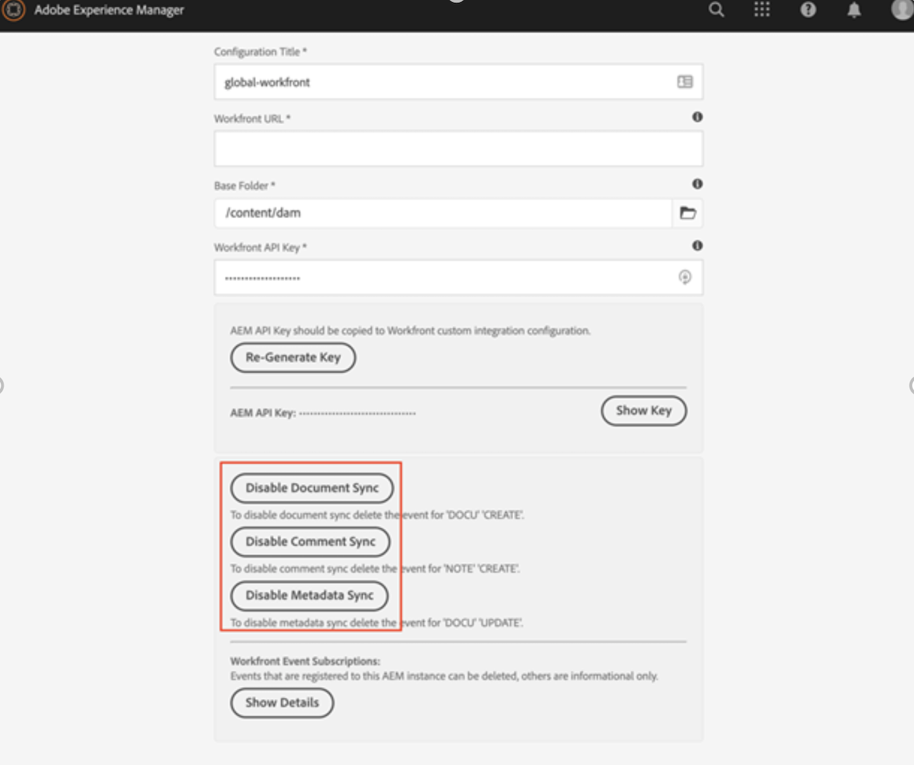
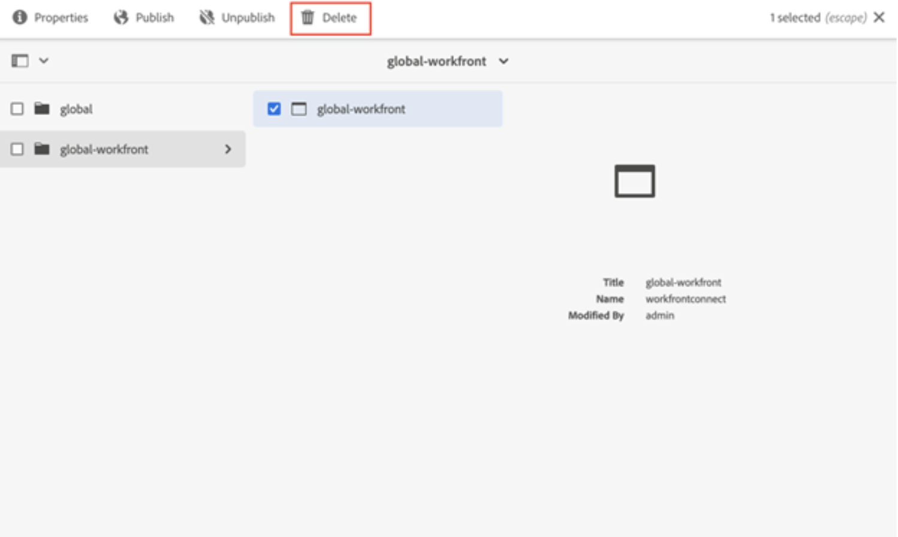
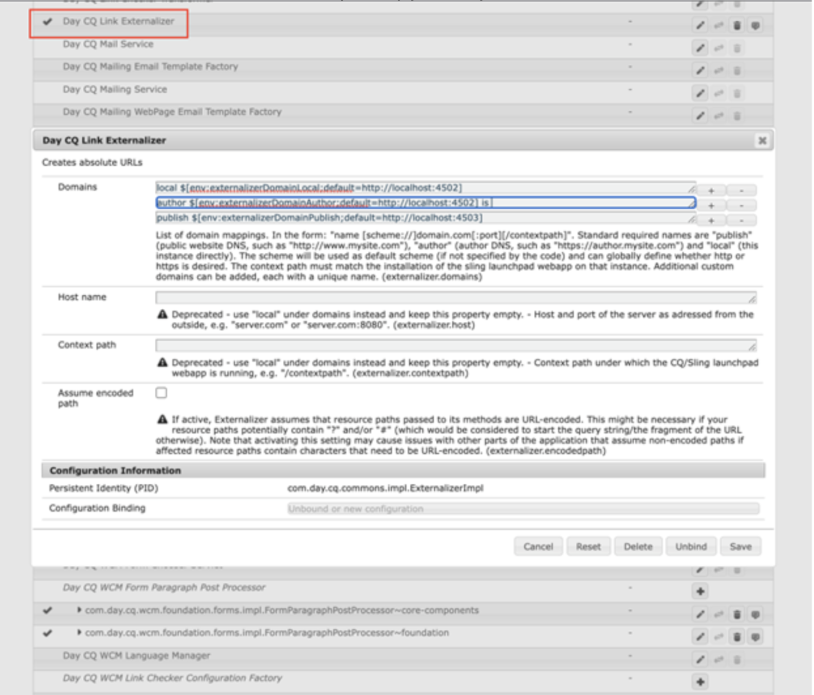

# Desinstalar el conector heredado de Workfront con Adobe Experience Manager

Debe desinstalar el conector heredado de Workfront con Adobe Experience Manager a la última integración nativa que conecta Workfront y Adobe Experience Manager Assets as a Cloud Service.

## Cancelar la suscripción a Workfront

1. Abra Adobe Experience Manager.
1. En Experience Manager, vaya a **Herramientas** > **Cloud Service** > **Configuración de integración de Workfront**.
1. Seleccione su configuración (global-workfront de manera predeterminada) y haga clic en **Propiedades**.

   

1. Deshabilitar sincronización de documentos, comentarios y metadatos. La etiqueta debe estar deshabilitada durante el día.
Esto eliminará las suscripciones en Workfront y permitirá al usuario crear una nueva suscripción con la misma URL definida en Day CQ Link Externalizer.

## Eliminar la configuración de integración de Workfront

Después de eliminar la suscripción, ahora es seguro eliminar la Configuración de integración de Workfront.

1. Abra la configuración y seleccione **Eliminar**.

   

## Quitar asignación

A continuación, debe eliminar la asignación de propiedades de Workfront.

1. En Experience Manager, vaya a **Herramientas** > **Recursos** > **Asignación de propiedades de Workfront**.

1. Seleccione todas las asignaciones y haga clic en **Eliminar**.

## Permisos de usuario

A todos los usuarios que han accedido a la DAM de AEM desde Workfront se les han otorgado permisos de lectura para `/content/dam`. Si un usuario ya no lo necesita, puede eliminar los permisos otorgados a dichos usuarios.

El conector funciona mediante el servicio de Workfront del usuario del sistema. Esto se desinstala al desinstalar el conector.

>[!NOTE]
>
>Si utiliza la versión 2.0.3 del conector y ha añadido el grupo `workfront-aem-connector-group`, también debe eliminarlo yendo a **Herramientas** > **Seguridad** > **Grupos**.

## Externalizador de vínculo CQ por día

Si no necesita el Externalizador de vínculo CQ por día, puede revertirlo a `localhost:4502` yendo a `/system/console/configMgr` y buscando (“Externalizador de vínculo CQ de día”)

>[!NOTE]
>
>Si utiliza Adobe Experience Manager as a Cloud Service, Esto se puede cambiar si busca en su proyecto el archivo _com.day.cq.commons.impl.ExternalizerImpl.xml_ en _ui.apps/src/main/content/jcr_ root/apps/mysite/config_.

## Desinstalar el paquete del conector

Los pasos necesarios para desinstalar el paquete del conector difieren según la versión de Adobe Experience Manager de que disponga.

### Adobe Experience Manager On-Premise

Si usa Adobe Experience Manager On-Premise, vaya a _crx/packmgr/index.jsp_ y busque `workfront-aem-connector.all-<version>.zip`, haga clic en **Más** y, a continuación, en **Desinstalar**.

Compruebe en `/conf` que se hayan eliminado todos los archivos creados por Workfront.

### Adobe Experience Manager as a Cloud Service

En Adobe Experience Manager as a Cloud Service, puede eliminar las dependencias del conector de los archivos pom.js del proyecto.

## Cortafuegos y Dispatcher

No olvide eliminar las URL de Workfront de la lista de permitidos si la comunicación ya no es necesaria. Además, el conector utiliza los encabezados API Key y el nombre de usuario que se estableció en Dispatcher. Estas también se pueden eliminar.
