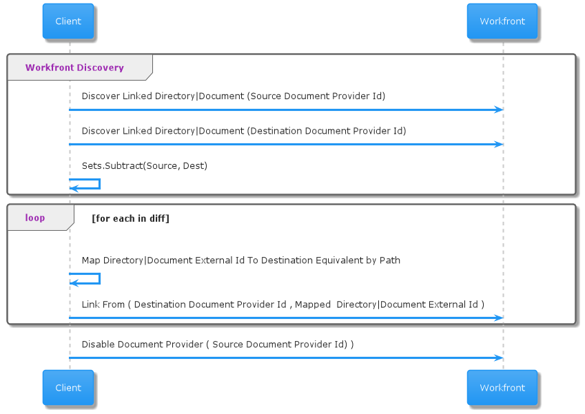

# Migrar carpetas y documentos vinculados

Puede utilizar la API para migrar carpetas y documentos vinculados a Adobe Experience Manager Assets.

## Procedimiento

1. Identifique todos los documentos y carpetas vinculados con el anterior proveedor externo de almacenamiento de documentos, anotando sus identificadores internos de documento o carpeta de Workfront, así como el identificador de carpeta de cualquier carpeta contenedora.

   >[!NOTE]
   >
   > Debe comprobar todas las carpetas o documentos detectados para verificar que no se haya creado ya un vínculo para ellos con el nuevo proveedor.

1. Busque los documentos y carpetas en el nuevo repositorio por ruta y, a continuación, busque su identidad en el sistema externo.

1. Cree una asignación del ID interno de Workfront al ID en el nuevo almacén externo. Esto es necesario para crear un nuevo vínculo en el siguiente paso.

1. Cree un nuevo documento o vínculo de carpeta de documentos en Workfront que señale al recurso en su nueva ubicación mediante su nuevo ID externo.

   1. **Documentos**: añada una nueva versión del documento existente con el nuevo proveedor de documentos externo.
   1. **Carpetas**: cree una nueva carpeta en la misma ubicación con el mismo nombre.

>[!CAUTION]
>
>   No elimine las carpetas vinculadas existentes. Esto podría causar la pérdida de datos. Para eliminar vínculos de carpetas antiguas de la aplicación de Workfront, deshabilite la integración de documentos personalizada en el área de Configuración.


## Proceso de ejemplo para migrar vínculos



## Información de la API

Para obtener más información sobre las API de Workfront en esta sección, consulte [Documentación para desarrolladores:Documents](https://developer.workfront.com/documents.html).

### Encontrar todos los documentos

Encontrar todos los **documentos (DOCU)** vinculados al **proveedor de documentos** de **providerType** con **documentProviderID**.

```
Http Method: GET
 
Http Endpoint: {host}/attask/api/v14.0/document/search?fields=currentVersion:*&currentVersion:externalIntegrationType={providerType}
```

[Referencia DOCS de API](https://developer.workfront.com/documents.html#get-/docu/search)

### Encontrar todas las carpetas

Encontrar todas las **carpetas de documentos (DOCFDR)** vinculadas al proveedor de documentos de **providerType** con **documentProviderID**.

```
Http Method: GET
 
Http Endpoint: {host}/attask/api/v14.0/documentFolder/search?fields=*,linkedFolder:*&linkedFolder:externalIntegrationType={providerType}
```

DOCUMENTOS DE API: (los puntos finales de la carpeta de documentos no están cubiertos actualmente en developer.workfront.com)

### Vincular documentos

Vincular **documentos (DOCU)** desde el **proveedor de documentos externos** de **providerType** con **documentProviderID**.

>[!IMPORTANT]
>
>Los documentos se almacenan temporalmente. Esto significa que tiene acceso a todas las versiones del documento. Al crear el vínculo, puede especificar el ID del documento existente, por lo que simplemente está escribiendo una nueva versión en ese documento, con los datos alojados externamente en el nuevo proveedor. Este ID de documento es el mismo que el ID de documento encontrado en el vínculo de documento que está reemplazando. Es el mismo documento conceptual. Simplemente, indica que los bytes de esta nueva versión se almacenan con un proveedor diferente.

```
Http Method: POST
 
Endpoint: {host}/internal/documents/linkExternalObjects
 
Http Body:
refObjCode=DOCU&refObjID={documentId}&providerType={providerType}&documentProviderID={documentProviderID}
```

DOCUMENTOS DE API: (los puntos finales del vínculo interno no están cubiertos actualmente en developer.workfront.com)

### Vincular carpetas

Vincular **carpetas de documentos (DOCFDR)** desde el **proveedor de documentos externos** de **providerType** con **documentProviderID**.

>[!IMPORTANT]
>
>Para los vínculos de carpeta, a diferencia de los vínculos a documentos, necesita el “documentFolderId” de la carpeta en Workfront en la que desea colocar el nuevo vínculo. Es muy probable que se trate de la misma carpeta principal que la carpeta vinculada que estamos copiando.

>[!CAUTION]
>
>Las carpetas no se almacenan temporalmente. No elimine las carpetas antiguas. Deshabilite la integración de documentos personalizada en el área de configuración para eliminar carpetas antiguas.


```
Http Method: POST
 
Endpoint: {host}/internal/document/version/linkExternal
 
Http Body:
providerType={providerType}&documentProviderID={documentProviderID}&breadcrumb=[]&linkAction=LINKEXTERNAL&refObjCode={USER|PROJECT_TASK|TEMPLATE_TASK|securityRootObjectCode}&refObjID={userID|taskID|templateTaskID|securityRootId}&destFolderID={parentFolderId}
```

DOCUMENTOS DE API: (los puntos finales del vínculo interno no están cubiertos actualmente en developer.workfront.com)

## Términos importantes

* **Documento**: un recurso digital en Workfront

* **Carpeta de documentos**: un contenedor para recursos digitales en Workfront

* **ID de documento**: ID interno de Workfront para un recurso digital

* **ID de carpeta de documentos**: ID interno de Workfront para una carpeta de recursos digitales

* **ID de proveedor de documentos**: ID asociado a proveedores de documentos específicos

>[!IMPORTANT]
>
> Para cualquier tipo de proveedor de documentos determinado, un cliente puede tener varias instancias conectadas. Por ejemplo, puede tener varios repositorios AEM vinculados. O varias instancias de Google Drive vinculadas. El ID de proveedor de documentos indica la instancia específica del tipo de conexión que se desea reemplazar o al que se desea cambiar.

* **Tipo de proveedor de almacenamiento de documentos (también “Tipo de integración externa”)**: el tipo de integración de proveedor de almacenamiento de documentos que admite Workfront. Ya sea mediante una integración dedicada o una “integración personalizada”.

* **Tipos de proveedor de almacenamiento de documentos actuales (providerType)**:

  ```
  ATTASK
  BOX
  GOOGLE
  SHAREPOINT
  WEBDAM
  WORKFRONTDAM
  INFERNO
  WIDEN
  DROPBOX
  DROPBOX_BUSINESS
  ONEDRIVE
  QUIP
  WEBHOOKS
  AEM
  MOCK
  ```

* **Documento vinculado**: un recurso digital alojado en un proveedor externo de almacenamiento de documentos. Workfront tendrá su propio “ID de documento” interno para el recurso, pero los bytes se almacenarán externamente. Con el fin de facilitarlo, Workfront también almacena un “ID de documento externo” para ayudar a localizar el recurso al que se hace referencia externamente en el repositorio o almacén remoto.

* **Carpeta de documentos vinculados**: un contenedor para recursos digitales hospedados en un proveedor externo de almacenamiento de documentos. Workfront tendrá su propio “ID de carpeta de documentos” interno para el recurso, pero los bytes se almacenarán externamente. Con el fin de facilitarlo, Workfront también almacena un “ID de documento externo” para ayudar a localizar el recurso al que se hace referencia externamente en el repositorio o almacén remoto.

* **ID de documento externo**: ID asignado cuando los recursos se almacenan fuera de Workfront. Workfront asigna su identificador interno al identificador utilizado para localizar el recurso en el sistema externo, a través de este campo denominado “identificador de documento externo”. Por lo tanto, al vincular el documento o la carpeta desde un nuevo almacén externo, se debe crear un nuevo identificador de documento externo en el formato adecuado para que el proveedor externo de documentos identifique el documento en el nuevo repositorio o almacén.

  >[!NOTE]
  >
  > Workfront todavía no tiene un estándar para identificadores de documentos externos. Se está utilizando una nueva especificación para los ID de AEM, pero para otros ID, el ID de documento externo puede adoptar diferentes formas según el tipo de proveedor.


* **Tipo de objeto**: se trata de un término exclusivo de la API a efectos de este documento. Es un tipo de objeto genérico dentro de Workfront con el que desea interactuar. En estos casos, se interactuará con documentos y carpetas que tengan los tipos “DOCU” y “DOCFDR” respectivamente.

* **ID de objeto**: el identificador Workfront interno del objeto genérico con el que desea interactuar. Se interactuará con documentos y carpetas, por lo que será el ID de documento o el ID de carpeta de documentos respectivamente.
