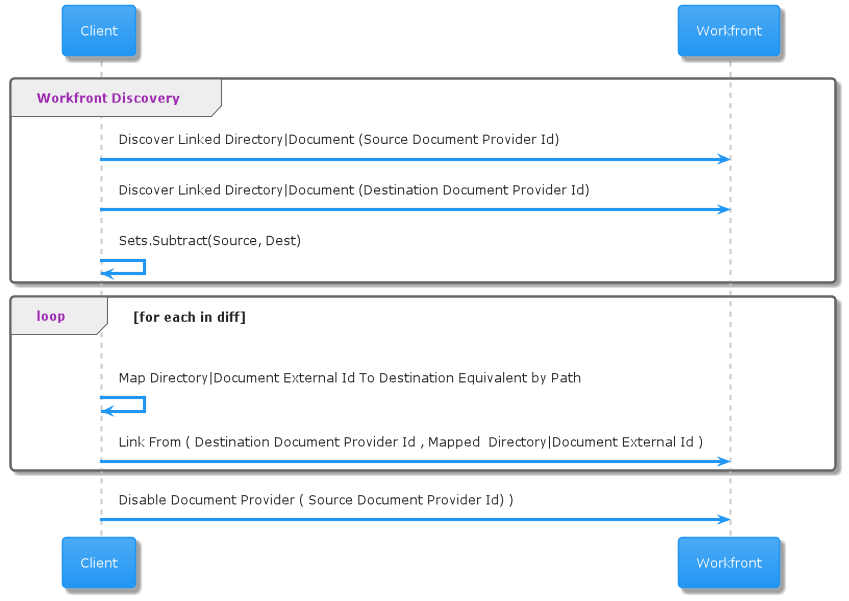

# Migración de carpetas y documentos vinculados

Puede utilizar la API para migrar carpetas y documentos vinculados a Adobe Experience Manager Assets.

## Procedimiento

1. Identifique todos los documentos y carpetas vinculados al proveedor de almacenamiento de documentos externo anterior, indicando sus identificadores de carpeta o documento interno de Workfront, así como el identificador de carpeta de cualquier carpeta que los contenga.

   >[!NOTE]
   >
   > Debe comprobar todas las carpetas o documentos descubiertos para verificar que no hayan creado ya un vínculo para ellos con el nuevo proveedor.

1. Busque los documentos y carpetas en el nuevo repositorio por ruta y, a continuación, busque su identidad en el sistema externo.

1. Cree una asignación del Workfront ID interno al ID en el nuevo almacén externo. Debe crear un vínculo nuevo en el paso siguiente.

1. Cree un nuevo vínculo de documento o carpeta de documento en Workfront, señalando al recurso en su nueva ubicación a través de su nuevo ID externo.

   1. **Documentos**: Añada una nueva versión del documento existente con el nuevo proveedor de documentos externo.
   1. **Carpetas**: Cree un nuevo filtro en el mismo lugar con el mismo nombre.

>[!CAUTION]
>
>   No elimine las carpetas vinculadas existentes. Esto podría provocar la pérdida de datos. Para quitar los vínculos de carpetas antiguas de la aplicación Workfront, desactive la integración de documentos personalizados en el área Configuración.


## Proceso de ejemplo para la migración de vínculos



## Información de API

Para obtener más información sobre las API de Workfront en esta sección, consulte [Documentación para desarrolladores:documentos](https://developer.workfront.com/documents.html).

### Buscar todos los documentos

Buscar todo **Documentos (DOCU)** Vinculado a **Proveedor de documentos** de **providerType** con **documentProviderID**.

```
Http Method: GET
 
Http Endpoint: {host}/attask/api/v14.0/document/search?fields=currentVersion:*&currentVersion:externalIntegrationType={providerType}
```

[Referencia DOCS de API](https://developer.workfront.com/documents.html#get-/docu/search)

### Buscar todas las carpetas

Buscar todo **Carpetas de documentos (DOCFDR)** Vinculado al proveedor de documentos de **providerType** con **documentProviderID**.

```
Http Method: GET
 
Http Endpoint: {host}/attask/api/v14.0/documentFolder/search?fields=*,linkedFolder:*&linkedFolder:externalIntegrationType={providerType}
```

DOCS de API: (Los extremos de las carpetas de documentos no están cubiertos actualmente en developer.workfront.com)

### Vinculación de documentos

Vínculo **Documentos (DOCU)** from **Proveedor de documentos externos** de **providerType** con **documentProviderID**.

>[!IMPORTANT]
>
>Los documentos se almacenan temporalmente. Es decir, tiene acceso a todas las versiones del documento. Cuando cree el vínculo, puede especificar el ID del documento existente, por lo que simplemente está escribiendo una nueva versión para ese documento, con los datos alojados externamente en el nuevo proveedor. Este ID de documento es el mismo que el ID del documento que se encuentra en el vínculo del documento que va a reemplazar. Es el mismo documento conceptual. Simplemente indica que los bytes de esta nueva versión se almacenan con un proveedor diferente.

```
Http Method: POST
 
Endpoint: {host}/internal/documents/linkExternalObjects
 
Http Body:
refObjCode=DOCU&refObjID={documentId}&providerType={providerType}&documentProviderID={documentProviderID}
```

DOCS de API: (Los extremos de los vínculos internos no están cubiertos actualmente en developer.workfront.com)

### Vincular carpetas

Vínculo **Carpetas de documentos (DOCFDR)** from **Proveedor de documentos externos** de **providerType** con **documentProviderID**.

>[!IMPORTANT]
>
>Para los vínculos de carpeta , a diferencia de los vínculos de documento, necesita el &quot;documentFolderId&quot; de la carpeta en Workfront en la que desea colocar el nuevo vínculo. Esta es la misma carpeta principal, muy probablemente, que la carpeta vinculada que estamos copiando.

>[!CAUTION]
>
>Las carpetas no se almacenan temporalmente. No elimine las carpetas antiguas. Deshabilite la integración de documentos personalizados en el área de configuración para eliminar carpetas antiguas.


```
Http Method: POST
 
Endpoint: {host}/internal/document/version/linkExternal
 
Http Body:
providerType={providerType}&documentProviderID={documentProviderID}&breadcrumb=[]&linkAction=LINKEXTERNAL&refObjCode={USER|PROJECT_TASK|TEMPLATE_TASK|securityRootObjectCode}&refObjID={userID|taskID|templateTaskID|securityRootId}&destFolderID={parentFolderId}
```

DOCS de API: (Los extremos de los vínculos internos no están cubiertos actualmente en developer.workfront.com)

## Términos importantes

* **Documento**: Un recurso digital dentro de Workfront

* **Carpeta de documento**: Un contenedor para recursos digitales dentro de Workfront

* **ID del documento**: ID interno de Workfront para un recurso digital

* **ID de carpeta de documento**: ID interno de Workfront para una carpeta de recursos digitales

* **ID del proveedor de documentos**: ID asociado a proveedores de documentos específicos

>[!IMPORTANT]
>
> Para cualquier tipo de proveedor de documentos determinado, un cliente puede tener varias instancias conectadas. Pueden tener varios repositorios de AEM vinculados, por ejemplo. O varias instancias de Google Drive vinculadas. El ID del proveedor de documentos indica la instancia específica del tipo de conexión que queremos reemplazar o cambiar a.

* **Tipo de proveedor de almacenamiento de documentos (también &quot;Tipo de integración externa&quot;)**: El tipo de integración del proveedor de almacenamiento de documentos que admite Workfront. Mediante una integración dedicada o una &quot;integración personalizada&quot;.

* **Tipos de proveedores de almacenamiento de documentos actuales ( providerType)**:

   ```
   ATTASK
   BOX
   GOOGLE
   SHAREPOINT
   WEBDAM
   WORKFRONTDAM
   INFERNO
   WIDEN
   DROPBOX
   DROPBOX_BUSINESS
   ONEDRIVE
   QUIP
   WEBHOOKS
   AEM
   MOCK
   ```

* **Documento vinculado**: Recurso digital alojado en un proveedor de almacenamiento de documentos externo. Workfront tendrá su propio &quot;ID de documento&quot; interno para el recurso, pero los bytes se almacenan externamente. Para facilitar esto, Workfront también almacena un &quot;ID de documento externo&quot; para ayudar a localizar el recurso al que se hace referencia externamente en el repositorio o almacén remotos.

* **Carpeta de documento vinculado**: Un contenedor para recursos digitales alojado en un proveedor de almacenamiento de documentos externo. Workfront tendrá su propio &quot;ID de carpeta de documento&quot; interno para el recurso, pero los bytes se almacenan externamente. Para facilitar esto, Workfront también almacena un &quot;ID de documento externo&quot; para ayudar a localizar el recurso al que se hace referencia externamente en el repositorio o almacén remotos.

* **ID de documento externo**: ID asignado cuando los recursos se almacenan fuera del área de trabajo. Workfront asigna su identificador interno al identificador utilizado para localizar el recurso en el sistema externo, a través de este campo de &quot;identificador de documento externo&quot;. Por lo tanto, al vincular el documento o la carpeta desde un nuevo almacén externo, debe componerse un nuevo identificador de documento externo, con el formato adecuado para que el proveedor de documentos externo identifique el documento en el nuevo repositorio o almacén.

   >[!NOTE]
   >
   > Workfront aún no tiene un estándar para identificadores de documento externos. Se está utilizando una nueva especificación para AEM ID, pero para otros ID, el ID de documento externo puede adoptar distintos formularios en función del tipo de proveedor.


* **Tipo de objeto**: Este es un término de API únicamente para los fines de este documento. Es un tipo de objeto genérico dentro del área de trabajo con el que desea interactuar. En estos casos, interactuará con documentos y carpetas que tengan los tipos &quot;DOCU&quot; y &quot;DOCFDR&quot; respectivamente.

* **ID de objeto**: Identificador interno de Workfront del objeto genérico con el que desea interactuar. Interactuará con documentos y carpetas, por lo que será el ID del documento o el ID de la carpeta del documento, respectivamente.
