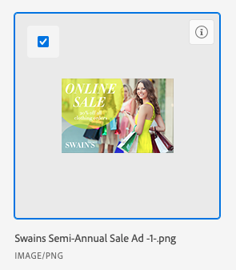
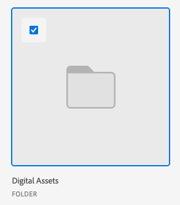

# Vinculación de recursos y carpetas con el conector mejorado

Puede vincular un recurso o una carpeta desde Experience Manager Assets a cualquier objeto de Workfront que admita documentos. Los recursos enviados desde Experience Manager Assets no cuentan para el almacenamiento general de documentos en Workfront. Los documentos cargados y enviados desde Workfront a Experience Manager Assets no se contabilizan en el almacenamiento general.

>[!NOTE]
>
>Los archivos de Excel vinculados a través del conector mejorado no se pueden previsualizar en Workfront. Debe descargar el archivo para acceder a él.

## Requisitos de acceso

+++ Expanda para ver los requisitos de acceso para la funcionalidad en este artículo.

<table style="table-layout:auto"> 
 <col> 
 <col> 
 <tbody> 
  <tr> 
   <td role="rowheader">Paquete de Adobe Workfront</td> 
   <td> 
Cualquiera
 </td> 
  </tr> 
  <tr> 
   <td role="rowheader">Licencia de Adobe Workfront</td> 
   <td> 
   
Colaborador o superior

   
Solicitud o superior
 
    </td> 
  </tr> 
  <tr> 
   <td role="rowheader">Productos adicionales</td> 
   <td>Experience Manager Assets </td> 
  </tr> 
  <tr> 
   <td role="rowheader">Configuraciones de nivel de acceso*</td> 
   <td> 
Acceso de edición a documentos
</td> 
  </tr> 
  <tr> 
   <td role="rowheader">Permisos de objeto</td> 
   <td> 
Ver el acceso o superior en un documento
 </td> 
  </tr> 
 </tbody> 
</table>

Para obtener más información, consulte [Requisitos de acceso en la documentación de Workfront](/help/quicksilver/administration-and-setup/add-users/access-levels-and-object-permissions/access-level-requirements-in-documentation.md).

+++

## Requisitos previos

Antes de empezar, debe

* Instalar el conector mejorado de Workfront para Experience Manager

## Vincular un recurso desde Experience Manager Assets

Puede vincular un recurso de Experience Manager Assets a Workfront. Una vez vinculado el recurso, puede

* [Probar un recurso vinculado para Experience Manager Assets](../../../documents/workfront-and-experience-manager-integrations/workfront-for-experience-manager-enhanced-connector/enhanced-connector-proof-asset.md)
* [Cargar una nueva versión de un documento](../../../documents/managing-documents/upload-new-document-version.md)

Para vincular un recurso a Experience Manager Assets:

1. Vaya al área de **Documentos** de Workfront donde desea añadir el documento.
1. Haga clic en **Añadir nuevo** y, a continuación, elija la integración de Experience Manager Assets que configuró el administrador.

   >[!NOTE]
   >
   >Se puede elegir cualquier nombre para esta integración, por lo que no se puede mencionar específicamente a Experience Manager Assets.

1. Seleccione los recursos que desee.

   

1. Haga clic en **Vincular**.

## Vincular una carpeta desde Experience Manager Assets

Los permisos para ver recursos individuales dentro de una carpeta dependen de los permisos de Experience Manager Assets.

Para vincular una carpeta a Experience Manager Assets:

1. Vaya al área de **Documentos** de Workfront donde desea añadir el documento.
1. Haga clic en **Añadir nuevo** y, a continuación, elija la integración de Experience Manager Assets que configuró el administrador.

   >[!NOTE]
   >
   >Se puede elegir cualquier nombre para esta integración, por lo que no se puede mencionar específicamente a Experience Manager Assets.

1. Seleccione las carpetas que desee.

   

1. Haga clic en **Vincular**.

## Vincular una nueva versión desde Experience Manager Assets

Puede extraer un nuevo recurso de Experience Manager Assets y añadirlo a un recurso existente como una nueva versión en Workfront. Si el documento ya está vinculado y se añade una nueva versión en Experience Manager Assets, la nueva versión aparece automáticamente en Workfront.

>[!TIP]
>
>Puede ver todas las versiones de un recurso si va a **Detalles del documento** > **Versiones**.

Para vincular una nueva versión desde Experience Manager Assets:

1. Vaya al área de **Documentos** de Workfront donde desea añadir el documento.
1. Seleccione el recurso que desea reemplazar con una nueva versión. No puede crear una nueva versión de un recurso en una carpeta vinculada.
1. Haga clic en **Añadir nuevo** y, a continuación, elija la integración de Experience Manager Assets que configuró el administrador.

   >[!NOTE]
   >
   >Se puede elegir cualquier nombre para esta integración, por lo que no se puede mencionar específicamente a Experience Manager Assets.

1. Seleccione el recurso que desee.

   

1. Haga clic en **Vincular**.
