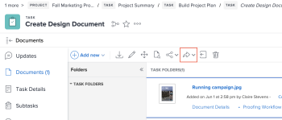

# Enviar un documento con el conector mejorado

Puede enviar documentos desde Workfront a Experience Manager Assets. Los documentos cargados y enviados desde Workfront a Experience Manager Assets siguen contando en el almacenamiento general de documentos. Los Assets vinculados desde Experience Manager Assets no cuentan para el almacenamiento general.

## Requisitos de acceso

+++ Expanda para ver los requisitos de acceso para la funcionalidad en este artículo.

<table style="table-layout:auto"> 
 <col> 
 <col> 
 <tbody> 
  <tr> 
   <td role="rowheader">Paquete de Adobe Workfront</td> 
   <td> 
Cualquiera
 </td> 
  </tr> 
  <tr> 
   <td role="rowheader">Licencia de Adobe Workfront</td> 
   <td> 
   
Colaborador o superior

   
Solicitud o superior
 </td> 
  </tr> 
  <tr> 
   <td role="rowheader">Productos adicionales</td> 
   <td>Experience Manager Assets </td> 
  </tr> 
  <tr> 
   <td role="rowheader">Configuraciones de nivel de acceso*</td> 
   <td> 
Acceso de edición a documentos
 s="MCXref xref"&gt;Crear o modificar niveles de acceso personalizados</a>.
 </td> 
  </tr> 
  <tr> 
   <td role="rowheader">Permisos de objeto</td> 
   <td> 
Acceso de visualización o superior en Documentos
</td> 
  </tr> 
 </tbody> 
</table>

Para obtener más información, consulte [Requisitos de acceso en la documentación de Workfront](/help/quicksilver/administration-and-setup/add-users/access-levels-and-object-permissions/access-level-requirements-in-documentation.md).
+++

## Requisitos previos

Antes de empezar, debe

* Instale el conector mejorado de Workfront para Experience Manager.

## Enviar un documento a Experience Manager Assets

Cuando un usuario envía un documento desde Workfront a Experience Manager Assets, los metadatos asignados se transfieren a lo largo del documento. Si se configura, los metadatos se sincronizan continuamente cada vez que se realiza un cambio.

Para enviar documentos:

1. Vaya al área **Documentos** de Workfront y seleccione el documento que quiera enviar.
1. Haga clic en **Enviar a** y, a continuación, elija la integración de Experience Manager Assets que configuró el administrador.

   >[!NOTE]
   >
   >Se puede elegir cualquier nombre para esta integración, por lo que no se puede mencionar específicamente a Experience Manager Assets.

   

1. Elija dónde desea que vaya el recurso y haga clic en **Seleccionar carpeta**.
1. Al encontrar el destino deseado, haga clic en **Guardar**.

## Enviar una nueva versión a Experience Manager Assets

Es posible añadir una nueva versión a un documento que se haya cargado anteriormente en Workfront. Para obtener más información, consulte [Cargar una nueva versión de un documento](../../../documents/managing-documents/upload-new-document-version.md). Una vez cargada la versión más reciente, puede enviarla a Experience Manager Assets. Si un campo asignado en Workfront ha cambiado, la nueva versión actualiza los metadatos en Experience Manager Assets cuando envía.

Para enviar la versión más reciente:

1. Vaya al área de **Documentos** en Workfront y busque el documento.
1. Haga clic en **Enviar a** y, a continuación, elija la integración de Experience Manager Assets que configuró el administrador.

   >[!NOTE]
   >
   >Se puede elegir cualquier nombre para esta integración, por lo que no se puede mencionar específicamente a Experience Manager Assets.

   

1. Haga clic en **Guardar**. La nueva versión se guarda en la misma ubicación que la versión anterior.
