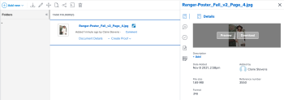

# Ver o descargar un recurso vinculado con el conector mejorado

Puede ver o descargar un recurso en Adobe Workfront que esté vinculado desde Experience Manager Assets.

## Requisitos de acceso

+++ Expanda para ver los requisitos de acceso para la funcionalidad en este artículo.

<table style="table-layout:auto"> 
 <col> 
 <col> 
 <tbody> 
  <tr> 
   <td role="rowheader">Paquete de Adobe Workfront</td> 
   <td> 
Cualquiera
 </td> 
  </tr> 
  <tr> 
   <td role="rowheader">Licencia de Adobe Workfront</td> 
   <td> 
   
Colaborador o superior

   
Solicitud o superior
 </td> 
  </tr> 
  <tr> 
   <td role="rowheader">Productos adicionales</td> 
   <td>Experience Manager Assets </td> 
  </tr> 
  <tr> 
   <td role="rowheader">Configuraciones de nivel de acceso*</td> 
   <td> 
Acceso de edición a documentos
 s="MCXref xref"&gt;Crear o modificar niveles de acceso personalizados</a>.
 </td> 
  </tr> 
  <tr> 
   <td role="rowheader">Permisos de objeto</td> 
   <td> 
Acceso de visualización o superior en Documentos
</td> 
  </tr> 
 </tbody> 
</table>

Para obtener más información, consulte [Requisitos de acceso en la documentación de Workfront](/help/quicksilver/administration-and-setup/add-users/access-levels-and-object-permissions/access-level-requirements-in-documentation.md).

+++

## Requisitos previos

Antes de empezar, debe

* Instalar el conector mejorado de Workfront para Experience Manager

## Ver o descargar un recurso vinculado desde Experience Manager Assets

1. Busque el documento que desea ver o descargar.
1. En la lista de documentos, seleccione el documento.
1. En el resumen del documento que se encuentra a la derecha, pasa el puntero por encima de la miniatura que hay en la parte superior y elija **Vista previa** o **Descargar**.

   
