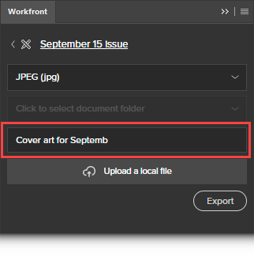

# Uso de la extensión de Workfront para Illustrator y InDesign

<!--Audited: 01/2024-->

>[!IMPORTANT]
>
>Sustituimos la extensión de Workfront para Illustrator y InDesign por [complementos de Creative Cloud actualizados](/help/quicksilver/workfront-integrations-and-apps/adobe-workfront-for-creative-cloud/wf-cc-install-toc.md). A partir de finales de 2022, esta extensión dejará de ser compatible y estará disponible tal cual.

Puede utilizar la extensión de Workfront para exportar a Workfront el contenido digital que guarde y cree en Adobe Illustrator y Adobe InDesign. Esto acelera el proceso de revisión y aprobación de documentos.

La extensión de Workfront es compatible con Adobe Creative Cloud 2017 y versiones posteriores en las siguientes aplicaciones:

* InDesign
* Illustrator
* Photoshop

  >[!NOTE]
  >
  >Se recomienda utilizar el nuevo [Adobe Workfront para Photoshop](/help/quicksilver/workfront-integrations-and-apps/adobe-workfront-for-creative-cloud/wf-cc-install-ps.md) plugin.

## Requisitos de acceso

Debe tener el siguiente acceso para realizar los pasos de este artículo:

<table style="table-layout:auto"> 
 <col> 
 <col> 
 <tbody> 
  <tr> 
   <td role="rowheader">plan Adobe Workfront*</td> 
   <td> 
Actual: Pro o superior

   O
   
Nuevo: cualquier plan
 </td> 
  </tr> 
  <tr data-mc-conditions=""> 
   <td role="rowheader">Licencia de Adobe Workfront*</td> 
   <td> 
Actual: Trabajo o superior

   O
   
Nuevo: estándar
 </td> 
  </tr> 
  <tr> 
   <td role="rowheader">Product</td> 
   <td>Debe tener una licencia de Adobe Creative Cloud además de una licencia de Workfront.</td> 
  </tr> 
  <tr> 
   <td role="rowheader">Permisos de objeto</td> 
   <td> 
Edite el acceso al objeto con el que desea interactuar.
  </td> 
  </tr> 
 </tbody> 
</table>

&#42;Para saber qué plan, tipo de licencia o acceso tiene, póngase en contacto con su administrador de Workfront. Para obtener más información, consulte [Requisitos de acceso en la documentación de Workfront](/help/quicksilver/administration-and-setup/add-users/access-levels-and-object-permissions/access-level-requirements-in-documentation.md).

## Inicie sesión en la extensión de Workfront desde Illustrator o InDesign. {#log-in-to-workfront-extension-from-illustrator-or-indesign}

Cuando inicia sesión en Workfront desde una de las aplicaciones de Adobe admitidas, inicia sesión en todas las aplicaciones de Adobe admitidas.

1. Vaya a la aplicación de Adobe donde desee utilizar la extensión de Workfront.

   Para obtener una lista de formatos admitidos para cada aplicación, consulte [Formatos de archivo exportados compatibles](#supported-exported-file-formats) en este artículo.

1. Clic **Ventana** > **Extensiones** > Workfront.

1. (Opcional) Arrastre el panel Workfront a la posición en la que desee que se muestre en la aplicación de Adobe.
1. Siga las indicaciones para iniciar sesión en Workfront.

   >[!NOTE]
   >
   >* Workfront se conecta a Adobe Creative Cloud mediante OAuth 2.0, un estándar seguro utilizado por la mayoría de las integraciones basadas en la web para la autenticación y autorización de usuarios.
   >* Cuando se le pida que introduzca el [dominio o host] de su cuenta de Workfront, escríbala con este formato:`yourCompany'sDomain.my.workfront.com`. El dominio de su empresa suele ser el nombre de su empresa.

   Si el proyecto se encuentra en estado actual, se mostrará una lista de los elementos de trabajo que tiene asignados. Si no se muestra una lista, inicie sesión en Workfront.

   Las tareas personales se enumeran en **No hay proyectos**.

## Cargar un archivo a un proyecto, tarea o problema de Workfront {#upload-a-file-to-a-workfront-project-task-or-issue}

Puede cargar un archivo desde el sistema de archivos del equipo o exportar un archivo abierto actualmente en una aplicación de Adobe Creative Cloud a un proyecto, tarea o problema de Workfront. 

Tenga en cuenta lo siguiente al cargar o exportar un archivo desde Adobe Creative Cloud:

* El nivel de acceso debe permitir la carga de documentos en Workfront. Para obtener más información, consulte [Conceder acceso a documentos](../../administration-and-setup/add-users/configure-and-grant-access/grant-access-documents.md).
* Debe tener permisos para cargar documentos en el elemento en el que desee cargarlos. Para obtener más información, consulte [Información general sobre los permisos de uso compartido en objetos](../../workfront-basics/grant-and-request-access-to-objects/sharing-permissions-on-objects-overview.md).
* El archivo se carga en el área Documentos del objeto de Workfront que seleccione.
* No se puede exportar un documento al área Documentos del menú principal  desde una aplicación de Adobe Creative Cloud.

Las siguientes secciones explican lo siguiente:

* [Cargar un archivo](#upload-a-file)
* [Exportar un archivo abierto actualmente en Illustrator o InDesign](#export-a-file-currently-open-in-illustrator-or-indesign)
* [Cargar una nueva versión de un archivo desde Illustrator o InDesign](#upload-a-new-version-of-a-file-from-illustrator-or-indesign)

### Cargar un archivo {#upload-a-file}

Puede cargar los archivos en un proyecto, tarea o problema sin salir de la aplicación de Adobe Creative Cloud.

1. Si no ve la extensión de Workfront al abrir la aplicación de Adobe Creative Cloud, haga clic en **Ventana** > **Extensiones** > **Workfront**.

   Si el proyecto se encuentra en estado actual, se mostrará una lista de los elementos de trabajo que se le hayan asignado. Si no se muestra una lista, inicie sesión en Workfront.

   Las tareas personales se enumeran en **No hay proyectos**.

1. Haga clic en el nombre del proyecto, tarea o problema en el que desea cargar el archivo.

   Para buscarlo, escriba el nombre en la lista **Buscar** y seleccionar **Proyecto**, **Tarea**, o **Problema** en el menú desplegable situado a la derecha del **Buscar** cuadro. Si el nombre del elemento de trabajo no aparece en la lista, presione **Entrar** para buscar todos los elementos de Workfront que tiene acceso para ver.

1. Clic **Seleccionar** en la esquina inferior derecha de la extensión de Workfront.
1. En el **Haga clic para seleccionar el formato** , haga clic en el formato en el que desee guardar el archivo en Workfront.

   Para obtener una lista de formatos admitidos para cada aplicación, consulte [Formatos de archivo exportados compatibles](#supported-exported-file-formats) en este artículo.

1. (Condicional) Si el elemento de trabajo donde desea cargar el archivo tiene carpetas de documentos, seleccione una carpeta de documentos en la **Haga clic para seleccionar una carpeta de documentos** y haga clic en **Seleccionar**.

1. Clic **Cargar un archivo local**.
1. En el **Abrir archivo** , busque el archivo en su sistema de archivos y haga clic en **Abrir**.

1. (Opcional) Escriba un nuevo nombre para el archivo.

   

1. Clic **Cargar**.

   En Workfront, el documento ahora aparece en el área Documentos del proyecto, tarea o problema seleccionado.

1. (Opcional) Haga clic en el nombre del documento para abrir su página de detalles del documento en Workfront.

   Workfront se abre en una nueva pestaña del explorador.

### Exportar un archivo abierto actualmente en Illustrator o InDesign {#export-a-file-currently-open-in-illustrator-or-indesign}

1. En una aplicación de Adobe Creative Cloud compatible, abra un archivo que desee exportar a Workfront.
1. Si no se muestra la extensión de Workfront, haga clic en **Ventana** > **Extensiones** > **Workfront**.

   Si el proyecto se encuentra en estado actual, se mostrará una lista de los elementos de trabajo que se le hayan asignado. Si no se muestra una lista, inicie sesión en Workfront.

   Las tareas personales se enumeran en **No hay proyectos**.

1. Haga clic en el nombre del proyecto, tarea o problema al que desea exportar el archivo.

   Para buscarlo, escriba el nombre en la lista **Buscar** y seleccionar **Proyecto**, **Tarea**, o **Problema** en el menú desplegable situado a la derecha del **Buscar** cuadro. Si el nombre del elemento de trabajo no aparece en la lista, presione **Entrar** para buscar todos los elementos de Workfront que tiene acceso para ver.

1. En el **Haga clic para seleccionar el formato** , haga clic en el formato en el que desee guardar el archivo en Workfront.

   Para obtener una lista de formatos admitidos para cada aplicación, consulte [Formatos de archivo exportados compatibles](#supported-exported-file-formats) en este artículo.

1. (Condicional) Si el elemento de trabajo donde desea cargar el archivo tiene carpetas de documentos, seleccione una carpeta de documentos en la **Haga clic para seleccionar una carpeta de documentos** y haga clic en **Seleccionar**.
1. (Opcional) Para cambiar el nombre del documento, haga clic en el nombre del documento y escriba un nombre nuevo.

   

1. Clic **Exportar**.

   Aparecerá un mensaje para confirmar que el documento se ha exportado correctamente a Workfront.

   En Workfront, el documento se muestra en el área Documentos del objeto especificado en Workfront.

1. (Opcional) Haga clic en el nombre del documento para acceder a él en Workfront.

   

   Workfront se abre en una nueva pestaña del explorador.

### Cargar una nueva versión de un archivo desde Illustrator o InDesign {#upload-a-new-version-of-a-file-from-illustrator-or-indesign}

1. Si desea exportar un archivo en el que esté trabajando en una aplicación de Adobe compatible como una nueva versión de un archivo en Workfront, abra el archivo en la aplicación de Adobe.
1. Si no se muestra la extensión de Workfront, haga clic en **Ventana** > **Extensiones** > **Workfront**.

   Si el proyecto se encuentra en estado actual, se mostrará una lista de los elementos de trabajo que tiene asignados. Si no se muestra una lista, inicie sesión en Workfront.

   Las tareas personales se enumeran en **No hay proyectos**.

1. Haga clic en el nombre del proyecto, tarea o problema en el que aparece el documento existente.

   Para buscarlo, escriba el nombre en la lista **Buscar** y seleccionar **Proyecto**, **Tarea**, o **Problema** en el menú desplegable situado a la derecha del **Buscar** cuadro. Si el nombre del elemento de trabajo no aparece en la lista, presione **Entrar** para buscar todos los elementos de Workfront que tiene acceso para ver.

   Todos los documentos cargados en proyectos, tareas o problemas se muestran en una lista, independientemente de si se cargaron desde la aplicación de Adobe.

1. En el **Haga clic para seleccionar el formato** , haga clic en el formato en el que desee guardar el archivo en Workfront.

   Esto es necesario si va a exportar un archivo que haya abierto en la aplicación de Adobe. Para obtener una lista de formatos admitidos para cada aplicación, consulte [Formatos de archivo exportados compatibles](#supported-exported-file-formats) en este artículo.

1. Si está exportando un archivo que ha abierto en la aplicación de Adobe como una nueva versión del documento de Workfront seleccionado, haga clic en **Exportar**.

   O

   Si desea cargar un archivo del sistema de archivos del equipo como una nueva versión del documento de Workfront seleccionado, haga clic en **Cargar un archivo local**, busque el archivo en el cuadro que aparece y haga clic en **Abrir**, luego haga clic en **Cargar**.

1. (Opcional) Haga clic en el nombre del documento para ver su nueva versión en Workfront.

   >[!NOTE]
   >
   >El nombre del documento en Workfront se rellena de forma predeterminada y no se puede editar. Tampoco cambia al nombre del archivo que carga o exporta como una nueva versión.
   >
   >
   >

## Comentario en un documento de Workfront desde Illustrator o InDesign {#comment-on-a-workfront-document-from-illustrator-or-indesign}

Puede agregar comentarios directamente a un documento de Workfront dentro de una aplicación de Adobe. En Workfront, los comentarios se muestran en el área de Actualizaciones del documento y en el área de Actualizaciones del elemento de Workfront donde se guarda el documento.

1. Abra una de las aplicaciones de Adobe compatibles.
1. Si no se muestra la extensión de Workfront, haga clic en **Ventana** > **Extensiones** > **Workfront**.

   Si el proyecto se encuentra en estado actual, se mostrará una lista de los elementos de trabajo que tiene asignados. Si no se muestra una lista, inicie sesión en Workfront.

   Las tareas personales se enumeran en **No hay proyectos**.

1. Haga clic en el proyecto, tarea o problema en el que aparece el documento existente.

   Para buscarlo, escriba el nombre en la lista **Buscar** y seleccionar **Proyecto**, **Tarea**, o **Problema** en el menú desplegable situado a la derecha del **Buscar** cuadro. Si el nombre del elemento de trabajo no aparece en la lista, presione **Entrar** para buscar todos los elementos de Workfront que tiene acceso para ver.

1. Haga clic en el nombre del documento existente y luego haga clic en **Seleccionar** en la esquina inferior derecha de la extensión de Workfront.
1. Haga clic en **Comentario** y, a continuación, escriba la actualización en el cuadro.

1. (Opcional) Para incluir a otros usuarios o equipos de Workfront en el comentario, empiece a escribir el nombre de un usuario o equipo en la variable **Notificar a personas o equipos** y, a continuación, haga clic en el nombre cuando aparezca en la lista desplegable.
1. (Opcional) Para solicitar la aprobación del documento, seleccione **Realizar una solicitud de aprobación**.
1. Clic **Actualizar**.

   Se publica una actualización en la pestaña Actualizaciones del documento. Los usuarios de Workfront que incluya en el comentario recibirán una notificación dentro de la aplicación y, según la configuración de Workfront, también podrán recibir una notificación por correo electrónico.

   Para obtener más información sobre las notificaciones en Workfront, consulte [Visualización y administración de notificaciones en la aplicación](../../workfront-basics/using-notifications/view-and-manage-in-app-notifications.md).

   Para obtener más información sobre la recepción de notificaciones por correo electrónico, consulte [Notificaciones de Adobe Workfront](../../workfront-basics/using-notifications/wf-notifications.md).

## Solicitar la aprobación de un documento a Illustrator o a InDesign

Puede solicitar la aprobación de un documento de Workfront directamente desde una aplicación de Adobe.

Puede solicitar la aprobación de un documento a las siguientes entidades:

* Un usuario de Workfront
* Un usuario externo sin una cuenta de Workfront

Puede solicitar una aprobación de un documento a partir de una solicitud de Adobe de las siguientes maneras:

* Adjuntando un aprobador al documento.
* Al comentar un documento, notificar a la persona cuando realice un comentario y adjuntarla como aprobador al documento.

  Para obtener información sobre cómo solicitar una aprobación al comentar un documento, consulte la sección [Comentario en un documento de Workfront desde Illustrator o InDesign](#comment-on-a-workfront-document-from-illustrator-or-indesign) en este artículo.

Para solicitar una aprobación de un documento desde una solicitud de Adobe:

1. Abra una de las aplicaciones de Adobe compatibles.
1. Si no se muestra la extensión de Workfront, haga clic en **Ventana** > **Extensiones** > **Workfront**.

   Si el proyecto se encuentra en estado actual, se mostrará una lista de los elementos de trabajo que tiene asignados. Si no se muestra una lista, inicie sesión en Workfront.

   Las tareas personales se enumeran en **No hay proyectos**.

1. Haga clic en el proyecto, tarea o problema en el que aparece el documento existente y, a continuación, haga clic en el nombre del documento existente.

   Para buscarlo, escriba el nombre en la lista **Buscar** y seleccionar **Proyecto**, **Tarea**, o **Problema** en el menú desplegable situado a la derecha del **Buscar** cuadro. Si el nombre del elemento de trabajo no aparece en la lista, presione **Entrar** para buscar todos los elementos de Workfront que tiene acceso para ver.

1. Haga clic en el nombre del documento existente y luego haga clic en **Seleccionar** en la esquina inferior derecha de la extensión de Workfront.
1. Haga clic en **Aprobación** pestaña.
1. Para agregar un aprobador, en la **Empiece a escribir un cuadro de nombre** realice una de las siguientes acciones:

   * Escriba el nombre de un aprobador y selecciónelo cuando aparezca en la lista.

     

   * Escriba la dirección de correo electrónico de un usuario externo.

1. Clic **Solicitar aprobación**.

   Los usuarios de Workfront que incluya en el comentario o que añada como aprobador reciben una notificación dentro de la aplicación y, según la configuración de Workfront, también pueden recibir una notificación por correo electrónico.\
   Los usuarios externos reciben una notificación por correo electrónico desde donde pueden tomar una decisión sobre la aprobación.

   Para obtener información sobre las notificaciones en Workfront, consulte [Visualización y administración de notificaciones en la aplicación](../../workfront-basics/using-notifications/view-and-manage-in-app-notifications.md). Para obtener información sobre la recepción de notificaciones por correo electrónico, consulte [Notificaciones de Adobe Workfront](../../workfront-basics/using-notifications/wf-notifications.md).

## Generación de una prueba desde Illustrator o InDesign {#generate-a-proof-from-illustrator-or-indesign}

Si su organización utiliza plantillas de flujo de trabajo automatizado, puede generar una prueba para un documento que cree en una aplicación de Adobe sin salir de la aplicación. Para obtener información sobre la creación de pruebas, consulte [Creación de pruebas](../../review-and-approve-work/proofing/creating-proofs-within-workfront/create-proofs-in-wf.md). Para obtener información sobre las plantillas de flujo de trabajo automatizado, consulte [Plantillas de flujo de trabajo automatizado](../../review-and-approve-work/proofing/proofing-overview/automated-workflow.md#automate) in [Resumen del flujo de trabajo automatizado](../../review-and-approve-work/proofing/proofing-overview/automated-workflow.md).

1. Abra una de las aplicaciones de Adobe compatibles.
1. Si no se muestra la extensión de Workfront, haga clic en **Ventana** > **Extensiones** > Workfront.

   Si el proyecto se encuentra en estado actual, se mostrará una lista de los elementos de trabajo que tiene asignados. Si no se muestra una lista, inicie sesión en Workfront.

   Las tareas personales se enumeran en **No hay proyectos**.

1. Si el documento ya se ha cargado en Workfront, seleccione el proyecto, la tarea o el problema en la extensión de Workfront en la que aparece el documento y, a continuación, haga clic en el nombre del documento.

   O

   Cargue un documento de Adobe en un objeto de Workfront, tal como se describe en la sección [Cargar un archivo a un proyecto, tarea o problema de Workfront](#upload-a-file-to-a-workfront-project-task-or-issue) en este artículo, haga clic en el nombre del documento.

1. En el **Haga clic para seleccionar el formato** , haga clic en el formato en el que desee guardar el archivo en Workfront.

   Algunos formatos no están disponibles después de habilitar la funcionalidad de revisión en el paso siguiente. Para obtener más información, consulte [Formatos de archivo exportados compatibles](#supported-exported-file-formats) en este artículo.

1. Clic **Cargar como nueva prueba** para habilitarlo.
1. Seleccione el **Plantilla de flujo de trabajo** desea que las personas utilicen mientras revisan el documento.

   El administrador de Workfront configura las plantillas de flujo de trabajo automatizado como se describe en [Crear y administrar plantillas de flujo de trabajo automatizado](/help/quicksilver/administration-and-setup/manage-workfront/configure-proofing/create-manage-automated-workflow-templates.md). Si tiene alguna pregunta, consulte al administrador.

   1. Añada al menos uno **Nuevo destinatario** a cada fase de la plantilla de flujo de trabajo.

      Puede empezar a escribir un nombre y seleccionarlo cuando lo vea en la lista desplegable que aparece.

   1. Especifique el **Función de prueba** y frecuencia de **Alertas de correo electrónico** para cada destinatario que agregue.

   1. (Opcional) En el **Notificación por correo electrónico** , seleccione si desea enviar una notificación por correo electrónico con un mensaje personalizado opcional sobre la prueba a todos los destinatarios de prueba que ha añadido.

1. Clic **Crear revisión**.

   Puede ver el progreso del proceso de creación de la prueba. Aparece una alerta cuando ha terminado de generarse. Puede abrir la tarea en la que creó la prueba y que aparece en la lista.

## Cargar una nueva versión de una revisión sin salir de Illustrator ni de InDesign

1. Haga clic en un documento existente que tenga una prueba y, a continuación, haga clic en **Seleccionar** en la esquina inferior derecha.
1. Clic **Cargar como nueva versión de prueba** para habilitarlo.
1. (Opcional) Seleccione la **Plantilla de flujo de trabajo** desea que las personas utilicen al revisar la nueva versión.

   Si no selecciona una plantilla diferente, la plantilla seleccionada para la versión anterior permanecerá en vigor. Además, si ha modificado la plantilla para la versión anterior, los cambios estarán vigentes para la nueva versión.

   El administrador de Workfront configura las plantillas de flujo de trabajo automatizado como se describe en [Crear y administrar plantillas de flujo de trabajo automatizado](/help/quicksilver/administration-and-setup/manage-workfront/configure-proofing/create-manage-automated-workflow-templates.md). Si tiene alguna pregunta, consulte al administrador.

   1. Añada al menos uno **Nuevo destinatario** a cada fase de la plantilla de flujo de trabajo.

      Puede empezar a escribir un nombre y seleccionarlo cuando lo vea en la lista desplegable que aparece.

   1. Especifique el **Función de prueba** y frecuencia de **Alertas de correo electrónico** para cada destinatario que agregue.
   1. (Opcional) En el **Notificación por correo electrónico** , seleccione si desea enviar una notificación por correo electrónico con un mensaje personalizado opcional sobre la prueba a todos los destinatarios de prueba que ha añadido.

1. Clic **Crear nueva versión de revisión**.

   Puede ver el progreso del proceso de creación de la prueba. Aparece una alerta cuando ha terminado de generarse. Puede abrir la tarea en la que creó la prueba y que aparece en la lista.

## Cierre la sesión de Workfront Extension

1. En la aplicación de Adobe, haga clic en **Ventana** > **Extensiones** > **Workfront**.

1. Haga clic en **Más** menú  en la esquina superior derecha del panel.

1. (Opcional) Haga clic en **Comentarios** para abrir una breve encuesta y enviar a Workfront sus comentarios sobre Workfront for Adobe Creative Cloud.
1. Clic **Cerrar sesión**.\
   Se muestra la pantalla Inicio de sesión. Para obtener información sobre cómo iniciar sesión, consulte [Inicie sesión en la extensión de Workfront desde Illustrator o InDesign.](#log-in-to-workfront-extension-from-illustrator-or-indesign) en este artículo.

## Formatos de archivo exportados compatibles {#supported-exported-file-formats}

* [Formatos de archivo exportados compatibles con Adobe InDesign](#supported-exported-file-formats-for-adobe-indesign)
* [Formatos de archivo exportados compatibles con Adobe Illustrator](#supported-exported-file-formats-for-adobe-illustrator)

### Formatos de archivo exportados compatibles con Adobe InDesign  {#supported-exported-file-formats-for-adobe-indesign}

Workfront admite los siguientes formatos de archivo para exportar un archivo de InDesign a Workfront:

* EPS: PostScript encapsulado
* EPUB - Publicación electrónica de diseño fijo
* EPUB - Reflowable electronic publication &#42;
* HTML - Lenguaje de marcado de hipertexto
* IDML - Lenguaje de marcado de InDesign &#42;
* JPG, JPEG - Joint Photographic Experts Group
* PDF - Archivo de documento portátil de Adobe
* PNG - Gráficos de red portátiles
* SWF - FLASH PLAYER &#42;
* XML: lenguaje de marcado extensible &#42;

&#42; Este formato de archivo no está disponible cuando **Cargar una nueva prueba** está activada (para obtener información sobre esta opción, consulte [Generación de una prueba desde Illustrator o InDesign](#generate-a-proof-from-illustrator-or-indesign) en este artículo). Si este formato de archivo ya está seleccionado antes de activar **Cargar una nueva prueba**, el sistema cambia el formato de archivo a PDF. Puede seleccionar un formato diferente de la lista.

### Formatos de archivo exportados compatibles con Adobe Illustrator  {#supported-exported-file-formats-for-adobe-illustrator}

Workfront admite los siguientes formatos de archivo para exportar un archivo de Illustrator a Workfront:

* DWG - Dibujo de AutoCAD, Archivo de intercambio de AutoCAD &#42;
* JPG, JPEG - Joint Photographic Experts Group
* PNG - Gráficos de red portátiles
* PSD - Documento de Photoshop
* SWF - FLASH PLAYER &#42;
* TIFF - Formato de archivo de imagen etiquetado

&#42; Este formato de archivo no está disponible cuando **Cargar una nueva prueba** está activada (para obtener información sobre esta opción, consulte [Generación de una prueba desde Illustrator o InDesign](#generate-a-proof-from-illustrator-or-indesign) en este artículo). Si este formato de archivo ya está seleccionado antes de activar **Cargar una nueva prueba**, el sistema cambia el formato de archivo a PNG. Puede seleccionar un formato diferente de la lista.
