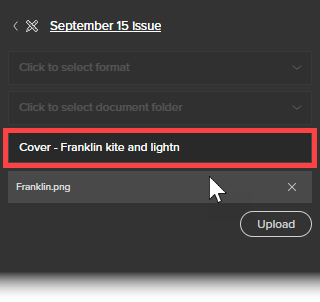

# Usar la extensión de Workfront para Illustrator y InDesign

>[!IMPORTANT]
>
>Estamos reemplazando la extensión de Workfront para Illustrator y InDesign por [complementos de Creative Cloud actualizados](/help/quicksilver/workfront-integrations-and-apps/adobe-workfront-for-creative-cloud/wf-cc-install-toc.md). A partir de finales de 2022, esta extensión dejará de ser compatible y estará disponible tal cual.

Puede utilizar la extensión de Workfront para exportar contenido digital que guarde y cree en Adobe Illustrator y Adobe InDesign a Workfront. Esto acelera el proceso de revisión y aprobación del documento.

La extensión de Workfront es compatible con Adobe Creative Cloud 2017 y versiones posteriores en las siguientes aplicaciones:

* InDesign
* Illustrator
* Photoshop

   >[!NOTE]
   >
   >Se recomienda usar el nuevo [Adobe Workfront para Photoshop](/help/quicksilver/workfront-integrations-and-apps/adobe-workfront-for-creative-cloud/wf-cc-install-ps.md) plugin.

## Requisitos de acceso

Debe tener el siguiente acceso para realizar los pasos de este artículo:

<table style="table-layout:auto"> 
 <col> 
 <col> 
 <tbody> 
  <tr> 
   <td role="rowheader">plan de Adobe Workfront*</td> 
   <td> 
Pro o superior
 </td> 
  </tr> 
  <tr data-mc-conditions=""> 
   <td role="rowheader">Licencia de Adobe Workfront*</td> 
   <td> 
Trabajo o superior
 </td> 
  </tr> 
  <tr> 
   <td role="rowheader">Product</td> 
   <td>Debe tener una licencia de Adobe Creative Cloud además de una licencia de Workfront.</td> 
  </tr> 
  <tr> 
   <td role="rowheader">Permisos de objeto</td> 
   <td> 
Edite el acceso al objeto con el que desee interactuar.
 
Para obtener información sobre la solicitud de acceso adicional, consulte <a href="../../workfront-basics/grant-and-request-access-to-objects/request-access.md" class="MCXref xref">Solicitar acceso a objetos </a>.
 </td> 
  </tr> 
 </tbody> 
</table>

&#42;Para saber qué plan, tipo de licencia o acceso tiene, póngase en contacto con el administrador de Workfront.

## Inicie sesión en la extensión de Workfront desde Illustrator o InDesign {#log-in-to-workfront-extension-from-illustrator-or-indesign}

Al iniciar sesión en Workfront desde una de las aplicaciones de Adobe compatibles, ha iniciado sesión en todas las aplicaciones de Adobe compatibles.

1. Vaya a la aplicación de Adobe donde desee utilizar la extensión de Workfront.

   Para obtener una lista de los formatos admitidos para cada aplicación admitida, consulte [Formatos de archivo exportados compatibles](#supported-exported-file-formats) en este artículo.

1. Haga clic en **Ventana** > **Extensiones** > Workfront.

1. (Opcional) Arrastre el panel Workfront hasta la posición en la que desea que se muestre en la aplicación de Adobe.
1. Siga las indicaciones para iniciar sesión en Workfront.

   >[!NOTE]
   >
   >* Workfront se conecta a Adobe Creative Cloud mediante OAuth 2.0, un estándar seguro que la mayoría de las integraciones basadas en web utilizan para la autenticación y autorización de usuarios.
   >* Cuando se le pida que introduzca la variable [dominio o host] de su cuenta de Workfront, escríbala con este formato: *yourCompany&#39;sDomain.my.workfront.com*. El dominio de la empresa suele ser el nombre de la empresa.

   Se muestra una lista de elementos de trabajo asignados a usted si el proyecto tiene un estado actual. Si no se muestra una lista, inicie sesión en Workfront.

   Las tareas personales se enumeran en **Sin proyecto**.

## Cargar un archivo a un proyecto, tarea o problema de Workfront {#upload-a-file-to-a-workfront-project-task-or-issue}

Puede cargar un archivo desde el sistema de archivos del equipo o exportar un archivo abierto actualmente en una aplicación de Adobe Creative Cloud a un proyecto, tarea o problema de Workfront. 

Tenga en cuenta lo siguiente al cargar o exportar un archivo desde Adobe Creative Cloud:

* El nivel de acceso debe permitir la carga de documentos en Workfront. Para obtener más información, consulte [Concesión de acceso a documentos](../../administration-and-setup/add-users/configure-and-grant-access/grant-access-documents.md).
* Debe tener permisos para cargar documentos en el elemento que desee. Para obtener más información, consulte [Información general sobre cómo compartir permisos en objetos](../../workfront-basics/grant-and-request-access-to-objects/sharing-permissions-on-objects-overview.md).
* El archivo se carga en el área Documentos del objeto Workfront que seleccione.
* No se puede exportar un documento al área Documentos del menú principal  desde una aplicación de Adobe Creative Cloud.

Esta sección explica lo siguiente:

* [Cargar un archivo](#upload-a-file)
* [Exportar un archivo abierto actualmente en Illustrator o InDesign](#export-a-file-currently-open-in-illustrator-or-indesign)
* [Cargar una nueva versión de un archivo desde Illustrator o InDesign](#upload-a-new-version-of-a-file-from-illustrator-or-indesign)

### Cargar un archivo {#upload-a-file}

Puede cargar los archivos en un proyecto, tarea o problema sin salir de la aplicación de Adobe Creative Cloud.

1. Si no ve la extensión de Workfront al abrir la aplicación de Adobe Creative Cloud, haga clic en **Ventana** > **Extensiones** > Workfront.

   Se muestra una lista de elementos de trabajo asignados a usted si el proyecto tiene un estado actual. Si no se muestra una lista, inicie sesión en Workfront.

   Las tareas personales se enumeran en **Sin proyecto**.

1. Haga clic en el nombre del proyecto, la tarea o el problema en el que desea cargar el archivo.

   Puede buscar esto escribiendo el nombre en la **Buscar** cuadro y selección **Proyecto**, **Tarea** o **Problema** en el menú desplegable situado a la derecha del **Buscar** en la ventana Si el nombre del elemento de trabajo no aparece en la lista, pulse **Entrar** para buscar todos los elementos de Workfront a los que tiene acceso para ver.

1. Haga clic en **Select** en la esquina inferior derecha de la extensión de Workfront.
1. En el **Haga clic para seleccionar el formato** menú desplegable, haga clic en el formato en el que desee guardar el archivo en Workfront.

   Para obtener una lista de los formatos admitidos para cada aplicación admitida, consulte [Formatos de archivo exportados compatibles](#supported-exported-file-formats) en este artículo.

1. (Condicional) Si el elemento de trabajo en el que desea cargar el archivo tiene carpetas de documento, seleccione una carpeta de documento en la **Haga clic para seleccionar una carpeta de documento** y, a continuación, haga clic en **Select**.

1. Haga clic en **Cargar un archivo local**.
1. En el **Abrir archivo** que aparece, busque el archivo en el sistema de archivos y haga clic en **Apertura**.

1. (Opcional) Escriba un nuevo nombre para el archivo. 

   

1. Haga clic en **Cargar**.

   En Workfront, el documento aparece ahora en el área Documentos del proyecto, la tarea o el problema que ha especificado.  

1. (Opcional) Haga clic en el nombre del documento para abrir su página Detalles del documento en Workfront.

   Workfront se abre en una nueva pestaña del explorador.

### Exportar un archivo abierto actualmente en Illustrator o InDesign {#export-a-file-currently-open-in-illustrator-or-indesign}

1. En una aplicación de Adobe Creative Cloud compatible, abra un archivo que desee exportar a Workfront. 
1. Si no se muestra la extensión de Workfront, haga clic en **Ventana** > **Extensiones** > Workfront.

   Se muestra una lista de elementos de trabajo asignados a usted si el proyecto tiene un estado actual. Si no se muestra una lista, inicie sesión en Workfront.

   Las tareas personales se enumeran en **Sin proyecto**.

1. Haga clic en el nombre del proyecto, la tarea o el problema al que desea exportar el archivo.

   Puede buscar esto escribiendo el nombre en la **Buscar** cuadro y selección **Proyecto**, **Tarea** o **Problema** en el menú desplegable situado a la derecha del **Buscar** en la ventana Si el nombre del elemento de trabajo no aparece en la lista, pulse **Entrar** para buscar todos los elementos de Workfront a los que tiene acceso para ver.

1. En el **Haga clic para seleccionar el formato** menú desplegable, haga clic en el formato en el que desee guardar el archivo en Workfront.

   Para obtener una lista de los formatos admitidos para cada aplicación admitida, consulte [Formatos de archivo exportados compatibles](#supported-exported-file-formats) en este artículo.

1. (Condicional) Si el elemento de trabajo en el que desea cargar el archivo tiene carpetas de documento, seleccione una carpeta de documento en la **Haga clic para seleccionar una carpeta de documento** y, a continuación, haga clic en **Select**.
1. (Opcional) Para cambiar el nombre del documento, haga clic en el nombre del documento y escriba un nuevo nombre.

   

1. Haga clic en **Exportar**. 

   Aparece un mensaje para confirmar que el documento se exportó correctamente a Workfront.

   En Workfront, el documento aparece en el área Documentos del objeto especificado en Workfront.

1. (Opcional) Haga clic en el nombre del documento para acceder a él en Workfront.

   

   Workfront se abre en una nueva pestaña del explorador.

### Cargar una nueva versión de un archivo desde Illustrator o InDesign {#upload-a-new-version-of-a-file-from-illustrator-or-indesign}

1. Si desea exportar un archivo en el que está trabajando en una aplicación de Adobe compatible como una nueva versión de un archivo en Workfront, abra el archivo en la aplicación de Adobe. 
1. Si no se muestra la extensión de Workfront, haga clic en **Ventana** > **Extensiones** > Workfront.

   Se muestra una lista de elementos de trabajo asignados a usted si el proyecto tiene un estado actual. Si no se muestra una lista, inicie sesión en Workfront.

   Las tareas personales se enumeran en **Sin proyecto**.

1. Haga clic en el nombre del proyecto, la tarea o el problema en el que aparece el documento existente.

   Puede buscar esto escribiendo el nombre en la **Buscar** cuadro y selección **Proyecto**, **Tarea** o **Problema** en el menú desplegable situado a la derecha del **Buscar** en la ventana Si el nombre del elemento de trabajo no aparece en la lista, pulse **Entrar** para buscar todos los elementos de Workfront a los que tiene acceso para ver.

   Todos los documentos cargados en proyectos, tareas o problemas se muestran en una lista, independientemente de si se cargaron desde la aplicación de Adobe.

1.  
1. En el **Haga clic para seleccionar el formato** menú desplegable, haga clic en el formato en el que desee guardar el archivo en Workfront.

   Esto es necesario si está exportando un archivo que ha abierto en la aplicación de Adobe. Para obtener una lista de los formatos admitidos para cada aplicación admitida, consulte [Formatos de archivo exportados compatibles](#supported-exported-file-formats) en este artículo.

1. Si está exportando un archivo que ha abierto en la aplicación de Adobe como una nueva versión del documento de Workfront que ha seleccionado, haga clic en **Exportar**.

   O

   Si desea cargar un archivo desde el sistema de archivos del equipo como una nueva versión del documento de Workfront seleccionado, haga clic en **Cargar un archivo local**, busque el archivo en el cuadro que aparece, haga clic en **Apertura** y haga clic en **Cargar**.

1. (Opcional) Haga clic en el nombre del documento para ver su nueva versión en Workfront. 

   >[!NOTE]
   >
   >El nombre del documento en Workfront se rellena de forma predeterminada y no se puede editar. Tampoco cambia el nombre del archivo que se carga o exporta como una versión nueva.
   >
   >
   >

## Comentar en un documento de Workfront desde Illustrator o InDesign {#comment-on-a-workfront-document-from-illustrator-or-indesign}

Puede agregar comentarios directamente a un documento de Workfront dentro de una aplicación de Adobe. En Workfront, los comentarios aparecen en el área Actualizaciones del documento y en el área Actualizaciones del elemento Workfront donde se guarda el documento. 

1. Abra una de las aplicaciones de Adobe compatibles.
1. Si no se muestra la extensión de Workfront, haga clic en **Ventana** > **Extensiones** > Workfront.

   Se muestra una lista de elementos de trabajo asignados a usted si el proyecto tiene un estado actual. Si no se muestra una lista, inicie sesión en Workfront.

   Las tareas personales se enumeran en **Sin proyecto**.

1. Haga clic en el proyecto, la tarea o el problema en el que aparece el documento existente.

   Puede buscar esto escribiendo el nombre en la **Buscar** cuadro y selección **Proyecto**, **Tarea** o **Problema** en el menú desplegable situado a la derecha del **Buscar** en la ventana Si el nombre del elemento de trabajo no aparece en la lista, pulse **Entrar** para buscar todos los elementos de Workfront a los que tiene acceso para ver.

1. Haga clic en el nombre del documento existente y, a continuación, haga clic en **Select** en la esquina inferior derecha de la extensión de Workfront.
1. Haga clic en el **Comentario** y después escriba la actualización en el cuadro que aparece.

1. (Opcional) Para incluir a otros usuarios o equipos de Workfront en el comentario, empiece a escribir el nombre de un usuario o equipo en la **Notificar a personas o equipos** y, a continuación, haga clic en el nombre cuando aparezca en la lista desplegable.
1. (Opcional) Para solicitar la aprobación del documento, seleccione **Realizar una solicitud de aprobación**.
1. Haga clic en **Actualizar**.

   Se publica una actualización en la pestaña Actualizaciones del documento. Los usuarios de Workfront que incluya en el comentario recibirán una notificación en la aplicación y, según la configuración de Workfront, también podrán recibir una notificación por correo electrónico.

   Para obtener más información sobre las notificaciones dentro de Workfront, consulte [Ver y administrar notificaciones en la aplicación](../../workfront-basics/using-notifications/view-and-manage-in-app-notifications.md). 

   Para obtener más información sobre la recepción de notificaciones por correo electrónico, consulte [Notificaciones de Adobe Workfront](../../workfront-basics/using-notifications/wf-notifications.md).

## Solicitar la aprobación de un documento de Illustrator o InDesign

Puede solicitar la aprobación de un documento de Workfront directamente desde una aplicación de Adobe.

Puede solicitar la aprobación de un documento desde las siguientes entidades:

* Un usuario de Workfront
* Un usuario externo sin una cuenta de Workfront

Puede solicitar una aprobación en un documento desde una aplicación de Adobe de las siguientes maneras:

* Adjuntando un aprobador al documento.
* Al comentar un documento, notificando a la persona cuando realiza un comentario. y adjuntándolos como aprobadores al documento.

   Para obtener información sobre la solicitud de una aprobación al comentar un documento, consulte [Comentar en un documento de Workfront desde Illustrator o InDesign](#comment-on-a-workfront-document-from-illustrator-or-indesign) en este artículo.

Para solicitar una aprobación en un documento desde una aplicación de Adobe:

1. Abra una de las aplicaciones de Adobe compatibles.
1. Si no se muestra la extensión de Workfront, haga clic en **Ventana** > **Extensiones** > Workfront.

   Se muestra una lista de elementos de trabajo asignados a usted si el proyecto tiene un estado actual. Si no se muestra una lista, inicie sesión en Workfront.

   Las tareas personales se enumeran en **Sin proyecto**.

1. Haga clic en el proyecto, la tarea o el problema en el que se muestra el documento existente y, a continuación, haga clic en el nombre del documento existente.

   Puede buscar esto escribiendo el nombre en la **Buscar** cuadro y selección **Proyecto**, **Tarea** o **Problema** en el menú desplegable situado a la derecha del **Buscar** en la ventana Si el nombre del elemento de trabajo no aparece en la lista, pulse **Entrar** para buscar todos los elementos de Workfront a los que tiene acceso para ver.

1. Haga clic en el nombre del documento existente y, a continuación, haga clic en **Select** en la esquina inferior derecha de la extensión de Workfront.
1. Haga clic en el **Aprobación** pestaña .
1. Para agregar un aprobador, en la sección **Empezar a escribir un cuadro de nombre** realice una de las siguientes acciones:

   * Escriba el nombre de un aprobador y selecciónelo cuando aparezca en la lista.

      

   * Escriba la dirección de correo electrónico de un usuario externo.

1. Haga clic en **Aprobación de solicitud**.

   Los usuarios de Workfront que incluya en el comentario o añada como aprobador recibirán una notificación en la aplicación y, en función de cómo se configure Workfront, también podrán recibir una notificación por correo electrónico.\
   Los usuarios externos reciben una notificación por correo electrónico desde la que pueden tomar una decisión sobre la aprobación.

   Para obtener información sobre las notificaciones en Workfront, consulte [Ver y administrar notificaciones en la aplicación](../../workfront-basics/using-notifications/view-and-manage-in-app-notifications.md). Para obtener información sobre la recepción de notificaciones por correo electrónico, consulte [Notificaciones de Adobe Workfront](../../workfront-basics/using-notifications/wf-notifications.md).

## Generar una prueba desde Illustrator o InDesign {#generate-a-proof-from-illustrator-or-indesign}

Si su organización utiliza plantillas de flujo de trabajo automatizado, puede generar una prueba para un documento que cree en una aplicación de Adobe sin salir de la aplicación. Para obtener información sobre la creación de pruebas, consulte [Crear pruebas](../../review-and-approve-work/proofing/creating-proofs-within-workfront/create-proofs--in-wf.md). Para obtener información sobre las plantillas de flujo de trabajo automatizado, consulte [Plantillas de flujo de trabajo automatizadas](../../review-and-approve-work/proofing/proofing-overview/automated-workflow.md#automate) en [Resumen del flujo de trabajo automatizado](../../review-and-approve-work/proofing/proofing-overview/automated-workflow.md).

1. Abra una de las aplicaciones de Adobe compatibles.
1. Si no se muestra la extensión de Workfront, haga clic en **Ventana** > **Extensiones** > Workfront.

   Se muestra una lista de elementos de trabajo asignados a usted si el proyecto tiene un estado actual. Si no se muestra una lista, inicie sesión en Workfront.

   Las tareas personales se enumeran en **Sin proyecto**.

1. Si el documento ya se ha cargado en Workfront, seleccione el proyecto, la tarea o el problema en la extensión de Workfront donde aparece el documento y, a continuación, haga clic en el nombre del documento.

   O

   Cargar un documento de Adobe a un objeto de Workfront, tal como se describe en la sección [Cargar un archivo a un proyecto, tarea o problema de Workfront](#upload-a-file-to-a-workfront-project-task-or-issue) en este artículo, haga clic en el nombre del documento.

1. En el **Haga clic para seleccionar el formato** menú desplegable, haga clic en el formato en el que desee guardar el archivo en Workfront.

   Algunos formatos no están disponibles después de habilitar la funcionalidad de pruebas en el paso siguiente a este. Para obtener más información, consulte [Formatos de archivo exportados compatibles](#supported-exported-file-formats) en este artículo.

1. Haga clic en **Cargar como una prueba nueva** para activarlo.
1. Seleccione el **Plantilla de flujo de trabajo** desea que las personas lo utilicen al revisar el documento.

   El administrador de Workfront configura las plantillas de flujo de trabajo automatizado, tal como se describe en . Consulte al administrador si tiene alguna pregunta.

   1. Agregar al menos una **Nuevo destinatario** a todas las etapas de la plantilla de flujo de trabajo.

      Puede empezar a escribir un nombre y seleccionarlo cuando lo vea en la lista desplegable que aparece.

   1. Especifique la variable **Función de prueba** y frecuencia de **Alertas de correo electrónico** para cada destinatario que agregue.

   1. (Opcional) En la **Notificación por correo electrónico** , seleccione si desea enviar una notificación por correo electrónico con un mensaje personalizado opcional sobre la prueba a todos los destinatarios de prueba agregados.

1. Haga clic en **Crear prueba**.

   Puede ver el progreso del proceso de creación de pruebas. Aparece una alerta cuando ha terminado de generarse. Puede abrir la tarea en la que creó la prueba y se muestra allí.

## Cargar una nueva versión de una prueba sin salir de Illustrator o InDesign

1. Haga clic en un documento existente que tenga una prueba y, a continuación, haga clic en **Select** en la esquina inferior derecha.
1. Haga clic en **Cargar como una nueva versión de prueba** para activarlo.
1. (Opcional) Seleccione el **Plantilla de flujo de trabajo** desea que las personas lo utilicen cuando revisen la nueva versión.

   Si no selecciona una plantilla diferente, la plantilla seleccionada para la versión anterior permanece en vigor. Además, si ha modificado la plantilla para la versión anterior, los cambios están en vigor para la nueva versión.

   El administrador de Workfront configura las plantillas de flujo de trabajo automatizado, tal como se describe en . Consulte al administrador si tiene alguna pregunta.

   1. Agregar al menos una **Nuevo destinatario** a todas las etapas de la plantilla de flujo de trabajo.

      Puede empezar a escribir un nombre y seleccionarlo cuando lo vea en la lista desplegable que aparece.

   1. Especifique la variable **Función de prueba** y frecuencia de **Alertas de correo electrónico** para cada destinatario que agregue.
   1. (Opcional) En la **Notificación por correo electrónico** , seleccione si desea enviar una notificación por correo electrónico con un mensaje personalizado opcional sobre la prueba a todos los destinatarios de prueba agregados.

1. Haga clic en **Crear nueva versión de prueba**.

   Puede ver el progreso del proceso de creación de pruebas. Aparece una alerta cuando ha terminado de generarse. Puede abrir la tarea en la que creó la prueba y se muestra allí.

## Cierre la sesión de la extensión de Workfront

1. En la aplicación de Adobe, haga clic en **Ventana** > **Extensiones** > Workfront.

1. Haga clic en el **Más** menú  en la esquina superior derecha del panel.

1. (Opcional) Haga clic en **Comentarios** para abrir un breve estudio y enviar sus comentarios a Workfront sobre Workfront para Adobe Creative Cloud. 
1. Haga clic en **Cerrar sesión**.\
   Aparece la pantalla Inicio de sesión . Para obtener información sobre cómo iniciar sesión, consulte [Inicie sesión en la extensión de Workfront desde Illustrator o InDesign](#log-in-to-workfront-extension-from-illustrator-or-indesign) en este artículo.

## Formatos de archivo exportados compatibles {#supported-exported-file-formats}

* [Formatos de archivo exportados compatibles con Adobe InDesign](#supported-exported-file-formats-for-adobe-indesign)
* [Formatos de archivo exportados compatibles con Adobe Illustrator](#supported-exported-file-formats-for-adobe-illustrator)

### Formatos de archivo exportados compatibles con Adobe InDesign  {#supported-exported-file-formats-for-adobe-indesign}

Workfront admite los siguientes formatos de archivo para exportar un archivo de InDesign a Workfront:

* EPS: PostScript encapsulado
* ePub - Publicación electrónica de presentación fija
* ePub - Publicación electrónica reflejable &#42;
* HTML - Lenguaje de marcado de HyperText
* IDML - Lenguaje de marcado de InDesign &#42;
* JPG, JPEG - Grupo Mixto de Expertos Fotográficos
* PDF - Archivo de documento portátil de Adobe
* PNG - Gráficos de red portátiles
* SWF - Flash Player &#42;
* XML: lenguaje de marcado extensible &#42;

&#42; Este formato de archivo no está disponible cuando **Cargar una nueva prueba** está activada (para obtener información sobre esta opción, consulte [Generar una prueba desde Illustrator o InDesign](#generate-a-proof-from-illustrator-or-indesign) en este artículo). Si este formato de archivo ya está seleccionado antes de activar **Cargar una nueva prueba**, el sistema cambia el formato de archivo a PDF. Puede seleccionar un formato diferente de la lista.

### Formatos de archivo exportados compatibles con Adobe Illustrator  {#supported-exported-file-formats-for-adobe-illustrator}

Workfront admite los siguientes formatos de archivo para exportar un archivo de Illustrator a Workfront:

* DWG - Dibujo AutoCAD, Archivo de intercambio AutoCAD &#42;
* JPG, JPEG - Grupo Mixto de Expertos Fotográficos
* PNG - Gráficos de red portátiles
* PSD - Documento de Photoshop
* SWF - Flash Player &#42;
* TIFF: formato de archivo de imagen etiquetado

&#42; Este formato de archivo no está disponible cuando **Cargar una nueva prueba** está activada (para obtener información sobre esta opción, consulte [Generar una prueba desde Illustrator o InDesign](#generate-a-proof-from-illustrator-or-indesign) en este artículo). Si este formato de archivo ya está seleccionado antes de activar **Cargar una nueva prueba**, el sistema cambia el formato de archivo a PNG. Puede seleccionar un formato diferente de la lista.
