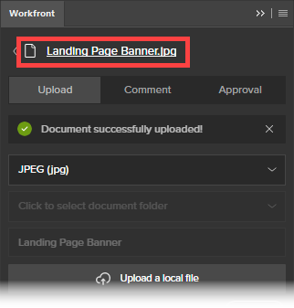

# Uso de la extensión de Workfront para Illustrator e InDesign

<!--Audited: 01/2024-->

>[!IMPORTANT]
>
>Estamos reemplazando la extensión de Workfront para Illustrator e InDesign por [complementos de Creative Cloud actualizados](/help/quicksilver/workfront-integrations-and-apps/adobe-workfront-for-creative-cloud/wf-cc-install-toc.md). A partir de finales de 2022, esta extensión dejará de recibir soporte y estará disponible tal cual.

Se puede utilizar la extensión de Workfront para exportar a Workfront el contenido digital que guarde y cree en Adobe Illustrator y Adobe InDesign. Esto acelera el proceso de revisión y aprobación de documentos.

La extensión de Workfront es compatible con Adobe Creative Cloud 2017 y versiones posteriores en las siguientes aplicaciones:

* InDesign
* Illustrator
* Photoshop

  >[!NOTE]
  >
  >Se recomienda usar el nuevo complemento de [Adobe Workfront para Photoshop](/help/quicksilver/workfront-integrations-and-apps/adobe-workfront-for-creative-cloud/wf-cc-install-ps.md).

## Requisitos de acceso

+++ Expanda para ver los requisitos de acceso para la funcionalidad en este artículo.

<table style="table-layout:auto"> 
 <col> 
 <col> 
 <tbody> 
  <tr> 
   <td role="rowheader">paquete de Adobe Workfront</td> 
   <td> 
Cualquiera

 </td> 
  </tr> 
  <tr data-mc-conditions=""> 
   <td role="rowheader">Licencia de Adobe Workfront</td> 
   <td> 
      
Estándar
 
   
Trabajo o superior

</td> 
  </tr> 
  <tr> 
   <td role="rowheader">Productos adicionales</td> 
   <td>Debe tener una licencia de Adobe Creative Cloud además de una licencia de Workfront.</td> 
  </tr> 
  <tr> 
   <td role="rowheader">Permisos de objeto</td> 
   <td> 
Edite el acceso al objeto con el que desea interactuar.
  </td> 
  </tr> 
 </tbody> 
</table>

Para obtener más información, consulte [Requisitos de acceso en la documentación de Workfront](/help/quicksilver/administration-and-setup/add-users/access-levels-and-object-permissions/access-level-requirements-in-documentation.md).

+++

## Inicie sesión en la extensión de Workfront desde Illustrator o InDesign. {#log-in-to-workfront-extension-from-illustrator-or-indesign}

Cuando se inicia sesión en Workfront desde una de las aplicaciones de Adobe compatibles, se inicia sesión en todas las aplicaciones de Adobe compatibles.

1. Vaya a la aplicación de Adobe donde desee utilizar la extensión de Workfront.

   Para obtener una lista de formatos compatibles con cada aplicación compatible, consulte [Formatos de archivo exportados compatibles](#supported-exported-file-formats) en este artículo.

1. Haga clic en **Ventana** > **Extensiones** > Workfront.

1. (Opcional) Arrastre el panel de Workfront a la posición en la que desea que se muestre en la aplicación de Adobe.
1. Siga las indicaciones para iniciar sesión en Workfront.

   >[!NOTE]
   >
   >* Workfront se conecta a Adobe Creative Cloud mediante OAuth 2.0, un estándar seguro utilizado por la mayoría de las integraciones basadas en la web para la autenticación y autorización de usuarios.
   >* Cuando se le pida introducir el [dominio u host] de su cuenta de Workfront, escríbalo en este formato: `yourCompany'sDomain.my.workfront.com`. El dominio de su empresa suele ser el nombre de su empresa.

   Si el proyecto se encuentra en el estado de actual, se mostrará una lista con los elementos de trabajo que tiene asignados. Si no se muestra una lista, inicie sesión en Workfront.

   Las tareas personales se enumeran en **Sin proyecto**.

## Carga de un archivo a un proyecto, tarea o problema de Workfront {#upload-a-file-to-a-workfront-project-task-or-issue}

Puede cargar un archivo desde el sistema de archivos de su equipo o exportar un archivo que tenga abierto en esos momentos en una aplicación de Adobe Creative Cloud a un proyecto, tarea o problema de Workfront. 

Tenga en cuenta lo siguiente al cargar o exportar un archivo desde Adobe Creative Cloud:

* Su nivel de acceso debe permitirle la carga de documentos en Workfront. Para obtener más información, consulte [Conceder acceso a documentos](../../administration-and-setup/add-users/configure-and-grant-access/grant-access-documents.md).
* Se deben tener permisos para cargar documentos en el elemento en el que desee cargarlos. Para obtener más información, consulte [Información general sobre los permisos de uso compartido en objetos](../../workfront-basics/grant-and-request-access-to-objects/sharing-permissions-on-objects-overview.md).
* El archivo se carga en el área Documentos del objeto de Workfront que se seleccione.
* No se puede exportar un documento al área Documentos del menú principal  desde una aplicación de Adobe Creative Cloud.

Las siguientes secciones explican lo siguiente:

* [Cargar un archivo](#upload-a-file)
* [Exportar un archivo abierto actualmente en Illustrator o InDesign](#export-a-file-currently-open-in-illustrator-or-indesign)
* [Cargar una nueva versión de un archivo desde Illustrator o InDesign](#upload-a-new-version-of-a-file-from-illustrator-or-indesign)

### Cargar un archivo {#upload-a-file}

Es posible cargar los archivos en un proyecto, tarea o problema sin salir de la aplicación de Adobe Creative Cloud.

1. Si no ve la extensión de Workfront al abrir la aplicación de Adobe Creative Cloud, haga clic en **Ventana** > **Extensiones** > **Workfront**.

   Si el proyecto se encuentra en estado actual, se mostrará una lista de los elementos de trabajo que se le hayan asignado. Si no se muestra una lista, inicie sesión en Workfront.

   Las tareas personales se muestran en **Sin proyecto**.

1. Haga clic en el nombre del proyecto, tarea o problema en el que quiera cargar el archivo.

   Para buscarlo, escriba el nombre en el cuadro **Buscar** y seleccione **Proyecto**, **Tarea** o **Problema** en el menú desplegable de la derecha del cuadro **Buscar**. Si el nombre del elemento de trabajo no aparece en la lista, presione **Intro** para buscar todos los elementos de Workfront a los que tiene acceso de visualización.

1. Haga clic en **Seleccionar** en la esquina inferior derecha de la extensión de Workfront.
1. En el menú desplegable **Haga clic para seleccionar el formato**, haga clic en el formato en el que desea guardar el archivo en Workfront.

   Para obtener una lista de formatos compatibles con cada aplicación compatible, consulte [Formatos de archivo exportados compatibles](#supported-exported-file-formats) en este artículo.

1. (Condicional) Si el elemento de trabajo donde desea cargar el archivo tiene carpetas de documentos, seleccione una carpeta de documentos en el campo **Haga clic para seleccionar una carpeta de documentos** y, a continuación, haga clic en **Seleccionar**.

1. Haga clic en **Cargar un archivo local**.
1. En el cuadro **Abrir archivo**, busque el archivo en su sistema de archivos y haga clic en **Abrir**.

1. (Opcional) Escriba un nuevo nombre para el archivo.

   

1. Haga clic en **Cargar**.

   En Workfront, el documento ahora aparece en el área Documentos del proyecto, tarea o problema seleccionado.

1. (Opcional) Haga clic en el nombre del documento para abrir su página de detalles del documento en Workfront.

   Workfront se abre en una nueva pestaña del explorador.

### Exportar un archivo abierto actualmente en Illustrator o InDesign {#export-a-file-currently-open-in-illustrator-or-indesign}

1. En una aplicación de Adobe Creative Cloud compatible, abra un archivo que desee exportar a Workfront.
1. Si no se muestra la extensión de Workfront, haga clic en **Ventana** > **Extensiones** > **Workfront**.

   Si el proyecto se encuentra en estado actual, se mostrará una lista de los elementos de trabajo que se le hayan asignado. Si no se muestra una lista, inicie sesión en Workfront.

   Las tareas personales se enumeran en **Sin proyecto**.

1. Haga clic en el nombre del proyecto, tarea o problema al que desea exportar el archivo.

   Para buscarlo, escriba el nombre en el cuadro **Buscar** y seleccione **Proyecto**, **Tarea** o **Problema** en el menú desplegable situado a la derecha del cuadro **Buscar**. Si el nombre del elemento de trabajo no aparece en la lista, presione **Intro** para buscar todos los elementos de Workfront a los que tiene acceso de visualización.

1. En el menú desplegable **Haga clic para seleccionar el formato**, haga clic en el formato en el que desea guardar el archivo en Workfront.

   Para obtener una lista de formatos compatibles con cada aplicación compatible, consulte [Formatos de archivo exportados compatibles](#supported-exported-file-formats) en este artículo.

1. (Condicional) Si el elemento de trabajo donde desea cargar el archivo tiene carpetas de documentos, seleccione una carpeta de documentos en el campo **Haga clic para seleccionar una carpeta de documentos** y, a continuación, haga clic en **Seleccionar**.
1. (Opcional) Para cambiar el nombre del documento, haga clic en el nombre del documento y escriba un nombre nuevo.

   

1. Haga clic en **Exportar**.

   Aparecerá un mensaje para confirmar que el documento se ha exportado correctamente a Workfront.

   En Workfront, el documento se muestra en el área Documentos del objeto especificado en Workfront.

1. (Opcional) Haga clic en el nombre del documento para acceder a él en Workfront.

   

   Workfront se abre en una nueva pestaña del explorador.

### Cargar una nueva versión de un archivo desde Illustrator o InDesign {#upload-a-new-version-of-a-file-from-illustrator-or-indesign}

1. Si desea exportar un archivo en el que esté trabajando en una aplicación de Adobe compatible como una nueva versión de un archivo en Workfront, abra el archivo en la aplicación de Adobe.
1. Si no se muestra la extensión de Workfront, haga clic en **Ventana** > **Extensiones** > **Workfront**.

   Si el proyecto se encuentra en estado actual, se muestra una lista de los elementos de trabajo que tenga asignados. Si no se muestra una lista, inicie sesión en Workfront.

   Las tareas personales se enumeran en **Sin proyecto**.

1. Haga clic en el nombre del proyecto, tarea o problema en el que se muestre el documento existente.

   Para buscarlo, escriba el nombre en el cuadro **Buscar** y seleccione **Proyecto**, **Tarea** o **Problema** en el menú desplegable de la derecha del cuadro **Buscar**. Si el nombre del elemento de trabajo no apareciera en la lista, presione **Entrar** para buscar todos los elementos de Workfront a los que tenga acceso de visualización.

   Todos los documentos cargados en proyectos, tareas o problemas se muestran en una lista, independientemente de si se cargaron desde la aplicación de Adobe.

1. En el menú desplegable **Haga clic para seleccionar el formato** y en el formato en el que quiera guardar el archivo en Workfront.

   Esto es necesario en caso de exportar un archivo que haya abierto en la aplicación de Adobe. Para obtener una lista de los formatos compatibles con cada aplicación compatible, consulte [Formatos de archivo de exportación compatibles](#supported-exported-file-formats) en este artículo.

1. En caso de exportar un archivo que abrió en la aplicación de Adobe como una nueva versión del documento de Workfront seleccionado, haga clic en **Exportar**.

   O

   Si desea cargar un archivo del sistema de archivos del equipo como una nueva versión del documento de Workfront seleccionado, haga clic en **Cargar un archivo local**, busque el archivo en el cuadro que aparezca, haga clic en **Abrir** y, a continuación, haga clic en **Cargar**.

1. (Opcional) Haga clic en el nombre del documento para ver su nueva versión en Workfront.

   >[!NOTE]
   >
   >El nombre del documento en Workfront se rellena de forma predeterminada y no se puede editar. Tampoco cambia el nombre del archivo que se cargue o exporte como una nueva versión.
   >
   >
   >

## Comentarios en documentos de Workfront desde Illustrator o InDesign {#comment-on-a-workfront-document-from-illustrator-or-indesign}

Es posible añadir comentarios directamente a un documento de Workfront dentro de una aplicación de Adobe. En Workfront, los comentarios se mostrarán en el área de Actualizaciones del documento y en el área de Actualizaciones del elemento de Workfront donde se guarde el documento.

1. Abra una de las aplicaciones de Adobe compatibles.
1. Si no se mostrase la extensión de Workfront, haga clic en **Ventana** > **Extensiones** > **Workfront**.

   Si el proyecto se encuentra en estado actual, se muestra una lista de los elementos de trabajo que tenga asignados. Si no se muestra una lista, inicie sesión en Workfront.

   Las tareas personales se enumeran en **Sin proyecto**.

1. Haga clic en el proyecto, tarea o problema en el que se muestre el documento existente.

   Para buscarlo, escriba el nombre en el cuadro **Buscar** y seleccione **Proyecto**, **Tarea** o **Problema** en el menú desplegable de la derecha del cuadro **Buscar**. Si el nombre del elemento de trabajo no apareciera en la lista, presione **Entrar** para buscar todos los elementos de Workfront a los que tenga acceso de visualización.

1. Haga clic en el nombre del documento existente y luego en **Seleccionar**, en la esquina inferior derecha de la extensión de Workfront.
1. Haga clic en la pestaña **Comentario** y, a continuación, escriba la actualización en el cuadro.

1. (Opcional) Para incluir a otros usuarios o equipos de Workfront en el comentario, empiece a escribir el nombre de un usuario o equipo en el cuadro **Notificar a personas o equipos** y, a continuación, haga clic sobre el nombre cuando aparezca en la lista desplegable.
1. (Opcional) Para solicitar la aprobación del documento, seleccione **Realizar una solicitud de aprobación**.
1. Haga clic en **Actualizar**.

   Se publica una actualización en la pestaña Actualizaciones del documento. A aquellos usuarios de Workfront a los que se les incluya en el comentario recibirán una notificación en la aplicación y, según la configuración de Workfront, también podrían recibir una notificación por correo electrónico.

   Para obtener más información sobre las notificaciones en Workfront, consulte [Visualización y administración de notificaciones en la aplicación](../../workfront-basics/using-notifications/view-and-manage-in-app-notifications.md).

   Para obtener más información sobre cómo recibir notificaciones por correo electrónico, consulte [Notificaciones de Adobe Workfront](../../workfront-basics/using-notifications/wf-notifications.md).

## Solicitar la aprobación de documentos desde Illustrator o a InDesign

Es posible solicitar la aprobación de documentos de Workfront directamente desde las aplicaciones de Adobe.

Solicite la aprobación de documentos a las siguientes entidades:

* Usuarios de Workfront
* Usuarios externos sin una cuenta de Workfront

Solicite la aprobación de documentos a partir de una solicitud de Adobe de las siguientes maneras:

* Adjuntando un aprobador al documento.
* Al comentar un documento, notificar a la persona cuando se realice un comentario y adjuntarla como aprobador al documento.

  Para obtener información sobre cómo solicitar aprobaciones al comentar documentos, consulte la sección [Comentarios en documentos de Workfront desde Illustrator o InDesign](#comment-on-a-workfront-document-from-illustrator-or-indesign) en este artículo.

Para solicitar aprobaciones de documentos desde solicitudes de Adobe:

1. Abra una de las aplicaciones de Adobe compatibles.
1. Si no se mostrase la extensión de Workfront, haga clic en **Ventana** > **Extensiones** > **Workfront**.

   Si el proyecto se encuentra en estado actual, se muestra una lista de los elementos de trabajo que tenga asignados. Si no se muestra una lista, inicie sesión en Workfront.

   Las tareas personales se enumeran en **Sin proyecto**.

1. Haga clic en el proyecto, tarea o problema en el que aparezca el documento existente y, a continuación, haga clic en el nombre del documento existente.

   Para buscarlo, escriba el nombre en el cuadro **Buscar** y seleccione **Proyecto**, **Tarea** o **Problema** en el menú desplegable de la derecha del cuadro **Buscar**. Si el nombre del elemento de trabajo no apareciera en la lista, presione **Entrar** para buscar todos los elementos de Workfront a los que tenga acceso de visualización.

1. Haga clic en el nombre del documento existente y luego en **Seleccionar**, en la esquina inferior derecha de la extensión de Workfront.
1. Haga clic en la pestaña **Aprobación**.
1. Para añadir a un aprobador, en el cuadro **Empiece a escribir un nombre**, realice una de las siguientes acciones:

   * Escriba el nombre de un aprobador y selecciónelo cuando aparezca en la lista.

     

   * Escriba la dirección de correo electrónico de un usuario externo.

1. Haga clic en **Solicitar aprobación**.

   A aquellos usuarios de Workfront a los que se les incluya en el comentario o que se les añada como aprobadores recibirán una notificación en la aplicación y, según la configuración de Workfront, también podrían recibir una notificación por correo electrónico.\
   Los usuarios externos recibirán una notificación por correo electrónico desde donde podrán tomar una decisión sobre la aprobación.

   Para obtener información sobre las notificaciones en Workfront, consulte [Visualización y administración de notificaciones en la aplicación](../../workfront-basics/using-notifications/view-and-manage-in-app-notifications.md). Para obtener información sobre cómo recibir notificaciones por correo electrónico, consulte [Notificaciones de Adobe Workfront](../../workfront-basics/using-notifications/wf-notifications.md).

## Generación de pruebas desde Illustrator o InDesign {#generate-a-proof-from-illustrator-or-indesign}

Si su organización utiliza plantillas de flujo de trabajo automatizado, genere pruebas para documentos que cree en aplicaciones de Adobe sin salir de ellas. Para obtener información sobre cómo crear pruebas, consulte [Creación de pruebas](../../review-and-approve-work/proofing/creating-proofs-within-workfront/create-proofs-in-wf.md). Para obtener información acerca de las plantillas de flujo de trabajo automatizado, consulte [Plantillas de flujo de trabajo automatizado](../../review-and-approve-work/proofing/proofing-overview/automated-workflow.md#automate) en [Información general sobre flujos de trabajo automatizados](../../review-and-approve-work/proofing/proofing-overview/automated-workflow.md).

1. Abra una de las aplicaciones de Adobe compatibles.
1. Si no se mostrase la extensión de Workfront, haga clic en **Ventana** > **Extensiones** > Workfront.

   Si el proyecto se encuentra en estado actual, se muestra una lista de los elementos de trabajo que tenga asignados. Si no se muestra una lista, inicie sesión en Workfront.

   Las tareas personales se muestran en **Sin proyecto**.

1. Si el documento ya se cargó en Workfront, seleccione el proyecto, tarea o problema en la extensión de Workfront donde aparezca el documento y, a continuación, haga clic en el nombre del mismo.

   O

   Cargue un documento de Adobe a un objeto de Workfront, tal y como se describe en la sección [Carga de archivos a proyectos, tareas o problemas de Workfront](#upload-a-file-to-a-workfront-project-task-or-issue) de este artículo y, a continuación, haga clic en el nombre del documento.

1. En el menú desplegable **Haga clic para seleccionar el formato** y haga clic en el formato en el que quiera guardar el archivo en Workfront.

   Algunos formatos no están disponibles después de habilitar la funcionalidad de revisión en el paso siguiente. Para obtener más información, consulte [Formatos de archivo de exportación compatibles](#supported-exported-file-formats) en este artículo.

1. Haga clic en **Cargar como prueba nueva** para habilitarla.
1. Seleccione la **plantilla de flujo de trabajo** que quiera que usen los usuarios cuando revisen el documento.

   El administrador de Workfront configura las plantillas de flujo de trabajo automatizado, tal y como se describe en [Crear y administrar plantillas de flujo de trabajo automatizado](/help/quicksilver/administration-and-setup/manage-workfront/configure-proofing/create-manage-automated-workflow-templates.md). Si tuviera alguna pregunta, consulte con el administrador.

   1. Añada al menos un **Nuevo destinatario** a cada fase de la plantilla del flujo de trabajo.

      Empiece a escribir un nombre y selecciónelo cuando lo vea en la lista desplegable que aparezca.

   1. Especifique la **Función de prueba** y la frecuencia de las **alertas por correo electrónico** para cada destinatario que añada.

   1. (Opcional) En la sección **Notificaciones por correo electrónico**, seleccione si desea enviar una notificación por correo electrónico con un mensaje personalizado opcional sobre la prueba a todos los destinatarios de la prueba que añadió.

1. Haga clic en **Crear prueba**.

   Es posible visualizar el progreso del proceso de creación de la prueba. Aparece una alerta cuando se ha terminado de generar. Puede abrir la tarea en la que creó la prueba y que aparece en la lista.

## Cargar nuevas versiones de una prueba sin salir de Illustrator o InDesign

1. Haga clic en un documento existente que tenga una prueba y, a continuación, haga clic en **Seleccionar**, en la esquina inferior derecha.
1. Haga clic en **Cargar como nueva versión de prueba** para habilitarla.
1. (Opcional) Seleccione la **Plantilla de flujo de trabajo** que quiera que las personas usen cuando revisen la nueva versión.

   Si no selecciona una plantilla diferente, la plantilla seleccionada para la versión anterior permanecerá en vigor. Además, si modificó la plantilla para la versión anterior, los cambios estarán vigentes para la nueva versión.

   El administrador de Workfront configura las plantillas de flujo de trabajo automatizado, tal y como se describe en [Creación y administración de plantillas de flujo de trabajo automatizado](/help/quicksilver/administration-and-setup/manage-workfront/configure-proofing/create-manage-automated-workflow-templates.md). Si tuviera alguna pregunta, consulte con el administrador.

   1. Añada al menos un **Nuevo destinatario** a cada fase de la plantilla del flujo de trabajo.

      Empiece a escribir un nombre y selecciónelo cuando lo vea en la lista desplegable que aparezca.

   1. Especifique la **Función de prueba** y la frecuencia de las **alertas por correo electrónico** para cada destinatario que añada.
   1. (Opcional) En la sección **Notificación por correo electrónico**, seleccione si desea enviar una notificación por correo electrónico con un mensaje personalizado opcional sobre la prueba a todos los destinatarios de la prueba que añadió.

1. Haga clic en **Crear nueva versión de prueba**.

   Puede ver el progreso del proceso de creación de la prueba. Aparece una alerta cuando se ha terminado de generar. Puede abrir la tarea en la que creó la prueba y que aparece en la lista.

## Cierre de la sesión de la extensión de Workfront

1. En la aplicación de Adobe, haga clic en **Ventana** > **Extensiones** > **Workfront**.

1. Haga clic en el menú **Más**  en la esquina superior derecha del panel.

1. (Opcional) Haga clic en **Comentarios** para abrir una encuesta breve y enviar a Workfront sus comentarios sobre Workfront para Adobe Creative Cloud.
1. Haga clic en **Cerrar sesión**.\
   Se muestra la pantalla de Inicio de sesión. Para obtener información sobre cómo iniciar sesión, consulte [Iniciar sesión en la extensión de Workfront desde Illustrator o InDesign](#log-in-to-workfront-extension-from-illustrator-or-indesign) en este artículo.

## Formatos de archivo exportados no compatibles {#supported-exported-file-formats}

* [Formatos de archivo exportados compatibles para Adobe InDesign](#supported-exported-file-formats-for-adobe-indesign)
* [Formatos de archivo exportados compatibles con Adobe Illustrator](#supported-exported-file-formats-for-adobe-illustrator)

### Formatos de archivo exportados compatibles para Adobe InDesign  {#supported-exported-file-formats-for-adobe-indesign}

Workfront admite los siguientes formatos de archivo al exportar un archivo de InDesign a Workfront:

* EPS: Encapsulated PostScript
* EPUB: publicación electrónica de diseño fijo
* EPUB: publicación electrónica de diseño ajustable &#42;
* HTML: lenguaje de marcado de hipertexto
* IDML: lenguaje de marcado de InDesign &#42;
* JPG, JPEG: grupo mixto de expertos fotográficos
* PDF: formato de documento portátil de Adobe
* PNG: Portable Network Graphics
* SWF: Flash Player &#42;
* XML: lenguaje de marcado extensible &#42;

&#42; Este formato de archivo no está disponible cuando la opción **Cargar una nueva prueba** está habilitada (para obtener información acerca de esta opción, vea [Generar una prueba desde Illustrator o InDesign](#generate-a-proof-from-illustrator-or-indesign) en este artículo). Si este formato de archivo ya está seleccionado antes de habilitar la opción **Cargar una nueva prueba**, el sistema cambia el formato de archivo a PDF. Se puede seleccionar un formato diferente de la lista.

### Formatos de archivo exportados compatibles para Adobe Illustrator  {#supported-exported-file-formats-for-adobe-illustrator}

Workfront admite los siguientes formatos de archivo al exportar un archivo de Illustrator a Workfront:

* DWG: dibujo de AutoCAD, archivo de intercambio de AutoCAD &#42;
* JPG, JPEG: grupo mixto de expertos fotográficos
* PNG: Portable Network Graphics
* PSD: documento de Photoshop
* SWF: Flash Player &#42;
* TIFF: Tagged Image File Format

&#42; Este formato de archivo no está disponible cuando la opción **Cargar una nueva prueba** está habilitada (para obtener información acerca de esta opción, vea [Generar una prueba desde Illustrator o InDesign](#generate-a-proof-from-illustrator-or-indesign) en este artículo). Si este formato de archivo ya está seleccionado antes de habilitar la opción **Cargar una nueva prueba**, el sistema cambia el formato de archivo a PNG. Se puede seleccionar un formato diferente de la lista.
