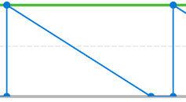

# Ver la visualización de evolución en Análisis mejorado

>[!IMPORTANT]
>
>El análisis mejorado se eliminará de Workfront la semana del 26 de mayo. Workfront Data Connect es una nueva solución alternativa que se puede utilizar para replicar las visualizaciones de Analytics mejoradas que utilice actualmente.  Consulte la guía de [Desaprobación mejorada de Analytics](/help/quicksilver/product-announcements/announcements/enhanced-analytics-deprecation.md) para obtener más información.

<!-- Audited: 12/2023 -->

La visualización de evolución muestra la evolución de un proyecto específico a lo largo del tiempo y le ayuda a comprender la relación entre la condición del proyecto, la velocidad y las horas o días restantes.

## Requisitos de acceso

Debe tener el siguiente acceso para realizar los pasos de este artículo:

<table style="table-layout:auto"> 
 <col> 
 <col> 
 <tbody> 
  <tr> 
   <td role="rowheader">Plan de Adobe Workfront</td> 
   <td>
      
Nuevo: cualquiera

      
o

      
Actual: empresa o superior
</td>
  </tr> 
  <tr> 
   <td role="rowheader">Licencia de Adobe Workfront</td> 
   <td>
      
Nuevo: Light o superior

      
o

      
Actual: revisión o superior

   </td> 
  </tr> 
  <tr> 
   <td role="rowheader">Configuraciones de nivel de acceso</td> 
   <td> 
Ver acceso a proyectos
 </td> 
  </tr> 
  <tr> 
   <td role="rowheader">Permisos de objeto</td> 
   <td> 
Ver
 </td>
  </tr> 
 </tbody> 
</table>

Para obtener más información sobre el contenido de esta tabla, consulte [Requisitos de acceso en la documentación de Workfront](/help/quicksilver/administration-and-setup/add-users/access-levels-and-object-permissions/access-level-requirements-in-documentation.md).

## Requisitos previos

Para conocer los requisitos previos para usar el análisis mejorado, consulte la sección “Requisitos previos” en [Información general de Análisis mejorado](../enhanced-analytics/enhanced-analytics-overview.md).

## Comprender la visualización de evolución

La línea azul continua muestra la velocidad planificada desde la fecha de inicio hasta la fecha planificada de finalización. Esta línea se ajusta a medida que se añade, quita o actualiza el trabajo, y cambia a una línea vertical discontinua cuando el proyecto alcanza la fecha planificada de finalización.

La línea real muestra el número de horas, o días, empleados en el proyecto a lo largo del tiempo. El color de esta línea indica la condición del proyecto cada día:

* **Verde**: el proyecto está en el destino.

  

* **Naranja**: el proyecto está en riesgo.

  

* **Rojo**: el proyecto tiene problemas.

  

Para obtener más información sobre estas condiciones del proyecto, consulte [Información general sobre la condición del proyecto y el tipo de condición](../manage-work/projects/manage-projects/project-condition-and-condition-type.md).

Cuando la línea real se mueve verticalmente hacia arriba, significa que se ha añadido trabajo al proyecto. Cuando la línea se desplaza verticalmente hacia abajo, significa que se ha eliminado o completado cierto trabajo del proyecto.

Debajo del eje x de la visualización, puede ver más información sobre cómo las tareas y las horas, o los días, cambiaron en un día determinado (la cantidad añadida, la cantidad completada y la diferencia entre ambas).

Ver toda esta información en la visualización de evolución le ayuda a determinar:

* El estado del proyecto individual a lo largo del tiempo
* Cómo afectan al trabajo planificado los problemas (o el trabajo no planificado) que se presentan.
* Qué eventos ampliaron el proyecto más allá de la fecha de finalización original.

Para aprender cómo obtener los mejores datos para esta visualización, consulte [Información general de Análisis mejorado](../enhanced-analytics/enhanced-analytics-overview.md).

## Ver la visualización de evolución

{{step1-to-analytics}}

1. (Opcional) Para utilizar un intervalo de fecha diferente, seleccione nuevas fechas de inicio y finalización en el filtro de intervalo de fecha.

   

   Para obtener información sobre el uso del filtro de intervalo de fechas, consulte [Aplicar filtros en Análisis mejorado](../enhanced-analytics/use-enhanced-analytics-filters.md).

1. (Condicional) Si necesita limitar el conjunto de datos del proyecto, seleccione y aplique los filtros que desea utilizar.

   Para obtener más información sobre cómo añadir filtros en Análisis mejorado, consulte [Aplicar filtros en Análisis mejorado](../enhanced-analytics/use-enhanced-analytics-filters.md).

   Después de añadir filtros, se muestran los datos de hasta 50 proyectos y los filtros permanecen activos incluso después de salir de la página o cerrar la sesión de Workfront.

1. (Opcional) Para ampliar un intervalo de fechas, seleccione un punto en la visualización para el inicio del intervalo de fechas y arrástrelo hasta el final del intervalo de fechas.

   Todas las demás visualizaciones se actualizan al mismo intervalo de fechas y se crea automáticamente un filtro de periodo de tiempo.

   

1. En la visualización Plan en curso o el diagrama de árbol del Proyecto, haga clic en un proyecto para ver más información.

   Se muestran las visualizaciones Evolución y Tareas en curso.

   >[!NOTE]
   >
   >Para obtener más información sobre estas otras visualizaciones, consulte:
   >
   >   * [Ver la visualización del plan en curso en el análisis mejorado](../enhanced-analytics/flight-plan-overview.md)
   >   * [Ver la visualización del diagrama de árbol del proyecto en el análisis mejorado](../enhanced-analytics/project-treemap-overview.md)
   >   * [Ver la visualización de las tareas en curso en el Análisis mejorado](../enhanced-analytics/tasks-in-flight-overview.md)
   >

1. (Opcional) Cambie la vista de horas planificadas a **duration**.

   Las horas planificadas están seleccionadas de forma predeterminada.

   >[!NOTE]
   >
   >Si se selecciona **duración**, toda la información de horas se cambia a días.\
   >\
   >Para obtener más información acerca de la duración en el área de Análisis mejorado, consulte la sección “Vista de la duración” en [Información general sobre el Análisis mejorado](../enhanced-analytics/enhanced-analytics-overview.md#duration-view).

1. Haga clic en cualquier punto del gráfico de líneas.

   Se muestra la fecha exacta y más información sobre las tareas y las horas (o días) del día seleccionado debajo del gráfico.

   

   >[!NOTE]
   >
   >Si la velocidad real es una línea plana que se ejecuta a lo largo del eje x (en línea con 0 horas o 0 días) de la visualización, significa que no se añadieron horas planificadas (o días) al proyecto.\
   >Si la velocidad real es una línea plana por encima del eje x (en línea con un número de horas o de días) que nunca desciende, significa que no se completó ninguna tarea dentro del período de tiempo filtrado.

1. (Opcional) Para exportar los datos de visualización, haga clic en el icono **Exportar**  en la esquina superior derecha de la visualización y seleccione el formato de exportación:

   * Gráfico (PNG)
   * Tabla de datos (XLSX)

1. (Opcional) Para ver detalles sobre el progreso de las tareas en el proyecto seleccionado, observe la visualización Tareas en curso que aparece debajo de la visualización de la evolución. Para obtener más información, consulte [Ver la visualización de las tareas en curso en el análisis mejorado](/help/quicksilver/enhanced-analytics/tasks-in-flight-overview.md).
