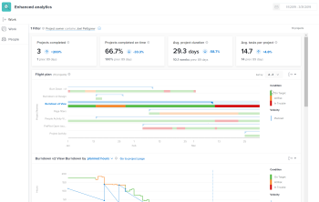

# Resumen de análisis mejorado

>[!IMPORTANT]
>
>El análisis mejorado se eliminará de Workfront la semana del 26 de mayo. Workfront Data Connect es una nueva solución alternativa que se puede utilizar para replicar las visualizaciones de Analytics mejoradas que utilice actualmente. <br>Consulte la guía de [Desaprobación mejorada de Analytics](/help/quicksilver/product-announcements/announcements/enhanced-analytics-deprecation.md) para obtener más información.


El análisis mejorado es una potente herramienta en Adobe Workfront con visualizaciones prediseñadas que le permite ver los datos del proyecto e identificar las tendencias con la planificación y la finalización. Esta perspectiva de sus proyectos le ayuda a administrar el trabajo actual y le permite planificar con mayor precisión el trabajo futuro.

Los análisis mejorados pueden ayudarle a identificar lo siguiente:

* La forma en que planifica los proyectos
* Cuando se agregue trabajo a los proyectos
* Cantidad de trabajo que se está completando para diferentes proyectos
* Cantidad de horas o días necesarios para completar un proyecto en comparación con las horas o días que está programado un equipo de inicio
* La frecuencia con la que los usuarios completan acciones específicas durante un proyecto
* El progreso de los proyectos, así como las tareas individuales dentro de un proyecto



Para ver casos de uso o obtener más información sobre la administración del trabajo actual y la planificación del trabajo futuro con el análisis mejorado, consulte [Rutas de aprendizaje de análisis mejorado](https://one.workfront.com/s/enhanced-analytics-program).

## Requisitos previos

Para acceder al área de Análisis mejorado, debe:

* Tener un plan empresarial o de negocios.

  Para obtener más información, consulte [Planes de Workfront](https://www.workfront.com/plans).

* Pida al administrador de Workfront que añada análisis mejorados a la plantilla de diseño.

  Para obtener más información, consulte [Análisis mejorado: agregar análisis a plantillas de diseño](https://one.workfront.com/s/managed-content-videos/enhanced-analytics-adding-analytics-to-layout-templates-MCH7URDSIXRREHHHF7TRTYYP2LTE).

Para ver información de proyectos y tareas, debe:

* Tener permiso de visualización en las áreas Proyectos y Tareas de su nivel de acceso.

  Para obtener información sobre cómo un administrador de Workfront puede modificar su nivel de acceso, consulte [Crear o modificar niveles de acceso personalizados](../administration-and-setup/add-users/configure-and-grant-access/create-modify-access-levels.md).

* Tener permiso de visualización para tareas o proyectos específicos.

  Para obtener información sobre cómo solicitar acceso adicional, consulte [Solicitar acceso a objetos ](../workfront-basics/grant-and-request-access-to-objects/request-access.md).

## Prácticas recomendadas para el análisis mejorado

Para obtener los mejores datos para sus proyectos, utilice plantillas que tengan horas planificadas y días de duración precisos. También debe asegurarse de que los usuarios introducen y actualizan los campos a continuación con la mayor precisión posible.

>[!NOTE]
>
>Algunos de los siguientes campos son cálculos que Workfront realiza basándose en la información que introducen los usuarios. Estos campos no se pueden actualizar manualmente.

* Horas planificadas

  Este es el campo más importante que se debe rellenar.

  >[!NOTE]
  >
  >Si sus equipos no utilizan las horas planificadas, aún puede ver algunos datos en función de la duración del proyecto.\
  >Para obtener más información, consulte la sección [Vista de duración](#duration-view) en este artículo.

* Nombre del proyecto

  El nombre debe ser descriptivo del proyecto.

* Condición del proyecto
* Estado del proyecto
* Fecha de inicio planificada del proyecto
* Fecha planificada de finalización
* Fecha de inicio real del proyecto
* Fecha de finalización real predeterminada
* Horas de duración del proyecto
* Horas reales del proyecto
* Estado de la tarea (esto incluye marcar las tareas como completadas).
* Nombre de la tarea
* Porcentaje completado de la tarea
* Fecha de inicio planificada de la tarea
* Fecha planificada de finalización de la tarea

>[!IMPORTANT]
>
>Los cambios realizados en las tareas y proyectos pueden tardar hasta 24 horas en reflejarse en el análisis mejorado.

## Vista de duración {#duration-view}

De forma predeterminada, las visualizaciones de diagrama de proyecto y evolución se basan en las horas planificadas. Si sus equipos no utilizan las horas planificadas, puede ver estas visualizaciones en función de la duración del proyecto.

En el análisis mejorado, la duración de un proyecto se calcula mediante las siguientes fórmulas:

* Plazo planificado:

  ```
  Planned Completion Date of the project - Start Date of the project
  ```

* Días trabajados:

  ```
  Planned Duration for tasks completed in the selected date range / Typical hours per work day
  ```

  >[!NOTE]
  >
  >8 horas es el número predeterminado de **Horas habituales por día laborable**. Un administrador de Adobe Workfront puede actualizar la configuración de **Horas habituales por día laborable** en **Configuración** > **Preferencias de proyecto** > **Proyectos** > **Escalas de tiempo**.\
  >Para obtener más información, consulte [Configurar las preferencias de proyecto en todo el sistema](../administration-and-setup/set-up-workfront/configure-system-defaults/set-project-preferences.md).

Para obtener información sobre la duración planificada, consulte [Información general sobre la duración del proyecto](../manage-work/projects/planning-a-project/project-duration.md).

## Métodos abreviados del teclado

Puede utilizar las siguientes teclas del teclado para navegar o completar acciones específicas en el área de Análisis mejorado:

| Clave | Acción |
|---|---|
| **Ficha** | Desplácese a cada elemento de la página, así como a una tabla con información sobre cada visualización que no se muestre en la página |
| **Entrar** | Abra el widget de calendario, elimine un filtro existente, abra las opciones de añadir filtro, seleccione o anule la selección de valores de filtro, aplique un filtro que haya creado, abra las opciones de exportación en cada visualización, abra los menús desplegables en las visualizaciones Evolución, Tareas en vuelo y Diagrama de árbol del proyecto |
| **Teclas de dirección** | Navegue hasta las fechas en el widget de calendario, a través de las opciones de filtro al agregar un filtro y a través de las opciones en todos los menús desplegables de las visualizaciones |
| **Barra espaciadora** | Seleccione fechas en el widget de calendario, seleccione un tipo de filtro al añadir un filtro, seleccione una opción de exportación en el menú desplegable de cada visualización y seleccione opciones en los menús desplegables de las visualizaciones Evolución, Tareas en vuelo y Diagrama de árbol del proyecto |

{style="table-layout:auto"}

Si utiliza software de lectura de pantalla o un complemento, el lector de pantalla lee la información en voz alta y describe las acciones que está realizando a medida que utiliza las claves enumeradas anteriormente.

## Vistas y funciones de análisis mejoradas

Para obtener más información sobre los detalles de una función específica dentro del análisis mejorado, las acciones que puede completar para obtener más información y lo que puede aprender de estos datos, consulte los siguientes artículos:

<table style="table-layout:auto"> 
 <col> 
 <col> 
 <thead> 
  <tr> 
   <th>Artículo</th> 
   <th>Explicación</th> 
  </tr> 
 </thead> 
 <tbody> 
  <tr> 
   <td><a href="../enhanced-analytics/use-enhanced-analytics-filters.md" class="MCXref xref">Aplicar filtros en Análisis mejorado</a> </td> 
   <td> <p>Puede aplicar filtros personalizados, filtros de campo de proyecto o filtros de equipo para ver solo los proyectos que se ajusten a criterios específicos. A medida que agrega filtros, el número de proyectos se actualiza en consecuencia.</p> </td> 
  </tr> 
  <tr> 
   <td><a href="../enhanced-analytics/understand-enhanced-analytics-kpis.md" class="MCXref xref">Comprender los KPI de análisis mejorado</a> </td> 
   <td> <p>Los indicadores clave de rendimiento (KPI) de todos los proyectos en un lapso de tiempo específico se encuentran en la parte superior de la pantalla.</p> </td> 
  </tr> 
  <tr> 
   <td> <p><a href="../enhanced-analytics/flight-plan-overview.md" class="MCXref xref">Ver la visualización del plan en curso en el análisis mejorado</a> </p> </td> 
   <td> <p>La visualización <b>Plan de vuelo</b> muestra que la condición ha cambiado durante la duración de un proyecto. La interacción con la visualización le ofrece más detalles sobre fechas específicas. Al seleccionar un proyecto, se abren las visualizaciones Evolución y Tareas en vuelo.</p> </td> 
  </tr> 
  <tr> 
   <td><a href="../enhanced-analytics/burndown-overview.md" class="MCXref xref">Ver la visualización de evolución en Análisis mejorado</a> </td> 
   <td> <p>La visualización <b>Evolución</b> muestra la velocidad planificada de un proyecto en comparación con la cantidad real de horas invertidas en un proyecto. La interacción con la visualización le ofrece más detalles sobre la condición del proyecto en una fecha específica.</p> </td> 
  </tr> 
  <tr> 
   <td><a href="../enhanced-analytics/tasks-in-flight-overview.md" class="MCXref xref">Ver la visualización de las tareas en curso en el Análisis mejorado</a> </td> 
   <td> <p>La visualización <b>Tareas en vuelo</b> muestra el estado de cada tarea dentro de un proyecto. La interacción con la visualización de le permite realizar cambios de forma rápida y sencilla en una tarea.</p> </td> 
  </tr> 
  <tr> 
   <td><a href="../enhanced-analytics/project-activity-overview.md" class="MCXref xref">Ver la visualización de actividades del proyecto en Análisis mejorado</a> </td> 
   <td> <p>La visualización de la <b>actividad del proyecto</b> muestra un mapa de calor del momento en el que los usuarios asignados a un proyecto iniciaron sesión en Workfront, cambiaron el estado de la tarea en ese proyecto y completaron las tareas en ese proyecto. La interacción con la visualización le permite ver estos detalles para cada usuario. También puede ver fechas específicas de estas acciones, así como el número de veces que se completó cada acción.</p> </td> 
  </tr> 
  <tr> 
   <td><a href="../enhanced-analytics/project-treemap-overview.md" class="MCXref xref">Ver la visualización del diagrama de árbol del proyecto en Análisis mejorado</a> </td> 
   <td> <p>La visualización <b>Diagrama de árbol del proyecto</b> muestra cuánto tiempo se ha invertido en algunos proyectos en comparación con otros. La interacción con la visualización le ofrece detalles sobre la condición del proyecto, la finalización planificada del proyecto y la finalización real del proyecto.</p> </td> 
  </tr> 
  <tr> 
   <td><a href="../enhanced-analytics/activity-by-team-overview.md" class="MCXref xref">Ver la visualización Actividad por equipo en Análisis mejorado</a> </td> 
   <td> <p>La visualización <b>Actividad por equipo</b> muestra un mapa de calor del momento en el que los usuarios de un equipo de inicio iniciaron sesión en Workfront, cambiaron el estado de una tarea y completaron una tarea. La interacción con la visualización le permite ver estos detalles para cada usuario individual. También puede ver fechas específicas de estas acciones, así como el número de veces que se completó cada acción.</p> </td> 
  </tr> 
  <!-- Features permanently removed from Workfront
  <tr> 
   <td><a href="../enhanced-analytics/resource-capacity-overview.md" class="MCXref xref">View the Resource capacity visualization in Enhanced analytics</a> </td> 
   <td> <p>The <b>Resource capacity</b> visualization shows you which home teams have the capacity to take on more work and which home teams have more work assigned to them than they can complete. Interacting with the visualization allows you to see more details about work completed and available hours for more work.&nbsp;Selecting a team opens the Team capacity visualization.</p> </td> 
  </tr> 
  <tr> 
   <td><a href="../enhanced-analytics/team-capacity-overview.md" class="MCXref xref">View the Team capacity visualization in Enhanced analytics</a> </td> 
   <td> <p>The <b>Team capacity</b> visualization shows you a percentage of the amount of work a home team has completed out of the amount of work assigned to them. Interacting with the visualization allows you to see scheduled hours and planned hours for a specific date, as well as the capacity percentage and whether the home team was over, under, or at capacity on that day.</p> </td> 
  </tr>--> 
 </tbody> 
</table>
