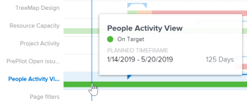

# Visualización del plan en curso en el análisis mejorado

>[!IMPORTANT]
>
>El análisis mejorado se eliminará de Workfront la semana del 26 de mayo. Workfront Data Connect es una nueva solución alternativa que se puede utilizar para replicar las visualizaciones de Analytics mejoradas que utilice actualmente.  Consulte la guía de [Desaprobación mejorada de Analytics](/help/quicksilver/product-announcements/announcements/enhanced-analytics-deprecation.md) para obtener más información.

La visualización del plan en curso muestra cuántos proyectos (dentro de los criterios de filtro aplicados) estaban en curso, qué cambios de estado se produjeron a lo largo de la vida de estos proyectos y en qué medida estos proyectos se ajustaron a sus plazos de finalización previstos.

## Requisitos de acceso

Debe tener lo siguiente:

<table style="table-layout:auto"> 
 <col> 
 <col> 
 <tbody> 
  <tr> 
   <td role="rowheader"><a href="https://www.workfront.com/plans" target="_blank">Plan de Adobe Workfront</a>*</td> 
   <td> 
Business o superior
 </td> 
  </tr> 
  <tr> 
   <td role="rowheader"><a href="../administration-and-setup/add-users/access-levels-and-object-permissions/wf-licenses.md" class="MCXref xref">Información general sobre licencias de Adobe Workfront</a>*</td> 
   <td> 
Revisión o superior
 </td> 
  </tr> 
  <tr> 
   <td role="rowheader">Configuraciones de nivel de acceso*</td> 
   <td> 
Ver acceso a proyectos
 
Nota: Si sigue sin tener acceso, pregunte al administrador de Workfront si ha establecido restricciones adicionales en su nivel de acceso. Para obtener información sobre cómo un administrador de Workfront puede cambiar su nivel de acceso, consulte <a href="../administration-and-setup/add-users/configure-and-grant-access/create-modify-access-levels.md" class="MCXref xref">Crear o modificar niveles de acceso personalizados</a>.
 </td> 
  </tr> 
  <tr> 
   <td role="rowheader">Permisos de objeto</td> 
   <td> 
Acceso de visualización al proyecto
 
Para obtener información sobre cómo solicitar acceso adicional, vea <a href="../workfront-basics/grant-and-request-access-to-objects/request-access.md" class="MCXref xref">Solicitar acceso a los objetos</a>.
 </td> 
  </tr> 
 </tbody> 
</table>

&#42;Para saber qué plan, tipo de licencia o acceso tiene, póngase en contacto con su administrador de Workfront.

## Requisitos previos

Para conocer los requisitos previos para usar el análisis mejorado, consulte la sección “Requisitos previos” en [Información general de Análisis mejorado](../enhanced-analytics/enhanced-analytics-overview.md).

## Comprender la visualización del plan en curso

En la duración real de un proyecto, puede ver únicamente las siguientes condiciones de proyecto:

* Bien encaminado
* En riesgo
* Con problemas

Para obtener más información sobre las condiciones del proyecto, consulte [Información general sobre la condición del proyecto y el tipo de condición](../manage-work/projects/manage-projects/project-condition-and-condition-type.md).

La visualización del plan de vuelo muestra los siguientes detalles del proyecto:

* **Duración planificada**: la línea azul horizontal representa la longitud planificada del proyecto, con los triángulos en cada extremo de la línea que indican la fecha de inicio y de finalización.

  

* **Duración real**: la línea gruesa y de color debajo de la duración planificada representa la duración real del proyecto. El color de la línea cambia según la condición del proyecto en ese momento específico del ciclo de vida del proyecto.

  

* **Condición real**: la línea gruesa y de color también muestra la condición de un proyecto en diferentes momentos. El color de la línea cambia según la condición del proyecto:

   * **Verde**: bien encaminado
   * **Naranja**: en riesgo
   * **Rojo**: con problemas

  

Al pasar el puntero por encima de una fila del proyecto en la visualización Plan de vuelo, puede ver información sobre el periodo de tiempo planificado del proyecto, la condición del proyecto actual y, si procede, la condición personalizada. Para obtener una vista más detallada de lo que puede haber afectado a la duración o condición, puede ver las otras visualizaciones en el área de Análisis mejorado.

Ver esta información le ayuda a determinar lo siguiente:

* Los eventos que desencadenan que un proyecto se extienda más allá de la fecha planificada de finalización.
* Cuándo un proyecto empieza a tener problemas.
* Cuántos proyectos están abiertos durante el mismo período de tiempo.
* Cuántos proyectos están activos.
* Qué proyectos necesitan atención o apoyo extra.

Para obtener más información sobre cómo obtener los mejores datos para esta visualización, consulte [Información general sobre el Análisis mejorado](../enhanced-analytics/enhanced-analytics-overview.md).

## Visualización del Plan de vuelo

1. Haga clic en el icono **Menú principal**  y, a continuación, seleccione **Analytics**.
1. (Opcional) Para utilizar un intervalo de fecha diferente, seleccione nuevas fechas de inicio y finalización en el filtro de intervalo de fecha.

   

   Para obtener más información sobre el uso del filtro de intervalo de fecha, consulte [Aplicar filtros en el Análisis mejorado](../enhanced-analytics/use-enhanced-analytics-filters.md).

1. (Condicional) Si necesita limitar el conjunto de datos del proyecto, seleccione y aplique los filtros que desea utilizar.

   Para obtener más información sobre cómo añadir filtros en Análisis mejorado, consulte [Aplicar filtros en Análisis mejorado](../enhanced-analytics/use-enhanced-analytics-filters.md).

   Después de añadir filtros, se muestran los datos de hasta 50 proyectos y los filtros permanecen activos incluso después de salir de la página o cerrar la sesión de Workfront.

1. (Opcional) Para acercar un intervalo de fecha, seleccione un punto en la visualización para el inicio del intervalo de fecha y arrastre hasta el final del intervalo de fecha.

   Todas las demás visualizaciones se actualizan al mismo intervalo de fecha y se crea un filtro de periodo de tiempo.

   

1. (Opcional) Para cambiar la forma en que se ordenan los proyectos, haga clic en el menú **Ordenar por** en la esquina superior derecha de la visualización Plan de vuelo y, a continuación, seleccione una nueva opción de clasificación:

   * **A - Z**
   * **Z - A**
   * **Fecha planificada de finalización**
   * **Fecha planificada de inicio**

   Todas las demás visualizaciones de la página se actualizarán para coincidir con su selección de ordenación.

1. (Condicional) Si hay más de 50 proyectos en el conjunto de datos, utilice las flechas de la esquina inferior izquierda de la visualización para navegar de un grupo de 50 proyectos al siguiente.

   Todas las demás visualizaciones de la página se actualizarán para coincidir con su selección de página.

   

1. Pase el puntero por encima del gráfico de barras del proyecto para ver la línea de fecha azul y los siguientes detalles:

   * Cronología planificada
   * Condición actual
   * Condición personalizada (si procede)

   

1. (Opcional) Para exportar los datos de visualización, haga clic en el icono **Exportar**  en la esquina superior derecha de la visualización y, a continuación, seleccione el formato de exportación:

   * **Gráfico (PNG)**
   * **Tabla de datos (XLSX)**

1. Para ver más información sobre el proyecto, haga clic en un proyecto de la visualización para abrir las visualizaciones Evolución y Tareas en vuelo.

   Estas visualizaciones pueden ayudarle a conocer la causa que provocó que el proyecto se saliera de la pista. También facilitan el registro en un proyecto en curso.\
   Para obtener más información sobre la visualización de Evolución, consulte [Ver la visualización de Evolución en Análisis mejorado](../enhanced-analytics/burndown-overview.md). Para obtener más información sobre la visualización de Tareas en vuelo, consulte [Ver la visualización de Tareas en vuelo en Análisis mejorado](../enhanced-analytics/tasks-in-flight-overview.md).

