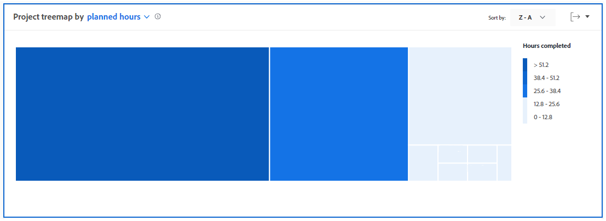
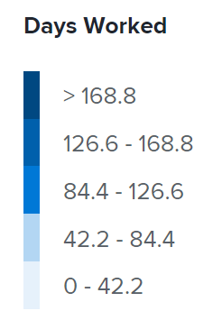

# Vista de la visualización del diagrama de árbol del proyecto en Análisis mejorado

>[!IMPORTANT]
>
>El análisis mejorado se eliminará de Workfront la semana del 26 de mayo. Workfront Data Connect es una nueva solución alternativa que se puede utilizar para replicar las visualizaciones de Analytics mejoradas que utilice actualmente.  Consulte la guía de [Desaprobación mejorada de Analytics](/help/quicksilver/product-announcements/announcements/enhanced-analytics-deprecation.md) para obtener más información.

<!-- Audited: 12/2023 -->

La visualización del diagrama de árbol del proyecto es una vista de las horas (o días) que se han trabajado en una ventana de tiempo específica en comparación con otros esfuerzos laborales en el tamaño. Esto le ayuda a comprender cuánto tiempo han dedicado las personas a un proyecto.

{width="700"}

## Requisitos de acceso

+++ Amplíe para ver los requisitos de acceso.

Debe tener el siguiente acceso para realizar los pasos de este artículo:

<table style="table-layout:auto"> 
 <col> 
 <col> 
 <tbody> 
  <tr> 
   <td role="rowheader"><a href="https://www.workfront.com/plans" target="_blank">Plan de Adobe Workfront</a></td> 
   <td> 
Business o superior
 </td> 
  </tr> 
  <tr> 
   <td role="rowheader"><a href="../administration-and-setup/add-users/access-levels-and-object-permissions/wf-licenses.md" class="MCXref xref">Información general sobre licencias de Adobe Workfront</a></td> 
   <td>   
Nuevo:
 
   <ul><li>Light o superior</li></ul>
   
Actual:

   <ul><li>Revisión o superior</li></ul>
 </td> 
  </tr> 
  <tr> 
   <td role="rowheader">Configuraciones de nivel de acceso</td> 
   <td> 
Ver acceso a proyectos
 <!--
Note: If you still don't have access, ask your Workfront administrator if they set additional restrictions in your access level. For information on how a Workfront administrator can change your access level, see <a href="../administration-and-setup/add-users/configure-and-grant-access/create-modify-access-levels.md" class="MCXref xref">Create or modify custom access levels</a>.
--> </td> 
  </tr> 
  <tr> 
   <td role="rowheader">Permisos de objeto</td> 
   <td> 
Ver
 <!--
For information on requesting additional access, see <a href="../workfront-basics/grant-and-request-access-to-objects/request-access.md" class="MCXref xref">Request access to objects </a>.
--> </td> 
  </tr> 
 </tbody> 
</table>

Para obtener más información sobre el contenido de esta tabla, consulte [Requisitos de acceso en la documentación de Workfront](/help/quicksilver/administration-and-setup/add-users/access-levels-and-object-permissions/access-level-requirements-in-documentation.md).

+++

## Requisitos previos

Para conocer los requisitos previos para utilizar el Análisis mejorado, consulte la sección &quot;Requisitos previos&quot; en [Información general sobre el Análisis mejorado](../enhanced-analytics/enhanced-analytics-overview.md).

## Descripción de la visualización del diagrama de árbol del proyecto

Los cuadros de la visualización Diagrama de árbol del proyecto representan proyectos y el tamaño de los cuadros muestra una comparación de cuánto tiempo se ha invertido en diferentes proyectos. Cuanto más grande sea el cuadro, más tiempo se dedicará al proyecto.

La visualización del diagrama de árbol del proyecto consta de:

* **Cuadros más pequeños de color azul claro**: los proyectos que tienen menos horas o días se muestran como cuadros más pequeños de color azul claro.

  

* **Cuadros azules oscuros más grandes**: los proyectos que tienen más horas o días se muestran como cuadros más grandes con un color azul oscuro.

  

* **Cuadros azules de tamaño medio**: los proyectos que se encuentran entre las dos categorías se muestran como cuadros de tamaño mediano con un tono azul entre los colores azul oscuro y azul claro. Hay 3 posibles tonos de azul para los cuadros de tamaño mediano.

La leyenda a la derecha del gráfico muestra un desglose de las horas completadas para cada tono de azul. Esta leyenda es dinámica y se actualiza en función de los datos.

>[!NOTE]
>
>Si está examinando la visualización del diagrama de árbol del proyecto por la duración en lugar de por las horas planificadas, esta leyenda muestra un desglose de los días trabajados para cada tono de azul.\
>>

Ver esta información le ayuda a determinar lo siguiente:

* Prioridad de los elementos en los que se trabaja durante el intervalo de fechas seleccionado.
* En qué están invirtiendo el tiempo los equipos.
* Si los equipos se centran en lo correcto.
* Cuando se hace clic en un proyecto específico, cuánto cambió el ámbito de un proyecto durante ese período de tiempo.

Para obtener los mejores datos para esta visualización, consulte [Información general sobre el Análisis mejorado](../enhanced-analytics/enhanced-analytics-overview.md).

## Vista de la visualización del diagrama de árbol del proyecto

1. Haga clic en el icono del menú principal  y, a continuación, seleccione **Analytics**.
1. (Opcional) Para utilizar un intervalo de fecha diferente, seleccione nuevas fechas de inicio y finalización en el filtro de intervalo de fecha.

   

   Para obtener más información sobre el uso del filtro de intervalo de fecha, consulte [Aplicar filtros en el Análisis mejorado](../enhanced-analytics/use-enhanced-analytics-filters.md).

1. (Condicional) Si necesita limitar el conjunto de datos del proyecto, seleccione y aplique los filtros que desea utilizar.

   Para obtener más información sobre cómo añadir filtros en Análisis mejorado, consulte [Aplicar filtros en Análisis mejorado](../enhanced-analytics/use-enhanced-analytics-filters.md).

   Después de añadir filtros, se muestran los datos de hasta 50 proyectos y los filtros permanecen activos incluso después de salir de la página o cerrar la sesión de Workfront.

1. (Opcional) Para cambiar la forma en que se ordenan los proyectos, haga clic en el menú **Ordenar por** en la esquina superior derecha de la visualización del diagrama de árbol del proyecto y, a continuación, seleccione una nueva opción de ordenación:

   * **A - Z**
   * **Z - A**
   * **Fecha planificada de finalización**
   * **Fecha planificada de inicio**

   Todas las demás visualizaciones de la página se actualizarán para coincidir con su selección de ordenación.

1. (Condicional) Si hay más de 50 proyectos en el conjunto de datos, utilice las flechas de la esquina inferior izquierda de la visualización para navegar de un grupo de 50 proyectos al siguiente.

   Todas las demás visualizaciones de la página se actualizarán para coincidir con su selección de página.

   

1. (Opcional) Cambie la vista de **horas planificadas** a **duración**.

   Las horas planificadas están seleccionadas de forma predeterminada.

1. Pase el puntero por encima de un proyecto para ver su estado, así como la cantidad de horas planificadas totales, así como el número de horas totales previstas, el número de horas totales realizadas y el número medio de horas dedicadas al proyecto al día.

   

   >[!NOTE]
   >
   >Si seleccionó la vista **duración**, verá los siguientes detalles de duración:
   >
   >* **Período de tiempo planificado**: la cantidad de días planificados para completar el proyecto.
   >* **Días trabajados**: la duración planificada para cada tarea que se completó dentro del intervalo de fechas seleccionado en la parte superior, dividida por el número de horas de un día.
   >   
   >
   >
   >Para obtener más información sobre la duración, consulte la sección “Vista de duración” en [Información general sobre el análisis mejorado](../enhanced-analytics/enhanced-analytics-overview.md).

1. (Opcional) Para exportar los datos de visualización, haga clic en el **icono Exportar**  en la esquina superior derecha de la visualización y, a continuación, seleccione el formato de exportación:

   * **Gráfico (PNG)**
   * **Tabla de datos (XLSX)**

1. Haga clic en un proyecto para abrir las visualizaciones Evolución y Tareas en curso para obtener una perspectiva más detallada de cómo las tareas y las horas, o los días, contribuyeron al tamaño de un proyecto.

Para obtener más información sobre la visualización de evolución, consulte [Ver la visualización de evolución en Análisis mejorado](../enhanced-analytics/burndown-overview.md). Para obtener más información sobre la visualización de Tareas en vuelo, consulte [Ver la visualización de Tareas en vuelo en Análisis mejorado](../enhanced-analytics/tasks-in-flight-overview.md).

