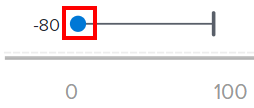

# Vea la visualización de la capacidad de los recursos en el análisis mejorado

Puede comprobar si un equipo está por encima, por debajo o por debajo de la capacidad cuando visualice el gráfico de visualización de capacidad de recursos de análisis mejorado en Adobe Workfront.

## Requisitos de acceso

Debe tener lo siguiente:

<table style="table-layout:auto"> 
 <col> 
 <col> 
 <tbody> 
  <tr> 
   <td>plan de Adobe Workfront</a>*</td> 
   <td> 
Actual: Empresa o superior

   O
   
Nuevo: Cualquiera

    </td> 
  </tr> 
  <tr> 
   <td>Licencia de Adobe Workfront*</td> 
   <td> 
Actual: revisar o superior

   O
   
Nuevo: estándar
 </td> 
  </tr> 
  <tr> 
   <td role="rowheader">Configuración del nivel de acceso</td> 
   <td> 
Ver acceso a proyectos
</td> 
  </tr> 
  <tr> 
   <td role="rowheader">Permisos de objeto</td> 
   <td> 
Ver permiso en un proyecto
  </td> 
  </tr> 
 </tbody> 
</table>

*Para saber qué plan, tipo de licencia o acceso tiene, póngase en contacto con su administrador de Workfront. Para obtener más información, consulte [Requisitos de acceso en la documentación de Workfront](/help/quicksilver/administration-and-setup/add-users/access-levels-and-object-permissions/access-level-requirements-in-documentation.md).

## Requisitos previos

Para conocer los requisitos previos para utilizar el análisis mejorado, consulte la sección &quot;Requisitos previos&quot; en [Resumen de análisis mejorado](../enhanced-analytics/enhanced-analytics-overview.md).

## Comprender el gráfico de capacidad de recursos

El gráfico Capacidad de los recursos muestra si un equipo está por encima, por debajo o por debajo de su capacidad. Este cálculo se basa en:

* **Capacidad disponible**: Cantidad total de horas que un equipo de inicio tiene disponibles para trabajar en el período de tiempo filtrado

  >[!NOTE]
  >
  >Si está viendo un periodo de tiempo futuro, la capacidad disponible se calcula en función de la capacidad del equipo para los últimos 7 días. Por este motivo, no se tiene en cuenta ningún PTO programado.

* **Capacidad planificada**: Cantidad total de horas de trabajo planificadas que se espera del equipo de inicio en el período de tiempo filtrado

Esta comparación de las horas planificadas de un equipo en casa y las horas planificadas reales puede ayudarle a determinar si no está asignando suficiente trabajo al equipo en casa o si pueden estar experimentando agotamiento debido a una gran carga de trabajo.

En la visualización de la capacidad de los recursos, puede ver los siguientes detalles:

* **Capacidad planificada**: En línea con un nombre de equipo de inicio, el círculo azul representa el número de horas planificadas asignadas al equipo de inicio.

  

* **Capacidad real**: En línea con un nombre de equipo en casa, la línea vertical representa la cantidad de horas disponibles para el equipo en casa.

  

* **Sobrecapacidad**: cuando la línea horizontal y el círculo azul se muestran a la derecha de la línea vertical, se asignó al equipo de inicio más trabajo del que puede completar en el número de horas disponibles. Esto significa que el equipo puede estar por encima de la capacidad durante el período de tiempo filtrado. El número restante de horas que debe completar el equipo se muestra a la derecha del círculo azul.

  

* **En capacidad**: cuando la línea horizontal y el círculo azul se muestran a la izquierda de la línea vertical, el equipo de inicio tiene más horas disponibles que el número de horas de trabajo planificadas que se les asignó. Esto significa que el equipo puede estar por debajo de la capacidad durante el período de tiempo filtrado. El número adicional de horas disponibles para que el equipo de inicio complete el trabajo se muestra a la izquierda del círculo azul.

  

Al pasar el ratón por encima de una fila, se muestra la cantidad exacta de horas de capacidad planificada y capacidad disponible, así como la cantidad de horas que el equipo de inicio ha superado o está por debajo de la capacidad.

Ver esta información le ayuda a determinar lo siguiente:

* Si el equipo de inicio estaba sobreasignado o infraasignado.
* ¿En qué fueron los proyectos más grandes en los que se centró el equipo local?
* Qué equipos locales están disponibles para el trabajo.

Para obtener los mejores datos para esta visualización, consulte [Resumen de análisis mejorado](../enhanced-analytics/enhanced-analytics-overview.md).

## Visualización de la visualización de la capacidad de recursos

1. Haga clic en el icono Menú principal , luego seleccione **Analytics**.
1. En el panel izquierdo, seleccione **People**.

   

1. (Opcional) Para utilizar un intervalo de fechas diferente, seleccione nuevas fechas de inicio y finalización en el filtro de intervalo de fechas.

   

   Para obtener información sobre el uso del filtro de intervalo de fechas, consulte [Aplicar filtros en análisis mejorado](../enhanced-analytics/use-enhanced-analytics-filters.md).

1. (Condicional) Si no ha establecido el filtro Equipo, agregue el filtro Equipo y seleccione cada equipo cuyos datos desee ver.

   Para obtener más información sobre la adición de filtros en el análisis mejorado, consulte [Aplicar filtros en análisis mejorado](../enhanced-analytics/use-enhanced-analytics-filters.md).

   Después de agregar filtros, se muestran datos de hasta 50 proyectos y los filtros permanecen activos incluso después de abandonar la página o cerrar la sesión de Workfront.

1. (Opcional) Para acercar un intervalo de fechas, seleccione un punto en la visualización para el inicio del intervalo de fechas y arrastre hasta el final del intervalo de fechas.

   Todas las demás visualizaciones se actualizan al mismo intervalo de fechas y se crea un filtro de periodo de tiempo.

   

1. Pase el ratón sobre la línea del equipo de inicio para ver cuántas horas están disponibles para programar, la cantidad de horas planificadas para que el equipo de inicio finalice y la cantidad total de horas trabajadas, que se etiquetan como superiores, inferiores o al límite de capacidad.

   

1. (Opcional) Para exportar los datos de visualización, haga clic en **Icono Exportar**  en la esquina superior derecha de la visualización, seleccione el formato de exportación:

   * **Gráfico (PNG)**
   * **Tabla de datos (XSLX)**

1. Haga clic en el nombre de un equipo de inicio para ver más información en la Visualización de la capacidad del equipo.

   Para obtener más información sobre la visualización de la capacidad del equipo, consulte [Vea la visualización de la capacidad Equipo en el análisis mejorado](../enhanced-analytics/team-capacity-overview.md).

