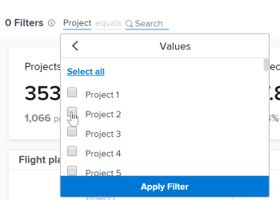
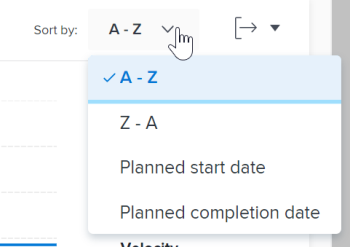
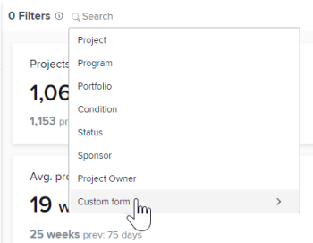

# Aplicar filtros en análisis mejorado

<!-- Audited: 12/2023 -->

Los filtros del área de Análisis mejorado de Adobe Workfront le ayudan a centrarse en proyectos específicos o tipos específicos de datos. Los tipos de filtros que utiliza pueden proporcionarle información sobre lo siguiente:

* Proyectos de su propiedad
* Vistas específicas de portafolios o programas
* Indicadores de rendimiento clave para un lapso de tiempo específico (semana, trimestre, año fiscal)

Puede añadir y eliminar filtros según sea necesario, y Workfront conserva los filtros que aplica aunque cierre la sesión.

## Requisitos de acceso

Debe tener el siguiente acceso para realizar los pasos de este artículo:

<table style="table-layout:auto"> 
 <col> 
 <col> 
 <tbody> 
  <tr> 
   <td role="rowheader">plan de Adobe Workfront</td> 
   <td>
      
Nuevo: Cualquiera

      
o

      
Actual: Empresa o superior
</td> 
  </tr>
  <tr> 
   <td role="rowheader">Licencia de Adobe Workfront</td> 
   <td>
      
Nuevo: claro o superior

      
o

      
Actual: revisar o superior

   </td> 
  </tr>
  <tr> 
   <td>Configuraciones de nivel de acceso</td> 
   <td> 
Ver acceso a proyectos
 
También debe tener acceso de Vista a Tareas, Portfolio y Usuarios para ver opciones específicas de filtrado de campos de proyecto.
 
Nota: Si las restricciones están seleccionadas en la <strong>Establecer restricciones adicionales</strong> del cuadro de diálogo Editar nivel de acceso, es posible que no vea toda la información en los filtros o en la página Análisis mejorado después de aplicar el filtro.
 </td> 
  </tr> 
  <tr> 
   <td> 
Permisos de objeto 
 </td> 
   <td> 
Ver
 </td> 
  </tr> 
 </tbody> 
</table>

Para obtener más información sobre esta tabla, consulte [Requisitos de acceso en la documentación de Workfront](/help/quicksilver/administration-and-setup/add-users/access-levels-and-object-permissions/access-level-requirements-in-documentation.md).

## Requisitos previos

Para conocer los requisitos previos para utilizar el análisis mejorado, consulte [Requisitos previos](../enhanced-analytics/enhanced-analytics-overview.md#prerequisites) in [Resumen de análisis mejorado](../enhanced-analytics/enhanced-analytics-overview.md).

## Cambio del filtro de intervalo de fechas {#change-the-date-range-filter}

De forma predeterminada, las visualizaciones del área de Análisis mejorado muestran datos de los últimos 60 días y los siguientes 15 días. Puede seleccionar un nuevo intervalo de fechas y aplicarlo a todas las visualizaciones del área de Análisis mejorado. Si sale de la página, el intervalo de fechas predeterminado se aplica la próxima vez que vuelva a la página.

>[!TIP]
>
>También puede utilizar las teclas del teclado para desplazarse, abrir y seleccionar un intervalo de fechas del widget de calendario.\
>Para obtener más información, consulte la [Métodos abreviados del teclado](../enhanced-analytics/enhanced-analytics-overview.md#keyboard-shortcuts) en el artículo [Resumen de análisis mejorado](../enhanced-analytics/enhanced-analytics-overview.md).

Para seleccionar un nuevo intervalo de fechas:

{{step1-to-analytics}}

1. En la parte superior derecha, haga clic en el campo de intervalo de fechas para abrir la vista de calendario.
1. Utilice las flechas situadas encima del calendario para localizar el mes de la fecha de inicio y, a continuación, seleccione la fecha de inicio.

   

1. Utilice las flechas situadas encima del calendario para localizar el mes de la fecha de finalización y, a continuación, seleccione la fecha de finalización.
1. (Opcional) Para ampliar un intervalo de fechas más pequeño, arrastre el ratón de una fecha específica a otra en una de las visualizaciones.

   Todas las visualizaciones de la pantalla se actualizarán para que coincidan con el periodo de tiempo seleccionado, y aparecerá un filtro de periodo de tiempo junto a los filtros existentes. Este filtro no se conserva si cierra la sesión o sale del área de Análisis mejorado.

   

## Añadir un filtro

Puede agregar filtros basados en campos de proyecto predeterminados, campos de formulario personalizados y equipos de inicio asignados a proyectos.

>[!TIP]
>
>También puede utilizar las teclas del teclado para desplazarse a y agregar un nuevo filtro.\
>Para obtener más información, consulte la [Métodos abreviados del teclado](../enhanced-analytics/enhanced-analytics-overview.md#keyboard) en el artículo [Resumen de análisis mejorado](../enhanced-analytics/enhanced-analytics-overview.md).

* [Agregar un filtro de campo de proyecto](#add-a-project-field-filter)
* [Agregar un filtro de formulario personalizado de proyecto](#add-a-project-custom-form-filter)
* [Agregar un filtro de equipo](#add-a-team-filter)

### Agregar un filtro de campo de proyecto {#add-a-project-field-filter}

Los filtros de campo de proyecto permiten filtrar los datos de los proyectos y las tareas en función de los valores introducidos en los campos que se incluyen en los proyectos de forma predeterminada.

Están disponibles los siguientes tipos de filtros de campo de proyecto:

| Campo | Datos mostrados |
|---|---|
| **Proyecto** | Muestra datos solo para los proyectos seleccionados |
| **Programa** | Muestra datos solamente para los proyectos en los programas seleccionados |
| **Portfolio** | Muestra datos solamente para los proyectos en los portafolios seleccionados |
| **Condición** | Muestra datos solo de los proyectos que han tenido recientemente las condiciones seleccionadas (como destino, en riesgo o con problemas) |
| **Estado** | Muestra datos solamente de los proyectos que han tenido los estados seleccionados más recientemente (completo, actual, en espera, cancelado, etc.) |
| **Patrocinador** | Muestra datos solamente para los proyectos con los patrocinadores seleccionados |
| **Propietario del proyecto** | Muestra datos solamente para los proyectos con los propietarios de proyecto seleccionados |

Los filtros de formulario personalizados funcionan de forma diferente. Para obtener más información, consulte [Agregar un filtro de formulario personalizado de proyecto](#add-a-project-custom-form-filter).

Para agregar un filtro de campo de proyecto:

{{step1-to-analytics}}

1. En la parte superior izquierda, haga clic en **Añadir filtro**, luego seleccione el tipo de filtro deseado.

   >[!NOTE]
   >
   >Los distintos tipos de filtro muestran datos diferentes. Solo se puede utilizar un tipo de filtro en un filtro. Después de seleccionarlo, no hay ningún tipo de filtro disponible para usar en otro filtro de campo de proyecto.

1. Busque los valores para los que desee ver datos introduciendo al menos tres caracteres de texto en la variable **Buscar** , luego seleccione cada valor que desee incluir en el filtro.

   Para seleccionar todos los valores actuales, haga clic en **Seleccionar todo**.

   

1. Después de seleccionar todos los valores deseados, haga clic en **Aplicar filtro**.

   El recuento de proyectos en la parte superior derecha se actualiza para reflejar los filtros aplicados.

1. Repita estos pasos para cada filtro que desee agregar.

   A medida que agrega filtros, los datos se muestran en las visualizaciones siguientes para un máximo de 50 proyectos.

   >[!TIP]
   >
   >Para ver los datos de más de 50 proyectos que se muestran de forma predeterminada, puede:
   >
   >   * Utilice las flechas de la parte inferior izquierda para mostrar los 50 proyectos siguientes en esa visualización.\
   >     
   >   
   >   * Utilice el **Ordenar por** en una visualización para ver los proyectos en un orden diferente.\
   >     

   Para ajustar el intervalo de fecha, consulte [Cambio del filtro de intervalo de fechas](#change-the-date-range-filter).

### Agregar un filtro de formulario personalizado de proyecto

El tipo de filtro de formulario personalizado permite filtrar los datos de los proyectos y las tareas en función de los valores introducidos en los campos de formulario personalizados de los proyectos. A diferencia de otros tipos de filtros de análisis mejorado, puede agregar más de un filtro de formulario personalizado. Cada filtro de formulario personalizado contiene valores introducidos solo dentro del campo seleccionado en un formulario personalizado específico.

Para agregar un filtro de formulario personalizado:

{{step1-to-analytics}}

1. En la esquina superior izquierda de la pantalla, haga clic en **Añadir filtro**, luego seleccione **Formulario personalizado**.

   

1. Busque el formulario personalizado que desee introduciendo al menos tres caracteres de texto en la etiqueta **Buscar** , luego seleccione el formulario personalizado.
1. Seleccione el campo que desee y, a continuación, complete una de las siguientes acciones en función del tipo de campo que esté agregando al filtro:

   >[!NOTE]
   >
   >No todos los tipos de campos corm personalizados se pueden agregar a un filtro. Actualmente, el análisis mejorado solo admite los tipos de campo enumerados a continuación.

   * **Casilla de verificación**, **lista desplegable**, o **botón de opción**: Seleccione cada valor en el campo que desee incluir en el filtro o haga clic en el **Seleccionar todo** casilla de verificación.\
     

   * **Fecha**: utilice las flechas para desplazarse a un mes específico y, en el campo, seleccione la fecha que desee incluir en el filtro.\
     

   * **Texto**: introduzca el texto dentro del campo que desea incluir en el filtro.\
     

   * **Número**: introduzca el número dentro del campo que desea incluir en el filtro.\
     

1. Después de introducir o seleccionar los valores que desea filtrar, haga clic en **Aplicar filtro**.

   El recuento de proyectos en la parte superior derecha se actualiza para reflejar los filtros aplicados.

1. Repita estos pasos para cada filtro que desee agregar.

   A medida que agrega filtros, los datos se muestran en las visualizaciones siguientes para un máximo de 50 proyectos.

   >[!TIP]
   >
   >Para ver los datos de más de 50 proyectos que se muestran de forma predeterminada, puede:
   >  
   >   * Utilice las flechas de la parte inferior izquierda para mostrar los 50 proyectos siguientes en esa visualización.\
   >     
   >   
   >   * Utilice el **Ordenar por** en una visualización para ver los proyectos en un orden diferente.\
   >     

   Para ajustar el intervalo de fecha, consulte [Cambio del filtro de intervalo de fechas](#change-the-date-range-filter).

### Agregar un filtro de equipo {#add-a-team-filter}

{{step1-to-analytics}}

1. En el panel izquierdo, haga clic en **People**.

   

1. En la parte superior izquierda de la pantalla, haga clic en **Añadir filtro**, luego seleccione la **Equipo** filtro.
1. Busque los equipos cuyos datos desee ver escribiendo al menos tres caracteres de texto en la etiqueta **Buscar** , a continuación seleccione cada equipo que desee incluir en el filtro. Para seleccionar todos los equipos, haga clic en **Seleccionar todo**.

   

   >[!NOTE]
   >
   >Todos los equipos se incluyen como opciones de filtro, independientemente del nivel de acceso.

1. Después de seleccionar todos los equipos deseados, haga clic en **Aplicar filtro**.

   A medida que agrega filtros, los datos se muestran en las visualizaciones siguientes.

   Para ajustar el intervalo de fecha, consulte [Cambio del filtro de intervalo de fechas](#change-the-date-range-filter).

## Eliminación de un filtro

Puede quitar un filtro en cualquier momento. Si elimina un filtro, no se mostrará la próxima vez que visite el área de Análisis mejorado.

>[!TIP]
>
>También puede utilizar las teclas del teclado para desplazarse a un filtro existente y eliminarlo.\
>Para obtener más información, consulte la [Métodos abreviados del teclado](../enhanced-analytics/enhanced-analytics-overview.md#keyboard) en el artículo [Resumen de análisis mejorado](../enhanced-analytics/enhanced-analytics-overview.md).

Para eliminar un filtro:

{{step1-to-analytics}}

1. Si desea quitar un campo de proyecto o un filtro de formulario personalizado, permanezca en el **Trabajo** área.

   O

   Si desea quitar un filtro de equipo, seleccione **People** en el panel izquierdo.

1. Busque el filtro deseado y haga clic en **X** para quitarlo.

   

   El filtro ya no está activo y no se muestra a menos que lo vuelva a añadir.
