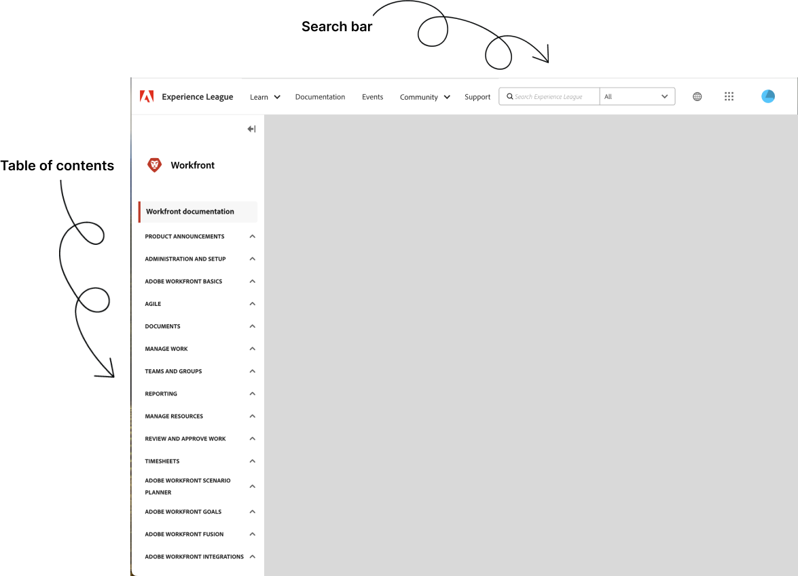

# [!DNL Workfront] documentación

Le damos la bienvenida a la página de inicio y a la documentación técnica de Adobe Workfront. Utilice los siguientes vínculos de Adobe Workfront, artículos de ayuda y recursos adicionales para aprender a implementar y utilizar Adobe Workfront de forma eficaz en su organización.

## Novedades

>[!BEGINTABS]

>[!TAB Última versión]

* [Información general sobre la versión del tercer trimestre de 2024](/help/quicksilver/product-announcements/product-releases/24-q3-release-activity/24-q3-release-overview.md)
* [Actividad de la versión de Adobe Workfront Fusion](/help/quicksilver/product-announcements/product-releases/fusion-release-activity/fusion-release-activity.md)

>[!TAB Versiones de 2024]

* [Información general sobre la versión del primer trimestre de 2024](/help/quicksilver/product-announcements/product-releases/24-q1-release-activity/24-q1-release-overview.md)
* [Información general sobre la versión del segundo trimestre de 2024](/help/quicksilver/product-announcements/product-releases/24-q2-release-activity/24-q2-release-overview.md)
* [Información general sobre la versión del tercer trimestre de 2024](/help/quicksilver/product-announcements/product-releases/24-q3-release-activity/24-q3-release-overview.md)
* [Actividad de la versión de Adobe Workfront Fusion](/help/quicksilver/product-announcements/product-releases/fusion-release-activity/fusion-release-activity.md)

>[!TAB Beta]

* [Información general sobre paneles de lienzo](/help/quicksilver/reports-and-dashboards/dashboards/creating-and-managing-dashboards/canvas-dashboards-overview.md)
* [Integración de Workfront y Frame.io](/help/quicksilver/review-and-approve-work/Documents/wf-frame-alpha.md)

>[!TAB Problemas conocidos]

* [Problemas conocidos](https://experienceleague.adobe.com/en/docs/workfront-known-issues/issues/overview)

>[!ENDTABS]

## Explorar documentación

<table>

<tr>
    <td style="text-align: center;">
<b>Administradores</b>
</td>
    <td colspan="2" style="text-align: center;">
<b>Usuarios</b>
</td>
    <td style="text-align: center;">
<b>Desarrolladores</b>
</td>
  </tr>
  <tr>
    <td>
    <ul>
    <li><a href="/help/quicksilver/administration-and-setup/get-started-wf-administration/get-started-with-wf-administration.md">Introducción a la administración de Workfront</a></li>
    <li><a href="/help/quicksilver/workfront-fusion/get-started/get-started.md">Introducción a Workfront Fusion</li>
    </ul>
 </td>
    <td>
        <ul>
        <li><a href="/help/quicksilver/workfront-basics/workfront-basics.md">Introducción a Workfront</a></li>
        <li><a href="/help/quicksilver/manage-work/manage-work.md">Introducción a la administración del trabajo</a></li>
        <li><a href="/help/quicksilver/reports-and-dashboards/reports-and-dashboards-overview.md">Introducción a Informes y paneles</a></li>
        <li><a href="/help/quicksilver/reports-and-dashboards/reports/text-mode/text-mode-resources.md">Introducción al modo de texto</a></li>
        </ul>
    </td>
    <td><ul>
        <li><a href="/help/quicksilver/agile/agile-overview.md">Introducción a Agile</a></li>
        <li><a href="/help/quicksilver/documents/documents-overview.md">Introducción a los documentos</a></li>
        <li><a href="/help/quicksilver/resource-mgmt/workload-balancer/workload-balancer.md">Introducción al Distribuidor de cargas de trabajo</a></li>
        <li><a href="/help/quicksilver/resource-mgmt/workload-balancer/overview-workload-balancer.md">Introducción a la revisión y aprobación</a></li>
        </ul></td>
    <td><ul>
        <li><a href="/help/quicksilver/wf-api/general/api-basics.md">Conceptos básicos de API</a></li>
        <li><a href="https://developer.adobe.com/workfront/api-explorer/">Explorador de API</a></li>
        <li><a href="/help/quicksilver/workfront-integrations-and-apps/workfront-integrations.md">Integraciones de Workfront</a></li>
        </ul></td>
  </tr>
</table>

## Sugerencias para buscar contenido en Experience League

La búsqueda de documentación puede ser más eficaz con algunos enfoques estratégicos. A continuación se ofrecen algunos consejos para ayudarle a encontrar lo que necesita de forma eficaz:

### Utilice la tabla de contenido y la barra de búsqueda

* **Tabla de contenido**: Comience con la tabla de contenido para obtener una visión general de los temas disponibles y reduzca a temas específicos mediante las secciones en expansión.
* **Barra de búsqueda**: utilice la barra de búsqueda para encontrar la documentación. Introduzca términos específicos relacionados con su problema o tema. En lugar de términos generales como &quot;administración de proyectos&quot;, utilice &quot;configuración de la cronología del proyecto&quot; o &quot;dependencias de tareas&quot;.

### Explorar secciones de aprendizaje y formación

* **Materiales de formación**: Vaya a [Formación de Workfront](https://experienceleague.adobe.com/en/browse/workfront) para obtener una biblioteca de vídeos y artículos de formación diseñados para ayudarle a comprender mejor las funciones y la configuración de Workfront. También puede acceder a materiales de formación de pago en [learning.adobe.com](https://learning.adobe.com/).
* **Cursos**: Buscar [cursos de formación estructurada](https://experienceleague.adobe.com/home?Solution=Workfront#courses) que le guían a través del uso de varias funciones de Workfront en una secuencia lógica.

### Encuentre respuestas en los foros de la comunidad

* **Hacer preguntas**: Si la documentación no responde a su pregunta, intente publicar en [Foros de la comunidad Workfront](https://experienceleaguecommunities.adobe.com/t5/workfront/ct-p/workfront?profile.language=en) donde otros usuarios y expertos pueden ofrecer asistencia.