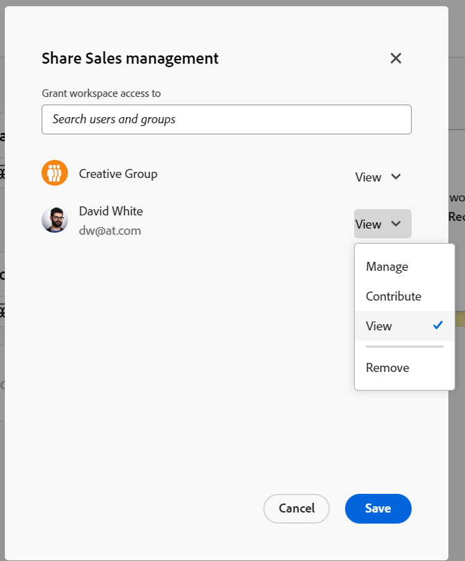

<!--update the metadata and description when we turn this article live; also, update title after Bob adds Maestro as a product-->

# Compartir espacios de trabajo

Puede compartir un área de trabajo con otros usuarios para garantizar la colaboración al trabajar en Adobe Workfront Maestro.

>[!NOTE]
>
>Al conceder permisos a un espacio de trabajo, no se conceden permisos a otros usuarios para las vistas de las páginas de tipo de registro. Debe conceder permisos a vistas individuales de una página de tipo de registro para compartirlas con otros usuarios. Para obtener más información, consulte [Compartir una vista](/help/quicksilver/maestro/access/share-views.md).

## Requisitos de acceso

Debe tener el siguiente acceso para realizar los pasos de este artículo:

<table style="table-layout:auto">
 <col>
 </col>
 <col>
 </col>
 <tbody>
    <tr>
<tr>
<td>
   
 Product
 </td>
   <td>
   
 Adobe Workfront
 </td>
  </tr>  
 <td role="rowheader">
acuerdo con Adobe Workfront
</td>
   <td>

Su organización debe estar inscrita en el programa beta cerrado de Adobe Maestro. Póngase en contacto con el representante de cuentas para obtener más información sobre esta nueva oferta. 

   </td>
  </tr>
  <tr>
   <td role="rowheader">
plan de Adobe Workfront
</td>
   <td>

Cualquiera

   </td>
  </tr>
  <tr>
   <td role="rowheader">
Licencia de Adobe Workfront
</td>
   <td>
   
Cualquiera
 
  </td>
  </tr>

<tr>
   <td role="rowheader">
Configuraciones de nivel de acceso
</td>
   <td> No hay controles de acceso para Adobe Maestro
  
</td>
  </tr>

<tr>
   <td role="rowheader">
Permisos
</td>
   <td> 
Administración de permisos en un espacio de trabajo
  
</td>
  </tr>

<tr>
   <td role="rowheader">
Plantilla de diseño
</td>
   <td> 
El administrador de Workfront o de grupo debe agregar el área de Maestro a la plantilla de diseño. 
  
</td>
  </tr>
 </tbody>
</table>

## Compartir permisos en un espacio de trabajo

Los siguientes usuarios pueden compartir un espacio de trabajo con otros usuarios:

* Los administradores del sistema pueden compartir todos los espacios de trabajo, incluidos los que no hayan creado.
* Todos los demás usuarios solo pueden compartir espacios de trabajo para los que tengan permisos de administración.

Para compartir un espacio de trabajo con otros usuarios:

{{step1-to-maestro}}

1. Abra el espacio de trabajo que desee compartir y haga clic en **Compartir** en la esquina superior derecha de la pantalla.

   

1. En el **Conceder acceso al espacio de trabajo a** , empiece a escribir el nombre de un usuario o grupo y, a continuación, haga clic en él cuando se muestre en la lista.

   

1. Seleccione uno de los siguientes niveles de permisos en el menú desplegable:
   * Ver
   * Contribuir
   * Administrar

     Para obtener información sobre los niveles de permisos y las acciones que los usuarios pueden realizar para cada nivel, consulte [Información general sobre los permisos de uso compartido en Adobe Maestro](../access/sharing-permissions-overview.md).
1. Haga clic en **Guardar**.

## Eliminación de permisos de un espacio de trabajo

{{step1-to-maestro}}

1. Abra el espacio de trabajo en el que desea quitar permisos y haga clic en **Compartir** en la esquina superior derecha de la pantalla.
1. Haga clic en el menú desplegable situado a la derecha del nombre de un usuario o grupo y, a continuación, haga clic en **Eliminar**.
1. Haga clic en **Guardar**.

   El usuario o los usuarios que pertenecen al grupo eliminado ya no tienen acceso al espacio de trabajo o a sus objetos.