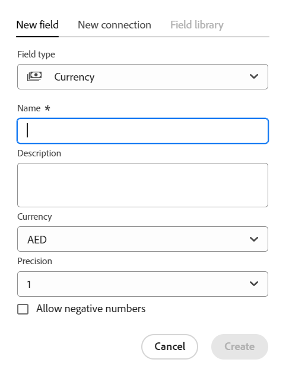

<!--udpate the metadata with real information when making this avilable in TOC and in the left nav-->

<!--Should the structure of this article be like this one: https://experienceleague.adobe.com/docs/workfront/using/administration-and-setup/customize/custom-forms/custom-form-builder/use-the-custom-form-builder/add-a-custom-field-to-a-custom-form.html?lang=en ??-->

<!--will they add a way to create fields elsewhere than in a table?! - how will that change the structure of this article? -->

# Creación de campos

>[!IMPORTANT]
>
>En la actualidad, Adobe Maestro forma parte de un programa beta abierto a un número limitado de clientes.
>
>Póngase en contacto con su representante de cuentas para obtener más información acerca de cómo unirse al programa beta de Maestro.
>
>Para obtener más información, consulte [Introducción a Adobe Maestro](../maestro-overview.md).

En Adobe Maestro, puede crear campos personalizados para tipos de registros operativos o taxonomías. A continuación, puede asociar los campos con los registros de Maestro para mejorar la información de los registros.

Debe crear tipos de registros antes de poder crear campos que se asocien a ellos. Para obtener más información, consulte [Creación de tipos de registros](../architecture-and-fields/create-record-types.md).

## Requisitos de acceso

Debe tener el siguiente acceso para realizar los pasos de este artículo:

<table style="table-layout:auto">
 <col>
 <tbody>
<td>
   
 producto de Adobe
 </td>
   <td>
   
 Adobe Workfront
 </td>
  </tr>  
 <td role="rowheader">
acuerdo con Adobe Workfront
</td>
   <td>

Su organización debe estar inscrita en el programa beta cerrado de Adobe Maestro. Póngase en contacto con el representante de cuentas para obtener más información sobre esta nueva oferta. 

   </td>
  </tr>
  <tr>
   <td role="rowheader">
plan de Adobe Workfront
</td>
   <td>

Cualquiera

   </td>
  </tr>
  <tr>
   <td role="rowheader">
Licencia de Adobe Workfront
</td>
   <td>
   
Cualquiera
 
  </td>
  </tr>

<tr>
   <td role="rowheader">Nivel de acceso</td>
   <td> 
Cualquiera
  
</td>
  </tr>
<tr>
   <td role="rowheader">Plantilla de diseño</td>
   <td> 
El administrador del sistema debe agregar el área de Maestro en la plantilla de diseño. Para obtener más información, consulte <a href="../access/grant-access.md">Conceder acceso a Adobe Maestro</a>. 
  
</td>
  </tr>
 </tbody>
</table>

<!--Maybe enable this at GA - but Maestro is not supposed to have Access controls in the Workfront Access Level: 
>[!NOTE]
>
>If you don't have access, ask your Workfront administrator if they set additional restrictions in your access level. For information on how a Workfront administrator can change your access level, see [Create or modify custom access levels](../administration-and-setup/add-users/configure-and-grant-access/create-modify-access-levels.md). -->

<!-- Notes to add for the table: for the "Workfront plans" row: the above is only for closed beta; when going to GA - activate the following plans:    

Current plan: Prime and Ultimate

Legacy plan: Enterprise
-->

<!-- Notes for the table: for the "Workfront access" row: 
For more information, see <a href="../../administration-and-setup/add-users/access-levels-and-object-permissions/wf-licenses.md" class="MCXref xref">Adobe Workfront licenses overview</a>.
-->

## Consideraciones sobre los campos de Maestro

* Sólo puede crear campos desde la vista de tabla de una página de tipo de registro. Los campos se muestran como columnas en la vista de tabla.

  Para obtener información sobre la administración de columnas de tabla (o campos de registro), consulte [Administrar la vista de tabla](../views/manage-the-table-view.md).

  Para obtener información sobre la administración de campos, consulte los siguientes artículos:

   * [Editar campos](../architecture-and-fields/edit-fields.md)
   * [Eliminar campos](./delete-fields.md)

* Los campos asociados a un tipo de registro están disponibles para asociarse a todos los registros de ese tipo. <!--will this change and will the fields be available for other record types, too?! Also, the next bullet might need to change too if this one changes -->

* Los campos asociados a un tipo de registro no se pueden agregar a otro tipo de registro. <!-- this will change when they open the Field library tab when creating a field-->

* Puede crear campos manual o automáticamente de las siguientes maneras:

   * Manualmente:

      * Agregando columnas en la vista Tabla de una página de tipo de registro. Las columnas de la tabla son los campos asociados al tipo de registro. Son los mismos campos que se muestran en la página Detalles de un registro.

        No se pueden crear campos desde la página Detalles de un registro.

        Este artículo describe cómo crear campos manualmente.

      * Vinculando tipos de registros. Puede crear campos de registro vinculados cuando agregue una nueva conexión entre dos tipos de registro Maestro o un tipo de registro y un tipo de objeto de otras aplicaciones.

        <!--* Importing record types with fields using a CSV or an Excel file. - this is not available yet-->

        Para obtener más información acerca de cómo conectar tipos de registros de Maestro, vea [Conectar tipos de registros](../architecture-and-fields/connect-record-types.md).

      * Mediante la importación de tipos de registros mediante un archivo CSV o de Excel. Para obtener más información, consulte [Creación de tipos de registros](../architecture-and-fields/create-record-types.md).

   * Automáticamente:

      * De forma predeterminada, cada vez que crea un tipo de registro.

        Los siguientes son campos estándar creados por defecto para cada nuevo tipo de registro operativo:

         * Nombre
         * Descripción
         * Fecha de inicio
         * Fecha de finalización
         * Estado. Los valores predeterminados para los estados de registro son:
            * Desarrollo
            * Planificados
            * Activo
            * Finalizado
            * En espera

           Puede agregar más valores o cambiar el nombre de los existentes.

        A continuación se muestran los campos estándar creados de forma predeterminada para cada nuevo tipo de registro de taxonomía:

         * Nombre <!--will more be added? If not, consider rephrasing this bullet-->

      * Cuando se crea un espacio de trabajo a partir de una plantilla. Maestro crea campos para tipos de registros operativos y taxonomías cuando se crea un espacio de trabajo a partir de una plantilla. Para obtener más información, consulte [Creación de espacios de trabajo](../architecture-and-fields/create-workspaces.md).

* Puede ver y actualizar la configuración de los campos que ha creado usted o cualquier otro usuario. <!--this will change with access/ permissions-->

* Puede tener hasta 500 campos para un tipo de registro.

* Los nombres de campo pueden tener hasta 250 caracteres.

* Al eliminar un tipo de registro operativo, taxonomía o espacio de trabajo, todos los campos asociados a ellos y los valores de los campos también se eliminan y no se pueden recuperar. <!-- this might change with a possible recycle bin solution?!-->

## Crear campos desde cero {#create-fields-from-scratch}

<!--in a table (not sure if this can be done elsewhere?!-->

1. Haga clic en **Menú principal** icono  en la esquina superior derecha de Workfront, <!---or the **Main menu** icon   in the upper-left corner, if available--> luego haga clic en **Maestro** .

   El espacio de trabajo al que se accedió por última vez debe abrirse de forma predeterminada.

1. (Opcional) Expanda la flecha hacia abajo a la derecha del nombre de un espacio de trabajo existente y seleccione el espacio de trabajo para el que desea crear campos y, a continuación, haga clic en el tipo de registro.

   Todos los registros existentes asociados al tipo de registro se muestran en las filas de la vista de tabla.

   >[!TIP]
   >
   >    Si no se muestra ningún registro, es posible que aún no tenga ningún registro, o que tenga aplicado un filtro que limite lo que ve en la pantalla.

   Todos los campos existentes asociados al tipo de registro se muestran en las columnas de la vista de tabla. <!--caveat this for when we can hide the fields; mention that they can be hidden if they are not visible by default-->

1. Haga clic en **+** en la esquina superior derecha de la vista de tabla para añadir nuevos campos.
1. En el **Nuevo campo** pestaña, seleccione entre los siguientes tipos de campo:

   * [Texto de línea única](#single-line-text)
   * [Párrafo](#paragraph)
   * [Selección múltiple](#multi-select)
   * [Selección única](#single-select)
   * [Fecha](#date)
   * [Número](#number)
   * [Porcentaje](#percentage)
   * [Divisa](#currency)
   * [Casilla de verificación](#checkbox)

   >[!IMPORTANT]
   >
   >    No se puede cambiar el tipo de campo después de guardarlo.

1. Siga agregando cada campo, tal como se describe en las secciones siguientes.

### Texto de línea única {#single-line-text}

Los campos de texto de una sola línea capturan información alfanumérica limitada. Por ejemplo, puede capturar la información del propietario, la parte interesada, el equipo o la unidad organizativa en un campo de texto de una sola línea. El contenido de un campo de texto de una sola línea puede tener hasta 250 caracteres. <!-- asked Lilit if we can change this to "Single-line" since this can have numbers and text.-->

1. Comience a crear un campo como se describe en la sección [Crear campos desde cero](#create-fields-from-scratch) en este artículo, seleccione **Texto de una sola línea** tipo de campo.

   

1. Añada la siguiente información:
   * **Nombre**: Nombre del tipo de campo, tal como aparecerá en una tabla o en la página Detalles del registro. <!--ensure they updated this; and update the screen shot: it used to be "Label"-->
   * **Descripción**: Información adicional sobre el campo. La descripción de un campo se muestra cuando pasa el ratón sobre el encabezado de columna del campo en una tabla.
1. Haga clic en **Crear**.

   El nuevo campo de una sola línea se agrega como una columna al tipo de registro y sus valores se pueden asociar con registros. El campo también se muestra en la página Detalles de un registro.

### Párrafo {#paragraph}

Los campos de párrafo capturan información alfanumérica adicional sobre un registro, similar al campo Descripción. El contenido de un campo de párrafo puede tener hasta 1000 caracteres.

1. Comience a crear un campo como se describe en la sección [Crear campos desde cero](#create-fields-from-scratch) en este artículo, seleccione **Párrafo** tipo de campo.

   

1. Añada la siguiente información:
   * **Nombre**: Nombre del tipo de campo, tal como aparecerá en una tabla o en la página Detalles del registro. <!--ensure they updated this; and update the screen shot: it used to be "Label"-->
   * **Descripción**: Información adicional sobre el campo. La descripción de un campo se muestra cuando pasa el ratón sobre la columna del campo de una tabla.
1. Haga clic en **Crear**.

   El nuevo campo de párrafo se agrega como una columna al tipo de registro y sus valores se pueden asociar con registros. El campo también se muestra en la página Detalles de un registro.

### Selección múltiple {#multi-select}

Puede utilizar un campo de selección múltiple para capturar información adicional en cualquier formato seleccionando más de una opción en un menú desplegable.

1. Comience a crear un campo como se describe en la sección [Crear campos desde cero](#create-fields-from-scratch) en este artículo, seleccione **Selección múltiple** tipo de campo.

   

1. Añada la siguiente información:
   * **Nombre**: Nombre del tipo de campo, tal como aparecerá en una tabla o en la página Detalles del registro. <!--ensure they updated this; and update the screen shot: it used to be "Label"-->
   * **Descripción**: Información adicional sobre el campo. La descripción de un campo se muestra cuando pasa el ratón sobre la columna del campo de una tabla.
   * **Opciones**: las opciones disponibles para seleccionar en el menú desplegable después de guardar el campo. Puede tener números y letras para el nombre de cada opción.
1. Clic **Añadir opción** para agregar tantas opciones como sea necesario. No hay límite en la cantidad de opciones que se pueden agregar a un campo de selección múltiple.
1. (Opcional) Arrastre y suelte manualmente cada opción en el orden deseado o seleccione la
   **Ordenar opciones A-Z** si desea que las opciones se muestren automáticamente en orden alfabético. <!--Add this if they added this functionality: You cannot edit this option after you save the field.-->
1. Haga clic en **x** a la derecha de una opción para eliminarlo.
1. Haga clic en la muestra de color a la izquierda de la opción para expandir el selector de color y personalizar el color de cada opción.
1. Haga clic en **Crear**.

   El nuevo campo de selección múltiple se agrega como una columna al tipo de registro y sus valores se pueden asociar con registros. El campo también se muestra en la página Detalles de un registro.

### Selección única {#single-select}

Los campos de selección única capturan información adicional en cualquier formato seleccionando una opción en un menú desplegable.

1. Comience a crear un campo como se describe en la sección [Crear campos desde cero](#create-fields-from-scratch) en este artículo, seleccione **Selección única** tipo de campo.

   

1. Añada la siguiente información:
   * **Nombre**: Nombre del tipo de campo, tal como aparecerá en una tabla o en la página Detalles del registro. <!--ensure they updated this; and update the screen shot: it used to be "Label"-->
   * **Descripción**: Información adicional sobre el campo. La descripción de un campo se muestra cuando pasa el ratón sobre la columna del campo de una tabla.
   * **Opciones**: las opciones disponibles para seleccionar en el menú desplegable después de guardar el campo. Puede tener números y letras para el nombre de cada opción.

1. Clic **Añadir opción** para agregar tantas opciones como sea necesario. No hay límite en la cantidad de opciones que se pueden agregar a un campo de selección única.
1. (Opcional) Arrastre y suelte manualmente cada opción en el orden deseado o seleccione la **Ordenar opciones A-Z** si desea que las opciones se muestren automáticamente en orden alfabético. <!--Add this if they added this functionality: You cannot edit this option after you save the field.-->
1. Haga clic en **x** a la derecha de una opción para eliminarlo.
1. Haga clic en la muestra de color a la izquierda de la opción para expandir el selector de color y personalizar el color de cada opción.
1. Haga clic en **Crear**.

   El nuevo campo de selección única se agrega como una columna al tipo de registro y sus valores se pueden asociar con registros. El campo también se muestra en la página Detalles de un registro.

### Fecha {#date}

Puede utilizar un campo de fecha para capturar información adicional en formato de fecha y hora.

1. Comience a crear un campo como se describe en la sección [Crear campos desde cero](#create-fields-from-scratch) en este artículo, seleccione **Fecha** tipo de campo.

   

1. Añada la siguiente información:
   * **Nombre**: Nombre del tipo de campo, tal como aparecerá en una tabla o en la página Detalles del registro. <!--ensure they updated this; and update the screen shot: it used to be "Label"-->
   * **Descripción**: Información adicional sobre el campo. La descripción de un campo se muestra cuando pasa el ratón sobre la columna del campo de una tabla.
   * **Formato de fecha**: Tipo de formato de fecha que desea mostrar en este campo.

     Seleccione entre los siguientes formatos:
      * **Configuración regional**: coincide con la configuración regional del explorador.
      * **Standard**: 16/05/2023
      * **Largo**: 16 de mayo de 2023
      * **Europeo**: 05/16/2023
      * **ISO**: 16-05-2023
   * **Incluir un campo de hora**: seleccione esta opción si desea incluir una marca de tiempo. De forma predeterminada, esta opción no está seleccionada.

     Seleccione entre las siguientes opciones:

      * **24 horas**: Por ejemplo: 18:00
      * **12 h**: Por ejemplo: 18:00

1. Haga clic en **Crear**.

   El nuevo campo de fecha se agrega como una columna al tipo de registro y sus valores se pueden asociar con registros. El campo también se muestra en la página Detalles de un registro.

### Número {#number}

Los tipos de campos de número capturan información en formato numérico.

1. Comience a crear un campo como se describe en la sección [Crear campos desde cero](#create-fields-from-scratch) en este artículo, seleccione **Número** tipo de campo.

   
1. Añada la siguiente información:

   * **Nombre**: Nombre del tipo de campo, tal como aparecerá en una tabla o en la página Detalles del registro.
   * **Descripción**: Información adicional sobre el campo. La descripción de un campo se muestra cuando pasa el ratón sobre la columna del campo de una tabla.
   * **Precisión**: el número de decimales que desea registrar para el campo. Se pueden mostrar hasta 6 decimales.
   * **Permitir números negativos**: seleccione esta opción si desea permitir números negativos en este campo. Esta opción está desactivada de forma predeterminada.

   >[!NOTE]
   >
   >    Si selecciona Permitir números negativos y los valores negativos se almacenan en los registros a los que está adjunto el campo, ya no podrá anular la selección de la configuración en el futuro.

1. Haga clic en **Crear**.

   El nuevo campo de número se agrega como una columna al tipo de registro y sus valores se pueden asociar con registros. El campo también se muestra en la página Detalles de un registro.

### Porcentaje {#percentage}

Los tipos de campo de porcentaje capturan información en un formato numérico seguido de un signo de porcentaje.

1. Comience a crear un campo como se describe en la sección [Crear campos desde cero](#create-fields-from-scratch) en este artículo, seleccione **Porcentaje** tipo de campo.

   

1. Añada la siguiente información:
   * **Nombre**: Nombre del tipo de campo, tal como aparecerá en una tabla o en la página Detalles del registro.
   * **Descripción**: Información adicional sobre el campo. La descripción de un campo se muestra cuando pasa el ratón sobre la columna del campo de una tabla.
   * **Precisión**: el número de decimales que desea registrar para el campo. Se pueden mostrar hasta 6 decimales.
   * **Permitir números negativos**: seleccione esta opción si desea permitir valores de porcentaje negativos en este campo. Esta opción está desactivada de forma predeterminada.

   >[!NOTE]
   >
   >    Si selecciona Permitir números negativos y los valores negativos se almacenan en los registros a los que está adjunto el campo, ya no podrá anular la selección de la configuración en el futuro.

1. Haga clic en **Crear**.

   El nuevo campo de porcentaje se agrega como una columna al tipo de registro y sus valores se pueden asociar con registros. El campo también se muestra en la página Detalles de un registro.

### Divisa {#currency}

Los tipos de campo Moneda capturan información en un formato de número precedido por un símbolo de moneda.

1. Comience a crear un campo como se describe en la sección [Crear campos desde cero](#create-fields-from-scratch) en este artículo, seleccione **Moneda** tipo de campo.

   

1. Añada la siguiente información:
   * **Nombre**: Nombre del tipo de campo, tal como aparecerá en una tabla o en la página Detalles del registro. <!--ensure they updated this; and update the screen shot: it used to be "Label"-->
   * **Descripción**: Información adicional sobre el campo. La descripción de un campo se muestra cuando pasa el ratón sobre la columna del campo de una tabla.
   * **Moneda**: El tipo de moneda que desea mostrar en este campo. Esta es una lista de monedas según la Organización Internacional de Normalización (ISO).
   * **Precisión**: el número de decimales que desea registrar para el campo. Se pueden mostrar hasta 6 decimales.
   * **Permitir números negativos**: seleccione esta opción si desea permitir valores de moneda negativos en este campo. Esta opción está desactivada de forma predeterminada.

   >[!NOTE]
   >
   >    Si selecciona Permitir números negativos y los valores negativos se almacenan en los registros a los que está adjunto el campo, ya no podrá anular la selección de la configuración en el futuro.

1. Haga clic en **Crear**.

   El nuevo campo de moneda se agrega como una columna al tipo de registro y sus valores se pueden asociar con registros. El campo también se muestra en la página Detalles de un registro.

### Casilla de verificación

Puede utilizar el tipo de campo Casilla de verificación para agregar una sola opción de casilla de verificación a un registro. Puede utilizar este campo para indicar un atributo o estado específico para ese registro en particular. Por ejemplo, puede utilizarlo como indicador para rastrear la finalización, la aprobación o cualquier otro atributo binario de cada registro.

1. Comience a crear un campo como se describe en la sección [Crear campos desde cero](#create-fields-from-scratch) en este artículo, seleccione **Casilla** tipo de campo.

   

1. Añada la siguiente información:
   * **Nombre**: Nombre del tipo de campo, tal como aparecerá en una tabla o en la página Detalles del registro. <!--ensure they updated this; and update the screen shot: it used to be "Label"-->
   * **Descripción**: Información adicional sobre el campo. La descripción de un campo se muestra cuando pasa el ratón sobre la columna del campo de una tabla.
1. Haga clic en **Crear**.

   El nuevo campo de casilla de verificación se agrega como una columna al tipo de registro y sus valores se pueden asociar con registros. El campo también se muestra en la página Detalles de un registro.

## Crear campos vinculando tipos de registro

Puede crear campos de registro vinculados cuando agregue una nueva conexión entre dos tipos de registro Maestro o un tipo de registro y un tipo de objeto de otras aplicaciones.

Para obtener información acerca de cómo conectar tipos de registros de Maestro, vea [Conectar tipos de registros](../architecture-and-fields/connect-record-types.md).

## Crear campos mediante la importación de tipos de registro mediante un archivo CSV y de Excel

Para obtener más información, consulte [Creación de tipos de registros](../architecture-and-fields/create-record-types.md).

## Creación de campos creando un tipo de registro

Al crear un tipo de registro, también se crean de forma predeterminada varios campos asociados al nuevo tipo de registro. Para obtener más información, consulte [Creación de tipos de registros](../architecture-and-fields/create-record-types.md).

## Creación de campos creando un espacio de trabajo a partir de una plantilla

Maestro crea campos para tipos de registros operativos y taxonomías cuando se crea un espacio de trabajo a partir de una plantilla.

Para obtener más información, consulte [Creación de espacios de trabajo](../architecture-and-fields/create-workspaces.md).

