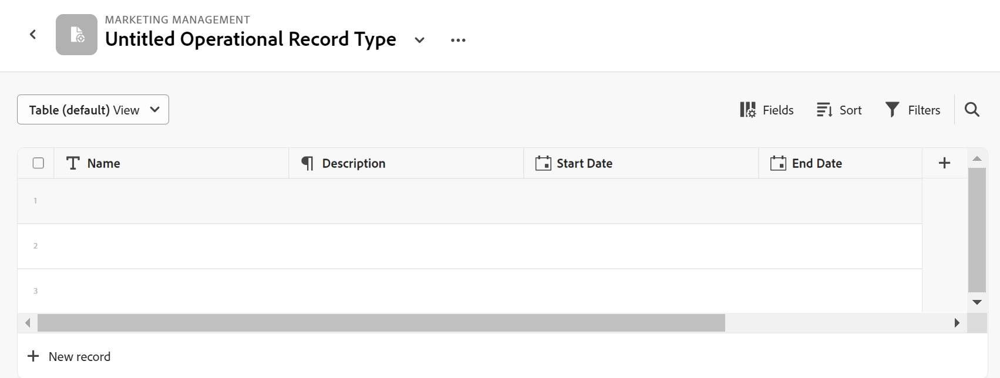

<!--udpate the metadata with real information when making this avilable in TOC and in the left nav-->

# Información general sobre los tipos de registros y las taxonomías

>[!IMPORTANT]
>
>La información de este artículo hace referencia a Adobe Maestro, que es una nueva oferta de Adobe.
>
>En la actualidad, Adobe Maestro forma parte de un programa beta abierto a un número limitado de clientes.
>
>Póngase en contacto con su representante de cuentas para obtener más información acerca de cómo unirse al programa beta de Maestro.
>
>Para obtener más información, consulte [Introducción a Adobe Maestro](../maestro-overview.md).

A diferencia de Workfront, donde los tipos de objeto están predefinidos, en Adobe Maestro puede crear sus propios tipos de objeto. Por ejemplo, en Workfront ya se han creado los tipos de objeto Programa, Portfolio, Proyecto, Tarea o Problema.

Los tipos de objetos de Maestro se denominan &quot;tipos de registros&quot;. Los tipos de registro son los componentes básicos de un área de trabajo de Maestro. Para obtener información sobre los espacios de trabajo, consulte [Creación de espacios de trabajo](../architecture-and-fields/create-workspaces.md).

## Resumen del tipo de registro

En Maestro, puede crear tipos de registros personalizados que satisfagan las necesidades de su organización.

* Los siguientes son tipos de registros de Maestro:

   * [Tipo de registro operativo](#operational-record-type): un tipo de registro que representa planes estratégicos, iniciativas o trabajo planificado. Por ejemplo, Campaña, Actividad, Táctica u Oportunidad pueden ser tipos de registros operativos.
   * [Taxonomía](#taxonomy): tipos de registro que capturan atributos sobre un tipo de registro operativo. Por ejemplo, Región, Dirección y Audiencia pueden ser taxonomías.

* Al crear un tipo de registro, todos los miembros de la organización pueden verlo, editarlo o eliminarlo. <!--this will change with access levels and permissions-->
* Debe crear un espacio de trabajo para poder crear tipos de registros para el espacio de trabajo.
* Puede tener un total combinado de 1000 tipos de registros operativos y taxonomías en un espacio de trabajo. Esto incluye los tipos de registros o taxonomías que se crean desde cero o que se importan desde otros sistemas.

### Tipo de registro operativo{#operational-record-type}

Un tipo de registro operativo es un tipo de registro Maestro que representa objetos relacionados con el trabajo.

Para obtener más información sobre los tipos de registros operativos, incluido cómo crearlos, consulte [Creación de tipos de registros](../architecture-and-fields/create-record-types.md).

### Taxonomía{#taxonomy}

Una taxonomía es un tipo de registro que captura atributos sobre un tipo de registro operativo.

Para obtener más información sobre los tipos de registros de taxonomía, consulte [Creación de una taxonomía](../architecture-and-fields/create-a-taxonomy.md).

Aunque la creación de taxonomías es idéntica a la creación de tipos de registros operativos, Maestro distingue conceptualmente entre un tipo de registro operativo y un tipo de registro de taxonomía. El propósito de las taxonomías es mejorar los tipos de registros operativos. Las taxonomías no deben representar directamente objetos de trabajo.  <!--this is no longer true, but might be later?!: A taxonomy is a record without dates, like a static list of attributes.-->

<!--mimic what you did above for operational record types to say that we can also import taxonomies from other applications too - this will be possible later; for example Team would be a taxonomy record type, etc -->

Por ejemplo, Audiencia, Región o Dirección pueden ser tipos de registros de tipo taxonomía.

Para obtener más información, consulte [Creación de una taxonomía](../architecture-and-fields/create-a-taxonomy.md).

## Similitudes y diferencias entre tipos de registros operativos y taxonomías

La siguiente tabla ilustra algunas de las similitudes y diferencias entre los tipos de registros operativos y las taxonomías:

| Tipo de registro y característica | Tipo de registro operativo | Tipo de registro de taxonomía |
|-------------------------------------------------------------|:-----------------------:|:--------------------:|
| Forman parte de un espacio de trabajo | ✓ | ✓ |
| Puede crearlos automáticamente a partir de una plantilla de Workspace | ✓ | ✓ |
| Puede crearlos manualmente, desde cero | ✓ | ✓ |
| Puede crearlos copiando y pegando información de un archivo o lista externos | ✓ | ✓ |
| Puede crear creando un archivo de Excel o CSV | ✓ |                     |
| Puede crear tipos de registro de sólo lectura conectándose a tipos de objeto de otras aplicaciones | ✓ |                     |
| Representan objetos relacionados con el trabajo | ✓ |                      |
| Representan atributos sobre objetos relacionados con el trabajo |                         | ✓ |
| Puede crear desde cero | ✓ | ✓ |
| Puede crear creando un archivo de Excel o CSV | ✓ |                      |
| Puede conectar el tipo de registro a un objeto desde una aplicación de terceros | ✓ |                      |
| Puede conectarse a otros tipos de registros de Maestro | ✓ |                    |
| Puede ver sus registros asociados en una vista de tabla | ✓ | ✓ |
| Puede ver sus registros asociados en una vista de cronología | ✓ | ✓ |
