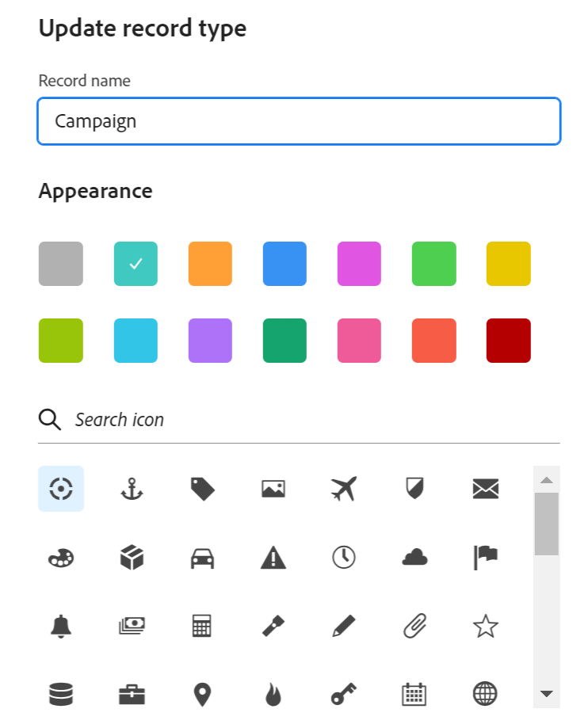

<!--update the metadata with real information when making this available in TOC and in the left nav
---
title: Edit record types
description: You can edit record types after they have been saved. Record types are the objec types of Adobe Maestro.
author: Alina
role: User
feature: Work Management 
topic: Architecture
hidefromtoc: yes
hide: yes
---

-->

# Editar tipos de registros

>[!IMPORTANT]
>
>La información de este artículo hace referencia a Adobe Maestro, que es una nueva oferta de Adobe Workfront.
>
>En la actualidad, Adobe Maestro forma parte de un programa beta abierto a un número limitado de clientes. Debe ser cliente de Workfront para utilizar las funciones de Maestro.
>
>Póngase en contacto con su representante de cuentas para obtener más información acerca de cómo unirse al programa beta de Maestro.
>
>Para obtener más información, consulte [Introducción a Adobe Maestro](../maestro-overview.md).

Los tipos de registro son los tipos de objeto de Adobe Maestro. Puede editar el aspecto de los tipos de registro que usted o cualquier otra persona hayan creado. Para obtener información acerca de cómo crear tipos de registros Maestro, vea [Creación de tipos de registros](../architecture/create-record-types.md).

## Requisitos de acceso

Debe tener el siguiente acceso para realizar los pasos de este artículo:

<table style="table-layout:auto">
 <col>
 </col>
 <col>
 </col>
 <tbody>
    <tr>
<tr>
<td>
   
 Product
 </td>
   <td>
   
 Adobe Workfront
 
Para conectar los tipos de registros de Maestro con Experience Manager Assets, debe tener una licencia de Adobe Experience Manager Assets y la instancia de Workfront de su organización debe estar integrada en Adobe Business Platform o en Adobe Admin Console.
 </td>
  </tr>  
 <td role="rowheader">
acuerdo con Adobe Workfront
</td>
   <td>

Su organización debe estar inscrita en el programa beta cerrado de Adobe Maestro. Póngase en contacto con el representante de cuentas para obtener más información sobre esta nueva oferta. 

   </td>
  </tr>
  <tr>
   <td role="rowheader">
plan de Adobe Workfront
</td>
   <td>

Cualquiera

   </td>
  </tr>
  <tr>
   <td role="rowheader">
Licencia de Adobe Workfront
</td>
   <td>
   
Cualquiera
 
  </td>
  </tr>

<tr>
   <td role="rowheader">
Configuraciones de nivel de acceso
</td>
   <td> 
No hay controles de nivel de acceso para Maestro
  
</td>
  </tr>

<tr>
   <td role="rowheader">
Permisos
</td>
   <td> 
Administración de permisos en un espacio de trabajo</a> 
  
   
Los administradores del sistema tienen permisos para todos los espacios de trabajo, incluidos los que no crearon
</td>
  </tr>
<tr>
   <td role="rowheader">
Plantilla de diseño
</td>
   <td> 
El administrador de Workfront o de grupo debe agregar el área de Maestro en la plantilla de diseño. Para obtener más información, consulte <a href="../access/access-overview.md">Acceso a información general</a>. 
  
</td>
  </tr>

</tbody>
</table>

<!--Maybe enable this at GA - but Maestro is not supposed to have Access controls in the Workfront Access Level: 
>[!NOTE]
>
>If you don't have access, ask your Workfront administrator if they set additional restrictions in your access level. For information on how a Workfront administrator can change your access level, see [Create or modify custom access levels](../administration-and-setup/add-users/configure-and-grant-access/create-modify-access-levels.md). -->

## Editar tipos de registros

{{step1-to-maestro}}

El espacio de trabajo al que se accedió por última vez debe abrirse de forma predeterminada.

1. (Opcional) Expanda la flecha hacia abajo a la derecha del nombre de un área de trabajo existente y seleccione el área de trabajo para la que desea crear tipos de registros.
1. Pase el ratón sobre la tarjeta de un tipo de registro y haga clic en **Más** menú  en la esquina superior derecha de la tarjeta de tipo de registro, haga clic en **Actualizar apariencia**.

   

1. En el cuadro Actualizar tipo de registro, actualice la siguiente información:

   * **Nombre de registro**: edite el nombre del tipo de registro, si es necesario. <!--correct this - I asked Garik to change this field to "Record type name"-->
   * **Aspecto**: edite el color y la forma del icono asociado al tipo de registro. Haga lo siguiente:
      * Seleccione un color para identificar el tipo de registro. Es el color del icono de tipo de registro. Gris está seleccionado de forma predeterminada.
      * Seleccione un icono de la lista o empiece a escribir el nombre de un icono para describir lo que representa y, a continuación, selecciónelo cuando se muestre. Este es el icono del tipo de registro. De forma predeterminada, se selecciona un icono de archivo.

     

1. Haga clic fuera del cuadro Actualizar tipo de registro para guardar los cambios.
1. (Opcional) Haga clic en la tarjeta de tipo de registro del área de trabajo para abrir la página del tipo de registro.
1. Haga clic en **Más** a la derecha del nombre del tipo de registro y haga clic en **Cambiar nombre** para cambiar el nombre del tipo de registro

   O

   Cambie el nombre del tipo de registro en el encabezado.  <!--check to see if they renamed this to "Rename" - it kept going back and forth between Rename and Edit-->

    <!--check this screen shot - not sure this is valid ???-->

   También puede cambiar el nombre de un tipo de registro en el encabezado de la página del tipo de registro.
1. (Opcional) Expanda la flecha hacia abajo a la derecha del nombre de un tipo de registro y seleccione otro tipo de registro para editar.
