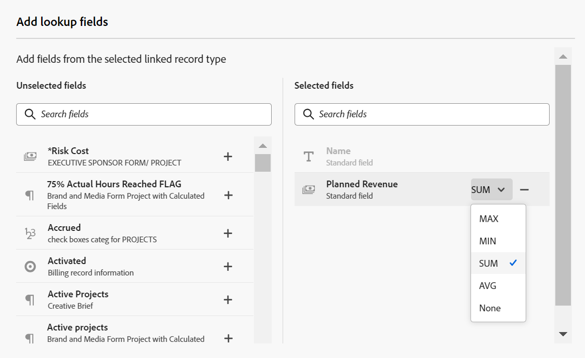

# Ejemplo de conexión de tipos y registros

{{maestro-important-intro}}

Este artículo describe un ejemplo de lo siguiente:

* Crear una conexión entre dos tipos de registros Maestro y dos registros Maestro.

* Cómo crear una conexión entre un tipo de registro de Adobe Maestro y un tipo de objeto de proyecto de Workfront, así como una conexión entre un registro Maestro y un proyecto.

Para obtener más información, consulte los siguientes artículos:

* [Conectar tipos de registros](../architecture/connect-record-types.md)
* [Conectar registros](../records/connect-records.md)

## Conectar dos tipos de registros y registros de Maestro (ejemplo)

Por ejemplo, tiene un tipo de registro denominado Campaign como tipo de registro original.

También tiene otro tipo de registro llamado Producto, que tiene un campo de moneda denominado Presupuesto.

Desea crear un campo en el tipo de registro de Campaign en el que pueda mostrar los valores del campo Presupuesto en el tipo de registro Producto.

Para ello:

1. Abra la vista de tabla del tipo de registro de campaña en un espacio de trabajo.
1. Haga clic en **+** en la esquina superior derecha de la vista de tabla para añadir un nuevo campo y haga clic en **Nueva conexión**, luego haga clic en **Product** en la sección del espacio de trabajo seleccionado.
1. Añada la siguiente información, por ejemplo:

   * **Tipo de registro**: producto <!--did they change the casing here?-->
   * **Nombre**: Información del producto. Es el nombre del campo de registro vinculado.
   * **Descripción**: estos son los productos a los que quiero asociar mis campañas.
   * **Permitir varios registros**: Si deja seleccionada esta opción, los usuarios pueden seleccionar varios registros cuando el campo de tipo de registro vinculado (Información del producto) se muestra en los registros originales (Campañas). En nuestro caso, podrán seleccionar varios productos para conectarlos a una campaña.
   * **Seleccionar campos de búsqueda**: Si deja seleccionada esta opción, la variable **Agregar campos de búsqueda** se abre el cuadro de diálogo siguiente para permitirle vincular los campos de producto con el tipo de registro de Campaign. Puede hacer clic en **Omitir** para omitir este paso y añadir campos de producto más adelante.

   

1. (Condicional) Si seleccionó la variable **Seleccionar opción de campos de búsqueda** en el paso anterior, en la lista de campos asociados con el **Product** tipo de registro, haga clic en **+** para el **Presupuesto** y haga clic en **Añadir campos**. Esto crea un campo llamado **Presupuesto (de la información del producto)**, que es el nombre del campo vinculado. Cualquier información del presupuesto del producto se mostrará en este campo para los registros de campaña.

   

   >[!TIP]
   >
   >    Si desea ver el presupuesto de todos los productos seleccionados como un número total, seleccione **SUM** en el menú desplegable situado a la derecha del nombre del campo. Cuando los usuarios seleccionan varios productos en la **Información del producto** campo de registro vinculado, la variable **Presupuesto (de la información del producto)** El campo suma todos sus valores de Budget y muestra el total. <!-- check the shot below - added a bug with a couple of UI changes here-->
   >
   > Si selecciona **Ninguno**, en lugar de **SUM**, los presupuestos individuales se mostrarán separados por comas.

   Esto genera los campos siguientes:

   * En la vista de tabla de registros de campaña y en la página Detalles de una campaña:

      * **Información del producto** (el campo de registro vinculado): esto muestra el nombre o los nombres de los productos.
      * **Presupuesto (de la información del producto)** (el campo vinculado): esto muestra los presupuestos de los productos seleccionados en el campo Información del producto.

   * En la vista de tabla de registros de producto y en la página Detalles de un producto:

      * **Campaign**: esto indica que el tipo de registro de producto está vinculado desde el tipo de registro de campaña.

     

   >[!TIP]
   >
   >    Los campos de registro vinculados van precedidos del icono de relación .

1. Desde el **Campaign** para crear una campaña agregando una fila nueva en la tabla de la página Tipo de registro de campaña.
1. Haga clic en **+** dentro de la  **Información del producto** de la nueva campaña. El **Conectar objetos** aparece el cuadro. El nombre del tipo de registro al que está vinculando (Product) se muestra en la esquina superior izquierda del cuadro.

   

1. Seleccione los registros de producto que desea conectar con los registros de Campaign y haga clic en **Conectar objetos**.

   Las siguientes columnas se rellenan en la tabla de tipo de registro de Campaign:
   * El **Información del producto** El campo se rellena para el registro de Campaign con los productos seleccionados.
   * **El presupuesto (de la información del producto)** Este campo se rellena con el valor de Presupuesto para cada Producto seleccionado, o con un total de todos los presupuestos de los productos seleccionados (si ha seleccionado SUMA para el agregador).

   

   >[!TIP]
   >
   >Cuando no se selecciona un agregador para los valores múltiples, todos los valores se muestran separados por comas.

1. Para rellenar el **Campaign** del campo **Product** vista de tabla, repita los pasos del 5 al 7 empezando por la vista de tabla Tipo de registro de producto y seleccionando información de campaña. Esto también actualiza el campo Product information en la tabla de la página Campaign record type. <!--ensure the step numbers remain correct-->

## Conectar un tipo de registro de Maestro con un tipo de objeto de proyecto de Workfront y conectar un registro con proyectos individuales

Por ejemplo, tiene un tipo de registro denominado Campaign como tipo de registro original.

También tiene proyectos en Workfront con un campo llamado &quot;Ingresos planificados&quot;.

Desea crear un campo de conexión en el tipo de registro de Campaign donde puede mostrar los valores del campo Ingresos planificados de los proyectos en Workfront que están conectados a campañas en Maestro.

Para ello:

1. Vaya a un espacio de trabajo donde desee conectar el tipo de registro de campaña con proyectos de Workfront.
1. Abra la vista de tabla del tipo de registro de campaña en el espacio de trabajo seleccionado.
1. Haga clic en **+** en la esquina superior derecha de la vista de tabla para añadir un nuevo campo y haga clic en **Nueva conexión**, luego haga clic en **Proyecto** en el **Tipos de objeto de Workfront** sección.
1. Añada la siguiente información, por ejemplo:

   * **Tipo de registro**: proyecto de Workfront (desde la subsección de Workfront)
   * **Nombre**: Información del proyecto. Este es un ejemplo de cómo se puede asignar un nombre al campo de objeto vinculado.
   * **Descripción**: estos son los proyectos a los que quiero asociar mis campañas. Este es un ejemplo de la descripción del campo de registro conectado.
   * 
      * **Permitir varios registros**: Si deja seleccionada esta opción, los usuarios pueden seleccionar varios proyectos cuando el campo de tipo de proyecto vinculado (Información del proyecto) se muestra en los registros originales (Campañas).
   * **Seleccionar campos de búsqueda**: Si deja seleccionada esta opción, la variable **Agregar campos de búsqueda** se abre el cuadro siguiente para permitirle vincular los campos de Project con el tipo de registro de Campaign. Puede hacer clic en **Omitir** para omitir este paso y agregar campos de proyecto más adelante.

   

1. (Condicional) Si seleccionó la variable **Seleccionar opción de campos de búsqueda** en el paso anterior, en la lista de campos asociados con el **Proyecto** tipo de objeto, haga clic en **+** para el **Ingresos planificados** y haga clic en **Añadir campos**. Esto crea un campo llamado **Ingresos planificados (de la información del proyecto)**, que es el nombre del campo vinculado. Cualquier información del campo Ingresos planificados del proyecto se mostrará automáticamente en este campo para los registros de campaña.

   >[!TIP]
   >
   >    Si desea ver los ingresos planificados de todos los proyectos seleccionados como un número total, seleccione **SUM** en el menú desplegable situado a la derecha del nombre del campo. Cuando los usuarios seleccionan varios proyectos en la **Información del proyecto** Campo de objeto vinculado, la variable **Ingresos planificados (de la información del producto)** Este campo suma todos sus valores y muestra el total. <!-- check the shot below - added a bug with a couple of UI changes here-->
   >
   > Si selecciona **Ninguno**, en lugar de **SUM**, los ingresos planificados individuales se muestran separados por comas.

   

   Esto genera los campos siguientes:

   * En la vista de tabla de registros de campaña y en la página Detalles de una campaña:

      * **Información del proyecto** (el campo del objeto vinculado): esto muestra el nombre o los nombres de los proyectos.
      * **Ingresos planificados (de la información del proyecto)** (el campo vinculado): Esto muestra los ingresos planificados de los proyectos seleccionados en el campo Información del proyecto.

   >[!TIP]
   >
   >    Los campos de objeto vinculados van precedidos del icono de relación .

1. Desde el **Campaign** tipo de registro vista de tabla, cree una campaña agregando una nueva fila en la tabla.
1. Haga clic en **+** dentro de la  **Información del proyecto** de la nueva campaña. El **Conectar objetos** aparece el cuadro. El nombre del tipo de objeto al que está vinculando (Workfront Project) se muestra en la esquina superior izquierda del cuadro.

   

1. Seleccione el proyecto o proyectos que desee conectar con los registros de Campaign y haga clic en **Conectar objetos**.

   Se añaden los siguientes elementos al espacio de trabajo seleccionado:

   * En la tabla Tipo de registro de campaña:
      * El **Información del proyecto** Este campo se rellena para el registro de Campaign con los proyectos seleccionados.
      * El **Ingresos planificados (de la información del producto)** Este campo se rellena con el valor de Presupuesto para cada Producto seleccionado. Este es un campo de solo lectura.

   

   >[!TIP]
   >
   >Cuando no se selecciona un agregador para los valores múltiples y se seleccionan varios objetos en el campo enlazado a objetos, todos los valores se muestran separados por comas.

1. Haga clic en el nombre de un proyecto en el campo de registro conectado.

   Esto abre el proyecto de Maestro de sólo lectura **Detalles** página.
Revise la información sobre el proyecto. En la página Detalles solo se muestran los campos de proyecto seleccionados.

1. Haga clic en Ir al origen en la esquina superior derecha de la pantalla para abrir el proyecto en Workfront, si tiene al menos permisos de Vista en el proyecto.
1. (Opcional) Actualice la información sobre el proyecto en Workfront, si tiene permisos para hacerlo.

1. En la vista de tabla de Campaign, pase el ratón sobre **Información del proyecto** encabezado de campo, haga clic en la flecha hacia abajo y, a continuación, haga clic en **Editar campos de búsqueda.**
1. Haga clic en **+** para cualquier campo de proyecto que desee agregar al registro de Workfront Project Maestro en la **Campos no seleccionados** sección.
1. Haga clic en **-** para cualquier campo de proyecto que desee quitar del registro de Workfront Project Maestro en la **Campos seleccionados** sección.
1. Haga clic en **Guardar**.

   Los campos vinculados adicionales se añaden al tipo de registro de campaña.
