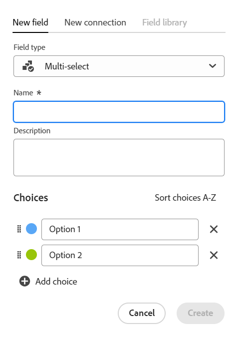
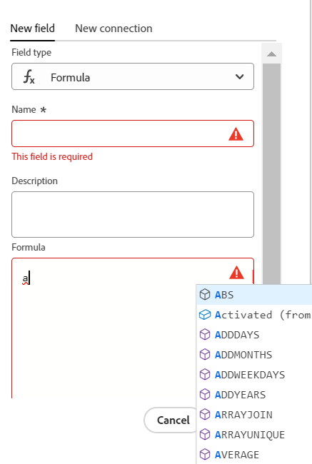

<!--udpate the metadata with real information when making this avilable in TOC and in the left nav-->

<!---
title: Create fields
description: In Adobe Maestro, you can create custom fields for each kind of operational record type or taxonomy. You can then associate the field with Maestro records.
hidefromtoc: yes
hide: yes
author: Alina
feature: (*******************WE NEED A NEW ONE*******************)
role: User, Administrator (************is this right???************)
recommendations: noDisplay, noCatalog
--->

<!--Should the structure of this article be like this one: https://experienceleague.adobe.com/docs/workfront/using/administration-and-setup/customize/custom-forms/custom-form-builder/use-the-custom-form-builder/add-a-custom-field-to-a-custom-form.html?lang=en ??-->

<!--will they add a way to create fields elsewhere than in a table?! - how will that change the structure of this article? -->

<!--Do we need this for FORMULAS: when we release permissions to RECORDS and we release referring lookup fields in a formula field, update considerations to say that lookup fields from linked records depends on the permissions to the record; if they have no permissions to view a linked record, they won't be able to use that records's lookup fields in a formula - not sure is needed??-->

# Creación de campos

{{planning-important-intro}}

En Adobe Workfront Planning, puede crear campos personalizados para los tipos de registro. A continuación, puede asociar los campos con los registros de Workfront Planning para mejorar la información de los registros.

Debe crear tipos de registros antes de poder crear campos que se asocien a ellos. Para obtener más información, consulte [Creación de tipos de registros](../architecture/create-record-types.md).

Puede crear campos de las siguientes maneras en Maestro:

* Desde cero
* Conectando tipos de registros
* Mediante la importación de tipos de registros mediante un archivo CSV o de Excel
* Creando un tipo de registro
* Al crear un espacio de trabajo a partir de una plantilla

Para obtener más información sobre los campos Maestro, consulte [Resumen de campo](/help/quicksilver/maestro/fields/fields-overview.md).

## Requisitos de acceso

Debe tener el siguiente acceso para realizar los pasos de este artículo:

<table style="table-layout:auto">
 <col>
 </col>
 <col>
 </col>
 <tbody>
    <tr>
<tr>
<td>
   
 Product
 </td>
   <td>
   
 Adobe Workfront
 </td>
  </tr>  
 <td role="rowheader">
acuerdo con Adobe Workfront
</td>
   <td>

Su organización debe estar inscrita en el programa beta de Adobe Workfront Planning. Póngase en contacto con el representante de cuentas para obtener más información sobre esta nueva oferta. 

   </td>
  </tr>
  <tr>
   <td role="rowheader">
plan de Adobe Workfront
</td>
   <td>

Cualquiera

   </td>
  </tr>
  <tr>
   <td role="rowheader">
Licencia de Adobe Workfront
</td>
   <td>
   
Cualquiera
 
  </td>
  </tr>

<tr>
   <td role="rowheader">
Configuraciones de nivel de acceso
</td>
   <td> 
No hay control de nivel de acceso para Workfront Planning
  
</td>
  </tr>

<tr>
   <td role="rowheader">
Permisos
</td>
   <td> 
Administración de permisos en un espacio de trabajo</a> 
  
   
Los administradores del sistema tienen permisos para todos los espacios de trabajo, incluidos los que no crearon.

</td>
  </tr>
<tr>
   <td role="rowheader">
Plantilla de diseño
</td>
   <td> 
El administrador del grupo o de Workfront debe agregar el área de Planning a la plantilla de diseño. Para obtener más información, consulte <a href="../access/access-overview.md">Acceso a información general</a>. 
  
</td>
  </tr>

</tbody>
</table>

<!--Maybe enable this at GA - but Maestro is not supposed to have Access controls in the Workfront Access Level: 
>[!NOTE]
>
>If you don't have access, ask your Workfront administrator if they set additional restrictions in your access level. For information on how a Workfront administrator can change your access level, see [Create or modify custom access levels](../administration-and-setup/add-users/configure-and-grant-access/create-modify-access-levels.md). -->

## Crear campos desde cero {#create-fields-from-scratch}

<!--in a table (not sure if this can be done elsewhere?!-->

{{step1-to-maestro}}

El espacio de trabajo al que se accedió por última vez debe abrirse de forma predeterminada.

1. (Opcional) Expanda la flecha hacia abajo a la derecha del nombre de un espacio de trabajo existente y seleccione el espacio de trabajo para el que desea crear campos y, a continuación, haga clic en el tipo de registro.

   Todos los registros existentes asociados al tipo de registro se muestran en las filas de la vista de tabla.

   >[!TIP]
   >
   >    Si no se muestra ningún registro, es posible que aún no tenga ningún registro, o que tenga aplicado un filtro que limite lo que ve en la pantalla.

   Todos los campos existentes asociados al tipo de registro se muestran en las columnas de la vista de tabla. <!--caveat this for when we can hide the fields; mention that they can be hidden if they are not visible by default-->

1. Haga clic en **+** en la esquina superior derecha de la vista de tabla para añadir nuevos campos.
1. En el **Nuevo campo** pestaña, busque un tipo de campo en la **Tipo de campo** o seleccione uno de los siguientes tipos de campo:

   * [Texto de línea única](#single-line-text)
   * [Párrafo](#paragraph)
   * [Selección múltiple](#multi-select)
   * [Selección única](#single-select)
   * [Fecha](#date)
   * [Número](#number)
   * [Porcentaje](#percentage)
   * [Divisa](#currency)
   * [Casilla](#checkbox)
   * [Fórmula](#formula)
   * [Personas](#people)
   * [Creado por](#created-by)
   * [Fecha de creación](#created-date)
   * [Última modificación realizada por](#last-modified-by)
   * [Fecha de la última modificación](#last-modified-date)

   >[!IMPORTANT]
   >
   >    No se puede cambiar el tipo de campo después de guardarlo.

1. Siga agregando cada campo, tal como se describe en las secciones siguientes.

### Texto de línea única {#single-line-text}

Los campos de texto de una sola línea capturan información alfanumérica limitada. Por ejemplo, puede capturar la información del propietario, la parte interesada, el equipo o la unidad organizativa en un campo de texto de una sola línea. El contenido de un campo de texto de una sola línea puede tener hasta 250 caracteres. <!-- asked Lilit if we can change this to "Single-line" since this can have numbers and text.-->

1. Comience a crear un campo como se describe en la sección [Crear campos desde cero](#create-fields-from-scratch) en este artículo, seleccione **Texto de una sola línea** tipo de campo.

   

1. Añada la siguiente información en la **Nuevo campo** pestaña:
   * **Nombre**: Nombre del tipo de campo, tal como aparecerá en una tabla o en la página Detalles del registro. <!--ensure they updated this; and update the screen shot: it used to be "Label"-->
   * **Descripción**: Información adicional sobre el campo. La descripción de un campo se muestra cuando pasa el ratón sobre el encabezado de columna del campo en una tabla.
1. Haga clic en **Crear**.

   El nuevo campo de una sola línea se agrega como una columna al tipo de registro y sus valores se pueden asociar con registros.

### Párrafo {#paragraph}

Los campos de párrafo capturan información alfanumérica adicional sobre un registro, similar al campo Descripción.

>[!TIP]
>
>* El contenido de un campo de párrafo puede tener hasta 1000 caracteres.
>
>* Puede utilizar el formato de texto enriquecido para mejorar el contenido de los campos de párrafo cuando se muestran en la vista de tabla o en la página Detalles de un registro. Para obtener más información, consulte [Edición de registros](/help/quicksilver/maestro/records/edit-records.md).

1. Comience a crear un campo como se describe en la sección [Crear campos desde cero](#create-fields-from-scratch) en este artículo, seleccione **Párrafo** tipo de campo.

   

1. Añada la siguiente información en la **Nuevo campo** pestaña:
   * **Nombre**: Nombre del tipo de campo, tal como aparecerá en una tabla o en la página Detalles del registro. <!--ensure they updated this; and update the screen shot: it used to be "Label"-->
   * **Descripción**: Información adicional sobre el campo. La descripción de un campo se muestra cuando pasa el ratón sobre la columna del campo de una tabla.
1. Haga clic en **Crear**.

   El nuevo campo de párrafo se agrega como una columna al tipo de registro y sus valores se pueden asociar con registros.

### Selección múltiple {#multi-select}

Puede utilizar un campo de selección múltiple para capturar información adicional en cualquier formato seleccionando más de una opción en un menú desplegable.

1. Comience a crear un campo como se describe en la sección [Crear campos desde cero](#create-fields-from-scratch) en este artículo, seleccione **Selección múltiple** tipo de campo.

   

1. Añada la siguiente información en la **Nuevo campo** pestaña:
   * **Nombre**: Nombre del tipo de campo, tal como aparecerá en una tabla o en la página Detalles del registro. <!--ensure they updated this; and update the screen shot: it used to be "Label"-->
   * **Descripción**: Información adicional sobre el campo. La descripción de un campo se muestra cuando pasa el ratón sobre la columna del campo de una tabla.
   * **Opciones**: las opciones disponibles para seleccionar en el menú desplegable después de guardar el campo. Puede tener números y letras para el nombre de cada opción.
1. Clic **Añadir opción** para agregar tantas opciones como sea necesario. No hay límite en la cantidad de opciones que se pueden agregar a un campo de selección múltiple.
1. (Opcional) Arrastre y suelte manualmente cada opción en el orden deseado o seleccione la
   **Ordenar opciones A-Z** si desea que las opciones se muestren automáticamente en orden alfabético. <!--Add this if they added this functionality: You cannot edit this option after you save the field.-->
1. (Opcional) Para quitar una opción, haga clic en **x** a la derecha de la imagen.
1. Haga clic en la muestra de color a la izquierda de la opción para expandir el selector de color y personalizar el color de cada opción.
1. Haga clic en **Crear**.

   El nuevo campo de selección múltiple se agrega como una columna al tipo de registro y sus valores se pueden asociar con registros.

### Selección única {#single-select}

Los campos de selección única capturan información adicional en cualquier formato seleccionando una opción en un menú desplegable.

1. Comience a crear un campo como se describe en la sección [Crear campos desde cero](#create-fields-from-scratch) en este artículo, seleccione **Selección única** tipo de campo.

   

1. Añada la siguiente información en la **Nuevo campo** pestaña:
   * **Nombre**: Nombre del tipo de campo, tal como aparecerá en una tabla o en la página Detalles del registro. <!--ensure they updated this; and update the screen shot: it used to be "Label"-->
   * **Descripción**: Información adicional sobre el campo. La descripción de un campo se muestra cuando pasa el ratón sobre la columna del campo de una tabla.
   * **Opciones**: las opciones disponibles para seleccionar en el menú desplegable después de guardar el campo. Puede tener números y letras para el nombre de cada opción.

1. Clic **Añadir opción** para agregar tantas opciones como sea necesario. No hay límite en la cantidad de opciones que se pueden agregar a un campo de selección única.
1. (Opcional) Arrastre y suelte manualmente cada opción en el orden deseado o seleccione la **Ordenar opciones A-Z** si desea que las opciones se muestren automáticamente en orden alfabético. <!--Add this if they added this functionality: You cannot edit this option after you save the field.-->
1. (Opcional) Para quitar una opción, haga clic en **x** a la derecha de la imagen.
1. Haga clic en la muestra de color a la izquierda de la opción para expandir el selector de color y personalizar el color de cada opción.
1. Haga clic en **Crear**.

   El nuevo campo de selección única se agrega como una columna al tipo de registro y sus valores se pueden asociar con registros.

### Fecha {#date}

Puede utilizar un campo de fecha para capturar información adicional en formato de fecha y hora.

1. Comience a crear un campo como se describe en la sección [Crear campos desde cero](#create-fields-from-scratch) en este artículo, seleccione **Fecha** tipo de campo.

   

1. Añada la siguiente información en la **Nuevo campo** pestaña:
   * **Nombre**: Nombre del tipo de campo, tal como aparecerá en una tabla o en la página de registro. <!--ensure they updated this; and update the screen shot: it used to be "Label"-->
   * **Descripción**: Información adicional sobre el campo. La descripción de un campo se muestra cuando pasa el ratón sobre la columna del campo de una tabla.
   * **Formato de fecha**: Tipo de formato de fecha que desea mostrar en este campo. <!--update this casing - submitted bug for it-->

     Seleccione entre los siguientes formatos:
      * **Configuración regional**: coincide con la configuración regional del explorador.
      * **Standard**: 16/05/2023
      * **Largo**: 16 de mayo de 2023
      * **Europeo**: 05/16/2023
      * **ISO**: 16-05-2023
   * **Incluir un campo de hora**: seleccione esta opción si desea incluir una marca de tiempo. De forma predeterminada, esta opción no está seleccionada. <!--update this setting name - submitted bug for it to be changed-->

     Seleccione entre las siguientes opciones:

      * **24 horas**: Por ejemplo: 18:00
      * **12 h**: Por ejemplo: 18:00

1. Haga clic en **Crear**.

   El nuevo campo de fecha se agrega como una columna al tipo de registro y sus valores se pueden asociar con registros.

### Número {#number}

Los tipos de campos de número capturan información en formato numérico.

1. Comience a crear un campo como se describe en la sección [Crear campos desde cero](#create-fields-from-scratch) en este artículo, seleccione **Número** tipo de campo.

   
1. Añada la siguiente información en la **Nuevo campo** pestaña:

   * **Nombre**: Nombre del tipo de campo, tal como aparecerá en una tabla o en la página de registro.
   * **Descripción**: Información adicional sobre el campo. La descripción de un campo se muestra cuando pasa el ratón sobre la columna del campo de una tabla.
   * **Precisión**: El número de decimales que desea registrar para el campo. Se pueden mostrar hasta 6 decimales.
   * **Permitir números negativos**: seleccione esta opción si desea permitir números negativos en este campo. Esta opción está desactivada de forma predeterminada.

   >[!NOTE]
   >
   >    Si selecciona Permitir números negativos y los valores negativos se almacenan en los registros a los que está adjunto el campo, ya no podrá anular la selección de la configuración en el futuro.

1. Haga clic en **Crear**.

   El nuevo campo de número se agrega como una columna al tipo de registro y sus valores se pueden asociar con registros.

### Porcentaje {#percentage}

Los tipos de campo de porcentaje capturan información en un formato numérico seguido de un signo de porcentaje.

1. Comience a crear un campo como se describe en la sección [Crear campos desde cero](#create-fields-from-scratch) en este artículo, seleccione **Porcentaje** tipo de campo.

   

1. Añada la siguiente información en la **Nuevo campo** pestaña:
   * **Nombre**: Nombre del tipo de campo, tal como aparecerá en una tabla o en la página de registro.
   * **Descripción**: Información adicional sobre el campo. La descripción de un campo se muestra cuando pasa el ratón sobre la columna del campo de una tabla.
   * **Precisión**: El número de decimales que desea registrar para el campo. Se pueden mostrar hasta 6 decimales.
   * **Permitir números negativos**: seleccione esta opción si desea permitir valores de porcentaje negativos en este campo. Esta opción está desactivada de forma predeterminada.

   >[!NOTE]
   >
   >    Si selecciona Permitir números negativos y los valores negativos se almacenan en los registros a los que está adjunto el campo, ya no podrá anular la selección de la configuración en el futuro.

1. Haga clic en **Crear**.

   El nuevo campo de porcentaje se agrega como una columna al tipo de registro y sus valores se pueden asociar con registros.

### Divisa {#currency}

Los tipos de campo Moneda capturan información en un formato de número precedido por un símbolo de moneda.

1. Comience a crear un campo como se describe en la sección [Crear campos desde cero](#create-fields-from-scratch) en este artículo, seleccione **Moneda** tipo de campo.

   

1. Añada la siguiente información en la **Nuevo campo** pestaña:
   * **Nombre**: Nombre del tipo de campo, tal como aparecerá en una tabla o en la página de registro. <!--ensure they updated this; and update the screen shot: it used to be "Label"-->
   * **Descripción**: Información adicional sobre el campo. La descripción de un campo se muestra cuando pasa el ratón sobre la columna del campo de una tabla.
   * **Moneda**: El tipo de moneda que desea mostrar en este campo. Esta es una lista de monedas según la Organización Internacional de Normalización (ISO).
   * **Precisión**: El número de decimales que desea registrar para el campo. Se pueden mostrar hasta 6 decimales.
   * **Permitir números negativos**: seleccione esta opción si desea permitir valores de moneda negativos en este campo. Esta opción está desactivada de forma predeterminada.

   >[!NOTE]
   >
   >    Si selecciona Permitir números negativos y los valores negativos se almacenan en los registros a los que está adjunto el campo, ya no podrá anular la selección de la configuración en el futuro.

1. Haga clic en **Crear**.

   El nuevo campo de moneda se agrega como una columna al tipo de registro y sus valores se pueden asociar con registros.

### Casilla de verificación

Puede utilizar el tipo de campo Casilla de verificación para agregar una sola opción de casilla de verificación a un registro. Puede utilizar este campo para indicar un atributo o estado específico para ese registro en particular. Por ejemplo, puede utilizarlo como indicador para rastrear la finalización, la aprobación o cualquier otro atributo binario de cada registro.

1. Comience a crear un campo como se describe en la sección [Crear campos desde cero](#create-fields-from-scratch) en este artículo, seleccione **Casilla** tipo de campo.

   

1. Añada la siguiente información en la **Nuevo campo** pestaña:
   * **Nombre**: Nombre del tipo de campo, tal como aparecerá en una tabla o en la página de registro. <!--ensure they updated this; and update the screen shot: it used to be "Label"-->
   * **Descripción**: Información adicional sobre el campo. La descripción de un campo se muestra cuando pasa el ratón sobre la columna del campo de una tabla.
1. Haga clic en **Crear**.

   El nuevo campo de casilla de verificación se agrega como una columna al tipo de registro y sus valores se pueden asociar con registros.

### Fórmula

Los campos de fórmula generan un nuevo valor utilizando valores existentes de otros campos en un tipo de registro y una función que indica cómo se deben calcular los valores existentes.

Para obtener más información, consulte [Información general sobre campos de fórmula](/help/quicksilver/maestro/fields/formula-fields.md).

1. Comience a crear un campo como se describe en la sección [Crear campos desde cero](#create-fields-from-scratch) en este artículo, seleccione **Fórmula** tipo de campo.

   

1. Añada la siguiente información en la **Nuevo campo** pestaña:

   * **Nombre**: introduzca un nombre para el nuevo campo.
   * **Descripción**: Añada información sobre el nuevo campo.
   * **Fórmula**: Empiece a escribir al menos un carácter para acceder a una expresión y, a continuación, selecciónela cuando se muestre en la lista.

1. Haga clic en la expresión seleccionada para mostrar la definición y ver su formato.

   

   Para obtener más información sobre las expresiones admitidas, consulte [Información general sobre campos de fórmula](/help/quicksilver/maestro/fields/formula-fields.md)

1. Agregue nombres de campo tal y como se muestran en Workfront Planning para hacer referencia a ellos en una fórmula.

   >[!NOTE]
   >
   > No se pueden agregar campos de tipo Selección múltiple en una fórmula.

1. Haga clic en **Crear**.

   El nuevo campo de fórmula se agrega como una columna al tipo de registro y sus valores se pueden asociar a registros.

### Personas

Puede utilizar el tipo de campo Personas para agregar un usuario <!--, job role, or team--> a un registro. Este es un campo de escritura anticipada y solo puede añadir usuarios<!--, roles, or teams--> que ya existen en su instancia de Workfront.

1. Comience a crear un campo como se describe en la sección [Crear campos desde cero](#create-fields-from-scratch) en este artículo, seleccione **People** tipo de campo.

   

1. Añada la siguiente información en la **Nuevo campo** pestaña:
   * **Nombre**: Nombre del tipo de campo, tal como aparecerá en una tabla o en la página de registro.
   * **Descripción**: Información adicional sobre el campo. La descripción de un campo se muestra cuando pasa el ratón sobre la columna del campo de una tabla.
   * **Permitir varios valores**: seleccione esta opción si desea permitir que los usuarios agreguen más de un usuario en este campo. Esta opción está desactivada de forma predeterminada.

   >[!NOTE]
   >
   >    Si selecciona Permitir varios valores y se almacenan varios usuarios en los registros a los que está adjunto el campo, ya no podrá anular la selección de la configuración en el futuro al editar este campo.

1. Haga clic en **Crear**.

   El nuevo campo de tipo Personas se agrega como una columna al tipo de registro y sus valores se pueden asociar con registros.

### Creado por

Puede utilizar el tipo de campo Creado por para agregar el usuario que creó el registro a un registro. Este es un campo de solo lectura y se rellena automáticamente con el nombre del usuario que había iniciado sesión cuando se creó el registro.

1. Comience a crear un campo como se describe en la sección [Crear campos desde cero](#create-fields-from-scratch) en este artículo, seleccione **Creado por** tipo de campo.

   

1. Añada la siguiente información en la **Nuevo campo** pestaña:

   * **Nombre**: Nombre del tipo de campo, tal como aparecerá en una tabla o en la página de registro. <!--this might change and they might prepopulate it with "Created by"-->
   * **Descripción**: Información adicional sobre el campo. La descripción de un campo se muestra cuando pasa el ratón sobre la columna del campo de una tabla.

1. Haga clic en **Crear**.

   El nuevo campo Creado por tipo se agrega como una columna al tipo de registro y sus valores se rellenan previamente con el nombre del usuario que creó cada registro.

### Fecha de creación

Puede utilizar el tipo de campo Fecha de creación para agregar la fecha en la que se creó el registro a un registro. Este es un campo de solo lectura y se rellena automáticamente con la fecha (y opcionalmente con la hora) en que se creó el registro.

1. Comience a crear un campo como se describe en la sección [Crear campos desde cero](#create-fields-from-scratch) en este artículo, seleccione **Fecha de creación** tipo de campo.

   

   <!--check the image above - added bug fix for UI text changes-->

1. Añada la siguiente información en la **Nuevo campo** pestaña:

   * **Nombre**: Nombre del tipo de campo, tal como aparecerá en una tabla o en la página de registro. <!--this might change and they might prepopulate it with "Created date"-->
   * **Descripción**: Información adicional sobre el campo. La descripción de un campo se muestra cuando pasa el ratón sobre la columna del campo de una tabla.
   * **Formato de fecha**: Seleccione entre los siguientes formatos:

      * **Configuración regional**: coincide con la configuración regional del explorador.
      * **Standard**: 16/05/2023
      * **Largo**: 16 de mayo de 2023
      * **Europeo**: 05/16/2023
      * **ISO**: 16-05-2023
   * **Incluir un campo de hora**: seleccione esta opción si desea incluir una marca de tiempo. De forma predeterminada, esta opción no está seleccionada. <!--submitted a UI text change for this - check the UI-->

     Seleccione entre las siguientes opciones:

      * **24 horas**: Por ejemplo: 18:00
      * **12 h**: Por ejemplo: 18:00

1. Haga clic en **Crear**.

   El nuevo campo de tipo Fecha de creación se agrega como una columna al tipo de registro y sus valores se rellenan previamente con la fecha (o fecha y hora) en que se creó el registro.

### Última modificación realizada por

Puede utilizar el tipo de campo Última modificación realizada por para agregar a un registro al usuario que modificó el registro por última vez. Este es un campo de solo lectura y se rellena automáticamente con el nombre del usuario que inició sesión cuando se actualizó el registro por última vez.

1. Comience a crear un campo como se describe en la sección [Crear campos desde cero](#create-fields-from-scratch) en este artículo, seleccione **Última modificación de:** tipo de campo.

   

1. Añada la siguiente información en la **Nuevo campo** pestaña:

   * **Nombre**: Nombre del tipo de campo, tal como aparecerá en una tabla o en la página de registro. <!--this might change and they might prepopulate it with "Created by"-->
   * **Descripción**: Información adicional sobre el campo. La descripción de un campo se muestra cuando pasa el ratón sobre la columna del campo de una tabla.

1. Haga clic en **Crear**.

   El nuevo campo Última modificación por tipo se agrega como una columna al tipo de registro y sus valores se rellenan previamente con el nombre del usuario que modificó cada registro por última vez.

### Fecha de la última modificación

Puede utilizar el tipo de campo Fecha de la última modificación para agregar la fecha en la que se modificó por última vez un registro a un registro. Este es un campo de solo lectura y se rellena automáticamente con la fecha (y opcionalmente con la hora) en que se modificó el registro por última vez.

1. Comience a crear un campo como se describe en la sección [Crear campos desde cero](#create-fields-from-scratch) en este artículo, seleccione **Fecha de creación** tipo de campo.

   

   <!--check the image above - added bug fix for UI text changes-->

1. Añada la siguiente información en la **Nuevo campo** pestaña:

   * **Nombre**: Nombre del tipo de campo, tal como aparecerá en una tabla o en la página de registro. <!--this might change and they might prepopulate it with "Created date"-->
   * **Descripción**: Información adicional sobre el campo. La descripción de un campo se muestra cuando pasa el ratón sobre la columna del campo de una tabla.
   * **Formato de fecha**: Seleccione entre los siguientes formatos:

      * **Configuración regional**: coincide con la configuración regional del explorador.
      * **Standard**: 16/05/2023
      * **Largo**: 16 de mayo de 2023
      * **Europeo**: 05/16/2023
      * **ISO**: 16-05-2023
   * **Incluir un campo de hora**: seleccione esta opción si desea incluir una marca de tiempo. De forma predeterminada, esta opción no está seleccionada. <!--submitted a UI text change for this - check the UI-->

     Seleccione entre las siguientes opciones:

      * **24 horas**: Por ejemplo: 18:00
      * **12 h**: Por ejemplo: 18:00

1. Haga clic en **Crear**.

   El nuevo campo de tipo Fecha de la última modificación se agrega como una columna al tipo de registro y sus valores se rellenan previamente con la fecha (o fecha y hora) en que se modificó por última vez el registro.

## Creación de campos conectando tipos de registro

Puede crear campos de registro vinculados cuando agregue una nueva conexión entre dos tipos de registro Maestro o un tipo de registro y un tipo de objeto de otras aplicaciones.

Para obtener información sobre cómo conectar tipos de registros de Workfront Planning, consulte [Conectar tipos de registros](../architecture/connect-record-types.md)

## Crear campos mediante la importación de tipos de registro mediante un archivo CSV o de Excel

Para obtener más información, consulte [Creación de tipos de registros](../architecture/create-record-types.md).

## Creación de campos creando un tipo de registro

Al crear un tipo de registro, también se crean de forma predeterminada varios campos asociados al nuevo tipo de registro. Para obtener más información, consulte [Creación de tipos de registros](../architecture/create-record-types.md).

## Creación de campos creando un espacio de trabajo a partir de una plantilla

Adobe Workfront Planning crea campos para los tipos de registro al crear un espacio de trabajo a partir de una plantilla.

Para obtener más información, consulte [Creación de espacios de trabajo](/help/quicksilver/maestro/architecture/create-workspaces.md).