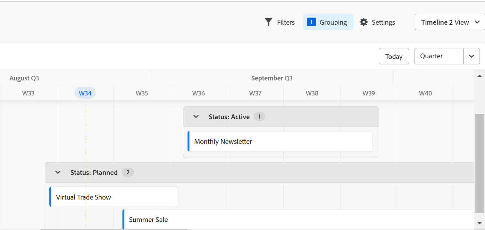

# Introducción a Adobe Maestro

<!--udpate the metadata with real information when making this avilable in TOC and in the left nav-->

<!-- remove the references to closed beta from the entire article-->

<!--update the video in the IMPORTANT below, when we have something better, especially after Open Beta - remove it-->

>[!IMPORTANT]
>
>La información de este artículo hace referencia a Adobe Maestro, que es una nueva oferta de Adobe Workfront.
>
>En la actualidad, Adobe Maestro forma parte de un programa beta abierto a un número limitado de clientes. Debe ser cliente de Workfront para utilizar las funciones de Maestro.
>
>Póngase en contacto con su representante de cuentas para obtener más información acerca de cómo unirse al programa beta de Maestro.
>[Vea un vídeo de demostración de Adobe Maestro](https://video.tv.adobe.com/v/3424253/){target=_blank}

## Introducción a Adobe Maestro

Adobe Maestro es una nueva oferta de Adobe Workfront. El propósito de Maestro es obtener una visibilidad completa de los detalles operativos de una organización y responder a preguntas comerciales críticas en cada fase del ciclo de vida de la administración del trabajo.

Los equipos y el liderazgo necesitan respuestas claras a preguntas como las siguientes:

* ¿Cuántas campañas se están ejecutando en EMEA en el cuarto trimestre?
* ¿Hay superposiciones de audiencia entre campañas simultáneas?
* ¿Qué tan bien están haciendo los programas de concientización en este momento?
* ¿Qué aspecto tienen los recursos en una campaña en particular? ¿Cuál de ellos aún debe ser aprobado?

Para responder a estas preguntas, el liderazgo necesita una solución que pueda proporcionar una visión integral de cada etapa del trabajo, desde la planificación hasta la ejecución, desde la entrega hasta la medición de los resultados. Actualmente, las organizaciones tienen herramientas que pueden cubrir algunas partes del proceso, pero muchas no tienen buenas conexiones con todas las fases del trabajo, ni pueden proporcionar resultados de manera confiable.

Estas son algunas de las funciones principales de Maestro:

* Solucionar el problema de la gestión del trabajo en todas las etapas y para todas las partes interesadas que participan en el proceso de trabajo.
* Personalice completamente los flujos de trabajo, desde decidir qué tipos de objetos (o tipos de registros) utiliza su organización hasta configurar cómo se vinculan estos objetos entre sí.
* Enlace a tipos de objetos de otros sistemas, creando un marco coherente para todos sus procesos.

## Funciones disponibles actualmente en Maestro

En la tabla siguiente se ilustran las características principales que estarán disponibles en Maestro y una cronología de su disponibilidad. La lista no incluye todas las funciones.

| Función | Disponible ahora | Disponible próximamente | En investigación |
|----------------------------------------------------|:-----------------------------:|:--------------------------------:|:----------------:|
| Creación de espacios de trabajo | ✓ |                                  |                  |
| Creación de tipos de registros operativos | ✓ |                                  |                  |
| Creación de taxonomías | ✓ |                                  |                  |
| Creación de registros y taxonomías individuales con nombre | ✓ |                                  |                  |
| Crear campos personalizados de registro | ✓ |                                  |                  |
| Importar tipos de registros y campos mediante un archivo CSV o de Excel | ✓ |                                  |                  |
| Enlazar registros | ✓ |                                  |                  |
| Visualización de registros en una tabla | ✓ |                                  |                  |
| Visualización de registros en una cronología | ✓ |                                  |                  |
| Filtrar registros | ✓ |                                  |                  |
| Agrupar registros en la vista de cronología | ✓ |                                  |                  |
| Agrupar registros en la vista de tabla | ✓ |                                 |                  |
| Ordenar registros en la vista de tabla | ✓ |                                 |                  |
| Ordenar registros en la vista de cronología |                               | ✓ |                  |
| Ordenar agrupaciones en la vista de tabla |                               | ✓ |                  |
| Ordenar agrupaciones en la vista de cronología |                               | ✓ |                  |
| Conectar espacios de trabajo |                               | ✓ |                  |
| Conectar registros y taxonomías de Maestro | ✓ |
| Buscar registros en la vista de tabla | ✓ |   |
| Buscar registros en la vista de cronología | ✓ |   |
| Conectar registros de Maestro a proyectos, programas, portafolios, empresas y grupos de Workfront | ✓ |                                 |                  |
| Conectar registros de Maestro a recursos de Adobe Experience Manager | ✓ |                                  |                 |
| Registrar página de detalles | ✓ |                                  |                  |
| Actualizar el diseño de la página Detalles del registro |                               | ✓ |                  |
| Compartir espacios de trabajo | ✓ | |  |
| Compartir vistas | ✓ | |  |
| Envío de solicitudes |                               |                                  | ✓ |
| Informe creativo |                               |                                  | ✓ |
| Personalizar el color y el icono de un registro | ✓ |                                  |                 |
| Agregar comentarios a registros | ✓ |                                  |                 |
| Formato de texto enriquecido para campos de párrafo | ✓ |                                  |                 |
| Módulos de Maestro para Adobe Workfront Fusion | ✓ |                                  |                 |
| Copiar y pegar información de un campo a otro | ✓ |                                  |                 |

## Habilite Maestro para los usuarios de la instancia de Workfront

Su organización debe inscribirse en el programa beta cerrado de Adobe Maestro para poder acceder a Maestro. Póngase en contacto con su representante de cuentas para obtener información sobre cómo inscribirse en el programa beta.

Para obtener más información sobre cómo conceder acceso a Maestro y permitir que otros utilicen el programa, vea [Acceso a información general](/help/quicksilver/maestro/access/access-overview.md).

## Terminología de Maestro

Aunque Maestro forma parte de Workfront, incluye conceptos y terminología propios. Familiarícese con los conceptos de Maestro antes de comenzar a configurar Maestro para su organización.

El marco de trabajo de Maestro es totalmente personalizable. Puede crear todos los tipos de registros, sus atributos y cualquier campo asociado a ellos para adaptarlos a las necesidades exactas de su organización.

Los siguientes son los objetos y conceptos principales de Maestro:

* **Workspace**: Recopilación de tipos de registros y taxonomías que definen el ciclo de vida operativo de una determinada organización. Un espacio de trabajo es el marco de trabajo de una unidad organizativa.

  Una instancia de Workfront puede tener un máximo de 1000 espacios de trabajo.

  

  Para obtener más información, consulte [Creación de espacios de trabajo](../maestro/architecture/create-workspaces.md).

* **Tipo de registro**: el tipo de objeto principal de Maestro.

  A diferencia de Workfront, donde los tipos de objeto están predefinidos, en Maestro puede crear sus propios tipos de objeto.

  Por ejemplo, en Workfront ya se han creado los tipos de objeto Programa, Portfolio, Proyecto, Tarea o Problema.

  En Maestro, puede crear cualquier tipo de registro que se ajuste a los flujos de trabajo de su organización. Posteriormente, puede definir cómo se relacionan los tipos de registro entre sí o las dependencias del formulario.

  Para obtener más información, consulte [Descripción general de los tipos de registros operativos y taxonomías](../maestro/architecture/overview-of-record-types-and-taxonomies.md).

  Maestro tiene los siguientes tipos de registros:

   * **Tipo de registro operativo**: un tipo de registro que representa planes estratégicos, iniciativas o trabajo ejecutado.

     

     Por ejemplo, Campaña, Actividad, Programa pueden ser tipos de registros operativos.

     Para obtener más información, consulte [Creación de tipos de registros](../maestro/architecture/create-record-types.md).

   * **Taxonomía**: un tipo de registro que captura atributos acerca de un tipo de registro operativo.

     

     Aunque la creación de taxonomías es idéntica a la creación de tipos de registros operativos, Maestro distingue entre un tipo de registro operativo y un tipo de registro de taxonomía. El propósito de las taxonomías es mejorar los tipos de registros operativos. <!--this is no longer true, but might be later?!: A taxonomy is a record without dates, like a static list of attributes.-->

     Por ejemplo, Audiencia, Región o Dirección pueden ser tipos de registros de tipo taxonomía.

     Para obtener más información, consulte [Crear tipos de registros de taxonomía](../maestro/architecture/create-a-taxonomy.md).

* **Registro**: instancia de un tipo de registro Maestro. Un registro puede hacer referencia a un tipo de registro operativo o a una taxonomía.

  
  

  Después de agregar un tipo de registro a un espacio de trabajo, puede empezar a agregar registros de ese tipo en la página del tipo de registro.

  Por ejemplo, &quot;Campaña&quot; puede ser un tipo de registro operativo y &quot;Campaña de verano para EMEA&quot; es un registro del tipo de registro de campaña

  O

  &quot;Región&quot; es un tipo de registro de tipo taxonomía, mientras que &quot;América-América Latina&quot; o &quot;EMEA - Europa Central&quot; son registros de taxonomía.

  Para obtener más información, consulte [Creación de registros](../maestro/records/create-records.md).

* **Plantilla de Workspace**: puede crear un espacio de trabajo con plantillas predefinidas. Puede utilizar los tipos de registros predefinidos, taxonomías y campos que se incluyen en una plantilla, o bien puede agregar los suyos propios.

  

  Maestro incluye una plantilla de área de trabajo de ventas, marketing y administración de productos.

  Para obtener más información, consulte [Creación de espacios de trabajo](../maestro/architecture/create-workspaces.md).

* **Campos**: los campos son atributos que se pueden agregar a tipos de registro operativos o de taxonomía que contienen información sobre el tipo de registro. <!--check the shot below, "Connection" needs to be in lowercase-->

  

  Consideraciones sobre los campos de Maestro:

   * Los campos que agregue para un tipo de registro se asocian automáticamente a todos los registros de ese tipo y se pueden utilizar para capturar datos sobre esos registros.

   * Los campos se muestran como columnas en la vista Tabla aplicada a una página de tipo de registro. También se muestran en la página Detalles del registro.

   * Los campos son exclusivos de un tipo de registro y no se transfieren de un tipo de registro a otro.

   * Los campos de Maestro son totalmente personalizables y sólo se puede acceder a ellos desde Maestro. No puede tener acceso a los campos de Maestro desde Workfront.

  Para obtener más información, consulte [Creación de campos](../maestro/fields/create-fields.md).

  De forma predeterminada, un nuevo tipo de registro operativo está asociado a los siguientes campos predefinidos:

   * Nombre
   * Descripción
   * Fecha de inicio
   * Fecha de finalización
   * Estado

  De forma predeterminada, un nuevo tipo de registro de taxonomía está asociado a un campo Nombre.

  Puede crear campos personalizados de los siguientes tipos:

   * Texto de línea única
   * Párrafo
   * Selección múltiple
   * Selección única
   * Fecha
   * Número
   * Porcentaje
   * Divisa
   * Casilla de verificación
   * Fórmula
   * Personas
   * Creado por
   * Fecha de creación
   * Última modificación realizada por
   * Fecha de la última modificación

* **Tipos de registros vinculados**, **Registros vinculados**, y **Campos de registro vinculados**: Puede crear una conexión entre las siguientes entidades:

   * Dos tipos de registros de Maestro
   * Un tipo de registro Maestro y un tipo de objeto de proyecto, programa, portafolio, compañía o grupo de Workfront.
   * Un tipo de registro Maestro y un recurso, carpeta o colección de Adobe Experience Manager.

     Debe tener una licencia de Adobe Experience Manager para vincular tipos de registros con objetos de Experience Manager.

     

  Después de establecer una conexión entre los tipos de registro, puede conectar registros individuales de esos tipos entre sí. La conexión entre los registros se muestra como un campo de registro vinculado.

* **Campos vinculados** (o campos de búsqueda): después de establecer la conexión entre dos tipos de registro y vincular registros individuales, puede hacer referencia a los campos de los registros vinculados en el registro desde el que se conecta.

  

  Para obtener información sobre cómo vincular tipos de registros, registros y crear campos vinculados, vea los siguientes artículos:

   * [Conectar tipos de registros](../maestro/architecture/connect-record-types.md)
   * [Conectar registros](../maestro/records/connect-records.md)

<!--not yet:* Fields are reusable across Record Types.  -->

* **Vistas**: los registros se muestran en su página de tipo de registro respectiva en diferentes tipos de vistas.

  

  Las vistas contienen configuraciones personalizadas de un tipo de vista específico, como la lista de campos (columnas), una lista de registros (filas), su orden (ordenación) y un filtro y agrupación aplicados o aplicables.

  Los siguientes son tipos de vista que puede aplicar a la página de tipo de registro:

   * **Vista de tabla**: Muestra los registros y sus campos en formato de tabla. Las filas de la tabla son los registros individuales y las columnas son los campos de registro. Esta es la vista predeterminada.

     

   * **Vista Cronología**: Muestra registros que tienen al menos dos campos de tipo Fecha en una cronología.

     

  Para obtener más información, consulte [Administrar vistas de registros](../maestro/views/manage-record-views.md).

## Limitaciones de objetos de Maestro

En la tabla siguiente se muestran los límites de la cantidad de objetos que se pueden crear en Maestro. Las limitaciones están sujetas a cambios a medida que avanzamos en las siguientes fases del desarrollo de Maestro.

| Objeto Maestro | Límite |
|-------------------------------------------------------------------------------|:---------------------------------------------------------------------------------------------------------------:|
| Número de espacios de trabajo de una instancia de Workfront | 1.000 |
| Número de tipos de registro de un espacio de trabajo | 1000 (incluye taxonomías para el espacio de trabajo u objetos que se importan desde aplicaciones de terceros) |
| Número de registros para un tipo de registro | 10.000 |
| Número de campos para un tipo de registro o taxonomía | 500 |
| Número de caracteres de un campo de texto | 1.000 caracteres |
| Tamaño del archivo que puede pegar en una tabla de tipo de registro | 1 MB |
| Tamaño del archivo que puede importar mediante la API para una tabla de tipo de registro | 1,5 MB |
| Velocidad a la que se pueden realizar solicitudes de API | 200 solicitudes por minuto |
| Tamaño del archivo CSV de Excel que puede importar en una tabla | 5 MB |

## Localizar Maestro

Asegúrese de que su organización ha recibido acceso a Maestro y de que el administrador del sistema o del grupo ha agregado el área de Maestro al menú principal.

Para localizar Maestro:

1. Inicie sesión en Adobe Workfront.

1. Haga clic en **Menú principal**  en la esquina superior derecha o haga clic en el botón **Menú principal**  en la esquina superior izquierda, si está disponible.

1. Clic **Maestro** .

   Se abre el área de espacios de trabajo de Maestro.

1. (Opcional y recomendada) Continúe con algunas de las siguientes acciones para crear la estructura de trabajo en Maestro:

   1. Cree un espacio de trabajo desde cero o con una plantilla.

   1. Agregue tipos de registros al nuevo espacio de trabajo.

   1. Añada taxonomías a los nuevos espacios de trabajo.

   1. Haga clic en el nombre de un tipo de registro para abrir la página del registro. La página de registros se abre en la vista Tabla de forma predeterminada.

   1. Personalice la vista Tabla mediante cualquiera de las acciones siguientes:

      * Añada más campos al tipo de registro haciendo clic en el **+** en la esquina superior derecha. Las columnas de la vista son campos asociados al tipo de registro.
      * Agregue registros haciendo clic en el **+** en la esquina inferior izquierda. Las filas de la vista son registros únicos del tipo de registro seleccionado.
      * Clic **Filtros** para filtrar la información que se muestra en la página tipo de registro.

   1. Haga clic en el nombre de un registro para ver más información en la página Detalles del registro.

   1. Cree una vista Cronología desde el **Ver** menú desplegable en la esquina superior derecha de la página tipo de registro.

   1. Personalice la vista de cronología actualizando Filtros, Agrupaciones o Configuración.

## Actividad de versión de Maestro

Estamos lanzando nuevas funciones a Maestro con regularidad. Para obtener una lista actualizada de las funciones lanzadas, consulte [Actividad de versión de Adobe Maestro](../maestro/release-activity.md).

<!--moved the contents of this whole section to its own article: release-activity.md, in the same folder

This section lists the features and patches that have been released after the launch of the Maestro closed beta program, on May 22, 2023. 

The features are released weekly and are listed in the order of their release, with the most recent first. Customers who are participating in the Maestro closed beta program can access all features in their Preview and Production environments. 

### Week of September 4, 2023

#### Connect Maestro records with Workfront companies and groups

Preview and production: September 5, 2023  

You can now connect a Maestro record with Workfront companies and groups. You must first create a connection between a Maestro record type and the Workfront companies and groups object types. Then, you can connect a single Maestro record of the selected record type to individual Workfront companies and groups.  

Consider the following:  

* You must create a connection between Maestro record types and Workfront companies and groups for each Workspace.  

* You cannot connect taxonomy record types with Workfront object types. 

* You can connect multiple Maestro records to the same Workfront company or group, and multiple companies or groups to the same Maestro record.  

* You cannot edit companies or groups in Maestro. All company or group changes performed in Workfront are visible in Maestro, when reviewing the Maestro linked records.  

#### URL support for single-line text fields 

Preview and production: September 7, 2023 

For better visibility when working with links in the Table view, we have added support for URLs in single-line text fields. Using URLs to other websites or external drives when updating a single-line text field, now identifies them as links and allows you to click them from the table.  

### Week of August 28, 2023

#### Field visibility menu for the Table View toolbar

Preview and production: August 31, 2023

To display the right information on a given set of records, especially if you intend to share the view with others who need to see some but not all fields of a record type, you can now select which fields (or columns) to display and which to hide in the Table view.  

You can hide or show individual fields, from each header of the field columns, or you can manage all fields of the record type from a setting in the table view toolbar.  

### Week of August 21, 2023

#### Connect Maestro records to programs and portfolios 

Preview and production: August 24, 2023

You can now connect a Maestro record with Workfront programs and portfolios. You must first create a connection between a Maestro record type and a program or portfolio which creates a connected field. Then, you can connect any Maestro records from all other record types within the same workspace to specific programs and portfolios which will create a read-only Workfront Program or Workfront Portfolio record type in the same workspace. Consider the following:

* Workfront connector record types are unique for each workspace. 
* You can connect multiple Maestro records to the same Workfront program or portfolio, and multiple programs and portfolios to the same Maestro record. 
* You cannot edit programs and portfolios in Maestro. All program and portfolio changes performed in Workfront are visible in Maestro, when reviewing the linked records. 

#### New sorting functionality for the table view

Preview and production: August 24, 2023

You can now sort records in the table view of a record type page. 
The following capabilities are now available: 

* Sorting at the table-level, where you can sort by multiple fields at the same time. 
* Sorting at the column or field-level, where you can sort by an individual field at a time.

#### Improvements to the timeline view: new look-and-feel for groupings and the Compact/ Standard view switch

Preview and production: August 24, 2023

We have introduced the following improvements to the timeline view: 

* You can now display the timeline view in the following modes:

    * Standard: Displays records in separate lines.
    * Compact: Display the records whose dates don't intersect on the same line. 

* We have changed the look-and-feel of the grouping lines in the timeline view to display above the timeline of the records they contain. Prior to this improvement, the grouping lines displayed across the entire length of the timeline.

### Week of August 14, 2023

#### Reorder columns in the table view

You can now reorder columns in the Maestro table view. Consider the following when reordering columns: 

* The Name field is always the first field in the table view of a record type page 

* You cannot move the Name field to another position 

* The Name field is frozen and is not part of the horizontal scroll. 

#### Horizontal scroll for timeline view

You can now scroll horizontally in the timeline view of a record type. 

### Week of August 7, 2023

#### Import record types from an Excel file 

Preview and production: August 10, 2023

You can now import an Excel file to create record types in a workspace. The sheets of the file become the record types, and the columns of the file become their respective fields.  

#### Improved experience for connecting record types and projects 

Preview and production: August 10, 2023

We have improved the way you connect record types, including connecting to Workfront projects. As part of this improvement, we made the following changes when adding a field for a record type from the table view:  

* Removed the Relationship-type field from the "New field" tab.  

* Add a "New connection" tab where you can directly select the record or object type you want to connect to, eliminating the need for a Relationship-type field. 

### Week of July 10, 2023

#### Update the appearance of a record type

Preview and production: July 13, 2023

You can now select a custom icon for a record type, as well as a custom color for the record type icon.  

#### New Checkbox field type

Preview and production: July 13, 2023 

You can now add a Checkbox field type to Maestro record types. You can use the Checkbox field type to add a single checkbox option to a record. You can use this field to indicate a specific attribute or status for that particular record. For example, you can use it as a flag for tracking completion, approval, or any other binary attribute for each record.  

### Week of June 26, 2023

#### Quick activation of the contextual menu in a table

Preview and production: June 28, 2023
 
We have enabled the ability to activate the contextual menu by right-clicking anywhere in a record row, when viewing the records in the table view or a record type. You can now quickly view, delete, or copy a link to the record's Details page when you access the contextual menu from anywhere in the table view of a record type. Prior to this enhancement, the contextual menu was accessible only from the More menu in the Name column of a record.  

### Week of June 19, 2023

#### Record field names are unique

We have introduced a requirement now that the field names of a Maestro record type should have unique names. Fields that belong to different record types do not have to have unique names.  

### Week of June 5, 2023

#### Connect Maestro records with Workfront projects

Preview and production: June 5, 2023

You can now connect a Maestro record with Workfront projects. You must first create a connector Maestro record type to establish the connection between Maestro records and Workfront projects. Then, you can connect any Maestro records from all other record types to the connector record using the Relationship field. Consider the following:

* You must have a connector record type for Workfront for each Workspace. 
* You can connect multiple Maestro records to the same Workfront project, and multiple projects to the same Maestro record. 
* You cannot edit projects in Maestro. All project changes performed in Workfront are visible in Maestro, when reviewing the linked records. 

### Week of May 29, 2023

#### Two-date requirement for creating a Timeline view

Preview and production: May 31, 2023  

You must have at least two date fields associated with a record type in order to create a Timeline view. 
-->
