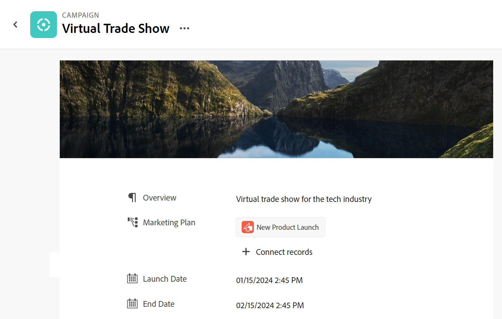

<!--update the metadata with real information when making this avilable in TOC and in the left nav-->

# Administrar la página de registro

{{maestro-important-intro}}

Puede editar y administrar el diseño del cuadro de registro y la página en Adobe Workfront Planning. Puede mostrar el cuadro de registro en una vista de registros.

El cuadro de registro es una vista más pequeña de la página de registro que se muestra en la vista de un tipo de registro.

Al cambiar el diseño de un cuadro de registro y de una página, el cuadro y la página cambian para todos los registros del mismo tipo.

Debe crear tipos de registros y registros antes de poder empezar a editar páginas de registros.

Para obtener más información, consulte los siguientes artículos:

* [Creación de tipos de registros](../architecture/create-record-types.md)

* [Creación de registros](/help/quicksilver/maestro/records/create-records.md)

## Requisitos de acceso

Debe tener el siguiente acceso para realizar los pasos de este artículo:

<table style="table-layout:auto">
 <col>
 </col>
 <col>
 </col>
 <tbody>
    <tr>
<tr>
<td>
   
 Product
 </td>
   <td>
   
 Adobe Workfront
 </td>
  </tr>  
 <td role="rowheader">
acuerdo con Adobe Workfront
</td>
   <td>

Su organización debe estar inscrita en el programa beta de Adobe Workfront Planning. Póngase en contacto con el representante de cuentas para obtener más información sobre esta nueva oferta. 

   </td>
  </tr>
  <tr>
   <td role="rowheader">
plan de Adobe Workfront
</td>
   <td>

Cualquiera

   </td>
  </tr>
  <tr>
   <td role="rowheader">
Licencia de Adobe Workfront*
</td>
   <td>
   
Nuevo: claro o superior

   O
   
Actual: Trabajo o superior
 
  </td>
  </tr>

<tr>
   <td role="rowheader">
Configuraciones de nivel de acceso
</td>
   <td> 
No hay controles de acceso para Adobe Workfront Planning
  
</td>
  </tr>
<tr>
   <td role="rowheader">
Permisos
</td>
   <td> 
Administrar permisos superiores a un espacio de trabajo</a> 
  
   
Los administradores del sistema tienen permisos para todos los espacios de trabajo, incluidos los que no crearon

</td>
  </tr>
<tr>
   <td role="rowheader">
Plantilla de diseño
</td>
   <td> 
El administrador del grupo o de Workfront debe agregar el área de Planning a la plantilla de diseño. Para obtener más información, consulte <a href="../access/access-overview.md">Acceso a información general</a>. 
  
</td>
  </tr>

</tbody>
</table>

*Para obtener más información, consulte [Requisitos de acceso en la documentación de Workfront](/help/quicksilver/administration-and-setup/add-users/access-levels-and-object-permissions/access-level-requirements-in-documentation.md).

## Consideraciones sobre la edición de páginas de registro

* Al reorganizar los campos del cuadro de registro o de la página, se reorganizan los campos de todos los registros de ese tipo y de todos los usuarios que tienen acceso a esos registros.
* Agregar una imagen de portada a un registro no forma parte del diseño general del cuadro de registros o de la página. Puede agregar imágenes de portada únicas a cada registro.

## Reorganizar campos en el cuadro de registro o en la página

{{step1-to-maestro}}

El espacio de trabajo al que se accede por última vez se abre.

1. (Opcional) Haga clic en la flecha hacia abajo situada a la derecha del nombre del área de trabajo para seleccionar el área de trabajo cuyos registros desea actualizar.
1. Haga clic en una tarjeta de tipo de registro.

   Se abre la página de tipo de registro.

1. Desde cualquier vista, haga clic en el nombre de un registro

   O

   En la vista de tabla de tabla, haga clic en **Abrir detalles** icono  a la izquierda del nombre de un registro.

   El cuadro del registro se abre en la vista.

   

   >[!TIP]
   >
   >Puede ver el **Abrir detalles** a la izquierda del campo Nombre de un registro en una vista de tabla sólo cuando el campo Nombre es un campo principal.

1. (Opcional) Haga clic en **Abrir en ficha nueva** icono  <!--check the icon; they are changing it--> en la esquina superior derecha del cuadro de registro para abrir la página del registro en una nueva ficha.

   Se abre la página de registro.

   

1. En el cuadro de registro o la página, haga clic en el icono de captura  a la izquierda del nombre de un campo, arrástrelo y suéltelo en el lugar que desee.

   La nueva posición del campo se actualiza tanto en el cuadro como en la página de todos los registros del mismo tipo para todos los usuarios que ven los registros.

   Todos los cambios realizados en el diseño del cuadro de registro o de la página se guardan automáticamente.

## Agregar una imagen de portada al cuadro de registro o página

Puede personalizar un registro agregando una imagen de portada en la parte superior del cuadro de registro o de la página.

{{step1-to-maestro}}

El espacio de trabajo al que se accede por última vez se abre.

1. (Opcional) Haga clic en la flecha hacia abajo situada a la derecha del nombre del área de trabajo para seleccionar el área de trabajo cuyos registros desea actualizar.

1. Haga clic en una tarjeta de tipo de registro.

   Se abre la página de tipo de registro.

1. Desde cualquier vista, haga clic en el nombre de un registro

   O

   En la vista de tabla de tabla, haga clic en **Abrir detalles** icono  a la izquierda del nombre de un registro.

   El cuadro del registro se abre en la vista.

   

   >[!TIP]
   >
   >Puede ver el **Abrir detalles** a la izquierda del campo Nombre de un registro en una vista de tabla sólo cuando el campo Nombre es un campo principal.

1. (Opcional) Haga clic en **Abrir en ficha nueva** icono  <!--check the icon; they are changing it--> en la esquina superior derecha del cuadro de registro para abrir la página del registro en una nueva ficha.

   Se abre la página de registro.

   

1. En el cuadro de registro o la página, haga clic en **Añadir portada**. <!--check the casing here; I logged a bug for this-->
El **Cubierta de registro** se abre el cuadro.

1. Clic **Seleccionar para cargar** y busque una imagen en el equipo para seleccionarla, agréguela y haga clic en **Usar imagen**.

   La imagen se carga en la parte superior del cuadro de registro o página y los cambios se guardan automáticamente.

   

1. (Opcional) Pase el ratón sobre la imagen y haga clic en **Más** menú  en la esquina inferior derecha de la imagen de la portada, siga uno de estos procedimientos:

   * Clic **Cargar** Si desea reemplazar la imagen de portada, repita el Paso 6 para cargar y guardar una nueva imagen.
   * Clic **Cambiar posición** y utilice el **Cambiar posición** herramienta  para centrar la imagen de la portada, haga clic en **Guardar** cuando termine.
   * Clic **Eliminar** para quitar la imagen de portada.

   Todos los cambios entrarán en vigor inmediatamente.

