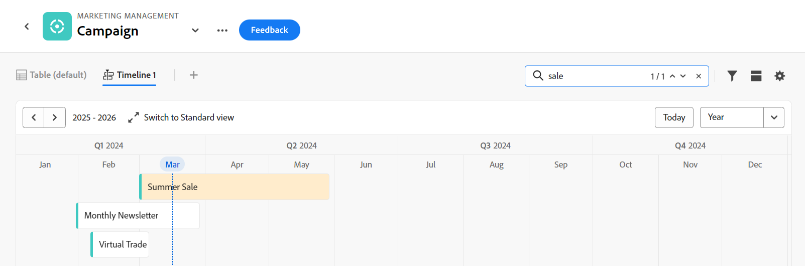

# Administrar la vista de cronología

<!--
title: Manage the timeline view in Adobe Maestro
description: You can display records in a timeline view, when accessing the record type page in Adobe Maestro. 
hidefromtoc: yes
hide: yes
author: Alina
feature: Work Management
role: User
-->

<!--update the metadata with real information when making this available in TOC and in the left nav-->

>[!IMPORTANT]
>
>La información de este artículo hace referencia a Adobe Maestro, que es una nueva oferta de Adobe Workfront.
>
>En la actualidad, Adobe Maestro forma parte de un programa beta abierto a un número limitado de clientes. Debe ser cliente de Workfront para utilizar las funciones de Maestro.
>
>Póngase en contacto con su representante de cuentas para obtener más información acerca de cómo unirse al programa beta de Maestro.
>
>Para obtener más información, consulte [Introducción a Adobe Maestro](../maestro-overview.md).

Puede mostrar registros en una vista de escala de tiempo al acceder a la página de tipo de registro en Adobe Maestro.

Para obtener información acerca de las vistas Maestro, vea [Administrar vistas de registros en Adobe Maestro](../views/manage-record-views.md).

## Requisitos de acceso

Debe tener el siguiente acceso para realizar los pasos de este artículo:

<table style="table-layout:auto">
 <col>
 <tbody>
<td>
   
 producto de Adobe
 </td>
   <td>
   
 Adobe Workfront
 </td>
  </tr>  
 <td role="rowheader">
acuerdo con Adobe Workfront
</td>
   <td>

Su organización debe estar inscrita en el programa beta cerrado de Adobe Maestro. Póngase en contacto con el representante de cuentas para obtener más información sobre esta nueva oferta. 

   </td>
  </tr>
  <tr>
   <td role="rowheader">
plan de Adobe Workfront
</td>
   <td>

Cualquiera

   </td>
  </tr>
  <tr>
   <td role="rowheader">
Licencia de Adobe Workfront
</td>
   <td>
   
Cualquiera
 
  </td>
  </tr>

<tr>
   <td role="rowheader">Nivel de acceso</td>
   <td> 
Cualquiera
  
</td>
  </tr>
<tr>
   <td role="rowheader">Plantilla de diseño</td>
   <td> 
El administrador del sistema debe agregar el área de Maestro en la plantilla de diseño. Para obtener más información, consulte <a href="../access/access-overview.md">Acceso a información general</a>. 
  
</td>
  </tr>
 </tbody>
</table>

<!--
When we release permissions to views:

<table style="table-layout:auto">
 <col>
 </col>
 <col>
 </col>
 <tbody>
    <tr>
<tr>
<td>
   
 Product
 </td>
   <td>
   
 Adobe Workfront
 </td>
  </tr>  
 <td role="rowheader">
Adobe Workfront agreement
</td>
   <td>

Your organization must be enrolled in the Adobe Maestro closed beta program. Contact your account representative to inquire about this new offering. 

   </td>
  </tr>
  <tr>
   <td role="rowheader">
Adobe Workfront plan
</td>
   <td>

Any

   </td>
  </tr>
  <tr>
   <td role="rowheader">
Adobe Workfront license
</td>
   <td>
   
Any
 
  </td>
  </tr>
  
  <tr>
   <td role="rowheader">Access level configurations</td>
   <td> 
There are no access controls for Maestro objects
  
</td>
  </tr>

  <tr>
   <td role="rowheader">
Object permissions
</td>
   <td> 
Manage permissions to the view
  
</td>
  </tr>

<tr>
   <td role="rowheader">Layout template</td>
   <td> 
Your system administrator must add the Maestro area in your layout template. For information, see <a href="../access/access-overview.md">Access overview</a>. 
  
</td>
  </tr>
 </tbody>
</table>

-->

## Administrar una vista de cronología {#manage-a-timeline-view}

<!--insert screen shot of timeline view-->

Al crear una vista de escala de tiempo, todos los registros del tipo de registro seleccionado se muestran en una escala de tiempo cronológica.

Tenga en cuenta lo siguiente:

* Sólo puede crear una vista Cronología si tiene al menos dos campos de fecha asociados a un tipo de registro. Cuando hay uno o ningún campo de fecha asociado a un tipo de registro, la opción de vista Cronología aparece atenuada.
* Según las fechas asociadas con los registros, es posible que algunos registros no se muestren en la vista de escala de tiempo en los siguientes casos:

   * Cuando las fechas de inicio y finalización no tienen valores
   * Cuando las fechas de inicio y finalización no tienen valor
   * Cuando la fecha de inicio es posterior a la fecha de finalización

<!--these are NOT available now because there won't be a table for the timeline view for the near future, per Andy: 
* The records displayed in the timeline view also display in a view-only table to the left of the timeline. 
* Each row in the table and each bar on the timeline represent the same record. 
* Each column in the table is a record field. The columns of this table are preconfigured and cannot be customized. 
* Only a limited number of fields (or columns) display in the timeline view table. 
* You cannot do the following in a timeline view:
     * Add rows or records
     * Add columns or fields
     * Edit record information
-->

Para administrar una vista de cronología:

1. Vaya a la página del tipo de registro cuya cronología desea ver.
1. Cree una vista de cronología, tal como se describe en el artículo [Administrar vistas de registros](../views/manage-record-views.md).

   

   Los registros asociados con el tipo de registro seleccionado se muestran como barras en una cronología y se ordenan en orden cronológico de forma predeterminada.

1. Realice una de las siguientes acciones para navegar por la cronología:

   * Haga clic en los iconos izquierdo y derecho o utilice el desplazamiento horizontal para moverse hacia atrás y hacia adelante en la cronología.
   * Clic **Hoy** para centrar la cronología en la fecha actual.
   * Seleccione una de las siguientes opciones del menú desplegable lapso de tiempo para actualizar los incrementos de tiempo:

      * Año
      * Trimestre
      * Mes
1. Clic **Cambiar a estándar** vista para mostrar registros en líneas independientes <!--check to see if they updated the name of the setting here-->

   O

   Clic **Cambiar a la vista Compacta** para mostrar los registros cuyas fechas no se cruzan en la misma línea. <!--check to see if they updated the name of the setting here-->

   Los registros se muestran en la vista Compacta de forma predeterminada.

1. Haga lo siguiente para buscar rápidamente registros que coincidan con una palabra clave:

   1. Haga clic en **Buscar** icono  y empiece a escribir una palabra clave asociada a cualquier campo de un registro que se muestra en la pantalla. El número de coincidencias correctas se muestra junto al elemento de búsqueda y el registro con la coincidencia correcta se resalta.

      

      Puede utilizar cualquier palabra o carácter especial que esté visible en la pantalla.

      No se pueden utilizar palabras clave asociadas a campos que no se muestran en la vista de cronología.

   1. Pulse Enter en el teclado para ir al siguiente campo encontrado.
   1. (Opcional) Si hay más de una coincidencia, haga clic en las flechas arriba y abajo a la derecha de la palabra clave de búsqueda para encontrar todas las coincidencias de la tabla.
   1. Haga clic en **x** en el cuadro de búsqueda para borrar la palabra clave de búsqueda.

1. Actualice los siguientes elementos de vista como se describe en las subsecciones siguientes:
   * [Filtros](#add-filters)
   * [Agrupación](#add-grouping)
     <!--* [Sort](#add-sort) not sure if this is present in timeline views?!; also check the anchor and make sure it's correct-->
   * [Configuración](#edit-the-timeline-view-settings)

### Añadir filtros

Puede reducir la cantidad de información que se muestra en la pantalla mediante filtros.

Tenga en cuenta lo siguiente al trabajar con filtros en la vista de cronología:

<!-- this list is almost identical to the one for the table view - update both-->

* Los filtros que cree para la vista de cronología funcionarán de forma independiente de los filtros de la vista de tabla cuando se apliquen al mismo tipo de registro.

* Los filtros son exclusivos de la vista seleccionada. Dos vistas de escala de tiempo del mismo tipo de registro pueden tener diferentes filtros aplicados. Dos usuarios que ven la misma vista de cronología ven el mismo filtro que se aplica actualmente.

* No puede asignar un nombre a los filtros que genere para una vista de cronología.

* Al eliminar los filtros, se eliminan de todos los que tengan acceso al mismo tipo de registro que usted y que muestren la misma vista que usted.

* Añadir filtros en la vista de cronología es idéntico a añadir filtros en la vista de tabla.

  Para obtener más información, consulte la sección &quot;Agregar filtros&quot; en el artículo [Administrar la vista de tabla](../views/manage-the-table-view.md).

### Agregar agrupación

<!-- groupings are almost identical between this view and table  but they display a little differently, so I kept the steps for both; update in both places if they make changes to groupings-->

Puede agrupar registros por información similar al aplicar una agrupación a una vista.

Agregar agrupaciones en la vista de escala de tiempo es similar a agregar agrupaciones a la vista de tabla.

Tenga en cuenta lo siguiente al trabajar con agrupaciones en la vista de cronología:

* Puede aplicar agrupaciones tanto en las vistas de tabla como de escala de tiempo. Las agrupaciones de la vista de tabla son independientes de las de la vista de escala de tiempo del mismo tipo de registro.
* Puede aplicar tres niveles de agrupación en una vista Maestro. Los registros se agrupan en el orden de agrupaciones que seleccione.
* Puede aplicar hasta 4 niveles de agrupación al utilizar la API.
* Las agrupaciones son únicas para la vista que seleccione. Dos vistas de escala de tiempo del mismo tipo de registro pueden tener diferentes agrupaciones aplicadas. Dos usuarios que ven la misma vista de cronología ven la misma agrupación que se aplica actualmente.
* No puede asignar nombres a las agrupaciones que genere para una vista de cronología.
* Al quitar las agrupaciones, se quitan de cualquier usuario que tenga acceso al mismo tipo de registro que usted y que muestre la misma vista que usted.

Para agregar una agrupación en la vista de escala de tiempo:

1. Cree una vista de cronología para un tipo de registro, tal como se describe en el artículo [Administrar vistas de registros](../views/manage-record-views.md).
1. Clic **Agrupación** en la esquina superior derecha de la vista de la cronología.

   

1. Haga clic en uno de los campos sugeridos o en **Elija un campo diferente**, busque un campo diferente y, a continuación, haga clic en él cuando se muestre en la lista.

   >[!TIP]
   >
   >No se pueden seleccionar campos vinculados.

   La agrupación se aplica automáticamente a la cronología y los registros se muestran dentro del cuadro de agrupación.

   <!-- add a step that you can rearrange the groupings here, when this will be possible-->

1. (Opcional) Repita los pasos anteriores para agregar hasta 3 agrupaciones.

   El número de campos seleccionados para la agrupación se muestra junto al icono Grouping.

   

1. (Opcional) Dentro de **Agrupar registros por** , haga clic en **x** a la derecha de un campo seleccionado para que la agrupación elimine la agrupación

   O

   Clic **Borrar todo** para eliminar todos los campos.

1. Haga clic fuera de **Agrupar registros por** para cerrarlo.
1. (Opcional) Haga clic en **Configuración**, entonces **Color** a agrupaciones de código de color. Para obtener más información, consulte la [Editar la configuración de vista de cronología](#edit-the-timeline-view-settings) de este artículo.

<!-- 

### Add sort

this is not possible right now; if this is the same functionality as the table view, document it there and link from here. 

-->

### Editar la configuración de vista de cronología {#edit-the-timeline-view-settings}

Actualice la configuración de vista de escala de tiempo para indicar qué información se muestra en la sección de escala de tiempo de la vista y cómo.

1. Cree una vista de cronología para un tipo de registro, tal como se describe en el artículo [Administrar vistas de registros](../views/manage-record-views.md).
1. Clic **Configuración**.
1. Clic **Fecha y hora** en el panel izquierdo, seleccione una **Fecha de inicio** y un **Fecha de finalización** para mostrar en la cronología. Puede elegir las fechas de inicio y finalización predeterminadas, o bien puede elegir cualquier campo de fecha disponible. Las barras que representan los registros comienzan en la fecha que se indica para la fecha Start y finalizan en la fecha correspondiente a End date.

   >[!NOTE]
   >
   >Los registros que no tienen valores para las fechas Start o End o que tienen una fecha Start posterior a End no se muestran en la vista de escala de tiempo.

1. Clic **Estilo de barra** en el panel izquierdo, para indicar qué campos desea mostrar en las barras de registros.

   El campo Name está seleccionado de forma predeterminada. <!--adjust this when the primary field is released??-->

1. Clic **Añadir campo** para agregar hasta 4 campos a las barras de registros.
1. Haga clic dentro de **Campos de búsqueda** y haga clic en el campo que desee añadir.

   >[!TIP]
   >
   >   * Debe crear los campos para poder agregarlos a las barras de registros.
   > 
   >   * Debe haber seleccionado al menos un campo. **Nombre** está seleccionado de forma predeterminada.

   A la derecha aparece una vista previa del aspecto que tendrán las barras en la cronología.

   

1. Clic **Color** en el panel izquierdo, para personalizar los colores de los registros y las agrupaciones en la cronología.

   

1. (Condicional y opcional) Si ha agregado una agrupación a la vista de escala de tiempo, seleccione una de las siguientes opciones para establecer un color para la agrupación en la vista de escala de tiempo **Definir color de agrupación** sección:

   * **Predeterminado (gris)**: el color de las agrupaciones se establece en gris. Esta es la opción predeterminada.
   * **Valores de campo**: El color de las agrupaciones coincide con el color del campo por el que se agrupa.
Puede hacer coincidir el color de las agrupaciones solo con campos con opciones codificadas por colores.

   Por ejemplo, los campos de selección múltiple o de selección única pueden tener opciones codificadas por colores.

   Si agrupa por campos sin opciones codificadas por colores, el color de agrupación permanece gris.

   >[!TIP]
   >
   >Si no ha agregado agrupaciones a la vista de cronología, esta sección no se muestra.

1. En el **Establecer color de registro** , seleccione entre las siguientes opciones para definir un color para los registros:

   * **Tipo de registro**: El color de los registros coincide con el color del tipo de registro seleccionado. Esta es la opción predeterminada.
   * **Valores de campo**: El color de los registros coincide con el color de un campo especificado. Continúe con el paso 10. <!--ensure this stays accurate-->
   * **Agrupación**: El color de los registros coincide con el color indicado para las agrupaciones. Esta opción aparece atenuada cuando no se han aplicado agrupaciones a la vista de escala de tiempo.
   * **Ninguno**: los registros se muestran en una barra blanca.

1. (Condicional) Si ha seleccionado **Valores de campo** para los colores de registro, seleccione un campo de la **Hacer coincidir el color del registro con** menú desplegable.

   

   En el menú desplegable solo se muestran los campos con opciones codificadas por colores.

   Por ejemplo, los campos de selección múltiple o de selección única pueden tener opciones codificadas por colores.

   Si no tiene ningún campo con opciones codificadas por colores para el tipo de registro seleccionado, esta opción aparece atenuada.

1. Haga clic en **Guardar**.

   Los registros se muestran en la vista de escala de tiempo con las especificaciones seleccionadas.
