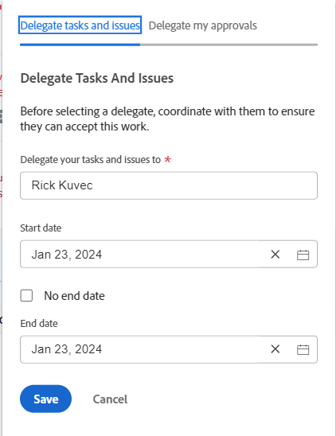
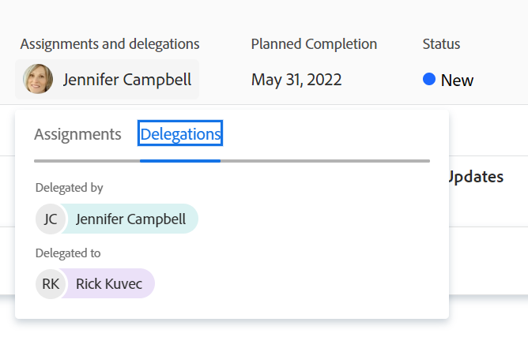
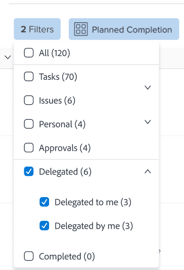

# Administrar delegación de tareas y problemas

<!-- Audited: 1/2024 -->

<!--
<NOTE: 
<you might need to change the tile to Delegate PTI, etc, when that functionality is added. Named it this so it will not conflict with the TOC article for Delegate section which was also "Delegate work"
I wrote this as a "Manage..." article and I did not add three separate articles, to match what we have for delegating approval requests)
-->

Puede delegar temporalmente el trabajo al que esté asignado mientras esté fuera de la oficina.

Puede delegar tareas y asignaciones de problemas, o bien puede delegar aprobaciones. Este artículo describe cómo delegar asignaciones de tareas y problemas.

Para obtener información general sobre la delegación de trabajo, vea [Información general sobre la delegación de trabajo](../../manage-work/delegate-work/delegate-work-overview.md).

## Requisitos de acceso

+++ Expanda para ver los requisitos de acceso para la funcionalidad en este artículo.

>[!IMPORTANT]
>
>* Los usuarios que seleccione como delegados reciben los mismos permisos que sus permisos en las tareas y problemas que delegue en ellos.
>* Los permisos deben funcionar dentro de sus niveles de acceso y, a veces, sus niveles de acceso pueden ser inferiores a los suyos.
>
>   
>   Por ejemplo, si un usuario solo tiene acceso de Vista a las tareas de su nivel de acceso y tiene permisos de Administración en las tareas que delega en él, recibirá permisos de Administración en las tareas que delega en él. Sin embargo, no podrán realizar las mismas acciones que usted en las tareas delegadas. Para poder actualizar tareas en su ausencia, deben solicitar al administrador del sistema acceso de edición de tareas.
>
>   
>   Para obtener información sobre cómo un administrador del sistema puede modificar su nivel de acceso, vea [Crear o modificar niveles de acceso personalizados](../../administration-and-setup/add-users/configure-and-grant-access/create-modify-access-levels.md).
>
>* Para los elementos que se asignan después de que la delegación ya haya comenzado, puede tardar hasta una hora después de que el elemento se haya asignado a [!DNL Workfront] en compartir los elementos recién asignados con el delegado.

Debe tener el siguiente acceso para realizar los pasos de este artículo:

<table style="table-layout:auto"> 
 <col> 
 <col> 
 <tbody> 
  <tr> 
   <td role="rowheader">[!DNL Adobe Workfront] plan</td> 
   <td> 
Cualquiera
 </td> 
  </tr> 
  <tr> 
   <td role="rowheader">[!DNL Adobe Workfront] licencia</td> 
   <td> 
Nuevo: Colaborador o superior

O

Actual: revisar o superior

>[!NOTE]
>
>Aunque se le puede asignar un trabajo cuando tiene una licencia de solicitud, no puede delegar su trabajo a otros. [!DNL Workfront] no recomienda asignar trabajo a los usuarios de revisión, solicitud o colaborador.

</tr> 
  <tr> 
   <td role="rowheader">Configuraciones de nivel de acceso</td> 
   <td> 
Editar acceso a Tareas y Problemas 
     
 </td> 
  </tr> 
  <tr> 
   <td role="rowheader">Permisos de objeto</td> 
   <td> 
Ver los permisos o niveles superiores de las tareas o problemas que tiene asignados
 
    </td> 
  </tr> 
 </tbody> 
</table>

Para obtener más información sobre esta tabla, consulte [Requisitos de acceso en la documentación de Workfront](/help/quicksilver/administration-and-setup/add-users/access-levels-and-object-permissions/access-level-requirements-in-documentation.md).

+++

<!--note from the table for Object permissions:
     
Contribute or higher permissions to the projects where you are designated as the Project&nbsp;Owner (NOTE:&nbsp;you cannot delegate projects yet)

    -->

## Requisitos previos

Antes de poder realizar las actividades descritas en este artículo, debe asegurarse de lo siguiente:

* Su administrador de [!DNL Workfront] o de grupo habilitó la opción [!UICONTROL Permitir que los usuarios eliminen tareas y problemas con horas registradas] en el área [!UICONTROL Configuración] de su instancia [!DNL Workfront].

  Para obtener más información, consulte [Configurar las preferencias de tareas y problemas en todo el sistema](../../administration-and-setup/set-up-workfront/configure-system-defaults/set-task-issue-preferences.md).

## Delegar tareas y problemas a otro usuario

Antes de delegar el trabajo a otros, le recomendamos que se ponga en contacto con ellos y les informe de que serán designados como delegados en sus elementos de trabajo. Pida su aprobación verbal antes de delegar el trabajo para asegurarse de que tengan el tiempo necesario para completar el trabajo mientras está fuera de la oficina.

Para obtener información general acerca de la delegación de tareas y problemas, vea [Información general sobre delegar tareas y problemas](/help/quicksilver/manage-work/delegate-work/delegate-work-overview.md).

Para delegar sus tareas y problemas a otros:

1. Vaya al área de [!UICONTROL **Inicio**] y luego haga clic en [!UICONTROL **Delegar**] en la parte superior de [!UICONTROL **Lista de trabajos**].

   

1. En la ficha [!UICONTROL **Delegar tareas y problemas**], actualice lo siguiente:

   * [!UICONTROL **Delegar sus tareas y problemas a**]: Empiece a escribir el nombre de un usuario al que desee delegar sus tareas y problemas y, a continuación, selecciónelo cuando se muestre en la lista. Solo puede seleccionar un usuario.

     El usuario que seleccione como delegado recibe los mismos permisos que sus permisos en las tareas y problemas que delegue en ellos.

   * [!UICONTROL **Fecha de inicio**]: seleccione en el calendario la fecha en la que debe comenzar la delegación de los elementos de trabajo.

     >[!TIP]
     >
     >La fecha de inicio no puede ser una fecha pasada.

   * [!UICONTROL **Sin fecha de finalización**]: seleccione esta opción si no desea especificar la fecha de finalización de la delegación.

   * [!UICONTROL **Fecha de finalización**]: seleccione en el calendario una fecha en la que la delegación debe detenerse.

     >[!TIP]
     >
     >Si deja vacío el campo Fecha de finalización y la opción Sin fecha de finalización no está seleccionada, la delegación solo se establece para el día actual.

     

1. Haga clic en [!UICONTROL **Guardar**].

   Suceden las siguientes cosas:

   * El trabajo se ha delegado al usuario especificado. Se delegarán todas las tareas o problemas incompletos que tengan fechas dentro del lapso de tiempo seleccionado (incluidos los recién asignados, después de habilitar la delegación).

     >[!TIP]
     >
     >   Los elementos de trabajo completados que tienen fechas dentro del lapso de tiempo de la delegación no se delegan.

   * Recibirá un mensaje en la esquina superior derecha de la pantalla para confirmar que ha habilitado la delegación de su trabajo a otro usuario. El nombre del usuario delegado se muestra en el mensaje de confirmación.

   * Se muestra una indicación de que las tareas y los problemas se han delegado a otros usuarios en la mayoría de las áreas donde puede ver asignaciones en [!DNL Workfront]. Para obtener más información sobre las áreas que no incluyen nombres de delegados, vea [Descripción general del trabajo delegado](delegate-work-overview.md).

   * El botón [!UICONTROL **Delegar**] del área [!UICONTROL Inicio] cambia a [!UICONTROL **Editar delegación**] para indicar que hay una delegación en su lugar.
   <!--
   <MadCap:conditionalText data-mc-conditions="QuicksilverOrClassic.Draft mode">
   (NOTE: is this shot correct?&nbsp;See UI - this is a mock)
   </MadCap:conditionalText>
   -->

   

   * Si las notificaciones de eventos y las notificaciones personales están habilitadas, también recibirá una confirmación de su delegación por correo electrónico.

   * El usuario que ha seleccionado como delegado recibe un correo electrónico sobre la delegación si las notificaciones de eventos están habilitadas.

     Para obtener información sobre cómo habilitar las notificaciones personales por correo electrónico, consulte [Modificar tus propias notificaciones por correo electrónico](../../workfront-basics/using-notifications/activate-or-deactivate-your-own-event-notifications.md).

## Editar o detener delegación

Puede permitir que una delegación caduque si ha seleccionado una fecha de finalización o puede detenerla manualmente. También puede modificar el lapso de tiempo de la delegación si las fechas de la delegación han cambiado.

1. Vaya al área de [!UICONTROL Inicio] y luego haga clic en [!UICONTROL Editar delegación] en la esquina superior derecha de la Lista de trabajos.
1. En la ficha [!UICONTROL Delegar tareas y problemas], realice una de las siguientes acciones:
   * Modifique la [!UICONTROL **fecha de inicio**] o la [!UICONTROL **fecha de finalización**]
   * Haga clic en [!UICONTROL **Detener delegación**]

   >[!TIP]
   >
   >    Solo puede editar la fecha de finalización de una delegación si esta ya ha comenzado.

   

1. (Condicional) haga clic en [!UICONTROL **Guardar**] para guardar las nuevas fechas de delegación

   O

   Haga clic en [!UICONTROL **Detener delegación**] en el cuadro de confirmación para confirmar que se detiene la delegación.

   La delegación ha actualizado las fechas o se ha detenido y los usuarios delegados se han eliminado de sus tareas y problemas. Sus permisos para las tareas y problemas siguen vigentes.

## Localizar trabajo delegado e información de delegado

<!--(if this was released, make sure that viewing delegated approvals has not changed, as documented here: /Content/Review and approve work/Manage Approvals/delegate-approval-requests.html) 
-->

Cuando se delegan tareas y problemas, existen varias áreas en [!DNL Workfront] en las que puede ver el trabajo delegado o quiénes son los delegados.

* [Busque delegados en la casilla Asignaciones](#locate-delegates-in-the-assignments-box)
* [Buscar trabajo delegado en [!UICONTROL Hogar]](#locate-delegated-work-in-home)

### Busque delegados en el cuadro [!UICONTROL Asignaciones]

Cuando el administrador del sistema o del grupo habilita la delegación de trabajo en su sistema, el cuadro [!UICONTROL Asignaciones] muestra las siguientes fichas en todas partes donde pueda acceder a ella:

* [!UICONTROL **Asignaciones**]: los usuarios asignados a la tarea o al problema se muestran aquí.
* [!UICONTROL **Delegaciones**]: aquí se muestran los usuarios designados como delegados por los usuarios asignados a la tarea o al problema.

Puede acceder al cuadro [!UICONTROL Asignaciones] en las siguientes áreas:

* El encabezado de la tarea o del problema

  El campo [!UICONTROL Asignaciones] del encabezado de tarea o problema cambia a [!UICONTROL Asignaciones y delegaciones].

  

* [!UICONTROL Distribuidor de cargas de trabajo] al asignar manualmente tareas o problemas

  

>[!NOTE]
>
> No puede ver delegados en la sección [!UICONTROL Asignaciones] de una tarea o cuadro de edición de problema.

Si se delega una tarea o un problema y el subseparador [!UICONTROL Delegaciones] está vacío, puede darse uno de los siguientes casos:

* No se le ha asignado la tarea o el problema.
* Las fechas de la tarea o del problema están fuera del lapso de tiempo de delegación.

>[!TIP]
>
>Las horas planificadas o reales para tareas y problemas delegados no se tienen en cuenta en las herramientas de administración de recursos, como [!UICONTROL Distribuidor de cargas de trabajo] o [!DNL Resource Planner] para los usuarios delegados. Las horas permanecen asociadas únicamente al usuario asignado.

### Buscar trabajo delegado en [!UICONTROL Hogar]

1. Vaya al área de [!UICONTROL **Home**], haga clic en el menú desplegable de filtros y seleccione una o varias de las siguientes opciones:
   * [!UICONTROL **Delegado**]: para ver las tareas y los problemas delegados en usted o por usted.
   * [!UICONTROL **Se me ha delegado**]: para ver las tareas y los problemas que le ha delegado otro usuario.
   * [!UICONTROL **Delegado por mí**]: para ver tareas y problemas delegados por usted a otros usuarios.

   

1. Haga clic en el menú desplegable [!UICONTROL sorting] para ordenar la lista según los criterios siguientes:
   * [!UICONTROL Finalización planificada]. Esta es la opción de ordenación predeterminada.
   * [!UICONTROL Inicio planificado]
   * [!UICONTROL Fecha de confirmación]
   * [!UICONTROL Proyecto]
   * [!UICONTROL Mi prioridad]
1. Expanda las agrupaciones de la [!UICONTROL **Lista de trabajos**] para ver los elementos de trabajo delegados. Existen los siguientes escenarios:
   * Para los elementos que delegó en otros, el nombre del delegado se muestra en la [!UICONTROL **Lista de trabajos**], así como en el campo [!UICONTROL **Asignaciones y delegaciones**] de la derecha.

   * Para los elementos que se le delegaron, el nombre del usuario asignado aparece en [!UICONTROL **Lista de trabajos**], así como en el campo **[!UICONTROL Asignaciones y delegaciones]** de la derecha.

   >[!TIP]
   >
   >    Si la delegación está configurada para comenzar en una fecha posterior a la fecha de hoy, la fecha de inicio de la delegación también se muestra en la [!UICONTROL Lista de trabajos]. Los elementos delegados se muestran en la agrupación que seleccione para la [!UICONTROL Lista de trabajos], según el tipo de agrupación. Por ejemplo, si agrupa por [!UICONTROL Fecha planificada de finalización], los elementos delegados se muestran en la agrupación que coincide con sus fechas planificadas de finalización.
