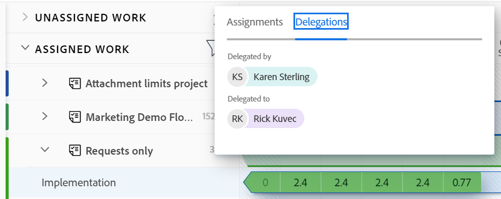

# Administrar delegación de tareas y problemas

<!--
<NOTE: 
<you might need to change the tile to Delegate PTI, etc, when that functionality is added. Named it this so it will not conflict with the TOC article for Delegate section which was also "Delegate work"
I wrote thhis as a "Manage..." article and I did not add three separate articles, to match what we have for delegating approval requests)
-->

Puede delegar temporalmente el trabajo al que está asignado mientras está fuera de la oficina.

Puede delegar tareas y asignaciones de emisión o delegar aprobaciones. En este artículo se describe cómo delegar tareas y emitir asignaciones.

Para obtener información general sobre la delegación de trabajo, consulte [Resumen del trabajo de los delegados](../../manage-work/delegate-work/delegate-work-overview.md).

## Requisitos de acceso

>[!IMPORTANT]
>
>* Los usuarios que seleccione como delegados reciben los mismos permisos que sus permisos en las tareas y problemas que delega en ellos.
>* Los permisos deben funcionar dentro de sus niveles de acceso y, a veces, sus niveles de acceso pueden ser inferiores a los suyos.

   >
   >   
   >   Por ejemplo, si un usuario solo tiene acceso de vista a tareas en su nivel de acceso y tiene permisos de administración en las tareas que delega en ellas, recibirá permisos de administración para las tareas que delegue en ellas. Sin embargo, no podrán realizar las mismas acciones que usted en las tareas delegadas. Deben solicitar el acceso de edición a Tareas al administrador del sistema para poder actualizar las tareas en su ausencia.
   >
   >   
   >   Para obtener información sobre cómo un usuario puede modificar su nivel de acceso, consulte [Crear o modificar niveles de acceso personalizados](../../administration-and-setup/add-users/configure-and-grant-access/create-modify-access-levels.md).
>
>* Para los elementos que se asignan después de que la delegación ya se haya iniciado, puede tardar hasta una hora después de que se haya asignado el elemento [!DNL Workfront] para compartir los elementos recién asignados con el delegado.

Debe tener el siguiente acceso para realizar los pasos de este artículo:

<table style="table-layout:auto"> 
 <col> 
 <col> 
 <tbody> 
  <tr> 
   <td role="rowheader">[!DNL Adobe Workfront] plan*</td> 
   <td> 
Cualquiera
 </td> 
  </tr> 
  <tr> 
   <td role="rowheader">[!DNL Adobe Workfront] licencia*</td> 
   <td> 
Revisar o superior

>[!NOTE]
>
>Aunque se le puede asignar para que funcione cuando tiene una licencia de Solicitud, no puede delegar su trabajo a otros. [!DNL Workfront] no recomienda asignar trabajo a usuarios de revisión o solicitud.

</tr> 
  <tr> 
   <td role="rowheader">Configuraciones de nivel de acceso*</td> 
   <td> 
Editar acceso a Tareas y problemas Si todavía no tiene acceso, consulte a su [!DNL Workfront] administrador si establecen restricciones adicionales en su nivel de acceso. Para obtener información sobre cómo se [!DNL Workfront] administrador puede modificar el nivel de acceso, consulte <a href="../../administration-and-setup/add-users/configure-and-grant-access/create-modify-access-levels.md" class="MCXref xref"> Crear o modificar niveles de acceso personalizados</a>.
 </td> 
  </tr> 
  <tr> 
   <td role="rowheader">Permisos de objeto</td> 
   <td> 
Ver o permisos superiores a las tareas o problemas a los que está asignado
 
    
Para obtener información sobre la solicitud de acceso adicional, consulte <a href="../../workfront-basics/grant-and-request-access-to-objects/request-access.md" class="MCXref xref">Solicitar acceso a objetos </a>.
 </td> 
  </tr> 
 </tbody> 
</table>

*Para saber qué plan, tipo de licencia o acceso tiene, póngase en contacto con su [!DNL Workfront] administrador.

<!--note from the table for Object permissions:
     
Contribute or higher permissions to the projects where you are designated as the Project&nbsp;Owner (NOTE:&nbsp;you cannot delegate projects yet)

    -->

## Requisitos previos

Antes de realizar las actividades descritas en este artículo, debe asegurarse de lo siguiente:

* Su [!DNL Workfront] o el administrador del grupo habilitó la variable [!UICONTROL Permitir que los usuarios eliminen tareas y problemas con las horas registradas] en la [!UICONTROL Configuración] del área [!DNL Workfront] instancia.

   Para obtener más información, consulte [Configurar las preferencias de problemas y tareas de todo el sistema](../../administration-and-setup/set-up-workfront/configure-system-defaults/set-task-issue-preferences.md).

## Delegación de tareas y problemas a otro usuario

Antes de delegar su trabajo en otros, le recomendamos que se ponga en contacto con ellos y les informe de que serán designados delegados en sus temas de trabajo. Pida su aprobación verbal antes de delegar el trabajo para asegurarse de que tienen el tiempo necesario para completar el trabajo mientras usted está fuera de la oficina.

Para obtener información general sobre la delegación de tareas y problemas, consulte [Resumen de tareas y problemas delegados](delegate-work.md).

Para delegar las tareas y los problemas a otros:

1. Vaya a la [!UICONTROL **Página principal**] área y haga clic en [!UICONTROL **Delegar**] en la parte superior del [!UICONTROL **Lista de trabajo**].

   

1. En el [!UICONTROL **Delegación de tareas y problemas**] , actualice lo siguiente:

   * [!UICONTROL **Delegación de tareas y problemas en**]: Empiece a escribir el nombre de un usuario al que desea delegar sus tareas y problemas y, a continuación, selecciónelo cuando aparezca en la lista. Solo puede seleccionar un usuario.\

      El usuario que seleccione como delegado recibe los mismos permisos que sus permisos en las tareas y problemas que delega en ellos. Para obtener más información, consulte [Resumen del problema y la tarea delegada](delegate-work-overview.md).

   * [!UICONTROL **Fecha de inicio**]: Seleccione una fecha del calendario en la que debe comenzar la delegación de los elementos de trabajo.

      >[!TIP]
      >
      >La fecha de inicio no puede ser anterior.

   * [!UICONTROL **Sin fecha de finalización**]: Seleccione esta opción si no desea especificar la fecha de finalización de la delegación.

   * [!UICONTROL **Fecha final**]: Seleccione una fecha del calendario en la que se debe detener la delegación.

      >[!TIP]
      >
      >Al no seleccionar una fecha de finalización, la delegación solo se habilita para el día actual.

      

1. Haga clic en [!UICONTROL **Guardar**].

   Las siguientes cosas suceden:

   * El trabajo se delega al usuario especificado. Se delega cualquier tarea incompleta o problema que tenga fechas dentro del lapso de tiempo seleccionado (incluidos los recién asignados, después de habilitar la delegación).
   >[!TIP]
   >
   >   Los elementos de trabajo completados que tengan fechas dentro del marco temporal de la delegación no se delegan.

   * Recibirá un mensaje en la esquina superior derecha de la pantalla para confirmar que ha habilitado la delegación de su trabajo a otro usuario. El nombre del usuario delegado se muestra en el mensaje de confirmación.

   * Una indicación de que las tareas y los problemas se delegan a otros usuarios se muestra en la mayoría de las áreas en las que puede ver asignaciones en [!DNL Workfront]. Para obtener más información sobre las áreas que no incluyen los nombres de los delegados, consulte [Resumen del problema y la tarea delegada](delegate-work-overview.md).

   * La variable [!UICONTROL **Delegar**] en el [!UICONTROL Página principal] cambios de área a [!UICONTROL **Editar delegación**] indicar que existe una delegación.

   <!--
   <MadCap:conditionalText data-mc-conditions="QuicksilverOrClassic.Draft mode">
   (NOTE: is this shot correct?&nbsp;See UI - this is a mock)
   </MadCap:conditionalText>
   -->

   

   * Si las notificaciones de eventos y las notificaciones personales están activadas, también recibirá una confirmación por correo electrónico de su delegación.

   * El usuario que ha seleccionado como delegado recibe un correo electrónico sobre la delegación si sus notificaciones de evento están habilitadas.

      Para obtener información sobre cómo activar las notificaciones personales por correo electrónico, consulte [Activar o desactivar sus propias notificaciones de eventos](../../workfront-basics/using-notifications/activate-or-deactivate-your-own-event-notifications.md).

## Editar o detener delegación

Puede dejar que una delegación caduque si ha seleccionado una fecha de finalización o puede detenerla manualmente. También puede modificar el lapso de tiempo de la delegación si las fechas de la delegación han cambiado.

1. Vaya a la [!UICONTROL Página principal] área y haga clic en [!UICONTROL Editar delegación] en la esquina superior derecha de la lista de trabajo.
1. En el [!UICONTROL Delegación de tareas y problemas] , realice una de las siguientes acciones:
   * Modifique el [!UICONTROL **Fecha de inicio**] o [!UICONTROL **Fecha final**]
   * Haga clic en [!UICONTROL **Detener delegación**]

   >[!TIP]
   >
   >    Solo puede editar la fecha de finalización de una delegación si esta ya se ha iniciado.

   

1. (Condicional) haga clic en [!UICONTROL **Guardar**] para guardar las nuevas fechas de delegación

   O

   Haga clic en [!UICONTROL **Detener delegación**] en el cuadro de confirmación para confirmar la parada de la delegación.

   La delegación actualizó las fechas o se detuvo y los usuarios delegados se eliminaron de sus tareas y problemas. Sus permisos para las tareas y los problemas siguen en vigor.

## Localizar información de delegados y trabajo delegado

<!--(if this was released, make sure that viewing delegated approvals has not changed, as documented here: /Content/Review and approve work/Manage Approvals/delegate-approval-requests.html) 
-->

Cuando se delegan tareas y problemas, hay varias áreas en [!DNL Workfront] donde puede ver el trabajo delegado o quiénes son los delegados.

* [Localizar delegados en el cuadro Asignaciones](#locate-delegates-in-the-assignments-box)
* [Localizar trabajo delegado en [!UICONTROL Página principal]](#locate-delegated-work-in-home)

### Busque delegados en la [!UICONTROL Asignaciones] box

Cuando el administrador del sistema o del grupo habilita la delegación de trabajo en el sistema, la variable [!UICONTROL Asignaciones] muestra las fichas siguientes en todas partes donde puede acceder a ellas:

* [!UICONTROL **Asignaciones**]: Los usuarios asignados a la tarea o al problema se muestran aquí.
* [!UICONTROL **Delegaciones**]: Los usuarios designados como delegados por los usuarios asignados en la tarea o el problema se muestran aquí.

Puede acceder al [!UICONTROL Asignaciones] en las siguientes áreas:

* Encabezado de tarea o problema

   

   La variable [!UICONTROL Asignaciones] en el encabezado de la tarea o problema cambia a [!UICONTROL Funciones y delegaciones].

* La variable [!DNL Workload Balancer] al asignar manualmente tareas o problemas

   

>[!NOTE]
>
> No puede ver delegados en la [!UICONTROL Asignaciones] de una tarea o problema Cuadro de edición.

Si se delega una tarea o un problema y [!UICONTROL Delegaciones] está vacía, puede darse una de las siguientes situaciones:

* No está asignado a la tarea o al problema.
* Las fechas de la tarea o del problema están fuera del lapso de tiempo de delegación.

>[!TIP]
>
>El horario planificado o real de las tareas y problemas delegados no se tiene en cuenta en las herramientas de administración de recursos, como el [!DNL Workload Balancer] o [!DNL Resource Planner] para los usuarios delegados. Las horas permanecen asociadas únicamente con el usuario asignado.

### Localizar trabajo delegado en [!UICONTROL Página principal]

1. Vaya a la [!UICONTROL **Página principal**] , haga clic en el menú desplegable de filtro y seleccione una o varias de las siguientes opciones:
   * [!UICONTROL **Delegado**]: para ver las tareas y los problemas delegados por usted o por usted.
   * [!UICONTROL **Delegado a mí**]: para ver las tareas y los problemas delegados por otro usuario.
   * [!UICONTROL **Delegado por mí**]: para ver las tareas y los problemas delegados por usted a otros usuarios.

   

1. Haga clic en el [!UICONTROL ordenar] menú desplegable para ordenar la lista según los siguientes criterios:
   * [!UICONTROL Finalización planificada]. Esta es la opción de ordenación predeterminada.
   * [!UICONTROL Inicio planificado]
   * [!UICONTROL Fecha de confirmación]
   * [!UICONTROL Proyecto]
   * [!UICONTROL Mi prioridad]
1. Expanda las agrupaciones en el [!UICONTROL **Lista de trabajo**] para ver los elementos de trabajo delegados. Existen los siguientes escenarios:
   * Para los elementos que delegó en otros, el nombre del delegado se muestra en la sección [!UICONTROL **Lista de trabajo**] , así como el [!UICONTROL **Funciones y delegaciones**] a la derecha.

   * Para los elementos delegados en su lugar, el nombre del usuario asignado se muestra en la sección [!UICONTROL **Lista de trabajo**] , así como el **[!UICONTROL Funciones y delegaciones]** a la derecha.
   >[!TIP]
   >
   >    Si la delegación está configurada para que comience en una fecha posterior a la fecha de hoy, la fecha de inicio de la delegación también se muestra en la [!UICONTROL Lista de trabajo]. Los elementos delegados se muestran en la agrupación que seleccione para la variable [!UICONTROL Lista de trabajo], según el tipo de agrupación. Por ejemplo, si se agrupa por [!UICONTROL Fecha de finalización planeada], los elementos delegados se muestran en la agrupación que coincide con sus fechas de finalización planificadas.
