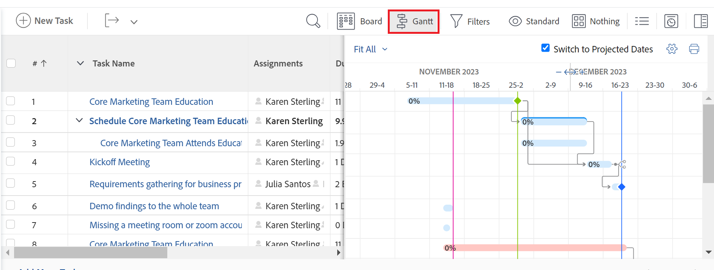

# Introducción al [!UICONTROL gráfico Gantt]

<!-- Audited: 01/2024 -->

Los diagramas de Gantt de Adobe Workfront proporcionan una representación visual de la cronología de una lista de tareas o proyectos.

En [!DNL Adobe Workfront], hay dos [!UICONTROL diagramas de Gantt] con una funcionalidad similar:

* **La lista de tareas [!UICONTROL Diagrama de Gantt]**: muestra información sobre las tareas y su cronología a nivel de proyecto. Un [!UICONTROL gráfico Gantt] similar muestra información sobre tareas de plantilla en el nivel de plantilla.
* **La lista de proyectos [!UICONTROL Diagrama de Gantt]**: muestra información sobre los proyectos y su cronología.

Aunque se ven y se sienten similares, la funcionalidad de cada uno es diferente.

## Consideraciones sobre el gráfico Gantt

* Puede editar la información en el siguiente [!UICONTROL gráfico Gantt]:
   * Una lista de tareas
* No se puede editar la información en los siguientes [!UICONTROL diagramas de Gantt]:
   * Una lista de tareas de plantilla
   * Una lista de proyectos
* No hay ninguna opción de [!UICONTROL gráfico Gantt] para una lista de plantillas.
* Puede configurar la información que se muestra en la lista de tareas [!UICONTROL Diagrama de Gantt] y en la lista de proyectos [!UICONTROL Diagrama de Gantt].
* No puede configurar los colores ni las fuentes en las que se muestra la información del [!UICONTROL gráfico Gantt].
* Cuando la información se actualiza desde las tareas, se refleja automáticamente tanto en la lista de tareas [!UICONTROL Diagrama de Gantt] como en la lista de proyectos [!UICONTROL Diagrama de Gantt].
* Cuando la información se actualiza desde las tareas de plantilla, se refleja automáticamente en la lista de tareas de plantilla [!UICONTROL Diagrama de Gantt].

## Obtener acceso al [!UICONTROL gráfico Gantt]

Los gráficos [!UICONTROL Gantt] de [!DNL Workfront] proporcionan una representación visual de una lista de tareas o proyectos.

Puede ver la lista de tareas [!UICONTROL Diagrama de Gantt] directamente desde la lista de tareas de un proyecto o desde un informe de tareas.

Puede ver la lista de proyectos [!UICONTROL Diagrama de Gantt] en una lista de proyectos o un informe de proyectos.

### Lista de tareas [!UICONTROL Diagrama de Gantt] {#task-list-gantt-chart}

<!--The task list [!UICONTROL Gantt Chart] is accessible in the following areas:

* In a Project

   * [!UICONTROL Tasks] section
   * [!UICONTROL Subtasks] section of a task

* In a [!UICONTROL Template]

* In a [!UICONTROL Task] report-->

Para obtener acceso a la lista de tareas [!UICONTROL Diagrama de Gantt] de un proyecto o una plantilla:

1. Vaya a cualquiera de las siguientes áreas:

   * Cree un proyecto y luego haga clic en [!UICONTROL **Tareas**] en el panel izquierdo.
   * Seleccione una plantilla y luego haga clic en [!UICONTROL **Tareas de plantilla**] en el panel izquierdo
   * Una tarea o tarea de plantilla y, a continuación, haga clic en [!UICONTROL **Subtareas**] en el panel izquierdo.
   * Un informe de tareas

1. Haga clic en el icono [!UICONTROL **Gantt**]  en la parte superior de la lista de tareas.

   

   La lista de tareas [!UICONTROL Diagrama de Gantt] se abre a la derecha de la lista de tareas.

1. Para configurar la información que desea mostrar en el gráfico [!UICONTROL Gantt] de la tarea, haga clic en el icono [!UICONTROL **Configuración**] y, a continuación, habilite cualquiera de las siguientes opciones:

   * [!UICONTROL Fechas reales]
   * [!UICONTROL Asignaciones]
   * [!UICONTROL Línea base]
   * [!UICONTROL Fecha de confirmación]
   * [!UICONTROL % completado]
   * [!UICONTROL Ruta crítica]
   * [!UICONTROL Diamantes de hito]
   * [!UICONTROL Líneas de hito]
   * [!UICONTROL Predecesoras]
   * [!UICONTROL Estado de progreso]
   * [!UICONTROL Fechas proyectadas]

1. Comience a editar las tareas como se describe en los siguientes artículos:

   * [Configurar cómo se muestra la información en el gráfico Gantt](../use-the-gantt-chart/configure-info-on-gantt-chart.md)
   * [Actualizar información en el gráfico Gantt de lista de tareas](../use-the-gantt-chart/update-info-task-list-gantt.md)

### Lista de proyectos [!UICONTROL Diagrama de Gantt] {#project-list-gantt-chart}

<!--The project list [!UICONTROL Gantt Chart] is accessible in the following areas:

* In the [!UICONTROL Projects] area
* In the [!UICONTROL Projects] section of a [!UICONTROL Portfolio]
* In the [!UICONTROL Projects] section of a [!UICONTROL Program]
* In a [!UICONTROL Project] report-->

Para obtener acceso a la lista de proyectos [!UICONTROL Diagrama de Gantt]:

1. Vaya a cualquiera de las siguientes áreas:

   * El área [!UICONTROL **Proyectos**]
   * La sección [!UICONTROL **Proyectos**] de un [!UICONTROL Portfolio]
   * La sección [!UICONTROL **Proyectos**] de un [!UICONTROL Programa]
   * Un informe de [!UICONTROL **proyecto**]

1. Haga clic en el icono [!UICONTROL **Gantt**] que se encuentra en la parte superior de la lista de proyectos.

   

   Se abre la lista de proyectos [!UICONTROL Diagrama de Gantt].

1. Para configurar la información que desea mostrar en el gráfico del proyecto [!UICONTROL Gantt], haga clic en el icono [!UICONTROL **Configuración**] y, a continuación, habilite cualquiera de las siguientes opciones:

   * [!UICONTROL Fechas reales]
   * [!UICONTROL % completado]
   * [!UICONTROL Diamantes de hito]
   * [!UICONTROL Líneas de hito]
   * [!UICONTROL Predecesoras]
   * [!UICONTROL Estado de progreso]
   * [!UICONTROL Fechas proyectadas]
