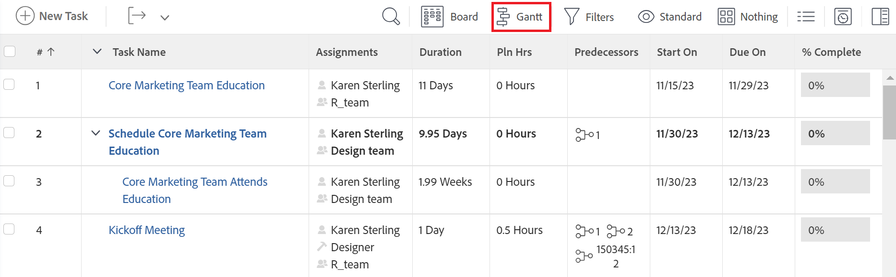

# Actualizar información en la lista de tareas [!UICONTROL Gráfico Gantt]

La lista de tareas [!UICONTROL Gráfico Gantt] muestra detalles acerca de las tareas que se encuentran en un proyecto o plantilla.

En una plantilla, la lista de tareas [!UICONTROL Gráfico Gantt] refleja las actualizaciones realizadas en la lista de tareas de la plantilla en el nivel de tarea. No se puede editar el [!UICONTROL Gráfico Gantt] asociado a una plantilla.

En un proyecto, puede actualizar la información de la tarea directamente en la lista de tareas [!UICONTROL Gráfico Gantt].

Este artículo describe las siguientes acciones que puede realizar directamente en la Lista de tareas [!UICONTROL Gráfico Gantt]:

* Modificar duración de tarea
* Crear o quitar relaciones de predecesoras
* Cambiar las fechas de inicio y finalización de la tarea
* Actualizar porcentaje completado
* Nivelar recursos del proyecto

## Requisitos de acceso

Debe tener lo siguiente para seguir los pasos de este artículo:

<table style="table-layout:auto"> 
 <col> 
 <col> 
 <tbody> 
  <tr> 
   <td role="rowheader">[!DNL Adobe Workfront] plan*</td> 
   <td> 
Cualquiera 
 </td> 
  </tr> 
  <tr> 
   <td role="rowheader">[!DNL Adobe Workfront] licencia*</td> 
   <td> 
[!UICONTROL Plan] 
 </td> 
  </tr> 
  <tr> 
   <td role="rowheader">Configuraciones de nivel de acceso*</td> 
   <td> 
Acceso de [!UICONTROL Edit] a Proyectos y tareas
 
Nota: Si todavía no tiene acceso, pregunte a su [!DNL Workfront] administrador si establece restricciones adicionales en su nivel de acceso. Para obtener información sobre cómo [!DNL Workfront] El administrador puede modificar su nivel de acceso. Consulte <a href="../../../administration-and-setup/add-users/configure-and-grant-access/create-modify-access-levels.md" class="MCXref xref">Crear o modificar niveles de acceso personalizados</a>.
 </td> 
  </tr> 
  <tr> 
   <td role="rowheader">Permisos de objeto</td> 
   <td> 
Acceso de [!UICONTROL Manage] al proyecto y a las tareas 
 
Para obtener información sobre cómo solicitar acceso adicional, consulte <a href="../../../workfront-basics/grant-and-request-access-to-objects/request-access.md" class="MCXref xref">Solicitud de acceso a objetos </a>.
 </td> 
  </tr> 
 </tbody> 
</table>

&#42;Para saber qué plan, tipo de licencia o acceso tiene, póngase en contacto con su [!DNL Workfront] administrador.

## Modificar duración de tarea

1. Vaya al proyecto que desee modificar.
1. Clic **[!UICONTROL Tareas]** en el panel izquierdo.

   

1. Haga clic en **[!UICONTROL Gráfico Gantt]** icono.

   

   Todos los cambios se guardan automáticamente cuando la variable **[!UICONTROL Autoguardar]** La opción está activada. Está activada de forma predeterminada.

1. (Opcional) Haga clic en **[!UICONTROL Modo de planificación]** y seleccione **[!UICONTROL Guardado manual estándar]** o **[!UICONTROL Planificación de calendario]** para guardar los cambios manualmente.

   

1. Pase el ratón sobre la cronología de una tarea y arrastre el indicador de línea de tiempo a una fecha diferente.
1. Suelte el indicador cuando haya alcanzado la nueva fecha de finalización correcta para la tarea.
1. (Opcional y condicional) Si ha seleccionado guardar manualmente los cambios, haga clic en **[!UICONTROL Deshacer]** o&#x200B;**[!UICONTROL Rehacer]** iconos si desea cancelar o duplicar cualquiera de los cambios.

   >[!TIP]
   >
   >Puede utilizar los siguientes métodos abreviados del teclado para deshacer o rehacer los cambios en el gráfico Gantt:
   >
   >   
   >   
   >   * [!DNL Mac]: uso [!UICONTROL Comando + Z] para deshacer y [!UICONTROL Comando + Mayús + Z] para rehacer.
   >   * [!DNL Windows]: uso [!UICONTROL Ctrl + Z] para deshacer y [!UICONTROL Ctrl + Y] para rehacer.
   >   
   >

1. Clic **[!UICONTROL Guardar]** en la esquina superior derecha de la [!UICONTROL Gráfico Gantt].

## Crear o quitar relaciones de predecesoras

1. Vaya al proyecto que desee modificar.
1. En el **[!UICONTROL Tareas]** , haga clic en el **[!UICONTROL Gráfico Gantt]** icono.

   El **[!UICONTROL Autoguardar]** está seleccionada de forma predeterminada, en cuyo caso todos los cambios se guardan automáticamente.

   

1. (Opcional) Haga clic en **[!UICONTROL Modo de planificación]** y seleccione **[!UICONTROL Guardado manual estándar]** o **[!UICONTROL Planificación de calendario]** para guardar los cambios manualmente.

   

1. Para crear una relación de predecesora, haga clic en el punto de inicio de una tarea y arrástrela hasta el punto final de la tarea.
1. Para eliminar una relación de predecesora, haga clic en una línea de predecesora que conecte dos tareas para seleccionarla y, a continuación, presione **[!UICONTROL Eliminar]** en el teclado.\
   

1. (Opcional y condicional) Si ha seleccionado guardar los cambios manualmente, haga clic en **[!UICONTROL Deshacer]** o&#x200B;**[!UICONTROL Rehacer]** iconos si desea cancelar o duplicar cualquiera de los cambios.

   >[!TIP]
   >
   >Puede utilizar los siguientes métodos abreviados del teclado para deshacer o rehacer los cambios en el gráfico Gantt:
   >
   >   
   >   
   >   * [!DNL Mac]: uso [!UICONTROL Comando + Z] para deshacer y [!UICONTROL Comando + Mayús + Z] para rehacer.
   >   * [!DNL Windows]: [!UICONTROL Utilizar Ctrl + Z] para deshacer y [!UICONTROL Ctrl + Y] para rehacer.
   >   
   >

1. Haga clic en **[!UICONTROL Guardar]** .

## Cambiar las fechas de inicio y finalización de la tarea

1. Vaya al proyecto que desee modificar.
1. En el **[!UICONTROL Tareas]** , haga clic en el **[!UICONTROL Gráfico Gantt]** icono.

   Todos los cambios se guardan automáticamente cuando la variable **[!UICONTROL Autoguardar]** La opción está activada. Está activada de forma predeterminada.

   

1. (Opcional) Haga clic en **[!UICONTROL Modo de planificación]** y seleccione **[!UICONTROL Guardado manual estándar]** o **[!UICONTROL Planificación de calendario]** para guardar los cambios manualmente.

   

1. Pase el ratón sobre el centro de la tarea y busque la flecha multidireccional.
1. Haga clic en la tarea y arrástrela a la fecha deseada.

   

1. Si cambia la fecha de la tarea de forma que afecte a la delimitación de la tarea, haga clic en **[!UICONTROL Aceptar]** para confirmar el cambio de restricción de tarea.

   >[!NOTE]
   >
   >Si la tarea tiene una de las restricciones siguientes, el sistema actualiza el [!UICONTROL Restricción de tarea] hasta [!UICONTROL No iniciar antes] En lugar de si el proyecto está programado desde el [!UICONTROL Fecha de inicio] o [!UICONTROL No terminar después de] si el proyecto está programado desde el [!UICONTROL Fecha de finalización]:
   >
   >   
   >   
   >   * [!UICONTROL Lo antes posible]
   >   * [!UICONTROL Lo más tarde posible]
   >   * [!UICONTROL Lo más temprano disponible]
   >   * [!UICONTROL Lo más tarde posible]
   >   
   >   
   >En algunos casos, las relaciones de predecesoras pueden impedir que las tareas comiencen antes y no se permite el movimiento de tareas.

1. (Opcional y condicional) Si ha seleccionado guardar los cambios manualmente, haga clic en **[!UICONTROL Deshacer]** o&#x200B;**[!UICONTROL Rehacer]** iconos si desea cancelar o duplicar cualquiera de los cambios.

   >[!TIP]
   >
   >Puede utilizar los siguientes métodos abreviados del teclado para deshacer o rehacer los cambios en la [!UICONTROL Gráfico Gantt]:
   >
   >   
   >   
   >   * [!DNL Mac]: uso [!UICONTROL Comando + Z] para deshacer y [!UICONTROL Comando + Mayús + Z] para rehacer.
   >   * [!DNL Windows]: uso [!UICONTROL Ctrl + Z] para deshacer y [!UICONTROL Ctrl + Y] para rehacer.
   >   
   >

1. Haga clic en **[!UICONTROL Guardar]**.

## Actualizar porcentaje completado

1. Vaya al proyecto que desee modificar.
1. En el **[!UICONTROL Tareas]** , haga clic en el **[!UICONTROL Gráfico Gantt]** icono.

   

   Todos los cambios se guardan automáticamente cuando la variable **[!UICONTROL Autoguardar]** La opción está activada. Está activada de forma predeterminada.

1. (Opcional) Haga clic en **[!UICONTROL Modo de planificación]** y seleccione **[!UICONTROL Guardado manual estándar]** o **[!UICONTROL Planificación de calendario]** para guardar los cambios manualmente.
1. Haga doble clic en el número porcentual dentro de la tarea e introduzca el número.

   >[!IMPORTANT]
   >
   >Debe tener [!UICONTROL % completado] seleccionados en la [!UICONTROL Opciones] para actualizar el porcentaje completado. Para ello, haga clic en el **[!UICONTROL Opciones]** y seleccione **[!UICONTROL % completado]**.
   >
   >
   >   >
   >

1. (Opcional y condicional) Si ha seleccionado guardar los cambios manualmente, haga clic en **[!UICONTROL Deshacer]** o&#x200B;**[!UICONTROL Rehacer]** iconos si desea cancelar o duplicar cualquiera de los cambios.

   >[!TIP]
   >
   >Puede utilizar los siguientes métodos abreviados del teclado para deshacer o rehacer los cambios en la [!UICONTROL Gráfico Gantt]:
   >
   >   
   >   
   >   * [!DNL Mac]: uso [!UICONTROL Comando + Z] para deshacer y [!UICONTROL Comando + Mayús + Z] para rehacer.
   >   * [!DNL Windows]: uso [!UICONTROL Ctrl + Z] para deshacer y [!UICONTROL Ctrl + Y] para rehacer.
   >   
   >

1. Clic **[!UICONTROL Guardar]** en la esquina superior derecha de la [!UICONTROL Gráfico Gantt].

## Nivelar recursos del proyecto

Puede utilizar la Lista de tareas [!UICONTROL Gráfico Gantt] para nivelar los recursos.

Para obtener información sobre la redistribución de recursos en [!UICONTROL Gráfico Gantt], consulte [Nivelar recursos en la [!UICONTROL Gráfico Gantt]](../../../manage-work/gantt-chart/use-the-gantt-chart/level-resources-in-gantt.md).

<!--

(NOTE:&nbsp;this is drafted because I moved the whole content to the article linked above)

<ol>
<li value="1">Go to the project you want to level.</li>
<li value="2"> 
 In the <strong>Tasks</strong> area, click the <strong>Gantt chart</strong> icon.
 
All changes are saved automatically when the <strong>Autosave</strong> option is enabled. It is enabled by default. 
 </li>
<li value="3">

(Optional) Click the <strong>Plan mode</strong> icon and select <strong>Manual save Standard</strong> or <strong>Timeline Planning</strong> to save your changes manually.
 <note type="tip">
You cannot level resources in the Gantt chart when the Autosave option is enabled.
</note>

  

 </li>
<li value="4"> 
Click the <strong>Level Resources</strong> drop-down menu.
 
  
 </li>
<li value="5">Select one of following options:
<ul>
<li><strong>Level Now</strong>: Applies resource leveling to the selected task.</li>
<li>
<strong>Clear Leveling</strong>: Removes all resource leveling from the selected task.
</li>
</ul><note type="note">
Your resources might be overallocated if they are assigned to multiple tasks which occur during the same time frame.
</note></li>
<li value="6"> 
(Optional and conditional) If you have disabled the Autosave option, click the <strong>Undo</strong> or<strong>Redo</strong> icons if you want to cancel or duplicate any of the changes. 
 <note type="tip">

You can use the following keyboard shortcuts to undo or redo changes on the Gantt chart:

<ul>
<li>Mac: Use Command + Z to undo and Command + Shift + Z to redo.</li>
<li>Windows: Use Ctrl + Z to undo and Ctrl + Y to redo.</li>
</ul>
</note> </li>
<li value="7">Click <strong>Save</strong> in the upper-right corner of the Gantt chart.</li>
</ol>

-->

<!--
<h2 data-mc-conditions="QuicksilverOrClassic.Draft mode"> </h2>
-->
