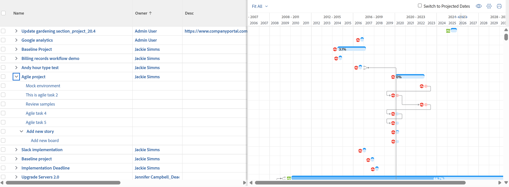

# Ver información en [!UICONTROL gráfico Gantt]

La lista de tareas [!UICONTROL gráfico de Gantt] y la lista de proyectos [!UICONTROL Ggráfico de Gantt] muestran información sobre proyectos y tareas.

## Requisitos de acceso

Debe tener lo siguiente para seguir los pasos de este artículo:

<table style="table-layout:auto"> 
 <col> 
 <col> 
 <tbody> 
  <tr> 
   <td role="rowheader">[!DNL Adobe Workfront] plan*</td> 
   <td> 
Cualquiera 
 </td> 
  </tr> 
  <tr> 
   <td role="rowheader">[!DNL Adobe Workfront] información general sobre licencias*</td> 
   <td> 
[!UICONTROL Review] o superior
 </td> 
  </tr> 
  <tr> 
   <td role="rowheader">Configuraciones de nivel de acceso*</td> 
   <td> 
[!UICONTROL View] o acceso superior a Proyectos y tareas
 
<b>NOTA</b>

Si todavía no tiene acceso, pregunte al administrador de [!DNL Workfront] si ha establecido restricciones adicionales en su nivel de acceso. Para obtener información sobre cómo un administrador de [!DNL Workfront] puede modificar su nivel de acceso, consulte <a href="../../../administration-and-setup/add-users/configure-and-grant-access/create-modify-access-levels.md" class="MCXref xref">Creación o modificación de niveles de acceso personalizados</a>.
 </td>
</tr> 
  <tr> 
   <td role="rowheader">Permisos de objeto</td> 
   <td> 
[!UICONTROL View] o acceso superior al proyecto
 
Para obtener información sobre cómo solicitar acceso adicional, consulte <a href="../../../workfront-basics/grant-and-request-access-to-objects/request-access.md" class="MCXref xref">Solicitar acceso a los objetos </a>.
 </td> 
  </tr> 
 </tbody> 
</table>

&#42;Para saber qué plan, tipo de licencia o acceso tiene, póngase en contacto con el administrador de [!DNL Workfront].

## Busque el [!UICONTROL gráfico Gantt]

Puede localizar el gráfico Gantt de lista de tareas y la lista de proyectos [!UICONTROL gráfico Gantt] en varias áreas de Workfront. Para obtener más información, consulte [Introducción al [!UICONTROL gráfico Gantt]](../../../manage-work/gantt-chart/use-the-gantt-chart/get-started-with-gantt.md).

## Ver tareas en la [!UICONTROL Ruta crítica]

En la lista de proyectos [!UICONTROL gráfico Gantt], las tareas que no están en la [!UICONTROL Ruta crítica] se muestran como líneas horizontales de color azul claro. Las tareas que están en la [!UICONTROL Ruta crítica] de un proyecto se muestran como líneas horizontales rojas.

Para obtener más información sobre las tareas en la [!UICONTROL Ruta crítica], consulte [Información general de la [!UICONTROL Ruta crítica]](../../../manage-work/tasks/manage-tasks/critical-path.md) del proyecto.

## Ver información de la tarea en la lista de proyectos [!UICONTROL gráfico Gantt]

Puede ver la información de tareas de un proyecto directamente desde la Lista de proyectos. Las tareas se enumeran con el nombre de cada proyecto.

>[!NOTE]
>
>No puede editar tareas desde la Lista de proyectos [!UICONTROL Gráfico Gantt].

Puedes ver la información de la tarea de un proyecto directamente desde una lista de proyectos en las siguientes áreas:

* En el área de [!UICONTROL Proyectos]
* En un portafolio
* Dentro de un programa

Para ver las tareas de un proyecto a partir de una lista de proyectos:

1. Vaya a una de las áreas mencionadas anteriormente.

   Por ejemplo, en el [!UICONTROL Menú principal], haga clic en **[!UICONTROL Proyectos]**.

   Se muestra una lista de proyectos.

1. Haga clic en el icono de **[!UICONTROL gráfico Gantt]**  en la esquina superior derecha de la pantalla.

   <!--
   
(NOTE: images conditioned for classic and nwe)  

   -->

1. Haga clic en el icono **[!UICONTROL Mostrar lista de tareas]**.

1. En la lista de proyectos a la izquierda, haga clic en la flecha desplegable junto al nombre del proyecto para mostrar las tareas de ese proyecto.\
   Muestra información de tareas en el [!UICONTROL gráfico Gantt].\
   

1. (Opcional) Haga clic en el icono **[!UICONTROL Imprimir]** en la esquina superior derecha para exportar el [!UICONTROL gráfico Gantt].

   >[!NOTE]
   >
   >La lista de proyectos [!UICONTROL Diagrama de Gantt] solamente exporta proyectos. No se incluye la información de la tarea.

## Cambiar el período de tiempo para el que se muestra información en el [!UICONTROL gráfico Gantt]

Puede ajustar el período de tiempo mostrado en el [!UICONTROL gráfico Gantt] para mostrar información a un nivel granular, o puede navegar rápidamente a una vista de día, semana, mes, trimestre o año:

* [Cambiar el período de tiempo en un nivel granular](#change-the-time-period-on-a-granular-level)
* [Ver información por día, semana, mes, trimestre o año](#view-information-by-day-week-month-quarter-or-year)

### Cambiar el período de tiempo en un nivel granular {#change-the-time-period-on-a-granular-level}

1. Pasa el cursor sobre la línea de tiempo del [!UICONTROL gráfico Gantt], luego arrastra el indicador de zoom de izquierda a derecha para expandir o contraer la línea de tiempo.\
   

### Ver información por día, semana, mes, trimestre o año {#view-information-by-day-week-month-quarter-or-year}

1. En el [!UICONTROL gráfico Gantt], haga clic en el menú desplegable de lapso de tiempo.

   

1. Seleccione un lapso de tiempo entre las siguientes opciones disponibles:

   * **[!UICONTROL Ajustar todo]**: esta opción muestra la línea de tiempo de todo el proyecto.
   * **[!UICONTROL Todos los proyectos]**: esta opción solo está disponible en el gráfico Gantt de lista de proyectos.
   * **[!UICONTROL Año]**
   * **[!UICONTROL Trimestre]**
   * **[!UICONTROL Mes]**
   * **[!UICONTROL Semana]**
   * **[!UICONTROL Día]**

1. (Opcional) Seleccione un marco de tiempo más granular, como [!UICONTROL Semana] o [!UICONTROL Día], y haga clic y arrastre la barra de desplazamiento horizontal en la parte inferior del [!UICONTROL gráfico Gantt] para moverse de izquierda a derecha en la línea de tiempo del proyecto.\
   Se muestra una captura de la línea de tiempo del [!UICONTROL gráfico Gantt] para mostrar todo el proyecto.

   >[!TIP]
   >
   >La instantánea de la cronología solo se muestra después de hacer clic en la barra de desplazamiento horizontal.

   

1. (Opcional) Haga clic en cualquier parte de la captura de la línea de tiempo para navegar a un punto específico en el ciclo de vida del proyecto.\
   O\
   Arrastra los controles del visor de la captura para seleccionar un rango específico de la línea de tiempo y mostrarlo en el [!UICONTROL gráfico Gantt] principal.

## Uso de filtros, vistas y agrupaciones

El [!UICONTROL gráfico Gantt] es una representación visual de la información que se muestra actualmente en la lista de tareas. Puedes aplicar filtros, vistas y agrupaciones a los objetos listados en ambos [!UICONTROL gráfico Gantt].

>[!CAUTION]
>
>No puede aplicar filtros, vistas y agrupaciones cuando seleccionas [!UICONTROL Guardar manualmente] en [!UICONTROL Planificación de la línea de tiempo] para guardar los cambios en tu lista de tareas. Para obtener información acerca de cómo guardar los cambios realizados en las tareas de una lista, consulte [Editar tareas en una lista](../../../manage-work/tasks/manage-tasks/edit-tasks-in-a-list.md).

Los filtros y agrupaciones que aplicas a la lista se reflejan tanto en los [!UICONTROL gráficos Gantt] de la Lista de proyectos como en la Lista de tareas y también se incluyen cuando se exportan los gráficos Gantt:

* Filtros\
   Puede aplicar un filtro a la lista para controlar la información que se muestra en el [!UICONTROL gráfico Gantt].\
   Para obtener información acerca de cómo aplicar un filtro, consulte [Información general de filtros](../../../reports-and-dashboards/reports/reporting-elements/filters-overview.md).

* Agrupaciones\
   Las agrupaciones que aplique a la lista se reflejarán en el [!UICONTROL gráfico Gantt].\
   Para obtener información sobre cómo aplicar una agrupación, consulte [Información general sobre agrupaciones en Adobe Workfront](../../../reports-and-dashboards/reports/reporting-elements/groupings-overview.md).

Las vistas no se reflejan en el [!UICONTROL gráfico Gantt]. Sin embargo, cuando exportas el [!UICONTROL gráfico Gantt] (como se describe en [Exportar el [!UICONTROL gráfico Gantt] a PDF](../../../manage-work/gantt-chart/use-the-gantt-chart/export-gantt-chart-to-pdf.md)), la lista de tareas se exporta además del [!UICONTROL gráfico Gantt], con la vista actual aplicada a la lista.

## Configurar opciones de visualización

Puede elegir qué tipo de información se muestra en ambos [!UICONTROL gráficos Gantt]. Para obtener más información, consulte [Configurar cómo se muestra la información en el [!UICONTROL gráfico Gantt]](../../../manage-work/gantt-chart/use-the-gantt-chart/configure-info-on-gantt-chart.md).
