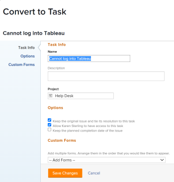

# Información general sobre la conversión de problemas en Adobe Workfront

Si es necesario trabajar más para completar un problema después de enviarlo, puede convertir el problema en un proyecto o en una tarea.

Para obtener información sobre la conversión de problemas en tareas, consulte [Convertir un problema en una tarea en Adobe Workfront](../../../manage-work/issues/convert-issues/convert-issue-to-task.md).

Para obtener información sobre la conversión de problemas en proyectos, consulte [Convertir un problema en un proyecto en Adobe Workfront](../../../manage-work/issues/convert-issues/convert-issue-to-project.md).

## Consideraciones al convertir problemas

* Al convertir problemas en tareas o proyectos, la mayor parte de la información del problema se transfiere a la tarea o al proyecto, a menos que se especifique lo contrario en este artículo.
* La persona con la función de administrador de Workfront o de grupos ya ha establecido las preferencias respecto a lo que sucede con un problema, su resolución y el acceso a su contacto principal cuando se convierte en un proyecto o tarea, como se describe en [Configurar las preferencias de tareas y problemas de todo el sistema](../../../administration-and-setup/set-up-workfront/configure-system-defaults/set-task-issue-preferences.md).
* Workfront quita todas las aprobaciones asociadas a problemas durante la conversión.
* Workfront sobrescribe el objeto de resolución del problema cuando se convierte en una tarea o un proyecto. La nueva tarea o problema pasa a ser el nuevo objeto de resolución del problema después de la conversión.
* Tenga en cuenta lo siguiente:

   * Durante la conversión, es posible que se le pregunte si desea mantener el problema y su resolución asociados al proyecto o la tarea que está creando.
   * Si mantiene el problema, el estado y el porcentaje completado del proyecto o la tarea actualizan automáticamente el estado y el porcentaje completado del problema cuando se producen cambios en el proyecto, la tarea o el problema, o cuando Workfront vuelve a calcular la línea de tiempo.

  >[!NOTE]
  >
  >   Una vez que el estado del problema pasa a ser Cerrado (como resultado del cierre de la tarea o del proyecto), independientemente del estado en que cambie la tarea o el proyecto después de cerrarlos, el problema permanece Cerrado.

* Al convertir un problema en una tarea o un proyecto, el problema se quita del área Inicio del usuario asignado al problema.

* Al convertir un problema, los permisos de los problemas originales no se transfieren al objeto convertido (tarea o proyecto).

* Al convertir un problema en un proyecto mediante una plantilla, la mayor parte de la información de la plantilla se transfiere al nuevo proyecto. Sin embargo, parte de la información del problema también se puede transferir al nuevo proyecto. Para obtener más información, consulte la sección [Información general sobre los campos de proyecto al convertir un problema en un proyecto mediante una plantilla](#overview-of-project-fields-when-converting-an-issue-to-a-project-using-a-template) en este artículo.
* Al convertir un problema, no todos los documentos o su información se mueven al nuevo objeto en el que se convierte el problema. Los siguientes elementos se incluyen al convertir un problema que tiene documentos o vínculos a documentos adjuntos:

   * Documento
   * Vínculos de documentos a servicios de terceros, como Google Drive o SharePoint.
   * Versiones
   * Las revisiones solo se incluyen cuando la opción **Mantener el problema original y enlazar su solución a esta tarea** no está seleccionada.
   * Las aprobaciones de documentos no se incluyen al convertir un problema que tiene documentos y vínculos a documentos adjuntos.

* Si ha decidido mantener el problema en la conversión y tiene documentos adjuntos, el documento y sus versiones se copian en el proyecto o en la tarea. Las pruebas y las aprobaciones de documentos no se copian en el proyecto ni en la tarea.
* Si decide no mantener el problema en la conversión y tiene documentos adjuntos, el documento, sus versiones y las pruebas se transfieren al proyecto o a la tarea. Las aprobaciones de documentos no se transferirán al proyecto o a la tarea.
* Si tiene documentos y carpetas vinculados al problema original desde servicios de terceros, como Google Drive, independientemente de si mantiene el problema o no durante la conversión, esos vínculos se copiarán al nuevo objeto.
* Los comentarios del problema también se copian en la tarea o el proyecto convertido desde el problema, pero los usuarios etiquetados no se transferirán.
* Si desea transferir información de formulario personalizado del problema al proyecto o tarea en el que la está convirtiendo, asegúrese de tener un formulario personalizado de proyecto o tarea que incluya los mismos campos que desea transferir del problema. Para obtener más información, consulte [Transferir datos de formulario personalizados al convertir un objeto](../../../administration-and-setup/customize-workfront/create-manage-custom-forms/transfer-custom-form-data-larger-item.md).

## Información general sobre los campos de proyecto al convertir un problema en un proyecto mediante una plantilla {#overview-of-project-fields-when-converting-an-issue-to-a-project-using-a-template}

Al convertir un problema en un proyecto, puede convertirlo en un proyecto en blanco o utilizar una plantilla.

Para obtener más información, consulte [Convertir un problema en un proyecto en Adobe Workfront](../../../manage-work/issues/convert-issues/convert-issue-to-project.md).

Al utilizar una plantilla, algunos campos que se rellenan en la plantilla se transfieren al proyecto creado desde el problema convertido. Otros campos se transfieren al proyecto desde el problema convertido.

En la tabla siguiente se muestra información del proyecto y si se transfiere desde la plantilla o desde el problema:

<table style="table-layout:auto"> 
 <col> 
 <col> 
 <tbody> 
  <tr> 
   <td>Descripción</td> 
   <td> 
La descripción del problema se transfiere al nuevo proyecto. 
 
 Si no hay una descripción del problema, la descripción de la plantilla se transfiere al proyecto. 
 
Si el campo Descripción está vacío tanto en el caso del problema como de la plantilla, el campo está vacío en el proyecto. 
 </td> 
  </tr> 
  <tr> 
   <td>Estado</td> 
   <td>Estado predeterminado seleccionado para el grupo en la plantilla. Si la plantilla no está asociada al grupo, el estado del proyecto se establece en el estado predeterminado definido por el administrador de Workfront en el área de Configuración Preferencias del proyecto. Para obtener más información, consulte <a href="../../../administration-and-setup/set-up-workfront/configure-system-defaults/set-project-preferences.md" class="MCXref xref">Configurar las preferencias de proyecto de todo el sistema</a>.</td> 
  </tr> 
  <tr> 
   <td>Prioridad</td> 
   <td>
Transferencias del problema.

   
Al utilizar una plantilla para el proyecto convertido, tiene la opción de cambiar manualmente la prioridad. Si decide no cambiarla, la prioridad del problema se transfiere al proyecto. 
    </td> 
  </tr> 
  <tr> 
   <td>URL</td> 
   <td> 
La URL del problema se transfiere al nuevo proyecto. 
 
 Si no se especifica ninguna URL en el problema, la URL de la plantilla se transfiere al proyecto. 
 
Si el campo de la URL está vacío tanto para el problema como para la plantilla, este queda vacío en el proyecto. 
 </td> 
  </tr> 
  <tr> 
   <td>Tipo de condición del proyecto</td> 
   <td>Se transfiere desde la plantilla.</td> 
  </tr> 
  <tr> 
   <td>Condición del proyecto</td> 
   <td>Coincide con la preferencia predeterminada del sistema, según lo que determine el administrador de Workfront en el área de Configuración. Para obtener más información, consulte <a href="../../../administration-and-setup/customize-workfront/create-manage-custom-conditions/set-custom-condition-default-projects.md" class="MCXref xref">Establecer una condición personalizada como predeterminada para los proyectos</a></td> 
  </tr> 
  <tr> 
   <td>Programar desde</td> 
   <td>Se transfiere desde la plantilla.</td> 
  </tr> 
  <tr> 
   <td>Fechas del proyecto</td> 
   <td> 
    <ul> 
     <li> 
<b>Fecha planificada de inicio</b>: debe preseleccionarse el tiempo de trabajo más cercano basado en el tiempo de trabajo de programación de la plantilla, de acuerdo con la zona horaria. Este campo está desactivado si el campo de programación “Desde” está establecido como Desde la finalización. 
 </li> 
     <li> 
<b>Fecha planificada de finalización</b>: debe preseleccionarse el tiempo de trabajo más cercano basado en el tiempo de trabajo de programación de la plantilla, de acuerdo con la zona horaria. Este campo está desactivado si el campo de programación “Desde” está establecido como Desde el inicio. 
 </li> 
    </ul> </td> 
  </tr> 
  <tr> 
   <td>Portafolio</td> 
   <td>Se transfiere desde la plantilla. De lo contrario, este campo queda vacío.</td> 
  </tr> 
  <tr> 
   <td>Programa</td> 
   <td>Se transfiere desde la plantilla. De lo contrario, este campo queda vacío.</td> 
  </tr> 
  <tr> 
   <td>Grupo</td> 
   <td>
 Se dan los siguientes escenarios:

     <ul><li>Si se especifica un grupo durante la conversión, este se convierte en el grupo del proyecto</li>
     <li>Si convierte a un proyecto mediante una plantilla y hay un grupo en la plantilla, y durante la conversión no especifica ningún grupo, el grupo de la plantilla se convierte en el grupo del nuevo proyecto</li>
      <li> Si no hay ningún grupo en la plantilla y no especifica ningún grupo durante la conversión, el grupo del proyecto del problema original se convierte en el grupo del nuevo proyecto</li> </ul>
      </td> 
  </tr> 
  <tr> 
   <td>Compañía</td>    
   <td>  Se transfiere desde la plantilla. De lo contrario, este campo queda vacío.</td>

</tr> 
  <tr> 
   <td>Propietario del proyecto</td> 
   <td>Se transfiere desde el campo Propietario de la plantilla en esta. De lo contrario, se establece en el usuario que ha iniciado sesión y que realiza la conversión. </td> 
  </tr> 
  <tr> 
   <td>Patrocinador de proyecto</td> 
   <td>Se transfiere desde el campo Patrocinador de la plantilla en esta. De lo contrario, este campo queda vacío.</td> 
  </tr> 
  <tr> 
   <td>Gerente de recursos</td> 
   <td>Se transfiere desde la plantilla. De lo contrario, este campo queda vacío.</td> 
  </tr> 
  <tr> 
   <td>Configuración de tarea</td> 
   <td>Transferencia desde la plantilla.</td> 
  </tr> 
  <tr> 
   <td>Configuración de problema</td> 
   <td>Transferencia desde la plantilla. </td> 
  </tr> 
  <tr> 
   <td>Acceso</td> 
   <td> 
Transferencias desde la sección Acceso en la plantilla. 
 </td> 
  </tr> 
  <tr> 
   <td>Rutas de aprobación</td> 
   <td>Transferencia desde la plantilla. Las aprobaciones asociadas con el problema se eliminan durante la conversión. </td> 
  </tr> 
 </tbody> 
</table>

<!--WRITER

<h2>Convert an issue to a project</h2> 

(NOTE: moved to its own article)

-->
<!--
<ol>
<li value="1"> Click the <strong>Issues</strong> icon on a project. </li>
<li value="2"> 
Click the issue to be converted to access the issue.
 </li>
<li value="3"> 
 Click the <strong>More</strong> menu, then click <strong>Convert to Project</strong>. 
  </li>
<li value="4"> 
In the submenu that displays, do one of the following:

<ul>
<li>Click <strong>New Project</strong></li>
<li>Under <strong>New from Template</strong>, click the name of a project template you want to use</li>
</ul> </li>
<li value="5"> 
Specify a name for the project.
 
The default name is the name of the issue you are converting.
 </li>
<li value="6">(Optional and conditional) If you are creating this project from a template, update the available fields in the Convert to Project box. For more information about editing fields on projects, see <a href="../../../manage-work/projects/manage-projects/edit-projects.md" class="MCXref xref">Edit projects</a>.</li>
<li value="7"> 
(Optional and conditional) Under <strong>Options</strong>, select any of the available options:

<ul>
<li> 
<strong>Keep the original issue and tie its resolution to the this project</strong>When deselected, the original issue is deleted.
 <note type="note">

Users without access or permissions to delete issues will not be able to delete the issue as they are converting it, regardless of the status of this setting. For information about access and permissions to issues, see:

<ul>
<li> 
<a href="../../../administration-and-setup/add-users/configure-and-grant-access/grant-access-issues.md" class="MCXref xref">Grant access to issues</a> 
 </li>
<li> 
<a href="../../../workfront-basics/grant-and-request-access-to-objects/share-an-issue.md" class="MCXref xref">Share an issue </a> 
 </li>
</ul>
</note> </li>
<li><strong>Allow <User Name> to have access to this project</strong>If unselected, the user who entered the issue has no access to the new task.</li>
</ul> <note type="note">

The options that are available here depend on how the Workfront administrator has configured them for everyone in the system or for your group. For more information, see <a href="../../../administration-and-setup/set-up-workfront/configure-system-defaults/set-task-issue-preferences.md" class="MCXref xref">Configure system-wide task and issue preferences</a>.

Or, if the top-level groups in your organization configured them separately, the options available here depend on which group you selected for the new project in step 6. For more information, see <a href="../../../administration-and-setup/manage-groups/create-and-manage-groups/configure-task-issue-preferences-group.md" class="MCXref xref">Configure task and issue preferences for a group</a>.

</note> </li>
<li value="8">(Optional) In the <strong>Custom Forms</strong> section, attach any custom forms. For more information about transferring information from the custom form of the issue to that of the new project, see <a href="../../../administration-and-setup/customize-workfront/create-manage-custom-forms/transfer-custom-form-data-larger-item.md" class="MCXref xref">Transfer custom form data when converting an object</a>.</li>
<li value="9"> 
Click <strong>Save Changes.</strong>
 
  
 
The issue is now a project, if you decided to delete the original issue. Or The issue is now linked to the new project and it will complete when the project completes, if you decided to keep the original issue. 
 
Some issue fields transfer to the project. For information, see the <a href="#view-original-issue-information-on-projects-and-tasks" class="MCXref xref">View original issue information on projects and tasks</a> section in this article. 
 </li>
<li value="10"> 
(Optional) Set any further project details ​(project owner, project dates) and tasks as necessary.
 </li>
</ol>

-->

<!--

<h2>Convert an issue to a task</h2> 
(NOTE: moved to its own article)

-->
<!--
<ol>
<li value="1"> Click the Issues icon on a project.  </li>
<li value="2"> 
Click the issue you want to convert to go to the issue's landing page. 
 </li>
<li value="3"> 
 Click the <strong>More</strong> menu on the issue, then <strong>Convert to Task</strong>.  
  </li>
<li value="4"> 
Name the task.
 </li>
<li value="5"> 
Identify the project where the task will reside. 
 
You can select a different project from the project that the issue is on.
 </li>
<li value="6"> 
In the <strong>Project</strong> box, start typing the name of the project where you want to put the new task, then press <strong>Enter</strong> when it appears.
 
By default, this box the name of the project containing the issue that you are converting.
 </li>
<li value="7"> 
(Optional and conditional) Under <strong>Options</strong>, select any of the following options. 
 
The Workfront administrator or group administrator must enable these preferences before they are visible during the conversion of issues: 

<ul>
<li> 
<strong>Keep the original issue and tie its resolution to the this task</strong> 
 
If unselected, the original issue is deleted.
 <note type="note">

Users without access or permissions to delete issues will not be able to delete the issue as they are converting it, regardless of the status of this setting. For information about access and permissions to issues, see:

<ul>
<li> 
<a href="../../../administration-and-setup/add-users/configure-and-grant-access/grant-access-issues.md" class="MCXref xref">Grant access to issues</a> 
 </li>
<li> 
<a href="../../../workfront-basics/grant-and-request-access-to-objects/share-an-issue.md" class="MCXref xref">Share an issue </a> 
 </li>
</ul>
</note> </li>
<li> 
<strong>Allow <User Name> to have access to this task</strong> 
 
If unselected, the user who entered the issue has no access to the new task.
 </li>
<li> 
<strong>Keep the planned completion date of the issue</strong> 
 
If unselected, the Planned Completion Date of the new task is calculated from the Planned Start Date of the task. The Planned Start Date of the new task is set according to the system preferences for new tasks.
 </li>
</ul> <note type="note">

The options that display here depend on how the Workfront administrator configured them for everyone in the system. For more information, see <a href="../../../administration-and-setup/set-up-workfront/configure-system-defaults/set-task-issue-preferences.md" class="MCXref xref">Configure system-wide task and issue preferences</a>.

Or, if the top-level groups in your organization configured them separately, the options that display here depend on which group is associated with the project you selected in step 6. For more information, see <a href="../../../administration-and-setup/manage-groups/create-and-manage-groups/configure-task-issue-preferences-group.md" class="MCXref xref">Configure task and issue preferences for a group</a>.

</note> </li>
<li value="8">(Optional) Attach custom forms. For more information about transferring information from the custom form of the issue to that of the new task, see <a href="../../../administration-and-setup/customize-workfront/create-manage-custom-forms/transfer-custom-form-data-larger-item.md" class="MCXref xref">Transfer custom form data when converting an object</a>. 

</li>
<li value="9"> 
Click <strong>Save Changes</strong> when all task settings are set.
 
The issue is now a task on the designated project, if you decided to delete the original issue.
 
Or
 
The issue is now linked to the new task on the project you chose, and it will complete once the task completes, if you decided to keep the original issue.
 
Some issue fields transfer to the task. For information, see the <a href="#view-original-issue-information-on-projects-and-tasks" class="MCXref xref">View original issue information on projects and tasks</a> section in this article.  
 </li>
<li value="10"> 
(Optional) Continue editing the task (assignments, dates) as necessary. 
 </li>
</ol>

-->

## Ver información del problema original de proyectos y tareas {#view-original-issue-information-on-projects-and-tasks}

Puede ver la información original del problema en las listas y los informes de proyectos y tareas, o en el área Detalles del proyecto. Para obtener información sobre cómo generar informes, consulte [Crear un informe personalizado](../../../reports-and-dashboards/reports/creating-and-managing-reports/create-custom-report.md).

La siguiente tabla ilustra qué campos de problema son visibles desde los proyectos y tareas convertidos.

| Campos de problema | Campo de proyecto o tarea | Lista o informe de proyecto | Área de detalles del proyecto | Lista de tareas o informes | El área Detalles de la tarea |
|---|---|---|---|---|---|
| Nombre del problema | Nombre de problema convertido | ✔ | ✔ | ✔ | ✔ |
| Contacto primario | Nombre de generador de problema convertido | ✔ | `✔` | ✔ |  |
| Fecha de entrada | Fecha de entrada de problema convertido | ✔ |  | ✔ |  |

>[!CAUTION]
>
>Si el Contacto principal de un problema cambia o si el problema se desvincula del proyecto o de la tarea después de que se haya convertido, el Nombre del generador de problema convertido no se actualiza y muestra el Contacto principal original del problema en el momento en el que este se convirtió.
