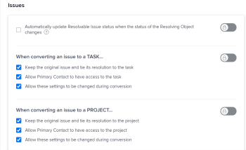

# Información general sobre la resolución y resolución de objetos

Un objeto resuelto es un problema cuya resolución está vinculada a un objeto resuelto. Un objeto resuelto es un proyecto, una tarea u otro problema.

Cuando se convierte un problema en una tarea o un proyecto, el problema se convierte en el objeto resuelto de la tarea o del proyecto.

También puede vincular manualmente un problema a un objeto resuelto, que puede ser una tarea, un proyecto o un problema. Para obtener más información, consulte [Vincular manualmente la resolución de un problema con otros problemas, tareas o proyectos](../../../manage-work/issues/convert-issues/manually-tie-resolution-of-issue-to-ptis.md).

El problema original se convierte en el objeto resuelto de la tarea, proyecto o problema, en este escenario.

## Configuración de Adobe Workfront para gestionar objetos resueltos {#set-up-adobe-workfront-to-handle-resolvable-objects}

Como administrador de Workfront o de grupo, puede decidir cómo desea gestionar los objetos resueltos en su sistema o para su grupo.

Puede seleccionar mantener el objeto resuelto tal como lo está convirtiendo en una tarea o proyecto, o eliminarlo una vez que se haya creado la tarea o el proyecto. Puede seleccionar esta opción para permitir que estos ajustes se modifiquen en el proceso de conversión de problemas, lo que permitirá al usuario convertir los problemas para seleccionar si desea mantener o eliminar el problema mientras lo convierte.

>[!NOTE]
>
>Los objetos resueltos siempre son problemas cuya resolución y estado pueden depender de la resolución y el estado del objeto resuelto al que están asociados. Resolver objetos puede ser problemas, tareas o proyectos.

Para obtener información sobre la configuración de preferencias para la gestión de objetos resueltos, consulte [Configurar las preferencias de problemas y tareas de todo el sistema](../../../administration-and-setup/set-up-workfront/configure-system-defaults/set-task-issue-preferences.md).

<!--WRITER

(Note: drafted and just pointed the user to the article linked above)&nbsp;

To establish the system default for what happens to the issue as it is being converted to a task or a project:

<ol>
<li value="1">Log in to Workfront as a Workfront administrator or group administrator.</li>
<li value="2"> 
  From the main menu, click <strong>Setup</strong>. 
 
  
 </li>
<li value="3">Expand <strong>Project Preferences</strong>.</li>
<li value="4">Click <strong>Tasks & Issues</strong>.</li>
<li value="5">Go to the <strong>Issues</strong> area of the setup.  Consider editing any of the following settings:
<ul>
<li>
<strong>Automatically update Resolvable Issue status when the status of the Resolving Object changes:</strong> Select this option to tie the resolution of the original issue to the resolution of its Resolving Object. In order for this setting to have any effect, the options to <strong>Keep the original issue and tie its resolution to the task</strong> or<strong>project</strong> must be selected.

<ul>
<li>When this setting is enabled, you can create custom statuses with the same key for both issues and projects or tasks. When the project or task (as a resolvable object) turns into the custom status, the change also reflects on the status of the issue. The status key must be the same for the issue and project or task statuses.</li>
<li>
When this setting is disabled, resolving object statuses are automatically set to the default status, instead of the custom ones. For more information about the default statuses, see <a href="#synchronize-the-status-of-the-resolvable-object-with-that-of-the-resolving-object" class="MCXref xref">Synchronize the Status of the Resolvable Object with that of the Resolving Object</a>.
<note type="note">
The default status of the issue is controlled by the status of the project or task, regardless of whether this option is selected or not.
</note></li>
</ul></li>
<li><strong>When converting an issue to a TASK...:</strong> The settings in this section determine what happens during the conversion process from issue to task:
<ul>
<li><strong>Keep the original issue and tie its resolution to the task:</strong> When converting the issue, it remains visible as an issue until the task is complete. The status of the issue automatically changes to Closed when the task completes.</li>
<li><strong>Allow Primary Contact to have access to the task:</strong> Gives the primary contact (issue creator) access to the task to review the task, make updates, and stay informed of its progress.</li>
<li><strong>Allow these settings to be changed during conversion:</strong> Allows the user who is converting the issue to change these options during the conversion of an issue to a task. </li>
</ul></li>
<li><strong>When converting an issue to a PROJECT...:</strong> The settings in this section determine what happens during the conversion process from issue to project:
<ul>
<li><strong>Keep the original issue and tie its resolution to the project:</strong> When converting the issue, it remains visible as an issue until the project is complete. The status of the issue automatically changes to Closed when the project completes.</li>
<li><strong>Allow Primary Contact to have access to the project:</strong> Gives the primary contact (issue creator) access to the project to review the project, make updates, and stay informed of its progress.</li>
<li><strong>Allow these settings to be changed during conversion:</strong> Allows the user who is converting the issue to change these options during the conversion of an issue to a project. </li>
</ul></li>
</ul></li>
<li value="6">Click <strong>Save</strong>.</li>
</ol>

-->

## Gestión del objeto resuelto durante la conversión a un proyecto o una tarea

Dependiendo de la forma en que el administrador de Workfront o del grupo configuró las preferencias de problemas a nivel de sistema o grupo, es posible que pueda gestionar el objeto resoluble durante la conversión de un problema en un proyecto o una tarea.

Existen los siguientes escenarios:

* Si el administrador de Workfront o de grupo tiene la variable **Mantenga el problema original y vincule su resolución a la tarea** y **Mantener el problema original y enlazar su resolución con el proyecto** seleccionados y **Permitir que esta configuración cambie durante la conversión** sin seleccionar, no podrá cambiar esta configuración ya que está convirtiendo problemas en tareas o proyectos.\
   

* Si el administrador de Workfront o de grupo tiene la variable **Mantenga el problema original y vincule su resolución a la tarea** y **Mantener el problema original y enlazar su resolución con el proyecto** seleccionados o no seleccionados y la variable **Permitir que esta configuración cambie durante la conversión** seleccionados, podrá cambiar esta configuración a medida que convierta problemas en tareas o proyectos.\
   

Para obtener más información sobre la conversión de problemas en tareas y proyectos, consulte [Información general sobre la conversión de problemas en Adobe Workfront](../../../manage-work/issues/convert-issues/convert-issues.md).

<!--WRITER

<h2>Tie the resolution of an issue to a project, task or </h2> 

(NOTE: created new article for this section; draft when the article is live and see if you need to make a link from this one to the new article) 

You can manually tie the resolution of an issue to the resolution of a project, task, or issue without converting the issue. The issue becomes one of the Resolvable Objects of the project, task, or issue you select. When you do this, a change in the status of the project, task, or issue triggers a change in the status of the original issue, so you cannot manually edit the status of the original issue.  For more information about how the status of the Resolving Object affects the Resolvable Object, see <a href="#synchronize-the-status-of-the-resolvable-object-with-that-of-the-resolving-object" class="MCXref xref">Synchronize the Status of the Resolvable Object with that of the Resolving Object</a>.

You must have Manage permissions on the original issue and View permissions on the project, task, or issue to do this. 

To tie the resolution of an issue to the resolution of a project, task, or issue:

<ol>
<li value="1">Navigate to an issue whose resolution you want to tie to a task or a project.</li>
<li value="2"> 
  Click the <strong>Issue Details</strong> > <strong>Overview</strong> area. 
 
  
 </li>
<li value="3"> 
Click the <strong>Edit</strong> icon  in the upper-right corner of the Issue Details section. 
 </li>
<li value="4">At the bottom of the form,  click in the <strong>Resolved By</strong> field,  and select from the following types of resolving objects:
<ul>
<li><strong>Project</strong></li>
<li><strong>Task</strong></li>
<li>
<strong>Issue</strong>
</li>
</ul>
The field for the resolving object displays. 
</li>
<li value="5">After selecting the object, start typing the name of a specific project, task, or issue in the available field and select it when it appears in the drop-down list. </li>
<li value="6">Click <strong>Save</strong>&nbsp;<strong>Changes</strong>. The original issue becomes the Resolvable Object for the project, task, or issue you selected in step 4 and 5. <note type="note">
One project, task, or issue may have multiple issues as Resolvable Objects.
</note></li>
</ol>

-->

## Sincronizar el estado del objeto resuelto con el del objeto resuelto {#synchronize-the-status-of-the-resolvable-object-with-that-of-the-resolving-object}

* [Sincronizar estados cuando el objeto resuelto es un problema](#synchronize-statuses-when-the-resolving-object-is-an-issue)
* [Sincronizar estados cuando el objeto resuelto es una tarea o un proyecto](#synchronize-statuses-when-the-resolving-object-is-a-task-or-a-project)

### Sincronizar estados cuando el objeto resuelto es un problema {#synchronize-statuses-when-the-resolving-object-is-an-issue}

Si un problema se relaciona manualmente con otro problema, el estado del segundo problema (objeto resuelto) déclencheur un cambio en el estado del primer problema (objeto resuelto). El estado del primer problema coincide con el estado en el que se cambia el segundo problema. Esto se aplica tanto a los estados de problemas predeterminados como personalizados.

### Sincronizar estados cuando el objeto resuelto es una tarea o un proyecto {#synchronize-statuses-when-the-resolving-object-is-a-task-or-a-project}

Cuando un problema es el objeto resuelto de una tarea o un proyecto, los cambios en el estado de las tareas y el déclencheur de proyectos cambian en el estado del problema. Los estados predeterminados se activan de forma diferente a los estados personalizados, en este caso.

* [Sincronizar el estado predeterminado del objeto resuelto con el estado predeterminado del objeto resuelto](#synchronize-the-default-status-of-the-resolving-object-with-the-default-status-of-the-resolvable-object)
* [Sincronizar el estado personalizado del objeto resuelto con el estado personalizado del objeto resuelto](#synchronize-the-custom-status-of-the-resolving-object-with-the-custom-status-of-the-resolvable-object)

#### Sincronizar el estado predeterminado del objeto resuelto con el estado predeterminado del objeto resuelto {#synchronize-the-default-status-of-the-resolving-object-with-the-default-status-of-the-resolvable-object}

Independientemente de si la opción &quot;Actualizar automáticamente el estado del problema resuelto cuando cambia el estado del objeto resuelto&quot; está seleccionada, cada vez que el estado predeterminado cambia en los objetos resueltos (proyectos o tareas), el estado del objeto resuelto (problemas) cambia según corresponda. Solo los estados predeterminados ya están asignados al déclencheur de un cambio de este tipo.

Los siguientes estados predeterminados para las tareas déclencheur los siguientes cambios en los estados predeterminados para los problemas, cuando el problema se establece como el objeto de resolución de una tarea:

| **ESTADO DE TAREA** | **ESTADO DEL PROBLEMA** |
|---|---|
| Nuevo | Nuevo |
| En curso | En curso |
| Completar | Cerrado |

Los siguientes estados predeterminados para proyectos déclencheur los siguientes cambios en los estados predeterminados para los problemas, cuando el problema se establece como un objeto resuelto de un proyecto. Algunos estados de proyecto no déclencheur los cambios en el estado de los problemas. Los problemas permanecen en el estado en el que estaban antes de que el proyecto se convirtiera en uno de estos estados:

| **ESTADO DEL PROYECTO** | **ESTADO DEL PROBLEMA** |
|---|---|
| Planificación | Nuevo |
| Al día | En curso |
| En espera | En espera |
| Solicitado | No déclencheur un cambio en el estado del problema |
| Aprobado | No déclencheur un cambio en el estado del problema |
| Rechazado | No déclencheur un cambio en el estado del problema |
| Idea | No déclencheur un cambio en el estado del problema |
| Inactivo | Cerrado |
| Finalizado | Cerrado |

>[!NOTE]
>
>Una vez que el estado del problema se ha cerrado (como resultado del cierre de la tarea o del proyecto), independientemente del estado al que cambie la tarea o el proyecto después de cerrarlos, el problema permanece cerrado.

#### Sincronizar el estado personalizado del objeto resuelto con el estado personalizado del objeto resuelto {#synchronize-the-custom-status-of-the-resolving-object-with-the-custom-status-of-the-resolvable-object}

Cuando cambia el estado de la tarea o del proyecto a un estado personalizado, el estado del problema cambia a un estado de problema personalizado solo si se cumplen las dos condiciones siguientes:

* Se selecciona la opción &quot;Actualizar automáticamente el estado del problema resuelto cuando cambia el estado del objeto resuelto&quot;. Para obtener más información sobre cómo habilitar esta configuración, consulte [Configuración de Adobe Workfront para gestionar objetos resueltos](#set-up-adobe-workfront-to-handle-resolvable-objects).

* El estado personalizado del proyecto o la tarea tiene el mismo código de tres letras que el estado personalizado del problema.

Puede crear estados personalizados con la misma clave para problemas y proyectos o tareas. Cuando el proyecto o la tarea (como objeto resuelto) se cambian al estado personalizado, el cambio también se refleja en el estado del problema. La clave de estado debe ser la misma para el problema y los estados de proyecto o tarea.

Por ejemplo, cree un estado personalizado de proyecto denominado &quot;Iniciado&quot; con el código de tres letras &quot;LCD&quot;, que equivale a &quot;Actual&quot;. Además, cree un problema con el estado personalizado llamado &quot;Lanzamiento del proyecto&quot;, también con el código de letra &quot;LCD&quot; que equivale a &quot;En curso&quot;. Cuando marque el proyecto como &quot;Iniciado&quot;, el problema cambiará automáticamente el estado a &quot;Lanzado del proyecto&quot;. Si el estado &quot;Actualizar automáticamente el estado del problema resuelto cuando el estado del objeto resuelto cambia&quot; no estuviera habilitado, el estado del problema cambiaría a &quot;En curso&quot; en su lugar (el estado predeterminado).

Para obtener más información sobre la creación de un estado personalizado, consulte [Crear o editar un estado](../../../administration-and-setup/customize-workfront/creating-custom-status-and-priority-labels/create-or-edit-a-status.md).

## Sincronizar el porcentaje completado de un objeto resuelto con el del objeto resuelto

Si una tarea o un proyecto resuelve un problema, el porcentaje completado del problema se actualiza en el problema resuelto cuando se produce cualquiera de las siguientes cosas: 

* Cuando alguien guarda un cambio en la tarea o proyecto.
* Se vuelve a calcular la cronología del proyecto.

Si el problema y se resuelve por otro problema, el porcentaje completado se actualiza cuando se actualiza cualquiera de los problemas.

## Localización del objeto resuelto en una tarea o proyecto

La ubicación del objeto de resolución es idéntica para las tareas y los proyectos.

1. Vaya a un proyecto o a una tarea que haya creado convirtiendo un problema en el proyecto o la tarea.
1. Haga clic en el **Detalles del proyecto** o **Detalles de la tarea** y haga clic en para expandirla.
1. Haga clic en **Información general**.
1. En la parte inferior de la pestaña , busque **Esto resuelve** campo: el problema que es el objeto resuelto del proyecto o la tarea se muestra en este campo.

   >[!NOTE]
   >
   >Los problemas no se pueden convertir en otros problemas, pero se pueden asociar manualmente con un problema de resolución. Un proyecto, tarea o problema puede tener varios problemas como Objetos resueltos. Cuando el proyecto, la tarea o el problema se resuelven, el objeto resuelto (problema) también se resuelve. El problema resuelto permanece cerrado aunque se vuelva a abrir el proyecto, la tarea o el problema que lo resolvió.

## Identificar un problema con un objeto resuelto en una lista

En una lista de problemas, puede identificar los problemas etiquetados como resolver objetos mediante iconos de estado. Para ello, busque este icono en la **Iconos de estado** o **Indicadores** columnas:

## Ver información sobre objetos resueltos y resueltos en un informe

Puede mostrar información sobre los objetos resueltos o resueltos en la vista o en el informe de proyectos, tareas o problemas.\
La tabla siguiente muestra los campos que puede mostrar y en qué vistas puede mostrarlos:

<table style="table-layout:auto"> 
 <col> 
 <col> 
 <col> 
 <col> 
 <thead> 
  <tr> 
   <th><strong>Campo en vista</strong> </th> 
   <th><strong>Vista de problemas</strong> </th> 
   <th><strong>Vista de tareas</strong> </th> 
   <th><strong>Vista de proyectos</strong> </th> 
  </tr> 
 </thead> 
 <tbody> 
  <tr> 
   <td><strong>Tiene resoluciones</strong>: Muestra un <strong>True</strong> si el proyecto o la tarea tienen problemas resueltos asociados a ellos, y <strong>False</strong> si no lo hacen.</td> 
   <td>✓</td> 
   <td>✓</td> 
   <td>✓</td> 
  </tr> 
  <tr> 
   <td><strong>Nombre del Problema Original, Fecha de Entrada del Problema Original, Nombre del Creador</strong>: Muestra el nombre y la fecha de entrada del problema original, así como el nombre del usuario que creó el problema en una vista personalizada en modo de texto. Para obtener más información sobre la creación de una vista personalizada de modo de texto para un proyecto, un informe de tareas o una lista para mostrar información sobre el problema original, consulte <a href="../../../reports-and-dashboards/reports/custom-view-filter-grouping-samples/view-display-original-issue-info-task-project-list.md" class="MCXref xref">Ver: mostrar la información del problema original en las listas de tareas y proyectos</a>. </td> 
   <td> </td> 
   <td> ✓</td> 
   <td> ✓</td> 
  </tr> 
  <tr> 
   <td> 
<strong>Resoluciones:</strong> Muestra una lista de todos los objetos resueltos en una vista personalizada de modo de texto para un informe o lista de proyectos o tareas.
 
Para obtener más información sobre la creación de esta vista, consulte <a href="../../../reports-and-dashboards/reports/custom-view-filter-grouping-samples/view-resolvable-objects-task-project-report.md" class="MCXref xref">Ver: Objetos resueltos en un informe de tarea o proyecto</a>
 </td> 
   <td> </td> 
   <td>✓</td> 
   <td> ✓</td> 
  </tr> 
  <tr> 
   <td><strong>Creador de problemas convertidos</strong>: Muestra información sobre el usuario que registró originalmente el problema que más tarde se convirtió en la tarea. </td> 
   <td> </td> 
   <td>✓</td> 
   <td> </td> 
  </tr> 
  <tr> 
   <td><strong>Resolver proyecto</strong>: Muestra información sobre el proyecto de resolución que se ha convertido desde el problema original o se ha designado manualmente como el objeto de resolución de un problema.</td> 
   <td>✓</td> 
   <td> </td> 
   <td> </td> 
  </tr> 
  <tr> 
   <td><strong>Resolver tarea</strong>: Muestra información sobre la tarea resuelta que se convirtió del problema original o que se designó manualmente como el objeto resuelto de un problema.</td> 
   <td>✓ </td> 
   <td> </td> 
   <td> </td> 
  </tr> 
  <tr> 
   <td><strong>Resolver problema</strong>: Muestra información sobre el problema de resolución, que se designó manualmente como el objeto de resolución de un problema.</td> 
   <td> ✓</td> 
   <td> </td> 
   <td> </td> 
  </tr> 
 </tbody> 
</table>
