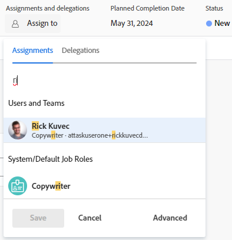
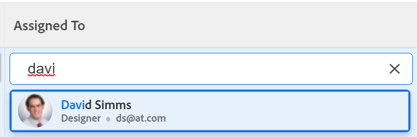

# Asignar problemas

{{highlighted-preview}}

Puede asignar problemas a usuarios, funciones y equipos para indicar quién es el responsable de completar los problemas. Para obtener información general sobre la asignación de problemas, consulte [Información general sobre la modificación de asignaciones de problemas](../../../manage-work/issues/manage-issues/modify-issue-assignments-overview.md).

>[!TIP]
>
>Puede asignar varios usuarios, roles o equipos. Solo puede asignar usuarios activos, roles y equipos.
>
>Si un usuario, un rol o un equipo se han asignado antes de que se desactiven, permanecerán asignados al elemento de trabajo. En este caso, se recomienda lo siguiente:
>
>* Reasignar el elemento de trabajo a los recursos activos.
>* Asocie los usuarios de un equipo desactivado a un equipo activo y reasigne el elemento de trabajo al equipo activo.

Además de este artículo, le recomendamos que lea los siguientes artículos para obtener más información sobre la asignación de problemas:

* [Información general sobre la modificación de asignaciones de problemas](../../../manage-work/issues/manage-issues/modify-issue-assignments-overview.md)
* [Editar problemas](../../../manage-work/issues/manage-issues/edit-issues.md)
* [Modificar asignaciones de usuarios para varios problemas de una lista](../../../manage-work/issues/manage-issues/edit-assignments-for-multiple-issues.md)
* [Crear asignaciones avanzadas](../../../manage-work/tasks/assign-tasks/create-advanced-assignments.md)
* [Realización de asignaciones inteligentes](../../../manage-work/tasks/assign-tasks/make-smart-assignments.md)
* [Información general sobre asignaciones inteligentes](../../../manage-work/tasks/assign-tasks/smart-assignments.md)
* [Información general sobre la asignación de trabajo en el Distribuidor de cargas de trabajo](../../../resource-mgmt/workload-balancer/assign-work-in-workload-balancer.md)

Puede asignar un problema a uno o varios recursos en el nivel de problema individual, o puede asignar varios recursos a varios problemas a la vez.

La asignación de problemas y tareas es similar en Adobe Workfront. Para obtener información general sobre la asignación de tareas, consulte [Información general sobre la modificación de asignaciones de tareas](../../../manage-work/tasks/assign-tasks/modify-task-assignments-overview.md).

## Requisitos de acceso

Debe tener el siguiente acceso para realizar los pasos de este artículo:

<table style="table-layout:auto"> 
 <col> 
 </col> 
 <col> 
 </col> 
 <tbody> 
  <tr> 
   <td role="rowheader">plan Adobe Workfront*</td> 
   <td> 
Cualquiera 
 </td> 
  </tr> 
  <tr> 
   <td role="rowheader">Licencia de Adobe Workfront*</td> 
   <td> 
Revisar o superior
 </td> 
  </tr> 
  <tr> 
   <td role="rowheader">Nivel de acceso*</td> 
   <td> 
Editar acceso a Problemas
 
Acceso de visualización o superior a Proyectos y tareas
 
Si sigue sin tener acceso, pregunte al administrador de Workfront si ha establecido restricciones adicionales en su nivel de acceso. Para obtener información sobre el acceso a los problemas del nivel de acceso, consulte <a href="../../../administration-and-setup/add-users/configure-and-grant-access/grant-access-issues.md" class="MCXref xref">Conceder acceso a los problemas</a>. Para obtener información sobre cómo un administrador de Workfront puede cambiar su nivel de acceso, consulte <a href="../../../administration-and-setup/add-users/configure-and-grant-access/create-modify-access-levels.md" class="MCXref xref">Crear o modificar niveles de acceso personalizados</a>. 
 </td> 
  </tr> 
  <tr> 
   <td role="rowheader">Permisos de objeto</td> 
   <td> 
Administrar permisos para el problema
 
Permisos de contribución para el elemento en el que está copiando el problema con la capacidad de agregar problemas.
 
 Para obtener información sobre la concesión de permisos a los problemas, consulte <a href="../../../workfront-basics/grant-and-request-access-to-objects/share-an-issue.md" class="MCXref xref">Compartir un problema </a>
 
Para obtener información sobre cómo solicitar permisos adicionales, consulte <a href="../../../administration-and-setup/add-users/configure-and-grant-access/grant-access-other-users.md">Concesión de acceso a los usuarios</a>.
 </td> 
  </tr> 
 </tbody> 
</table>

*Para saber qué plan, tipo de licencia o acceso tiene, póngase en contacto con su administrador de Workfront.

## Consideraciones para varias asignaciones a roles de trabajo, equipos y usuarios

Tenga en cuenta lo siguiente al asignar varios recursos a un elemento de trabajo:

* Los usuarios pueden tener más de una función de trabajo asociada a su perfil. Para obtener información sobre la asociación de usuarios con funciones del puesto, consulte [Edición del perfil de un usuario](../../../administration-and-setup/add-users/create-and-manage-users/edit-a-users-profile.md).

* Las tareas o los problemas suelen asignarse primero a uno o varios roles o equipos de trabajo. Cuando los proyectos están listos para iniciarse, es posible que también deban asignarse a usuarios.

  Si se asigna una tarea o un problema a una o varias funciones y, a continuación, también se asigna un usuario, Adobe Workfront decide qué función de trabajo se asocia al usuario adicional (si corresponde) según las siguientes reglas:

   * Si solo hay una función de trabajo asignada y coincide con la función principal del usuario, la tarea o el problema se asignan únicamente al usuario que cumple su función principal.
   * Si hay varias funciones asignadas y al menos una de las funciones coincide con las funciones secundarias del usuario, la tarea o el problema se asigna al usuario que cumple una de sus otras funciones (que Workfront selecciona aleatoriamente si hay varias coincidencias), así como cualquier función adicional asignada.
   * Si hay uno o más roles asignados y no hay coincidencias con los roles del usuario, la tarea o el problema se asignan tanto al rol o los roles como al usuario.

* Si se asigna una tarea o un problema a un equipo y también se asigna un usuario, la tarea o el problema permanecen asignados tanto al equipo como al usuario.

<!--

<h2> </h2>
<h2>Considerations about removing assignments from issues</h2> 

(NOTE: drafted and moved to Modify issue assignments overview article)

You can remove assignments from one issue at a time, or you can remove assignments from multiple issues in bulk.

For more information about removing assignments from issues in bulk, see <a href="../../../manage-work/issues/manage-issues/edit-assignments-for-multiple-issues.md" class="MCXref xref">Modify user assignments for multiple issues in a list</a>. 

Consider the following when removing assignments from issues: 

<ul>
<li>When you unassign a user from an issue, the issue remains assigned to the job role that the user fulfilled on the issue.</li>
<li>When you unassign a job role or a team from an issue, the issue remains unassigned if it is not assigned to any other resources. </li>
</ul>

-->

## Asignar un solo problema

1. Vaya al problema que desee asignar.
1. Clic **Asignar a** en la esquina superior derecha del encabezado del problema, en la pestaña **Asignaciones** área

   O

   Haga clic en el nombre de las asignaciones actuales, si el problema ya está asignado.

   

1. Realice una de las siguientes acciones:

   * Comience a escribir el nombre del usuario, rol o equipo que desea asignar y, a continuación, haga clic en él cuando aparezca en la lista.

     Imagen de muestra en el entorno de producción:
     

     Imagen de muestra en el entorno de vista previa:
     

   * (Condicional) Haga clic en uno de los nombres de la **Asignaciones sugeridas** lista
   * Clic **Asignármelo a mí** para asignársela a usted mismo
   * Clic **Avanzadas**.

     Crear asignaciones avanzadas es similar para tareas y problemas. Para obtener información sobre cómo realizar asignaciones avanzadas, consulte [Crear asignaciones avanzadas](../../../manage-work/tasks/assign-tasks/create-advanced-assignments.md).

     >[!TIP]
     >
     >Al agregar una asignación de usuario, observe el avatar, la función principal del usuario o su dirección de correo electrónico para distinguir entre usuarios con nombres idénticos.
     >
     >Los usuarios deben estar asociados con al menos un rol para verlo a medida que los agregue.
     >
     >Debe tener activada la configuración Ver información de contacto en su nivel de acceso para que los usuarios vean los correos electrónicos de los usuarios. Para obtener más información, consulte [Concesión de acceso a los usuarios](../../../administration-and-setup/add-users/configure-and-grant-access/grant-access-other-users.md)

1. Clic **Guardar** para completar la asignación del problema.
1. (Opcional) Haga clic en **Icono X** situado junto al nombre de las asignaciones en el área Asignaciones del encabezado del problema para eliminar una asignación.

## Asignar un problema en una lista

Puede asignar problemas en una lista o un informe cuando cualquiera de los campos de asignaciones esté visible en la vista de la lista. Esta es una forma más rápida de asignar problemas.

Según el campo visible en la vista, puede asignar las siguientes entidades al problema:

| Opción | Entidades asignadas |
|---|---|
| **Asignar a** | Asignar un usuario |
| **Asignado** | Asignar un usuario |
| **Asignaciones** | Asigne usuarios, funciones o equipos. |

Para asignar problemas en una lista:

1. Vaya a una lista de problemas que tenga los campos Asignado a, Asignado o Asignaciones en la vista.
1. Para asignar problemas, realice una de las siguientes acciones:

   * Haga clic dentro de **Asignado a** o **Asignado** y empiece a escribir el nombre de un usuario activo que desee asignar al problema y, a continuación, haga clic en él cuando se muestre en la lista.

     

   * Haga clic dentro de **Asignaciones** y empiece a escribir el nombre de un usuario, rol o equipo activo que desee asignar al problema y, a continuación, haga clic en él cuando se muestre en la lista.

     Imagen de muestra en el entorno de producción:
     

     Imagen de muestra en el entorno de vista previa:
     

   >[!TIP]
   >
   >Al agregar una asignación de usuario, observe el avatar, la función principal del usuario o su dirección de correo electrónico para distinguir entre usuarios con nombres idénticos.
   >
   >Los usuarios deben estar asociados con al menos un rol para verlo a medida que los agregue.
   >
   >Debe tener activada la configuración Ver información de contacto en su nivel de acceso para que los usuarios vean los correos electrónicos de los usuarios. Para obtener más información, consulte [Concesión de acceso a los usuarios](../../../administration-and-setup/add-users/configure-and-grant-access/grant-access-other-users.md).

1. (Condicional) Cuando esté visible en el campo Asignaciones, haga clic en **Icono Personas**  en la esquina superior derecha del cuadro asignaciones para abrir el cuadro Asignaciones avanzadas y crear asignaciones avanzadas. Para obtener más información, consulte [Crear asignaciones avanzadas](../../../manage-work/tasks/assign-tasks/create-advanced-assignments.md).

   >[!TIP]
   >
   >No puede realizar asignaciones avanzadas desde los campos Asignado a o Asignado.

1. Después de agregar los usuarios asignados al problema, presione Intro o haga clic en cualquier lugar de la página para guardar los cambios.

## Asignar problemas de forma masiva

1. Vaya a una lista de problemas que desee asignar de forma masiva.
1. Seleccione varios problemas en la lista.
1. Haga clic en **Icono Editar** .

   El **Editar problemas** se abre el cuadro de diálogo.

1. En el **Asignaciones** , seleccione la **Asignado** y, a continuación, empiece a escribir el nombre de un usuario, rol o equipo que desee asignar a todos los problemas.

   >[!IMPORTANT]
   >
   >Si alguno de los problemas ya está asignado, los recursos que indique aquí se agregan a los problemas en lugar de reemplazar los recursos existentes en los problemas.

1. (Opcional) Seleccione el botón de opción en la **Propietario de problema** para indicar qué recurso es el principal asignado o el propietario del problema, cuando asigna más de un recurso al problema. Esto no está disponible para equipos.
1. (Opcional) Seleccione una función que el usuario debe cumplir en el problema desde el **Elegir un rol** menú desplegable en el **Rol de asignado** cuando asigna usuarios a problemas. Si no selecciona ninguna función, Workfront selecciona automáticamente la función principal del usuario.

1. (Opcional) Si desea quitar los usuarios asignados existentes de todos los problemas, realice una de las siguientes acciones:

   1. Empiece a escribir el nombre del usuario, la función o el equipo que desea quitar del problema y, a continuación, selecciónelo cuando aparezca en la lista y haga clic en **Quitar persona asignada** para agregar usuarios asignados adicionales que eliminar.
   1. Clic **Quitar todas las personas asignadas actualmente** para quitar todas las personas asignadas de todos los problemas seleccionados.

1. Clic **Guardar cambios**.
1. (Opcional y condicional) Cuando los campos Asignado a o Asignaciones se muestren en su lista de problemas, haga clic dentro de una de estas columnas para un problema y luego haga clic en **Icono X** junto al nombre de un usuario asignado para eliminarlo del problema.
