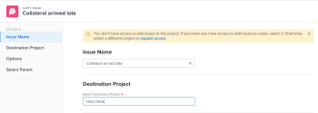

# Copiar problemas

<!--Audited: 08/2025-->

Puede copiar un problema o una solicitud y guardarlo en el mismo o en otro proyecto. También puede copiar un problema de una tarea a otro proyecto.

Puede copiar problemas de los siguientes objetos:

* De un proyecto al mismo proyecto (duplicarlo en el mismo proyecto)
* De una tarea a la misma tarea (duplicarla si se encuentra en la misma tarea)
* De un proyecto a otro
* De una tarea a un proyecto

>[!TIP]
>
>&quot;Problemas&quot; y &quot;solicitudes&quot; se usan indistintamente en Workfront. Puede registrar los problemas tanto de los proyectos como de las tareas para indicar el trabajo imprevisto que debe resolverse. También puede enviar solicitudes que se registren como problemas en un proyecto designado como una cola de solicitudes.

## Requisitos de acceso

+++ Expanda para ver los requisitos de acceso para la funcionalidad en este artículo.

<table style="table-layout:auto"> 
 <col> 
 <col> 
 <tbody> 
  <tr> 
   <td role="rowheader">paquete de Adobe Workfront</td> 
   <td> 
Cualquiera
 </td> 
  </tr> 
  <tr> 
   <td role="rowheader">Licencia de Adobe Workfront</td> 
   <td> 
   <ul><li>
Colaborador o superior
 </li>
   <li>
Licencia básica o superior para copiar un problema en la sección Problemas de un proyecto
</li></ul>
   O
   <ul><li>
Solicitante o superior
 </li>
   <li>
Licencia del revisor o superior para copiar un problema en la sección Problemas de un proyecto
</li></ul> </td> 
  </tr> 
  <tr> 
   <td role="rowheader">Configuración de nivel de acceso</td> 
   <td> 
Editar acceso a Problemas
 
Acceso de visualización o superior a proyectos y tareas
 </td> 
  </tr> 
  <tr> 
   <td role="rowheader">Permisos de objeto</td> 
   <td> 
Permisos de administración para el problema
 
Permisos de aportación para el elemento en el que está copiando el problema con la posibilidad de Añadir problemas.
</td> 
  </tr> 
 </tbody> 
</table>

Para obtener más información sobre el contenido de esta tabla, consulte [Requisitos de acceso en la documentación de Workfront](/help/quicksilver/administration-and-setup/add-users/access-levels-and-object-permissions/access-level-requirements-in-documentation.md).

+++

<!--Old:

<table style="table-layout:auto"> 
 <col> 
 <col> 
 <tbody> 
  <tr> 
   <td role="rowheader">Adobe Workfront plan*</td> 
   <td> 
Any
 </td> 
  </tr> 
  <tr> 
   <td role="rowheader">Adobe Workfront license*</td> 
   <td> 
Request or higher
 
Review or higher license to copy an issue in the Issues section of a project.
 </td> 
  </tr> 
  <tr> 
   <td role="rowheader">Access level*</td> 
   <td> 
Edit access to Issues
 
View or higher access to Projects and Tasks
 
Note: If you still don't have access, ask your Workfront administrator if they set additional restrictions in your access level. For information about access to issues in your Access Level, see <a href="../../../administration-and-setup/add-users/configure-and-grant-access/grant-access-issues.md" class="MCXref xref">Grant access to issues</a>. For information on how a Workfront administrator can change your access level, see <a href="../../../administration-and-setup/add-users/configure-and-grant-access/create-modify-access-levels.md" class="MCXref xref">Create or modify custom access levels</a>. 
 </td> 
  </tr> 
  <tr> 
   <td role="rowheader">Object permissions</td> 
   <td> 
Manage permissions to the issue
 
Contribute permissions to the item where you are copying the issue to with the ability to Add Issues.
 
 For information about granting permissions to issues, see <a href="../../../workfront-basics/grant-and-request-access-to-objects/share-an-issue.md" class="MCXref xref">Share an issue </a>
 
For information on requesting additional permissions, see <a href="../../../workfront-basics/grant-and-request-access-to-objects/request-access.md" class="MCXref xref">Request access to objects </a>.
 </td> 
  </tr> 
 </tbody> 
</table>-->

## Consideraciones al copiar problemas

### Consideraciones generales al copiar problemas

Tiene la oportunidad de seleccionar si desea copiar algunos elementos asociados al problema en el problema copiado durante el proceso de copia. Sin embargo, algunos elementos se transfieren al nuevo problema de forma predeterminada, mientras que otros no, según la descripción de las listas siguientes.

Los siguientes elementos se copian en el nuevo problema de forma predeterminada:

* Contacto primario
* Formularios personalizados. La información de los campos personalizados se copia en el nuevo problema solo cuando se selecciona Datos personalizados en el proceso de copia.
* Rutas de aprobación
* Fechas de inicio planificado y finalización planificada

Los objetos siguientes no se copian en el nuevo problema de forma predeterminada:

* Horas registradas

### Consideraciones sobre problemas asociados a documentos o colas de solicitudes

Tenga en cuenta lo siguiente al copiar problemas que contienen documentos o están asociados a una cola de solicitudes:

* **Cuando un problema está asociado a una cola de solicitudes:** cuando se copia un problema en otro objeto y el problema está asociado a una cola de solicitudes, el problema copiado ya no se asocia a la cola original desde la que se originó el primer problema.
* **Cuando se adjunta un documento al problema:** cuando se copia un problema en otro objeto y el problema tiene un documento adjunto, el documento y sus versiones también se transfieren al nuevo problema. Las pruebas o aprobaciones asociadas al documento no se transfieren.
* **Cuando un problema está vinculado a un documento o a una carpeta:** al copiar un problema que tiene documentos o carpetas vinculados a un servicio de terceros como Google Drive, los vínculos a los documentos se transfieren al problema copiado.

## Copiar problemas en una lista

Puede copiar uno o varios problemas desde una lista de problemas o desde un informe de problemas.

1. Vaya al proyecto que contiene el problema que desea copiar.

   O

   Vaya a un informe de problema.

1. Si seleccionó ir a un proyecto, haga clic en **Problemas** en el panel izquierdo.
1. Seleccione el problema o problemas que desee copiar, haga clic en el **menú Más** en la parte superior de la lista de problemas y, a continuación, haga clic en **Copiar en**.

   

1. Continúe copiando el problema, tal como se describe en la sección [Copiar un solo problema](#copy-a-single-issue) a partir del paso 2.

   <!--
   <MadCap:conditionalText data-mc-conditions="QuicksilverOrClassic.Draft mode">
   (NOTE: ensure step number stays accurate)
   </MadCap:conditionalText>
   -->

## Copiar un solo problema {#copy-a-single-issue}

Puede copiar un problema al verlo.

1. Vaya a un problema que desee copiar y, a continuación, haga clic en el menú **Más**  que se encuentra a la derecha del nombre del problema. Después, **Copiar en**.

   

   Se muestra el cuadro **Copiar problema**.

   

1. En la sección **Seleccionar proyecto de destino**, especifique el nombre del proyecto donde desea copiar los problemas. El nombre del proyecto actual se muestra de forma predeterminada.

   >[!TIP]
   >
   >En la lista solo se muestran 100 proyectos.

1. (Condicional) Haga clic en **solicitar acceso** si no tiene acceso para copiar problemas en el proyecto.
1. (Condicional) Continúe copiando el problema en el proyecto de destino seleccionado sin solicitar acceso si tiene acceso para añadir problemas a una de las tareas del proyecto de destino.

   

   >[!TIP]
   >
   >Se muestran mensajes similares si el proyecto seleccionado está pendiente de aprobación, completado o inactivo, cuando el administrador de Workfront impide añadir problemas a estos proyectos. Para obtener más información, consulte [Configurar las preferencias de proyecto de todo el sistema](../../../administration-and-setup/set-up-workfront/configure-system-defaults/set-project-preferences.md).

1. (Opcional) En la sección **Opciones**, anule la selección de cualquiera de los elementos enumerados en la tabla siguiente para eliminarlos del nuevo problema. Todas las opciones están seleccionadas de forma predeterminada.

   >[!NOTE]
   >
   >Esto solo afecta a los problemas copiados, no a los problemas originales.

   <table style="table-layout:auto"> 
    <col> 
    <col> 
    <tbody> 
     <tr> 
      <td role="rowheader">Asignaciones</td> 
      <td>Elimina los usuarios, funciones o equipos asignados al problema.</td> 
     </tr> 
     <tr> 
      <td role="rowheader">Progreso</td> 
      <td>Elimina el porcentaje completado, si lo hay, del problema.</td> 
     </tr> 
     <tr> 
      <td role="rowheader">Documentos</td> 
      <td>Elimina todo lo que hay en la ficha de documentos, incluidas las versiones de los documentos, los documentos vinculados y las carpetas.  De manera predeterminada, las revisiones y aprobaciones de documentos no se pueden copiar en otro problema.</td> 
     </tr> 
     <tr> 
      <td role="rowheader">Permisos</td> 
      <td>Elimina las entidades con las que se comparte el problema. </td> 
     </tr> 
     <tr> 
      <td role="rowheader">Actualizaciones</td> 
      <td>Elimina los comentarios de la sección Actualizaciones del problema.</td> 
     </tr> 
     <tr> 
      <td role="rowheader">Datos personalizados</td> 
      <td>Elimina la información del formulario personalizado del problema, así como la información de los formularios personalizados asociados con los documentos adjuntos al problema, si también se copian con este. Los formularios personalizados permanecerán adjuntos a los problemas y documentos, pero la información de los formularios no se transferirá al nuevo problema. </td> 
     </tr> 
    </tbody> 
   </table>

1. (Opcional) En la sección **Seleccionar tarea**, seleccione la tarea a la que desea mover el problema.
1. Haga clic en **Copiar problema** o en **Copiar problemas** si ha seleccionado varios problemas en una lista.

   Los problemas copiados se añaden al proyecto especificado.

