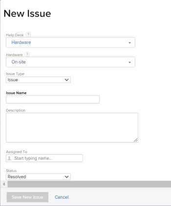

# Crear problemas

<!--

The highlighted information on this page refers to functionality not yet generally available. It is available only in the Preview environment for all customers. After the monthly releases to Production, the same features are also available in the Production environment for customers who enabled fast releases. 

For information about fast releases, see [Enable or disable fast releases for your organization](../../../administration-and-setup/set-up-workfront/configure-system-defaults/enable-fast-release-process.md).  

For information about the current release, see [Fourth Quarter 2023 release overview](../../../product-announcements/product-releases/23-q4-release-activity/23-q4-release-overview.md).  

-->

Mientras trabaja en un proyecto, es posible que descubra que surgen eventos inesperados. Puede registrar esos eventos inesperados como problemas de un proyecto concreto o de una tarea. Los usuarios con el acceso adecuado pueden ver y supervisar el estado de los problemas a medida que el proyecto o la tarea progresa hasta su finalización, lo que elimina la necesidad de largas cadenas de correo electrónico o reuniones de estado. A diferencia de las tareas, que son eventos planificados, los problemas representan elementos de trabajo no planificados en Adobe Workfront.

También puede añadir problemas a proyectos como solicitudes. Para obtener más información, consulte [Crear y enviar solicitudes de Adobe Workfront](../../../manage-work/requests/create-requests/create-submit-requests.md).

>[!TIP]
>
>Los problemas y las solicitudes se utilizan de forma intercambiable en Workfront. Puede registrar los problemas tanto de los proyectos como de las tareas para indicar el trabajo imprevisto que debe resolverse. También puede enviar solicitudes que se registren como problemas en un proyecto designado como una cola de solicitudes.

## Requisitos de acceso

+++ Expanda para ver los requisitos de acceso para la funcionalidad en este artículo.

Debe tener el siguiente acceso para realizar los pasos de este artículo:

<table style="table-layout:auto"> 
 <col> 
 <col> 
 <tbody> 
  <tr> 
   <td role="rowheader">Plan de Adobe Workfront*</td> 
   <td> 
Cualquiera
 </td> 
  </tr> 
  <tr> 
   <td role="rowheader">Licencia de Adobe Workfront*</td> 
   <td> 
Revisión o superior para añadir problemas a un proyecto o tarea
 
Solicitud o superior para añadir problemas como solicitudes mediante una cola de solicitudes.
 </td> 
  </tr> 
  <tr> 
   <td role="rowheader">Configuraciones de nivel de acceso*</td> 
   <td> 
Editar acceso a Problemas
 
Acceso de visualización o superior a proyectos y tareas
 
Nota: Si sigue sin tener acceso, pregunte al administrador de Workfront si ha establecido restricciones adicionales en su nivel de acceso. Para obtener información sobre el acceso a los problemas de su nivel de acceso, consulte <a href="../../../administration-and-setup/add-users/configure-and-grant-access/grant-access-issues.md" class="MCXref xref">Conceder acceso a los problemas</a>. Para obtener información sobre cómo un administrador de Workfront puede cambiar su nivel de acceso, consulte <a href="../../../administration-and-setup/add-users/configure-and-grant-access/create-modify-access-levels.md" class="MCXref xref">Creación o modificación de niveles de acceso personalizados</a>. 
 </td> 
  </tr> 
  <tr> 
   <td role="rowheader">Permisos de objeto</td> 
   <td> 
Permisos de aportación o superiores con capacidad para añadir problemas a la tarea o el proyecto donde crea el problema
 
 Para obtener información sobre la concesión de permisos a los problemas, consulte <a href="../../../workfront-basics/grant-and-request-access-to-objects/share-an-issue.md" class="MCXref xref">Compartir un problema </a>
 
Para obtener información sobre cómo solicitar permisos adicionales, consulte <a href="../../../workfront-basics/grant-and-request-access-to-objects/request-access.md" class="MCXref xref">Solicitar acceso a objetos </a>.
 </td> 
  </tr> 
 </tbody> 
</table>

Para saber qué plan, tipo de licencia o acceso tiene, póngase en contacto con el administrador de Workfront.

+++

<!--
(NOTE: in NWE Requestors CAN see the Issues tab on a project but in classic they cannot! However, even when they DO see it, they cannot enter the issues - logged this issue for it but they might decide not to fix it: https://hub.workfront.com/issue/60181e28000058980cce29597185b2d6/updates?email-source=comm)

-->

## Limitaciones en la creación de problemas

Cuando disponga de los permisos y el acceso correctos, podrá crear problemas en un proyecto o tarea. Sin embargo, en los siguientes casos es posible que no pueda crear problemas:

* El administrador de Workfront o de un grupo debe habilitar la adición de problemas a un proyecto que esté en estado completado o inactivo en el área de Preferencias del proyecto. Para obtener información sobre cómo establecer las preferencias del proyecto, consulte [Configurar las preferencias de proyecto de todo el sistema](../../../administration-and-setup/set-up-workfront/configure-system-defaults/set-project-preferences.md).
* No puede añadir problemas a un proyecto que esté pendiente de aprobación.

## Preparar el formulario Nuevo problema

Su organización debe contar con un proceso bien definido sobre cuándo y cómo registrar un problema. Al configurar este proceso, el primer paso es crear el formulario necesario para enviar un problema. Tanto si permite que los problemas se añadan directamente a las tareas y proyectos, como si tiene colas de solicitudes en las que se envían problemas, puede definir qué campos de Workfront, así como qué campos personalizados, están disponibles para los usuarios cuando envían nuevos problemas y deben completarse. El formulario Nuevo problema puede contener información importante que resulta útil para resolver el problema rápidamente.

Los campos para los nuevos problemas de un proyecto se definen en la sección Detalles de la cola del proyecto donde se registrarán los problemas. Para obtener información acerca de cómo configurar la sección Detalles de la cola de un proyecto, vea [Crear una cola de solicitudes](../../../manage-work/requests/create-and-manage-request-queues/create-request-queue.md).

Para obtener información sobre cómo crear problemas enviándolos a una cola de solicitudes, consulte la sección [Crear problemas al introducir una nueva solicitud](#create-issues-by-entering-a-new-request) en este artículo.

## Crear problemas en una tarea o proyecto mediante el botón Nuevo problema

Después de definir los campos del formulario de un nuevo problema en el proyecto, puede empezar a crear problemas.

<!-- OLD UI: redesigned on Oct 26, 2023:

Creating issues differs depending on which environment you choose to create the issue. 

### Create issues on a task or project using the New Issue button in the Production environment

To create an issue on a task or a project:

1. Go to a project where you want to create the issue. 
1. (Optional) If you want to log the issue for a task, go to the **Tasks** area, then click the name of a task. 
1. Click the **Issues** section.

   
1. Click **New Issue**.

  

1. (Conditional) If the project creator created Queue Topics or Topic Groups on the project they are added to the new issue form. Specify the **Topic Group** or the **Queue Topic** of your new issue. Topic Groups and Queue Topics have names customized to your environment.  
   For more information about creating Topic Groups, see [Create Topic Groups](../../../manage-work/requests/create-and-manage-request-queues/create-topic-groups.md). For more information about creating Queue Topics, see [Create Queue Topics](../../../manage-work/requests/create-and-manage-request-queues/create-queue-topics.md).

   

   * If there is only one Queue Topic set on the project, it is displayed automatically.
   * If the Topic Group does not have any Queue Topics or Topic Groups under it, nothing is available in the Topic Group drop-down.

1. (Conditional) If the project creator allowed for the **Request Type** field to display on the New Issue form, select the type of your issue from the following options:

   * Bug Report
   * Change Order
   * Issue
   * Request  
     Depending on how your Workfront administrator has configured your Project Preferences, the names of the issue types might be different for you. 

   >[!TIP]
   >
   >The Request Types must be enabled in the Queue Details and as well as when creating the Queue Topic to display as a selection in the New Issue form. For information, see the following articles: 
   >* [Create a Request Queue](../../requests/create-and-manage-request-queues/create-request-queue.md)
   >  * [Create Queue Topics](../../requests/create-and-manage-request-queues/create-queue-topics.md)

1. Add a name for the new issue in the **Issue Name** field. 
1. Continue specifying the fields available in the **New Issue** form. For more information about the fields available as you enter a new issue, see [Edit issues](../../../manage-work/issues/manage-issues/edit-issues.md).

   >[!IMPORTANT]
   >
   >Not all the issue-related fields are available in the New Issue form. The project creator enables the fields available when creating an issue when they define the Queue Details area of the project. For more information, see [Create a Requests Queue](../../requests/create-and-manage-request-queues/create-request-queue.md). 

1. (Conditional) If the Queue Topics are associated with a custom form, that custom form will display in the **New Issue** form.  
   Or  
   If the project is associated with an issue custom form through the Queue Details area, the form displays in the **New Issue** form, after the default Workfront fields.

   For information, see [Create a Request Queue](../../../manage-work/requests/create-and-manage-request-queues/create-request-queue.md).

1. Click **Save New Issue.**

Issues can be assigned to multiple users, job roles or to a team. For more information about assigning and managing requests, see [Manage work and team requests](../../../people-teams-and-groups/work-with-team-requests/manage-work-and-team-requests.md).

<!--When this is coming to Production, remove the "Production" section above and replace it with the following content:
-->

Para crear un problema en una tarea o un proyecto, siga estos pasos:

1. Vaya a un proyecto en el que desee crear el problema.
1. (Opcional) Si desea registrar el problema de una tarea, vaya al área **Tareas** y luego haga clic en el nombre de una tarea.
1. Haga clic en la sección **Problemas**.

   Se muestra la lista de problemas del proyecto

1. Haga clic en **Nuevo problema** en la parte superior de la lista de problemas.
Se muestra el cuadro Nuevo problema.

   

1. (Condicional) Si el creador del proyecto creó temas de la cola o grupos de temas en el proyecto, se añadirán al formulario de nuevo problema. Especifique el **Grupo de temas** o el **Tema de la cola** del nuevo problema. Los grupos de temas y los temas de la cola tienen nombres personalizados según su entorno.\
   Para obtener más información sobre cómo crear grupos de temas, vea [Creación de grupos de temas](../../../manage-work/requests/create-and-manage-request-queues/create-topic-groups.md). Para obtener más información acerca de cómo crear temas de la cola, vea [Creación de temas de la cola](../../../manage-work/requests/create-and-manage-request-queues/create-queue-topics.md).

   * Si solo hay un tema de la cola definido en el proyecto, se muestra de forma automática.
   * Si el grupo de temas no tiene ningún tema de la cola o grupo de temas debajo, no hay nada disponible en la lista desplegable Grupo de temas.

1. Ponga el nombre del problema en el campo **Asunto** y después añada una **Descripción**.

1. (Condicional) Si el creador del proyecto permitió que el campo **Tipo de solicitud** se mostrara en el formulario Nuevo problema, seleccione el tipo de problema en las siguientes opciones:

   * Informe de errores
   * Solicitud de cambio
   * Problema
   * Solicitud\
     Según la configuración dada por el administrador de Workfront a sus Preferencias del proyecto, los nombres de los tipos de problemas podrían ser diferentes para usted.

   >[!TIP]
   >
   >Los tipos de solicitud deben habilitarse en Detalles de la cola y al crear el tema de la cola para que se muestre como una selección en el formulario Nuevo problema. Para obtener más información, consulte los siguientes artículos:
   >* [Creación de una cola de solicitudes](../../requests/create-and-manage-request-queues/create-request-queue.md)
   >  * [Creación de temas de cola](../../requests/create-and-manage-request-queues/create-queue-topics.md)

1. Continúe especificando los campos disponibles en el formulario **Nuevo problema**. Para obtener más información acerca de los campos disponibles al introducir un problema nuevo, consulte [Edición de problemas](../../../manage-work/issues/manage-issues/edit-issues.md).

   >[!IMPORTANT]
   >
   >No todos los campos relacionados con el problema están disponibles en el formulario Nuevo problema. El creador del proyecto habilita los campos disponibles al crear un problema cuando definen el área Detalles de la cola del proyecto. Para obtener más información, vea [Creación de una cola de solicitudes](../../requests/create-and-manage-request-queues/create-request-queue.md).

1. (Condicional) Si los temas de la cola están asociados a un formulario personalizado, este se mostrará en el formulario **Nuevo problema**.\
   O\
   Si el proyecto está asociado con un formulario personalizado de problema mediante el área Detalles de la cola, el formulario se mostrará en el formulario **Nuevo problema**, después de los campos predeterminados de Workfront.

   Para obtener más información, vea [Creación de una cola de solicitudes](../../../manage-work/requests/create-and-manage-request-queues/create-request-queue.md).

1. Haga clic en **Enviar**.

   Los problemas se pueden asignar a varios usuarios, funciones del puesto o a un equipo. Para obtener más información sobre cómo asignar y administrar solicitudes, vea [Administración de solicitudes de trabajo y equipo](../../../people-teams-and-groups/work-with-team-requests/manage-work-and-team-requests.md).

## Creación de problemas en línea de una tarea o proyecto

>[!IMPORTANT]
>
>El propietario del proyecto debe habilitar **Permitir que los usuarios añadan problemas en línea** al definir la configuración de problemas del proyecto para que pueda añadir problemas en línea al proyecto o a las tareas. Para obtener información acerca de cómo configurar los problemas de un proyecto, vea [Edición de proyectos](../../../manage-work/projects/manage-projects/edit-projects.md).
>

Si desea añadir varios problemas rápido, puede crearlos para una tarea o un proyecto en línea añadiéndolos a una lista de problemas.

>[!NOTE]
>
>Cuando añade problemas en línea, Workfront no aplica el formulario Nuevo problema a los nuevos problemas. No se recomienda añadir problemas en línea si desea que los usuarios proporcionen cierta información al introducir problemas. Esto puede tener un impacto negativo en la creación de informes de problemas y, después, en la capacidad del usuario asignado al problema para tener toda la información necesaria para resolverlo.

Para crear problemas en línea, siga estos pasos:

1. Vaya a un proyecto en el que desee crear el problema.
1. (Opcional) Si desea registrar el problema para una tarea, vaya a la sección **Tareas** y, a continuación, haga clic en el nombre de una tarea.
1. Haga clic en **Problemas** en el panel izquierdo.
1. Haga clic en **Añadir más problemas** en la parte inferior de la lista de problemas.

   Se crea una nueva línea en la lista de problemas de la sección Problemas.

   >[!TIP]
   >
   >Esta opción aparece atenuada si la opción Permitir que los usuarios añadan problemas en línea no está seleccionada en el cuadro Editar proyecto. Para obtener más información, consulte [Edición de proyectos](../../../manage-work/projects/manage-projects/edit-projects.md).

   

1. Empiece a escribir el nombre del problema en el campo Nombre y, a continuación, continúe añadiendo más información sobre el problema en línea.

   >[!TIP]
   >
   >Los campos que están disponibles para editar en línea los proporciona la vista que aplique a la lista de problemas. Es posible que no pueda editar en línea el siguiente tipo de campos:
   >   
   >* Campos que pertenecen a otro objeto
   >* Campos en los que no tiene acceso para editar
   >* Campos que son cálculos y que Workfront actualiza de forma automática

1. Haga clic en Intro para finalizar la edición en línea y añada el problema al proyecto o tarea.

## Creación de problemas al introducir una nueva solicitud {#create-issues-by-entering-a-new-request}

Puede designar proyectos para que sean receptáculos de recepción de problemas. Este tipo de proyectos se denominan Colas de solicitudes en Workfront. Puede acceder a Colas de solicitudes a través del área Solicitudes del menú principal.

>[!TIP]
>
>Los términos “problema” y “solicitud” son intercambiables en Workfront.

Para obtener más información acerca de cómo configurar proyectos como colas de solicitudes para recibir problemas, vea [Creación de una cola de solicitudes](../../../manage-work/requests/create-and-manage-request-queues/create-request-queue.md). Para obtener información sobre cómo enviar solicitudes, consulte [Creación y envío de solicitudes de Adobe Workfront](../../../manage-work/requests/create-requests/create-submit-requests.md).
